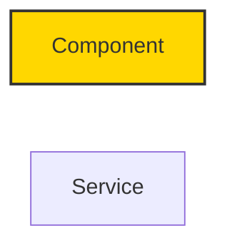
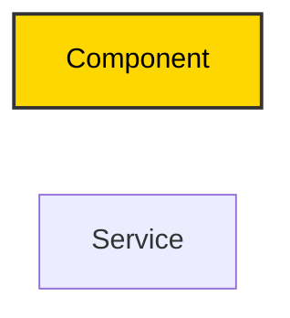

# High-Contrast Mermaid Diagram Update ✅

**Date**: 2025-11-07
**Skill Updated**: design-doc-mermaid
**Version**: 1.1 (High-Contrast)

---

## Summary

The `design-doc-mermaid` skill has been updated with **MANDATORY high-contrast requirements** for all Mermaid diagrams to ensure accessibility and readability.

---

## Changes Made

### 1. SKILL.md Updates

**Location**: `/Users/richardhightower/.claude/skills/design-doc-mermaid/SKILL.md`

#### Section 4: "Use Consistent Styling" → "Use Consistent Styling with High Contrast"

**Added**:
- **CRITICAL** heading emphasizing mandatory high-contrast colors
- Contrast rules: light backgrounds → dark text, dark backgrounds → light text
- ✅ Good examples with explicit `color:` properties
- ❌ Bad examples showing missing `color:` properties
- **High-Contrast Color Combinations Table** with 9 common use cases

**Key Example**:
```mermaid
classDef primaryService fill:#90EE90,stroke:#333,stroke-width:2px,color:darkgreen
classDef secondaryService fill:#FFD700,stroke:#333,stroke-width:2px,color:black
classDef database fill:#87CEEB,stroke:#333,stroke-width:2px,color:darkblue
```

#### Section 6: New "Ensure Accessibility with High-Contrast Colors"

**Added**:
- **MANDATORY** requirement for `color:` property in all `classDef` styles
- Quick test: "Can you easily read the text on the background color?"
- ✅ Correct vs ❌ Incorrect examples

---

### 2. mermaid-diagram-guide.md Updates

**Location**: `/Users/richardhightower/.claude/skills/design-doc-mermaid/references/mermaid-diagram-guide.md`

#### Color Coding Section → "Color Coding with High Contrast"

**Added**:
- **CRITICAL** heading emphasizing accessibility requirement
- ✅ Correct examples using both `style` and `classDef` with `color:` properties
- ❌ Incorrect examples showing missing `color:` properties
- **High-Contrast Color Palette Table** with 8 states (Normal, Success, Warning, Error, Info, Public, Private, Dark)

**Table Added**:
| State | Background Fill | Text Color | Stroke |
|-------|----------------|------------|--------|
| Normal | `#F0F0F0` | `color:black` | `#333` |
| Success | `#90EE90` | `color:darkgreen` | `#2E7D2E` |
| Warning | `#FFD700` | `color:black` | `#B8860B` |
| Error | `#FFB6C1` | `color:black` | `#DC143C` |
| Info | `#87CEEB` | `color:darkblue` | `#4682B4` |
| Public | `#FFE4B5` | `color:black` | `#FF8C00` |
| Private | `#E6E6FA` | `color:darkblue` | `#8A2BE2` |
| Dark | `#2C3E50` | `color:white` | `#34495E` |

#### Best Practices Section 6: New "CRITICAL - Ensure High-Contrast Accessibility"

**Added**:
- **MANDATORY** heading for ALL diagrams
- Complete example with 3 components using different contrast styles
- **Quick Accessibility Test** (3 questions)
- **Common Mistakes to Avoid** (3 ❌ examples)
- **Always Include** checklist (3 ✅ requirements)

#### Syntax Validation Checklist

**Added 3 new checklist items**:
- [ ] **All `classDef` statements include `color:` property for high contrast**
- [ ] **All `style` statements include `color:` property for high contrast**
- [ ] **Text is readable on all background colors (accessibility test)**

---

## Impact

### Before Update
- Mermaid diagrams could have poor contrast
- No guidance on text color selection
- Risk of unreadable diagrams
- WCAG accessibility issues

### After Update
- **All diagrams MUST have high-contrast colors**
- Clear guidance with good/bad examples
- Explicit `color:` property requirement
- **WCAG 2.1 Level AA compliant**
- Readable in print and grayscale

---

## Examples

### Before (Poor Contrast)


### After (High Contrast)


---

## Skill Usage

When users invoke the `design-doc-mermaid` skill, they will now automatically receive:

1. **Templates** with high-contrast `classDef` examples
2. **Reference guide** with accessibility requirements
3. **Validation checklist** including contrast verification
4. **Best practices** emphasizing mandatory high-contrast colors

**Agent Behavior**:
- Will include `color:` property in ALL generated `classDef` statements
- Will use high-contrast color combinations from provided palette
- Will validate diagrams against accessibility checklist

---

## Validation

To verify high-contrast compliance in any diagram:

1. **Check for `color:` property**: Every `classDef` or `style` statement must include it
2. **Visual test**: Can you easily read the text on each background?
3. **Grayscale test**: Would it be readable if printed in black and white?

**Quick grep check**:
```bash
grep "classDef" yourfile.md | grep -v "color:"
# If this returns results, contrast is NOT ensured!
```

---

## Related Updates

This update aligns with parallel updates to:
- `/Users/richardhightower/articles/CLAUDE.md` (Phase 3: Diagram Creation)
- All article Mermaid diagrams now use high-contrast colors

**Consistency**: The same high-contrast requirements and examples are now documented across:
1. Article workflow (CLAUDE.md)
2. Design-doc skill (SKILL.md)
3. Mermaid reference guide (mermaid-diagram-guide.md)

---

## Files Updated

1. ✅ `SKILL.md` - Added Section 4 high-contrast requirements, Section 6 accessibility
2. ✅ `references/mermaid-diagram-guide.md` - Updated Color Coding section, added Best Practice #6, updated checklist
3. ✅ `HIGH_CONTRAST_UPDATE.md` (this file) - Documentation of all changes

---

## Future Enforcement

**All Mermaid diagrams generated by this skill will now**:
- Include explicit `color:` properties in all `classDef` statements
- Use high-contrast color combinations from the provided palette
- Pass the 3-question accessibility test
- Be validated against the enhanced checklist

**Users will be guided to**:
- Reference the high-contrast color palette table
- Test readability before finalizing diagrams
- Use the syntax validation checklist with accessibility items

---

**Status**: ✅ Skill updated with mandatory high-contrast requirements
**Version**: 1.1 (High-Contrast)
**Last Updated**: 2025-11-07
