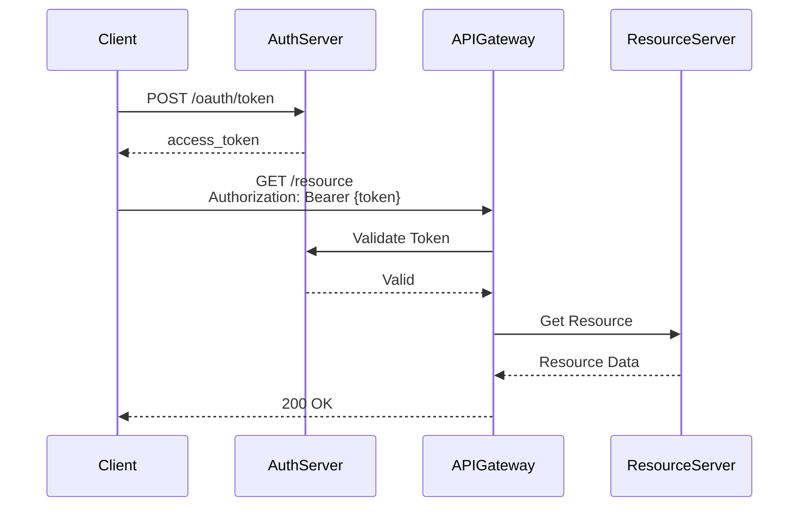
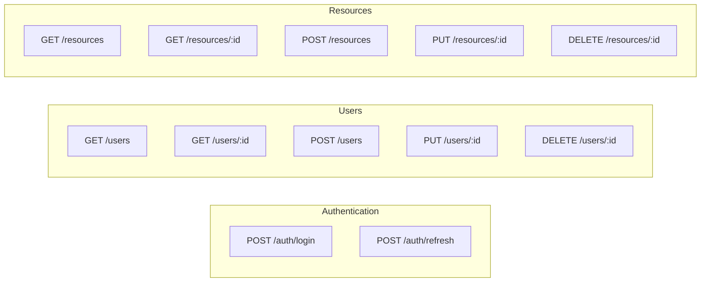
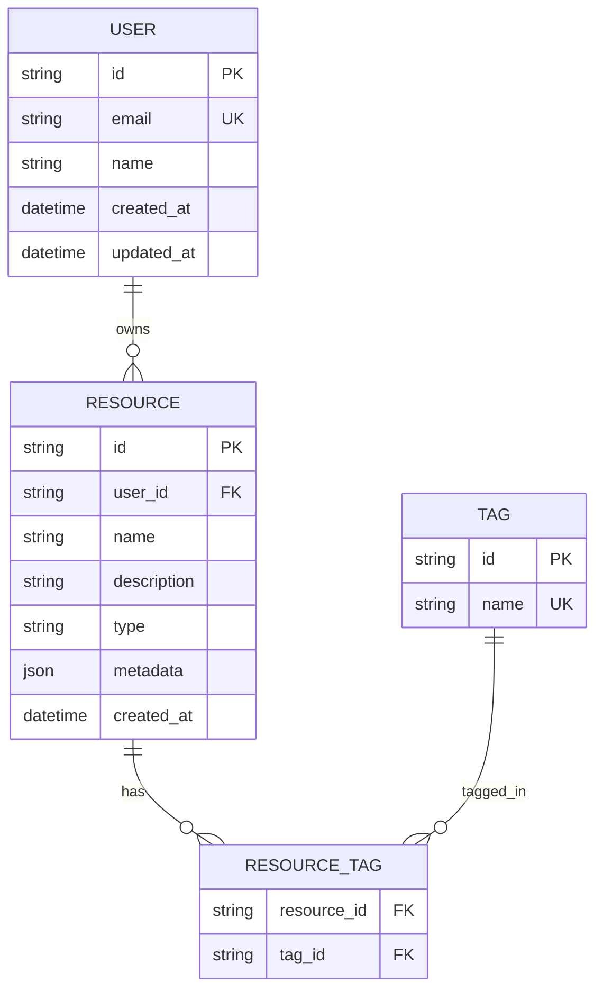
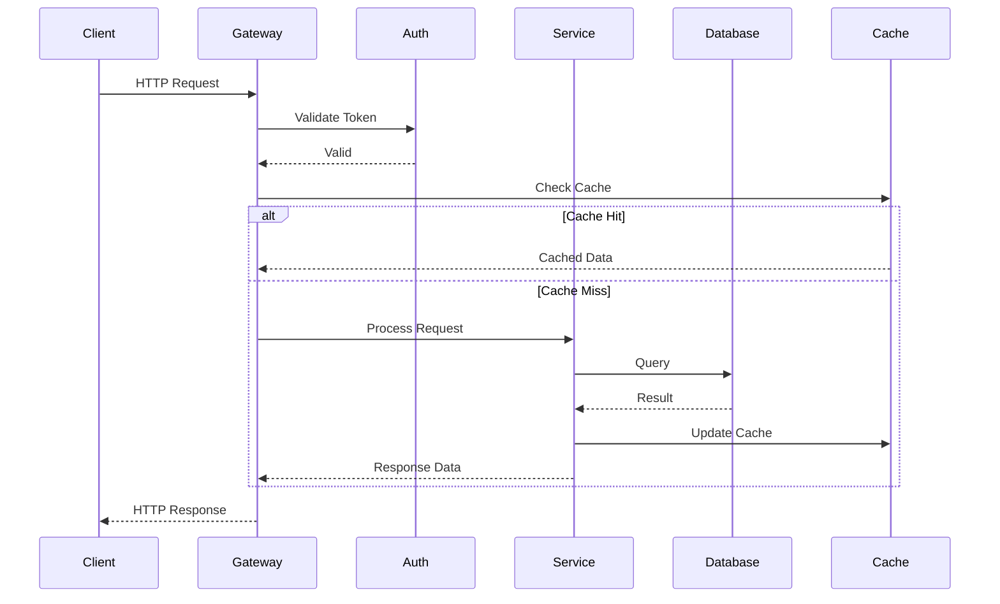
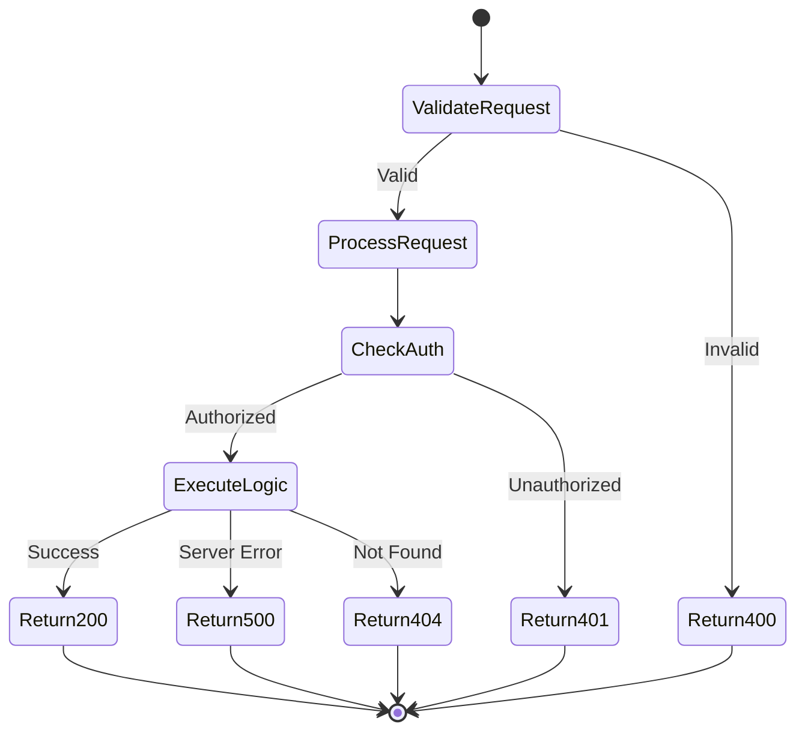
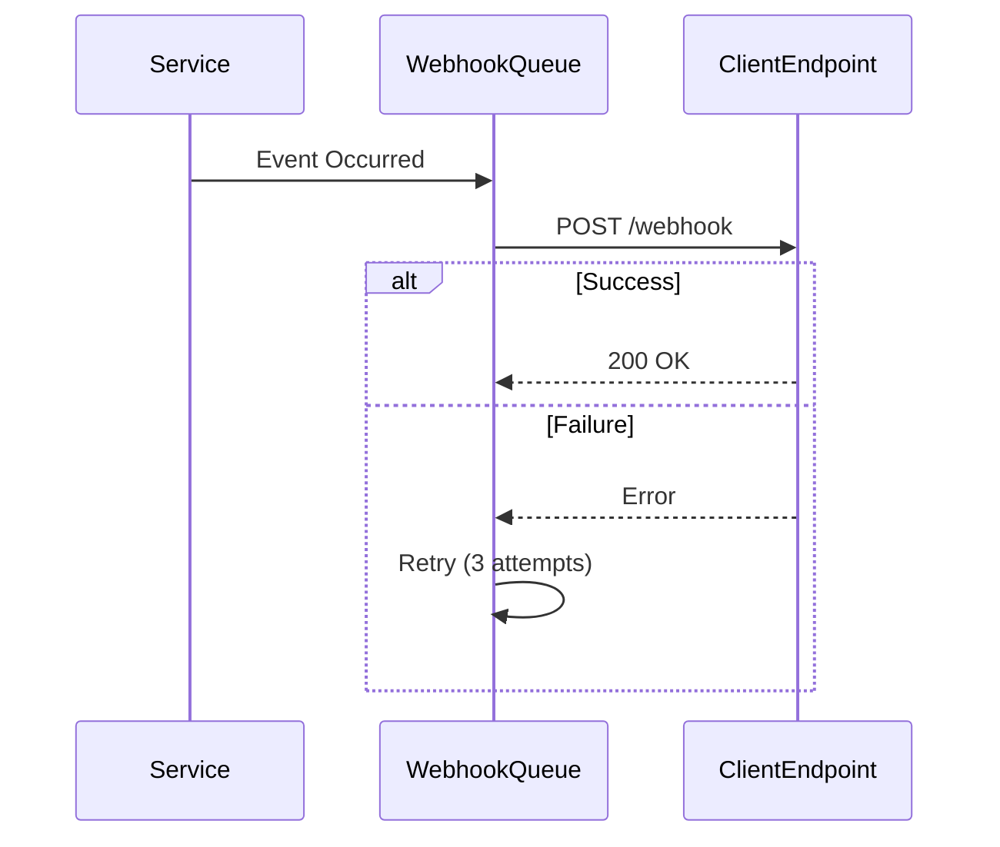
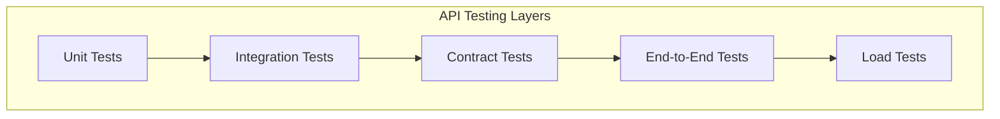

# [API Name] - API Design Document

**Author:** [Name]
**Date:** [YYYY-MM-DD]
**Status:** Draft | In Review | Approved
**Version:** 1.0
**API Version:** v1

---

## 1. Executive Summary

**Purpose:** [What this API does]

**Target Audience:**
- Internal services
- External partners
- Public developers

**Key Features:**
- Feature 1
- Feature 2
- Feature 3

---

## 2. API Overview

### 2.1 Base URL

```
Production:  https://api.example.com/v1
Staging:     https://api-staging.example.com/v1
Development: http://localhost:8000/v1
```

### 2.2 Authentication

**Method:** [OAuth 2.0 | API Key | JWT | etc.]



---

## 3. API Endpoints

### 3.1 Endpoint Overview



### 3.2 Detailed Endpoints

#### POST /auth/login

Authenticate a user and receive access token.

**Request:**
```json
{
  "email": "user@example.com",
  "password": "securePassword123"
}
```

**Response (200 OK):**
```json
{
  "access_token": "eyJhbGc...",
  "refresh_token": "dGhpc2lz...",
  "token_type": "Bearer",
  "expires_in": 3600
}
```

**Errors:**
- `400 Bad Request` - Invalid credentials
- `429 Too Many Requests` - Rate limit exceeded

---

#### GET /users/:id

Retrieve user details by ID.

**Parameters:**
- `id` (path, required): User ID

**Response (200 OK):**
```json
{
  "id": "123",
  "email": "user@example.com",
  "name": "John Doe",
  "created_at": "2025-01-01T00:00:00Z",
  "updated_at": "2025-01-01T00:00:00Z"
}
```

**Errors:**
- `401 Unauthorized` - Missing or invalid token
- `404 Not Found` - User not found

---

#### POST /resources

Create a new resource.

**Request:**
```json
{
  "name": "Resource Name",
  "description": "Resource description",
  "type": "type_a",
  "metadata": {
    "key": "value"
  }
}
```

**Response (201 Created):**
```json
{
  "id": "res_123",
  "name": "Resource Name",
  "description": "Resource description",
  "type": "type_a",
  "metadata": {
    "key": "value"
  },
  "created_at": "2025-01-01T00:00:00Z"
}
```

**Errors:**
- `400 Bad Request` - Validation errors
- `401 Unauthorized` - Missing or invalid token
- `422 Unprocessable Entity` - Invalid data

---

## 4. Data Models

### 4.1 Entity Relationships



### 4.2 User Model

```json
{
  "id": "string (UUID)",
  "email": "string (email format, unique)",
  "name": "string (1-255 chars)",
  "role": "enum (admin, user, guest)",
  "created_at": "ISO 8601 datetime",
  "updated_at": "ISO 8601 datetime"
}
```

---

## 5. Request/Response Flow

### 5.1 Typical Request Flow



### 5.2 Error Handling Flow



---

## 6. Rate Limiting

### 6.1 Rate Limit Policy

| Tier | Requests/Minute | Requests/Hour | Burst |
|------|-----------------|---------------|-------|
| Free | 60 | 1000 | 10 |
| Basic | 300 | 10000 | 50 |
| Premium | 1000 | 100000 | 200 |

**Headers:**
```
X-RateLimit-Limit: 60
X-RateLimit-Remaining: 45
X-RateLimit-Reset: 1640995200
```

---

## 7. Error Responses

### 7.1 Error Format

```json
{
  "error": {
    "code": "RESOURCE_NOT_FOUND",
    "message": "The requested resource was not found",
    "details": {
      "resource_id": "res_123"
    },
    "timestamp": "2025-01-01T00:00:00Z",
    "request_id": "req_abc123"
  }
}
```

### 7.2 Error Codes

| HTTP Status | Error Code | Description |
|-------------|------------|-------------|
| 400 | INVALID_REQUEST | Request validation failed |
| 401 | UNAUTHORIZED | Missing or invalid authentication |
| 403 | FORBIDDEN | Insufficient permissions |
| 404 | NOT_FOUND | Resource not found |
| 422 | VALIDATION_ERROR | Data validation failed |
| 429 | RATE_LIMIT_EXCEEDED | Too many requests |
| 500 | INTERNAL_ERROR | Server error |
| 503 | SERVICE_UNAVAILABLE | Service temporarily unavailable |

---

## 8. Pagination

**Request:**
```
GET /resources?page=2&per_page=20&sort=created_at&order=desc
```

**Response:**
```json
{
  "data": [...],
  "pagination": {
    "page": 2,
    "per_page": 20,
    "total_pages": 10,
    "total_count": 200,
    "has_next": true,
    "has_prev": true
  },
  "links": {
    "self": "/resources?page=2&per_page=20",
    "first": "/resources?page=1&per_page=20",
    "prev": "/resources?page=1&per_page=20",
    "next": "/resources?page=3&per_page=20",
    "last": "/resources?page=10&per_page=20"
  }
}
```

---

## 9. Filtering & Search

### 9.1 Filter Parameters

```
GET /resources?type=type_a&status=active&created_after=2025-01-01
```

### 9.2 Search

```
GET /resources?q=search+term&fields=name,description
```

---

## 10. Webhooks

### 10.1 Webhook Events



**Event Types:**
- `resource.created`
- `resource.updated`
- `resource.deleted`
- `user.created`

**Webhook Payload:**
```json
{
  "event": "resource.created",
  "timestamp": "2025-01-01T00:00:00Z",
  "data": {
    "id": "res_123",
    "name": "Resource Name"
  }
}
```

---

## 11. Versioning Strategy

**Strategy:** URL-based versioning

**Deprecation Policy:**
- New version announced 6 months in advance
- Old version supported for 12 months after new version release
- Sunset notices sent via email and API headers

**Version Headers:**
```
API-Version: 1.0
API-Deprecated: false
API-Sunset-Date: null
```

---

## 12. Security Considerations

### 12.1 Security Checklist

- [x] HTTPS only (TLS 1.2+)
- [x] Authentication required
- [x] Authorization checks on all endpoints
- [x] Input validation
- [x] SQL injection prevention
- [x] XSS prevention
- [x] CSRF protection
- [x] Rate limiting
- [x] Request size limits
- [x] Audit logging

---

## 13. Performance Targets

| Metric | Target | Current |
|--------|--------|---------|
| Response Time (p95) | < 200ms | 150ms |
| Response Time (p99) | < 500ms | 350ms |
| Throughput | > 1000 req/s | 1200 req/s |
| Uptime | 99.9% | 99.95% |

---

## 14. Testing Strategy

### 14.1 Test Coverage



---

## 15. API Client Examples

### 15.1 cURL

```bash
curl -X POST https://api.example.com/v1/resources \
  -H "Authorization: Bearer {token}" \
  -H "Content-Type: application/json" \
  -d '{
    "name": "Resource Name",
    "type": "type_a"
  }'
```

### 15.2 Python

```python
import requests

headers = {
    "Authorization": "Bearer {token}",
    "Content-Type": "application/json"
}

data = {
    "name": "Resource Name",
    "type": "type_a"
}

response = requests.post(
    "https://api.example.com/v1/resources",
    headers=headers,
    json=data
)

print(response.json())
```

---

## 16. Changelog

### v1.0.0 (2025-01-01)

**Added:**
- Initial API release
- Authentication endpoints
- User management endpoints
- Resource CRUD operations

---

## 17. Appendices

### A. Glossary

| Term | Definition |
|------|------------|
| JWT | JSON Web Token |
| CRUD | Create, Read, Update, Delete |

### B. References

1. [OpenAPI Specification](https://swagger.io/specification/)
2. [REST API Best Practices](https://restfulapi.net/)
