# [System Name] - Architecture Design Document

**Author:** [Name]
**Date:** [YYYY-MM-DD]
**Status:** Draft | In Review | Approved
**Version:** 1.0

---

## 1. Executive Summary

[Brief overview of the system and key architectural decisions]

**Business Context:**
- Problem being solved
- Target users
- Key business requirements

**Key Decisions:**
- Major architectural choice 1
- Major architectural choice 2
- Major architectural choice 3

---

## 2. System Context

### 2.1 System Overview

[High-level description of what the system does]

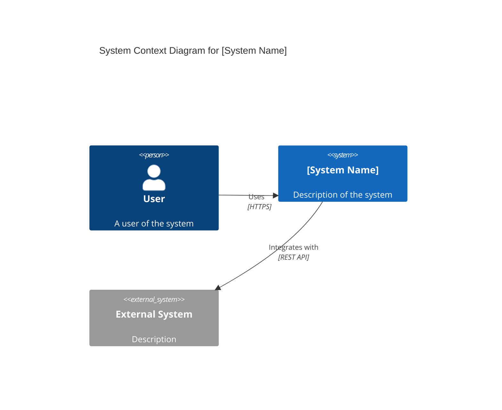

### 2.2 Stakeholders

| Stakeholder | Role | Interest |
|-------------|------|----------|
| [Name/Group] | [Role] | [What they care about] |

---

## 3. Requirements

### 3.1 Functional Requirements

| ID | Requirement | Priority |
|----|-------------|----------|
| FR-1 | [Requirement description] | High/Medium/Low |

### 3.2 Non-Functional Requirements

| Category | Requirement | Target |
|----------|-------------|--------|
| Performance | [Description] | [Metric] |
| Scalability | [Description] | [Metric] |
| Availability | [Description] | [Metric] |
| Security | [Description] | [Standard] |

---

## 4. Architecture Overview

### 4.1 Architectural Style

[Description of the architectural pattern: microservices, layered, event-driven, etc.]

**Why this style:**
- Reason 1
- Reason 2
- Reason 3

### 4.2 High-Level Architecture

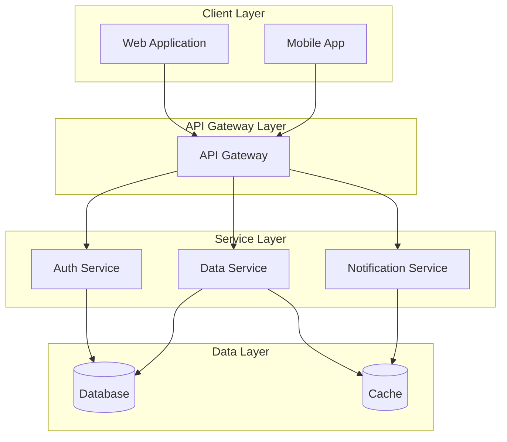

---

## 5. Component Design

### 5.1 Component Overview

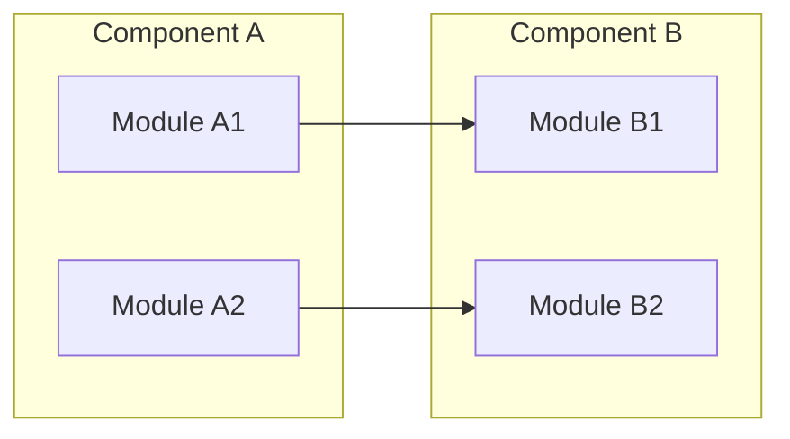

### 5.2 Component Descriptions

#### Component A
- **Purpose:** [What it does]
- **Responsibilities:** [Key responsibilities]
- **Technologies:** [Tech stack]
- **Dependencies:** [What it depends on]

---

## 6. Data Architecture

### 6.1 Data Model

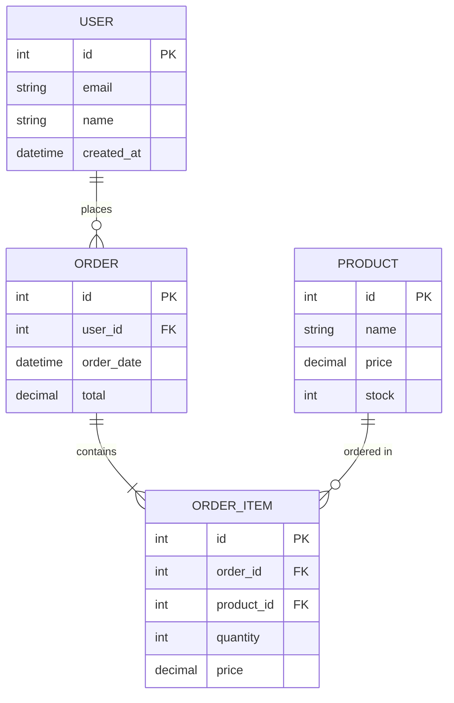

### 6.2 Data Flow

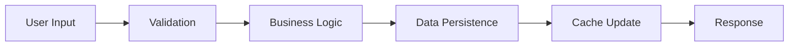

---

## 7. Integration Points

### 7.1 External Dependencies

| System | Purpose | Protocol | SLA |
|--------|---------|----------|-----|
| [System] | [Purpose] | [REST/gRPC/etc] | [99.9%] |

### 7.2 API Design

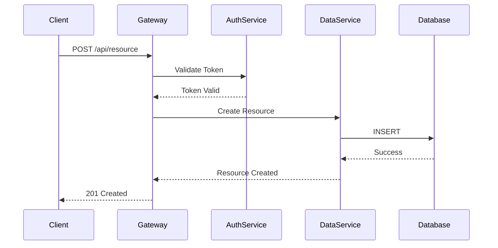

---

## 8. Security Architecture

### 8.1 Security Layers

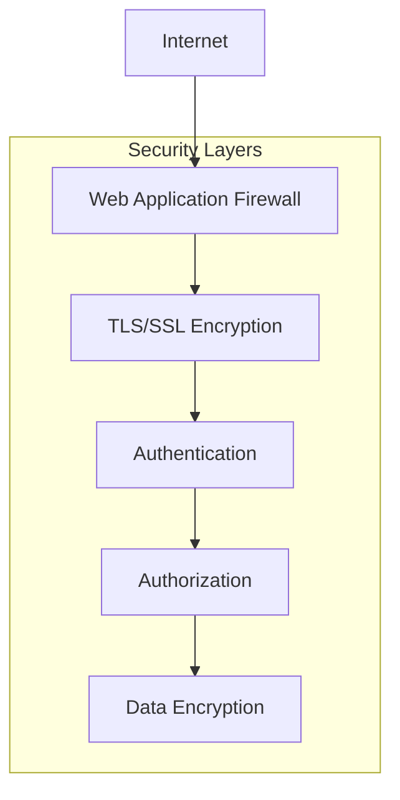

### 8.2 Authentication Flow

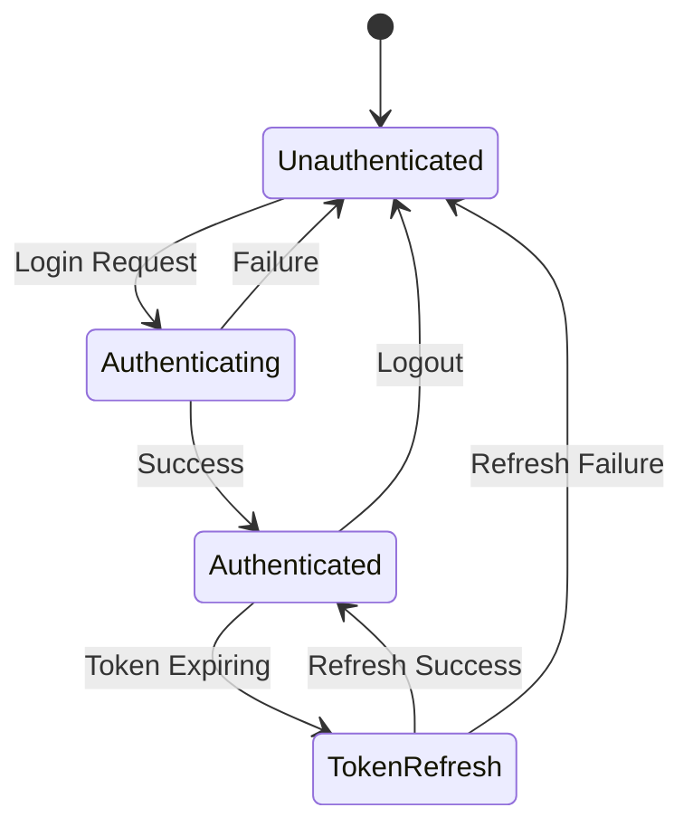

---

## 9. Deployment Architecture

### 9.1 Infrastructure

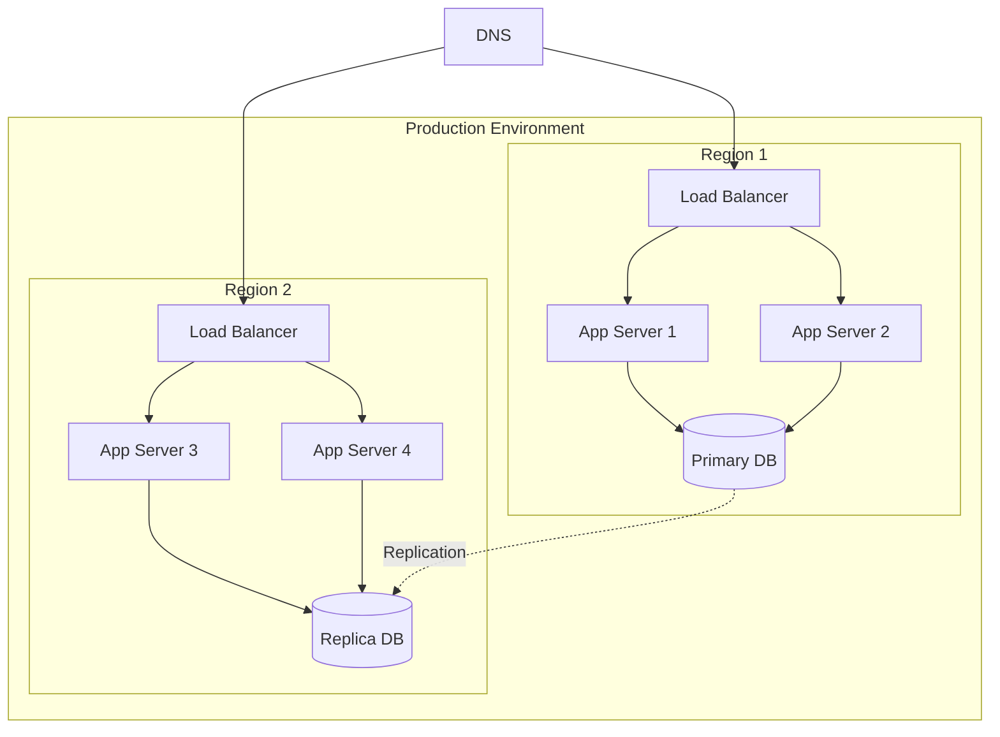

---

## 10. Scalability & Performance

### 10.1 Scaling Strategy

| Component | Strategy | Trigger | Max Scale |
|-----------|----------|---------|-----------|
| [Component] | [Horizontal/Vertical] | [Metric > Threshold] | [N instances] |

### 10.2 Performance Targets

| Operation | Target | Current | Strategy |
|-----------|--------|---------|----------|
| [Operation] | [< X ms] | [Y ms] | [Optimization approach] |

---

## 11. Monitoring & Observability

### 11.1 Key Metrics

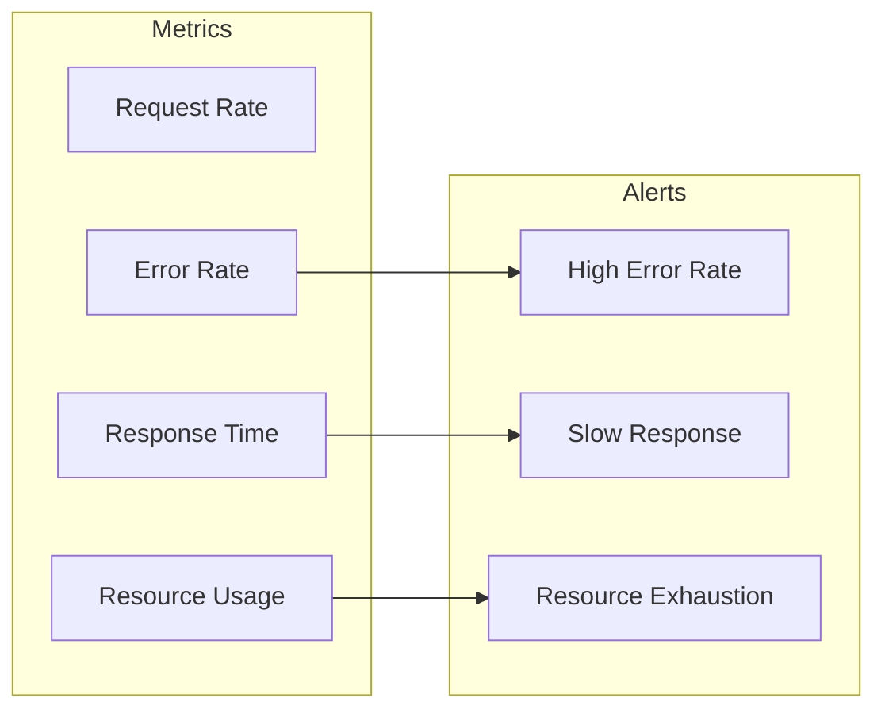

---

## 12. Disaster Recovery

### 12.1 Backup Strategy

| Data Type | Frequency | Retention | RTO | RPO |
|-----------|-----------|-----------|-----|-----|
| [Type] | [Frequency] | [Period] | [Time] | [Time] |

---

## 13. Technical Debt & Future Work

### 13.1 Known Limitations

1. [Limitation description]
2. [Limitation description]

### 13.2 Future Enhancements

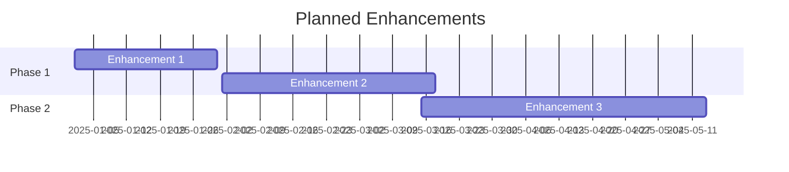

---

## 14. Decision Log

### ADR-001: [Decision Title]

**Date:** [YYYY-MM-DD]
**Status:** Accepted

**Context:**
[What led to this decision]

**Decision:**
[What was decided]

**Consequences:**
- Positive: [Benefits]
- Negative: [Costs/Trade-offs]

**Alternatives Considered:**
1. [Alternative 1] - Rejected because [reason]
2. [Alternative 2] - Rejected because [reason]

---

## 15. Appendices

### Glossary

| Term | Definition |
|------|------------|
| [Term] | [Definition] |

### References

1. [Document/Link]
2. [Document/Link]
