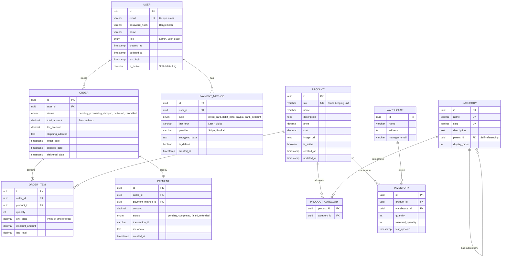
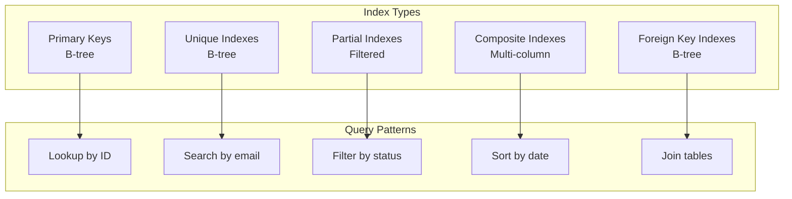
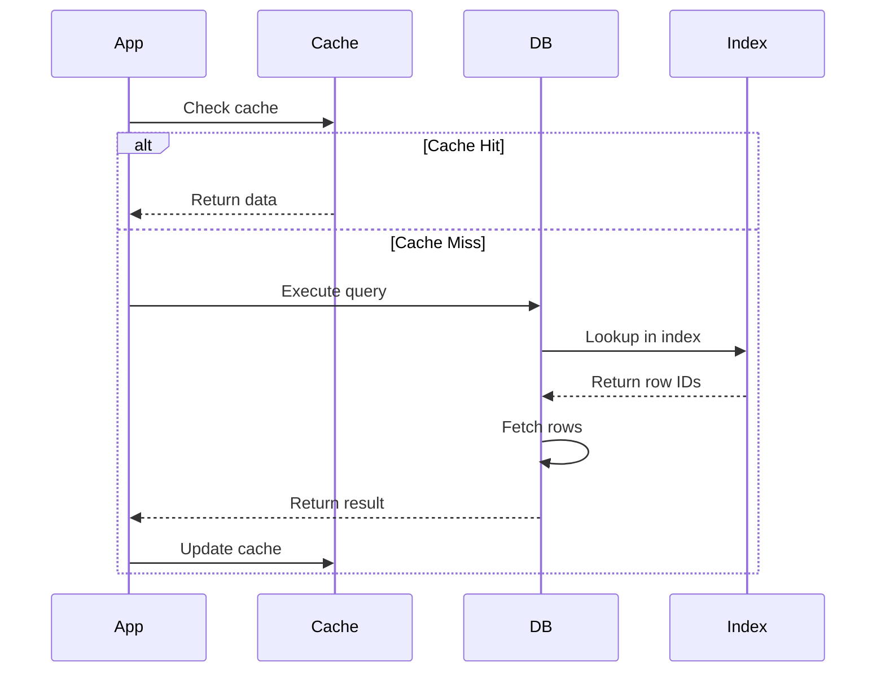
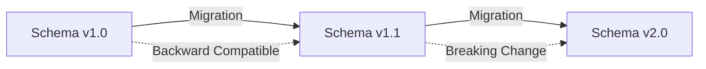
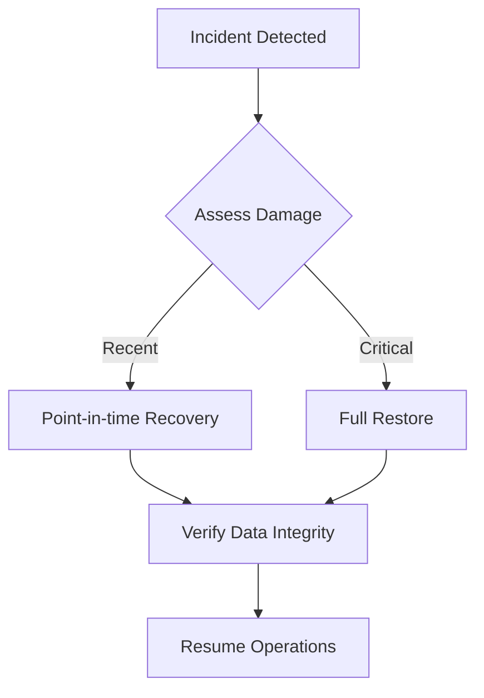
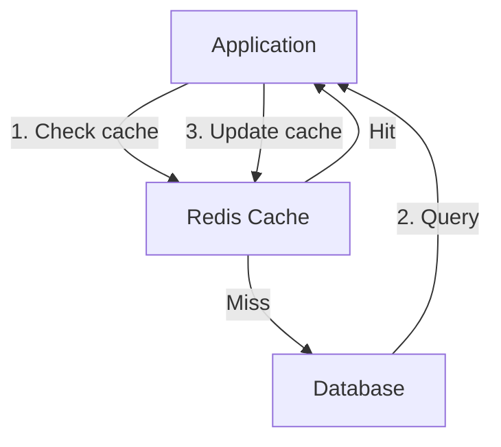
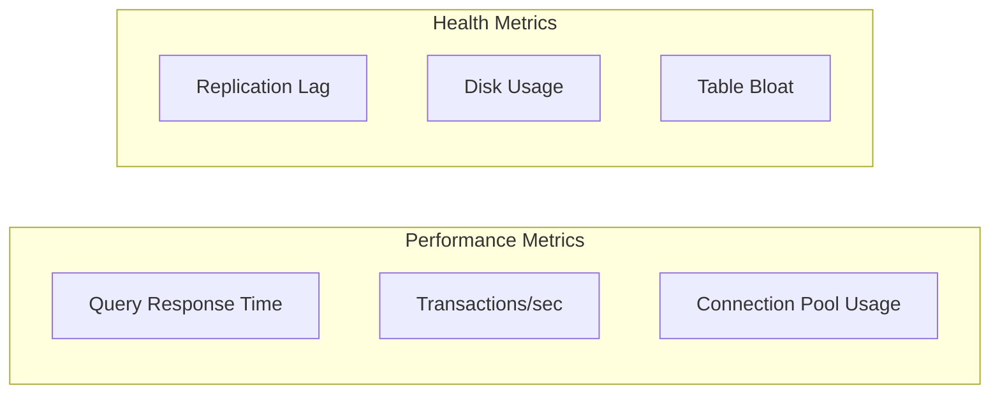
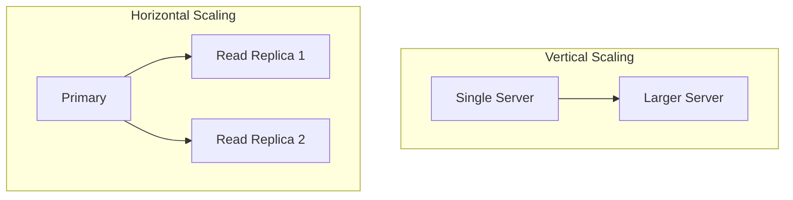
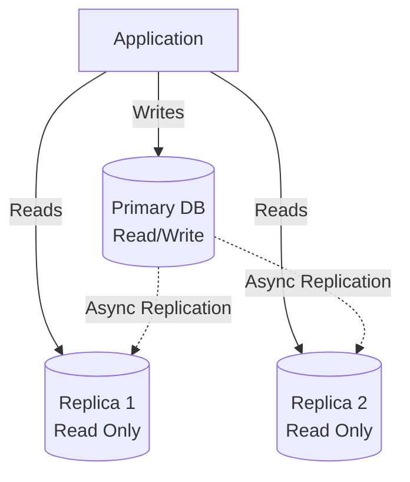

# [Database Name] - Database Design Document

**Author:** [Name]
**Date:** [YYYY-MM-DD]
**Status:** Draft | In Review | Approved
**Version:** 1.0

---

## 1. Executive Summary

**Database Type:** [PostgreSQL | MySQL | MongoDB | etc.]

**Purpose:** [What this database stores and why]

**Scale:**
- Expected records: [Number]
- Expected growth: [Rate]
- Expected queries/sec: [Number]

---

## 2. Requirements

### 2.1 Functional Requirements

| Requirement | Description | Priority |
|-------------|-------------|----------|
| FR-1 | [Requirement] | High/Medium/Low |

### 2.2 Non-Functional Requirements

| Category | Requirement | Target |
|----------|-------------|--------|
| Performance | Query response time | < 100ms |
| Availability | Uptime | 99.9% |
| Scalability | Max records | 10M |
| Backup | Recovery time | < 1 hour |

---

## 3. Data Model

### 3.1 Entity Relationship Diagram



### 3.2 Cardinality Explanation

| Relationship | Cardinality | Explanation |
|--------------|-------------|-------------|
| USER - ORDER | 1:N | One user can place many orders |
| ORDER - ORDER_ITEM | 1:N | One order contains many items |
| PRODUCT - ORDER_ITEM | 1:N | One product can be in many order items |
| ORDER - PAYMENT | 1:1 | One order has one payment |

---

## 4. Table Specifications

### 4.1 Users Table

**Purpose:** Store user account information

```sql
CREATE TABLE users (
    id UUID PRIMARY KEY DEFAULT gen_random_uuid(),
    email VARCHAR(255) UNIQUE NOT NULL,
    password_hash VARCHAR(255) NOT NULL,
    name VARCHAR(255) NOT NULL,
    role VARCHAR(50) NOT NULL DEFAULT 'user'
        CHECK (role IN ('admin', 'user', 'guest')),
    created_at TIMESTAMP NOT NULL DEFAULT CURRENT_TIMESTAMP,
    updated_at TIMESTAMP NOT NULL DEFAULT CURRENT_TIMESTAMP,
    last_login TIMESTAMP,
    is_active BOOLEAN NOT NULL DEFAULT true
);

CREATE INDEX idx_users_email ON users(email);
CREATE INDEX idx_users_created_at ON users(created_at);
CREATE INDEX idx_users_is_active ON users(is_active) WHERE is_active = true;
```

**Column Details:**

| Column | Type | Constraints | Description |
|--------|------|-------------|-------------|
| id | UUID | PK | Unique identifier |
| email | VARCHAR(255) | UNIQUE, NOT NULL | User email |
| password_hash | VARCHAR(255) | NOT NULL | Bcrypt password hash |
| role | VARCHAR(50) | CHECK, DEFAULT 'user' | User role |
| is_active | BOOLEAN | DEFAULT true | Soft delete flag |

**Indexes:**
- Primary key on `id` (B-tree)
- Unique index on `email` (B-tree)
- Index on `created_at` for sorting (B-tree)
- Partial index on `is_active` for active users only

---

### 4.2 Orders Table

**Purpose:** Store order information

```sql
CREATE TABLE orders (
    id UUID PRIMARY KEY DEFAULT gen_random_uuid(),
    user_id UUID NOT NULL REFERENCES users(id) ON DELETE RESTRICT,
    status VARCHAR(50) NOT NULL DEFAULT 'pending'
        CHECK (status IN ('pending', 'processing', 'shipped', 'delivered', 'cancelled')),
    total_amount DECIMAL(10, 2) NOT NULL,
    tax_amount DECIMAL(10, 2) NOT NULL DEFAULT 0.00,
    shipping_address TEXT NOT NULL,
    order_date TIMESTAMP NOT NULL DEFAULT CURRENT_TIMESTAMP,
    shipped_date TIMESTAMP,
    delivered_date TIMESTAMP
);

CREATE INDEX idx_orders_user_id ON orders(user_id);
CREATE INDEX idx_orders_status ON orders(status);
CREATE INDEX idx_orders_order_date ON orders(order_date DESC);
```

---

## 5. Constraints & Business Rules

### 5.1 Check Constraints

```sql
-- Ensure order total is positive
ALTER TABLE orders ADD CONSTRAINT check_total_positive
    CHECK (total_amount > 0);

-- Ensure quantity is positive
ALTER TABLE order_items ADD CONSTRAINT check_quantity_positive
    CHECK (quantity > 0);

-- Ensure prices are non-negative
ALTER TABLE products ADD CONSTRAINT check_price_non_negative
    CHECK (price >= 0);
```

### 5.2 Foreign Key Constraints

| Table | Foreign Key | References | On Delete | On Update |
|-------|-------------|------------|-----------|-----------|
| orders | user_id | users(id) | RESTRICT | CASCADE |
| order_items | order_id | orders(id) | CASCADE | CASCADE |
| order_items | product_id | products(id) | RESTRICT | CASCADE |

---

## 6. Indexes Strategy

### 6.1 Index Overview



### 6.2 Critical Indexes

| Table | Index | Type | Purpose | Estimated Size |
|-------|-------|------|---------|----------------|
| users | idx_users_email | B-tree | Login queries | 10MB |
| orders | idx_orders_user_id | B-tree | User order history | 50MB |
| orders | idx_orders_status | Partial | Active orders only | 20MB |
| products | idx_products_sku | Unique B-tree | Product lookup | 5MB |

---

## 7. Data Access Patterns

### 7.1 Query Patterns

**Pattern 1: User Login**
```sql
SELECT id, email, password_hash, role
FROM users
WHERE email = ? AND is_active = true;
```
**Indexes Used:** `idx_users_email`

**Pattern 2: Order History**
```sql
SELECT o.*, oi.*, p.*
FROM orders o
JOIN order_items oi ON o.id = oi.order_id
JOIN products p ON oi.product_id = p.id
WHERE o.user_id = ?
ORDER BY o.order_date DESC
LIMIT 20;
```
**Indexes Used:** `idx_orders_user_id`, `idx_orders_order_date`

### 7.2 Query Flow



---

## 8. Partitioning Strategy

### 8.1 Partitioning Plan

**Table:** orders

**Strategy:** Range partitioning by order_date

```sql
-- Create partitioned table
CREATE TABLE orders (
    ...
) PARTITION BY RANGE (order_date);

-- Create partitions
CREATE TABLE orders_2024_q1 PARTITION OF orders
    FOR VALUES FROM ('2024-01-01') TO ('2024-04-01');

CREATE TABLE orders_2024_q2 PARTITION OF orders
    FOR VALUES FROM ('2024-04-01') TO ('2024-07-01');
```

**Benefits:**
- Faster queries on recent orders
- Easier archival of old data
- Improved maintenance (VACUUM, ANALYZE)

---

## 9. Normalization Level

### 9.1 Current Normalization

**Level:** Third Normal Form (3NF)

**Why:**
- Eliminates data redundancy
- Maintains data integrity
- Allows efficient updates

### 9.2 Denormalization Decisions

| Table | Denormalized Field | Reason | Trade-off |
|-------|-------------------|--------|-----------|
| order_items | unit_price | Historical price at time of order | Duplicates product price |
| orders | total_amount | Avoid recalculating sum | Must update on item changes |

---

## 10. Data Migration & Evolution

### 10.1 Migration Strategy



### 10.2 Migration Example

```sql
-- Add new column (backward compatible)
ALTER TABLE users ADD COLUMN phone VARCHAR(20);

-- Create index concurrently (no downtime)
CREATE INDEX CONCURRENTLY idx_users_phone ON users(phone);

-- Backfill data
UPDATE users SET phone = '000-000-0000' WHERE phone IS NULL;

-- Add NOT NULL constraint
ALTER TABLE users ALTER COLUMN phone SET NOT NULL;
```

---

## 11. Backup & Recovery

### 11.1 Backup Strategy

| Backup Type | Frequency | Retention | RTO | RPO |
|-------------|-----------|-----------|-----|-----|
| Full Backup | Daily | 30 days | 4 hours | 24 hours |
| Incremental | Hourly | 7 days | 1 hour | 1 hour |
| Transaction Logs | Continuous | 7 days | 15 minutes | 5 minutes |

### 11.2 Recovery Flow



---

## 12. Performance Optimization

### 12.1 Query Optimization

**Slow Query Example:**
```sql
-- SLOW: Full table scan
SELECT * FROM orders WHERE EXTRACT(YEAR FROM order_date) = 2024;

-- OPTIMIZED: Index-friendly
SELECT * FROM orders
WHERE order_date >= '2024-01-01'
  AND order_date < '2025-01-01';
```

### 12.2 Caching Strategy



---

## 13. Security

### 13.1 Access Control

```sql
-- Create read-only role
CREATE ROLE readonly;
GRANT SELECT ON ALL TABLES IN SCHEMA public TO readonly;

-- Create application role
CREATE ROLE app_user;
GRANT SELECT, INSERT, UPDATE, DELETE ON ALL TABLES IN SCHEMA public TO app_user;

-- Create admin role
CREATE ROLE admin WITH SUPERUSER;
```

### 13.2 Data Encryption

| Data Type | Encryption | Key Management |
|-----------|------------|----------------|
| Passwords | Bcrypt hash | N/A |
| Payment Data | AES-256 | AWS KMS |
| PII | Column-level encryption | HashiCorp Vault |

---

## 14. Monitoring & Maintenance

### 14.1 Key Metrics



### 14.2 Maintenance Tasks

| Task | Frequency | Purpose |
|------|-----------|---------|
| VACUUM | Weekly | Reclaim space, update statistics |
| ANALYZE | Daily | Update query planner statistics |
| REINDEX | Monthly | Rebuild fragmented indexes |
| Backup Verification | Weekly | Ensure backups are valid |

---

## 15. Scaling Strategy

### 15.1 Vertical vs Horizontal



### 15.2 Replication Architecture



---

## 16. Appendices

### A. Data Dictionary

| Table | Column | Type | Description |
|-------|--------|------|-------------|
| users | id | UUID | Unique identifier |
| users | email | VARCHAR(255) | User email address |

### B. Reserved Keywords

Avoid using these as column names:
- `user`, `order`, `select`, `from`, `where`, etc.

### C. References

1. [Database Design Best Practices](https://example.com)
2. [PostgreSQL Performance Tuning](https://example.com)
