# [Feature Name] - Feature Design Document

**Author:** [Name]
**Date:** [YYYY-MM-DD]
**Status:** Draft | In Review | Approved
**Version:** 1.0
**JIRA Ticket:** [TICKET-ID]

---

## 1. Feature Overview

### 1.1 Executive Summary

**What:** [One sentence describing the feature]

**Why:** [Business value and problem being solved]

**Who:** [Target users]

**When:** [Expected delivery timeline]

---

## 2. Background & Context

### 2.1 Problem Statement

[Detailed description of the problem this feature solves]

**Current State:**
- [Pain point 1]
- [Pain point 2]
- [Pain point 3]

**Desired State:**
- [Goal 1]
- [Goal 2]
- [Goal 3]

### 2.2 Business Goals

| Goal | Metric | Target |
|------|--------|--------|
| [Goal] | [How to measure] | [Value] |

### 2.3 User Stories

**As a** [user type]
**I want** [goal]
**So that** [reason]

**Acceptance Criteria:**
- [x] Criterion 1
- [x] Criterion 2
- [x] Criterion 3

---

## 3. User Experience

### 3.1 User Journey

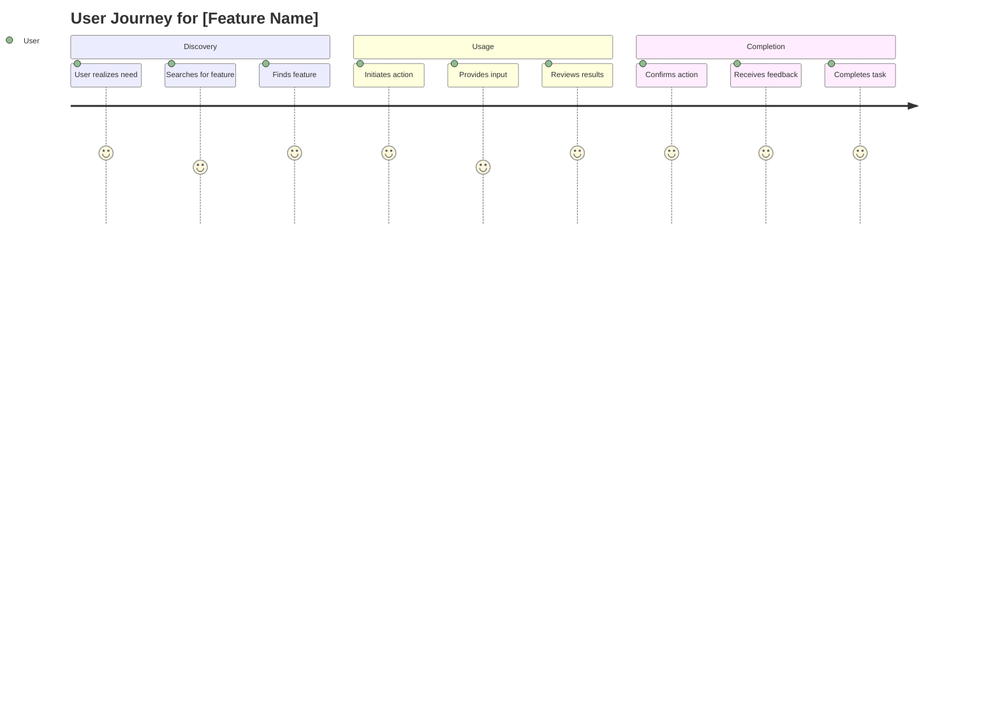

### 3.2 User Flow

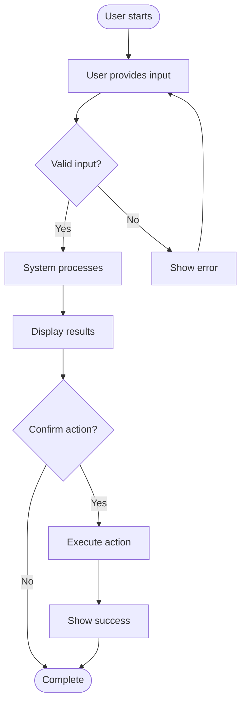

### 3.3 UI/UX Mockups

[Include wireframes, mockups, or screenshots]

**Key UI Elements:**
1. [Element 1] - [Purpose]
2. [Element 2] - [Purpose]
3. [Element 3] - [Purpose]

---

## 4. Technical Design

### 4.1 System Architecture

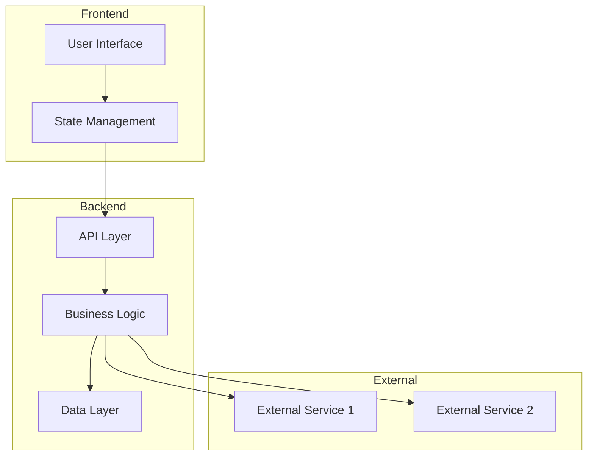

### 4.2 Component Design

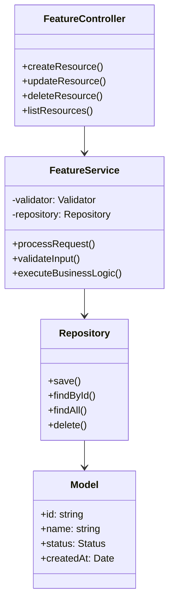

### 4.3 Sequence Diagram

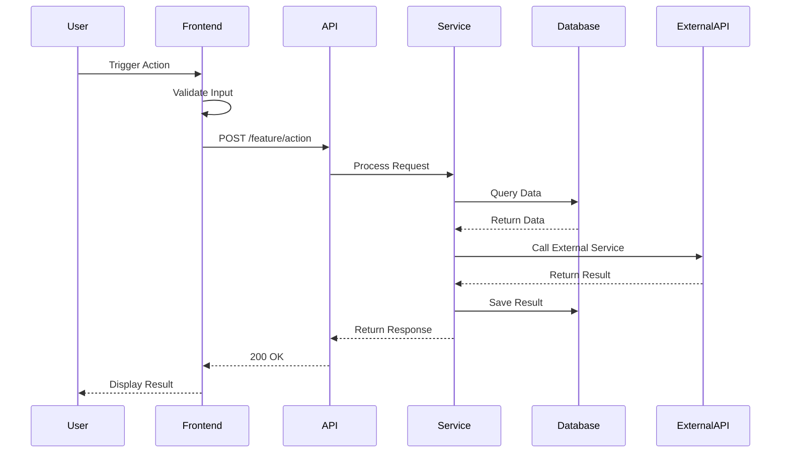

---

## 5. Data Model

### 5.1 Entity Relationship

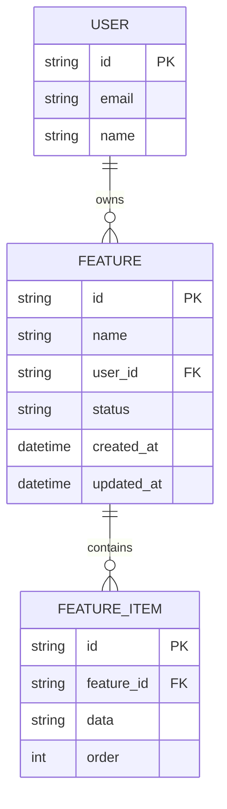

### 5.2 Database Schema

**Table: features**
```sql
CREATE TABLE features (
    id VARCHAR(36) PRIMARY KEY,
    name VARCHAR(255) NOT NULL,
    user_id VARCHAR(36) NOT NULL,
    status VARCHAR(50) DEFAULT 'active',
    created_at TIMESTAMP DEFAULT CURRENT_TIMESTAMP,
    updated_at TIMESTAMP DEFAULT CURRENT_TIMESTAMP ON UPDATE CURRENT_TIMESTAMP,
    FOREIGN KEY (user_id) REFERENCES users(id)
);
```

---

## 6. API Specification

### 6.1 Endpoints

#### POST /api/v1/features

Create a new feature instance.

**Request:**
```json
{
  "name": "Feature Name",
  "config": {
    "option1": "value1"
  }
}
```

**Response (201):**
```json
{
  "id": "feat_123",
  "name": "Feature Name",
  "status": "active",
  "created_at": "2025-01-01T00:00:00Z"
}
```

---

## 7. State Management

### 7.1 State Machine

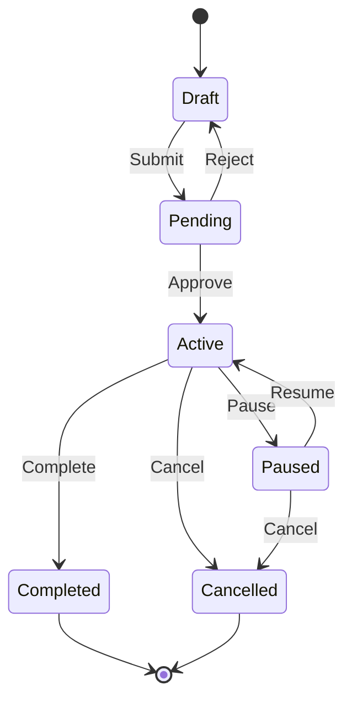

### 7.2 State Transitions

| From State | To State | Trigger | Validation |
|------------|----------|---------|------------|
| Draft | Pending | User submits | Required fields complete |
| Pending | Active | Admin approves | Passes review |
| Active | Completed | System/User | All tasks done |

---

## 8. Business Logic

### 8.1 Processing Flow

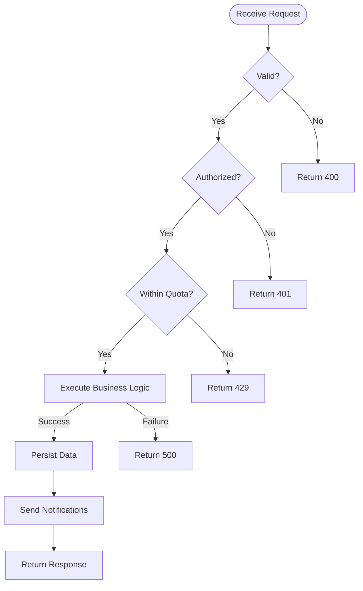

---

## 9. Security & Privacy

### 9.1 Security Requirements

- [x] Authentication required
- [x] Authorization checks
- [x] Input validation
- [x] Output sanitization
- [x] Rate limiting
- [x] Audit logging

### 9.2 Data Privacy

| Data Type | Sensitivity | Encryption | Retention |
|-----------|-------------|------------|-----------|
| User PII | High | At rest & in transit | 7 years |
| Usage Data | Medium | In transit | 1 year |

---

## 10. Error Handling

### 10.1 Error Scenarios

| Scenario | Error Code | Message | Action |
|----------|------------|---------|--------|
| Invalid input | 400 | "Invalid request data" | Show validation errors |
| Not authenticated | 401 | "Authentication required" | Redirect to login |
| Insufficient permissions | 403 | "Access denied" | Show error page |
| Resource not found | 404 | "Resource not found" | Show 404 page |
| Rate limit exceeded | 429 | "Too many requests" | Show retry message |
| Server error | 500 | "Internal error" | Log & show generic error |

---

## 11. Performance Requirements

### 11.1 Targets

| Metric | Target | Measurement |
|--------|--------|-------------|
| Response Time | < 200ms | p95 |
| Throughput | > 100 req/s | Sustained |
| Availability | 99.9% | Monthly |
| Error Rate | < 0.1% | Per request |

### 11.2 Load Testing

**Expected Load:**
- Peak: 1000 concurrent users
- Average: 200 concurrent users
- Requests per user: 10 per session

---

## 12. Testing Strategy

### 12.1 Test Coverage

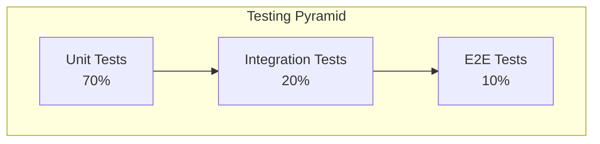

### 12.2 Test Cases

| Test Case | Type | Expected Result |
|-----------|------|-----------------|
| Valid input submission | Positive | Feature created successfully |
| Invalid input | Negative | Validation error returned |
| Unauthorized access | Security | 401 error |
| Rate limit exceeded | Performance | 429 error |

---

## 13. Deployment Plan

### 13.1 Rollout Strategy

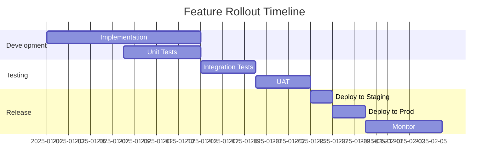

### 13.2 Feature Flags

**Flag:** `feature_[name]_enabled`

**Rollout:**
1. 0% - Internal testing
2. 10% - Beta users
3. 50% - General availability
4. 100% - Full rollout

---

## 14. Monitoring & Metrics

### 14.1 Key Metrics

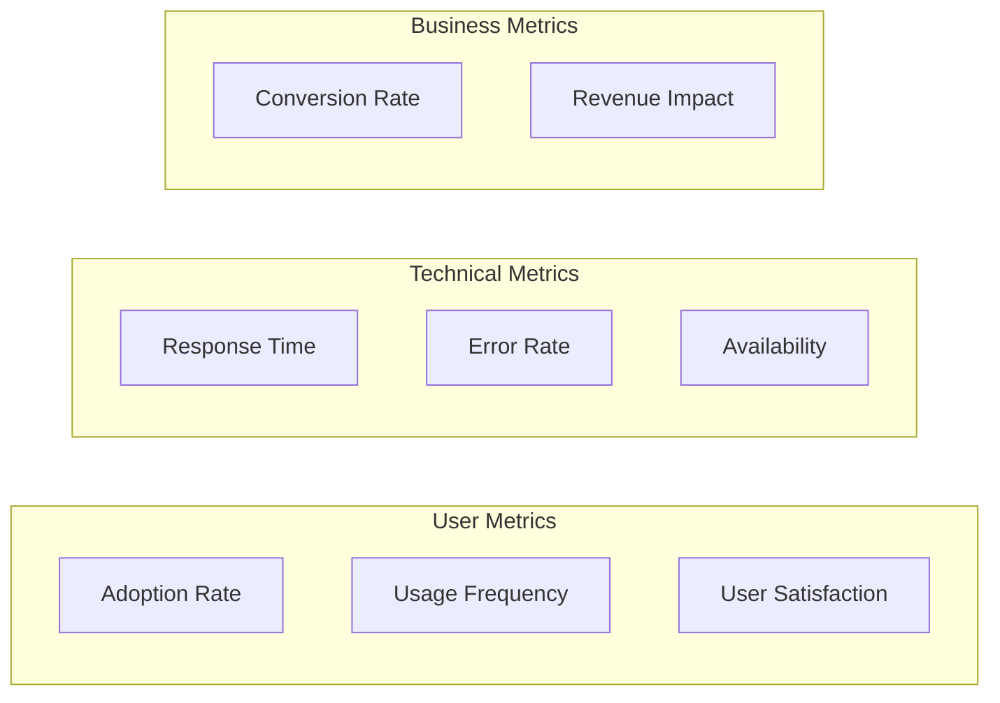

### 14.2 Alerts

| Metric | Threshold | Alert Level |
|--------|-----------|-------------|
| Error rate | > 1% | Critical |
| Response time | > 500ms | Warning |
| Availability | < 99.5% | Critical |

---

## 15. Dependencies

### 15.1 External Dependencies

| Dependency | Type | Impact if Down | Mitigation |
|------------|------|----------------|------------|
| External API | Service | Feature unavailable | Implement circuit breaker |
| Database | Infrastructure | Complete failure | Read replicas |

### 15.2 Internal Dependencies

| Team/Service | Dependency | Timeline |
|--------------|------------|----------|
| Platform Team | API updates | Week 1 |
| Data Team | Schema changes | Week 2 |

---

## 16. Risks & Mitigation

| Risk | Probability | Impact | Mitigation |
|------|-------------|--------|------------|
| Performance degradation | Medium | High | Load testing, caching |
| Security vulnerability | Low | Critical | Security review, penetration testing |
| User adoption low | Medium | Medium | User research, feedback loops |

---

## 17. Success Criteria

### 17.1 Launch Criteria

- [x] All unit tests passing
- [x] Integration tests passing
- [x] Security review complete
- [x] Performance targets met
- [x] Documentation complete
- [x] Rollback plan documented

### 17.2 Post-Launch Success

**Week 1:**
- [ ] Zero critical bugs
- [ ] < 0.1% error rate
- [ ] Positive user feedback

**Month 1:**
- [ ] 20% user adoption
- [ ] 90% feature completion rate
- [ ] NPS score > 7

---

## 18. Open Questions

1. [Question 1]
2. [Question 2]
3. [Question 3]

---

## 19. Appendices

### A. Glossary

| Term | Definition |
|------|------------|
| [Term] | [Definition] |

### B. References

1. [Document/Link]
2. [Document/Link]
