# [System Name] - System Design Document

**Author:** [Name]
**Date:** [YYYY-MM-DD]
**Status:** Draft | In Review | Approved
**Version:** 1.0

---

## 1. Executive Summary

**System Purpose:** [One sentence describing what the system does]

**Scale:**
- Users: [Number of users]
- Requests/Day: [Volume]
- Data Volume: [Size]

**Key Challenges:**
1. [Challenge 1]
2. [Challenge 2]
3. [Challenge 3]

---

## 2. Requirements

### 2.1 Functional Requirements

1. **[Requirement Category]**
   - FR-1: [Specific requirement]
   - FR-2: [Specific requirement]

### 2.2 Non-Functional Requirements

| Category | Requirement | Target | Priority |
|----------|-------------|--------|----------|
| Availability | Uptime | 99.99% | Critical |
| Performance | Response time | < 100ms | High |
| Scalability | Concurrent users | 100k | High |
| Consistency | Data consistency | Eventual | Medium |
| Security | Data encryption | At rest & transit | Critical |

---

## 3. System Context

### 3.1 High-Level Overview

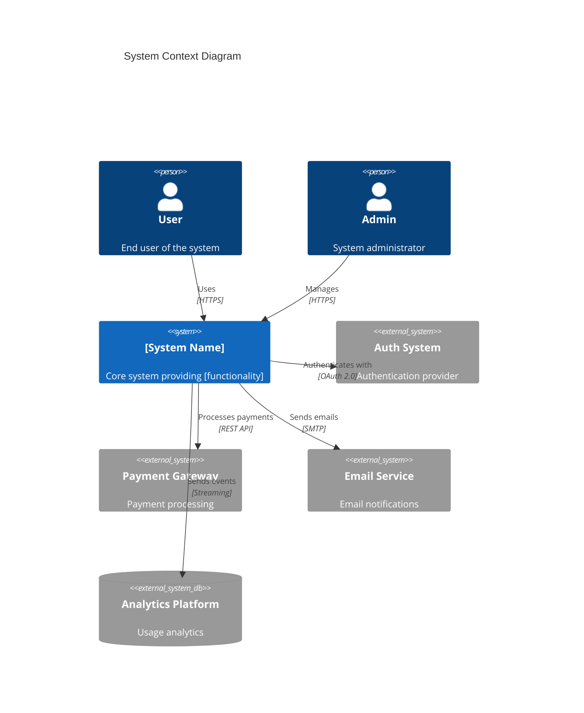

---

## 4. High-Level Architecture

### 4.1 Architecture Overview

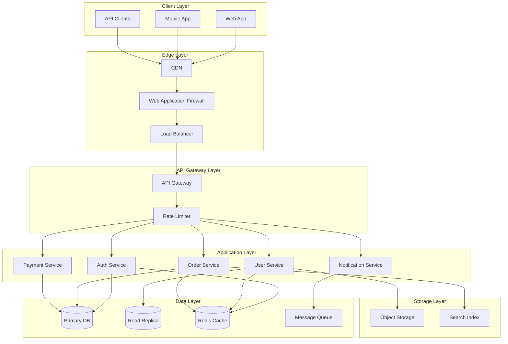

---

## 5. Component Design

### 5.1 Service Architecture

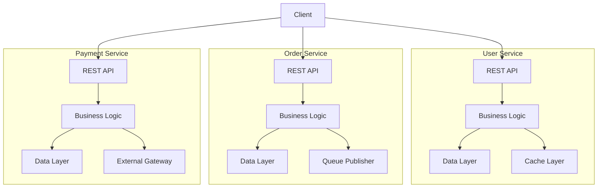

---

## 6. Data Flow

### 6.1 Write Path

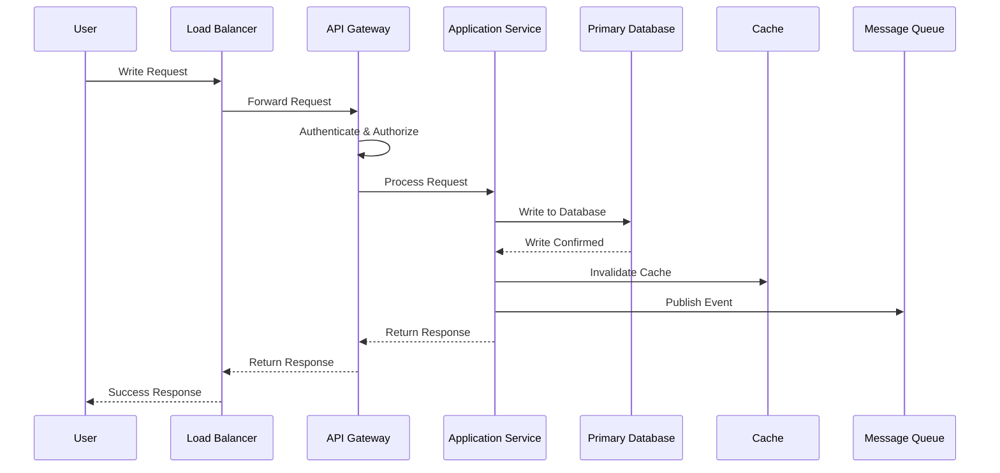

### 6.2 Read Path

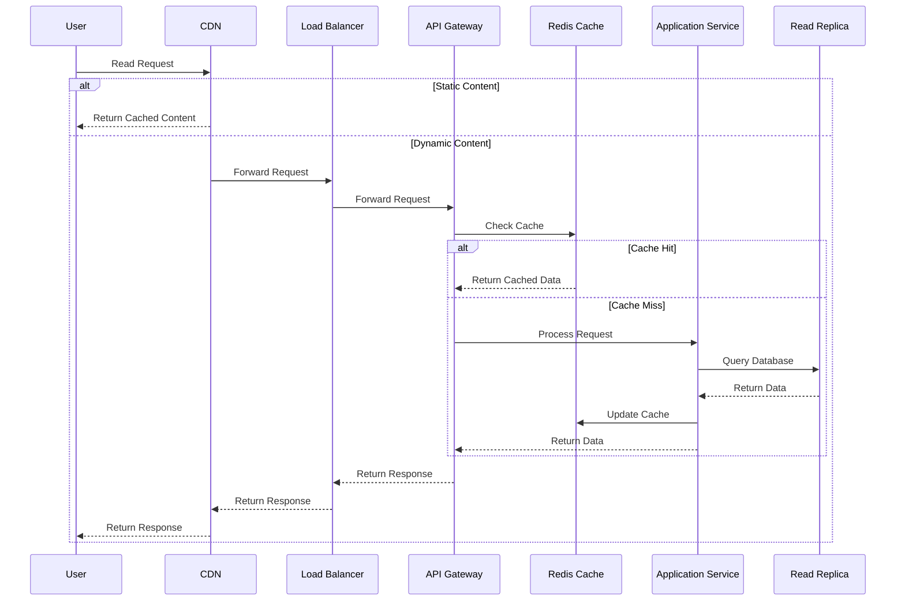

---

## 7. Database Design

### 7.1 Data Model

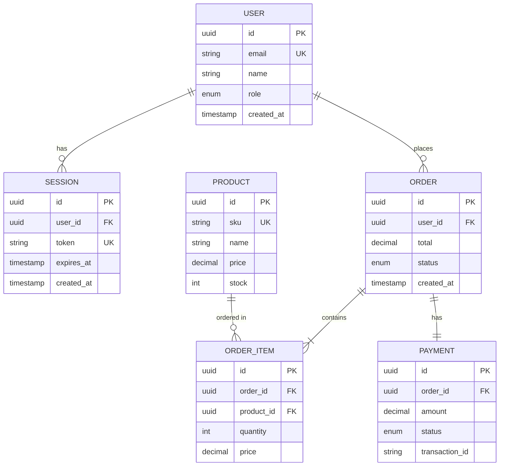

### 7.2 Sharding Strategy

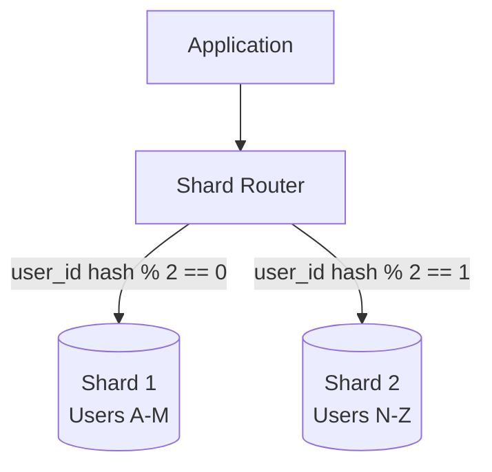

**Sharding Key:** `user_id`

**Rationale:**
- Even distribution of data
- Enables user-centric queries
- Allows independent scaling

---

## 8. API Design

### 8.1 API Architecture

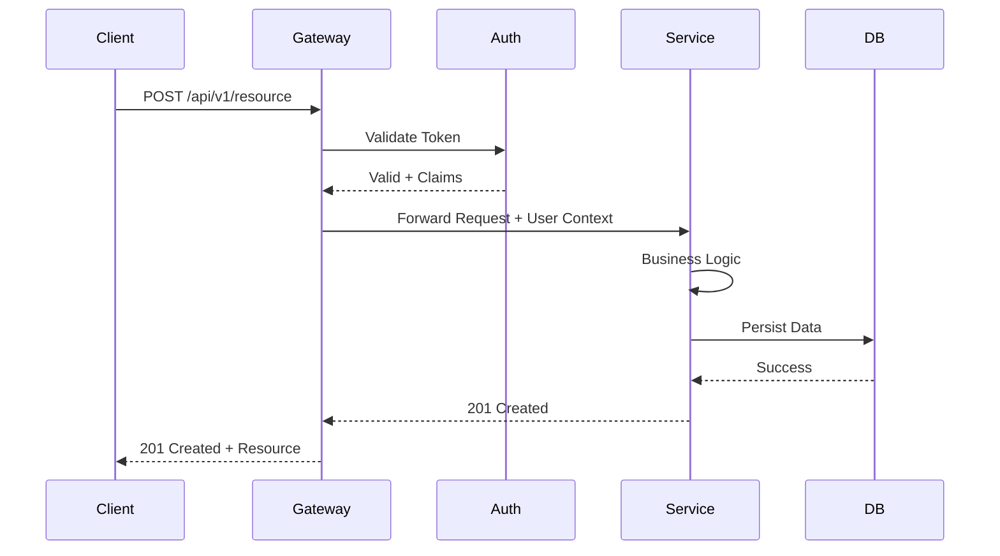

### 8.2 Key Endpoints

| Endpoint | Method | Purpose | Rate Limit |
|----------|--------|---------|------------|
| `/api/v1/users` | GET | List users | 100/min |
| `/api/v1/users/:id` | GET | Get user | 300/min |
| `/api/v1/orders` | POST | Create order | 30/min |
| `/api/v1/orders/:id` | GET | Get order | 300/min |

---

## 9. Scaling Strategy

### 9.1 Horizontal Scaling

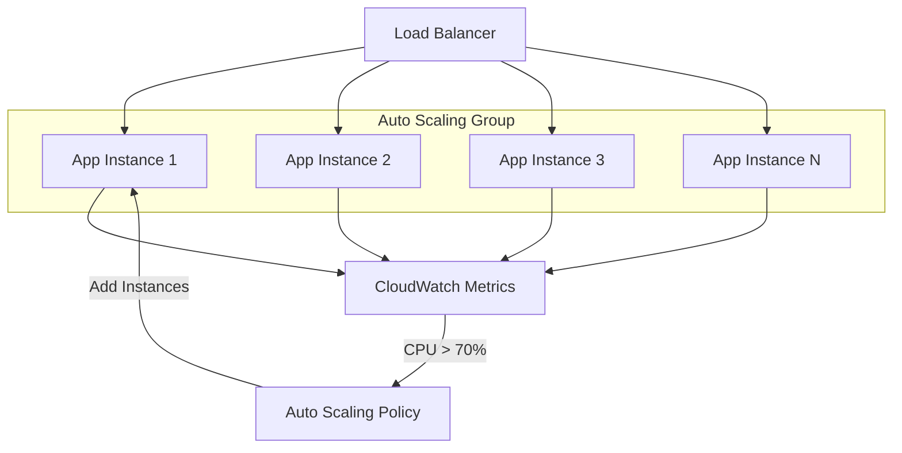

### 9.2 Database Scaling

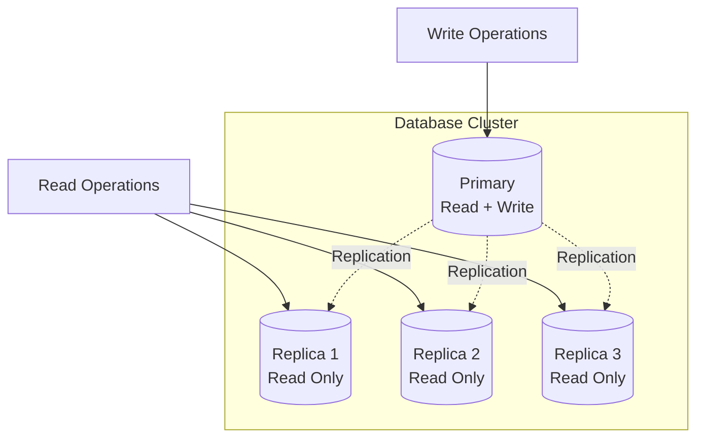

---

## 10. Caching Strategy

### 10.1 Multi-Layer Cache

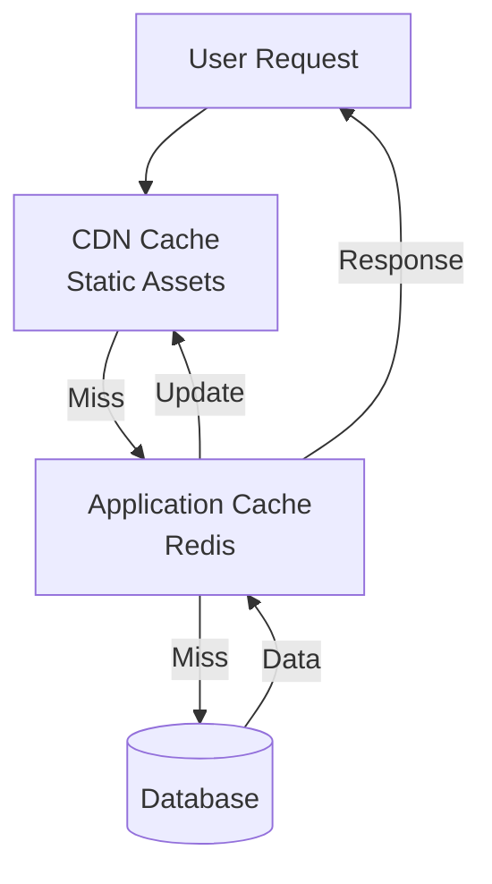

### 10.2 Cache Invalidation

**Strategy:** Write-through with TTL

| Data Type | TTL | Invalidation Trigger |
|-----------|-----|---------------------|
| User Profile | 1 hour | On user update |
| Product Catalog | 15 minutes | On product change |
| Order Status | 5 minutes | On order update |
| Static Assets | 30 days | On deployment |

---

## 11. Message Queue Architecture

### 11.1 Event-Driven Architecture

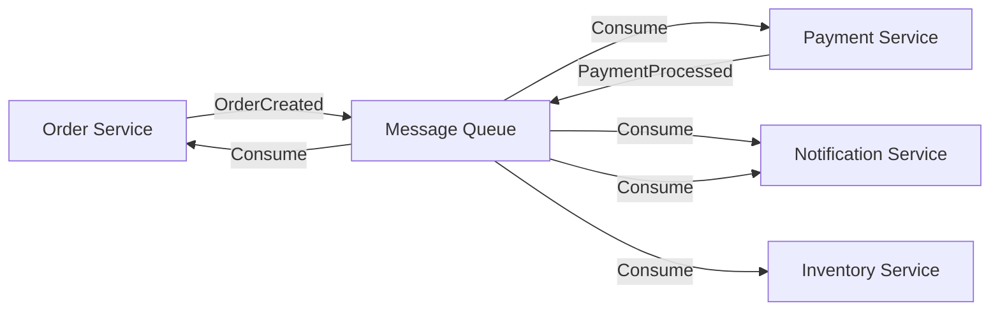

### 11.2 Message Flow

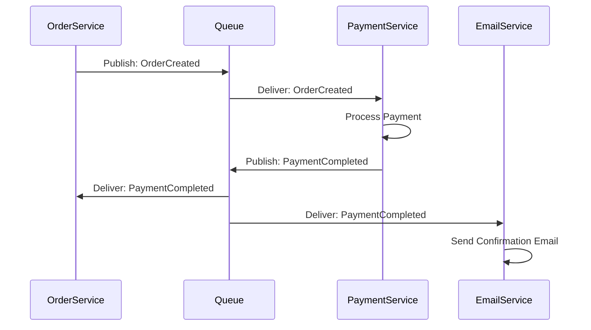

---

## 12. Security Architecture

### 12.1 Security Layers

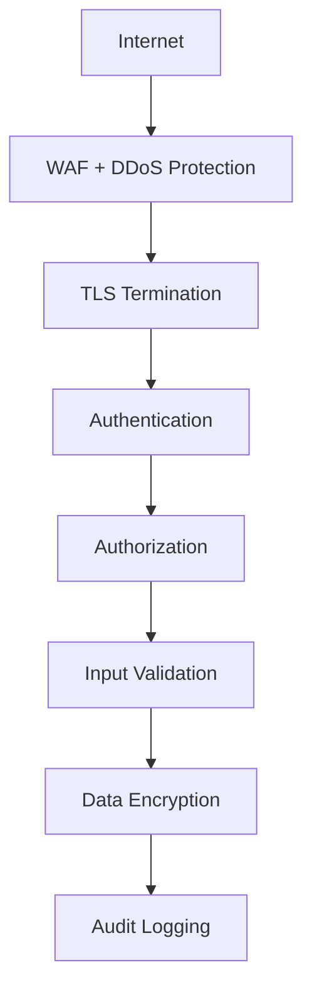

### 12.2 Authentication Flow

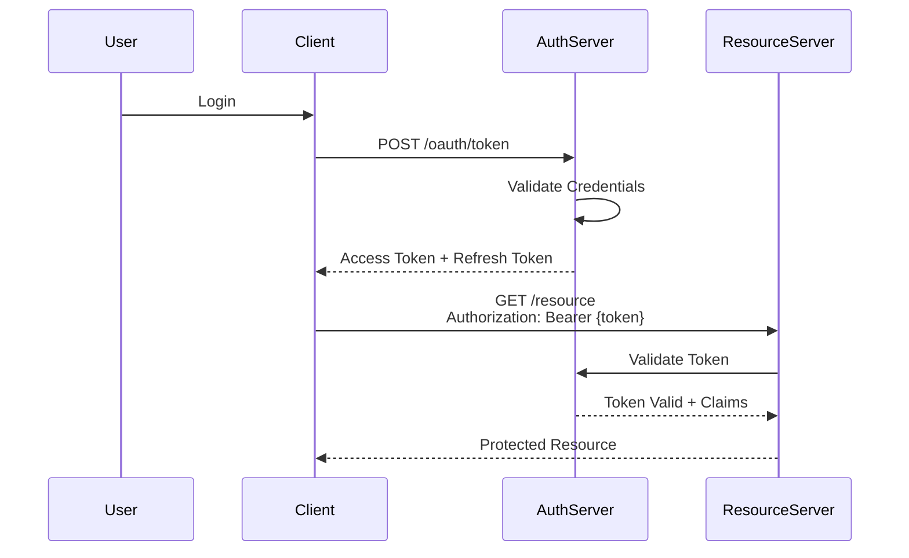

---

## 13. Monitoring & Observability

### 13.1 Monitoring Architecture

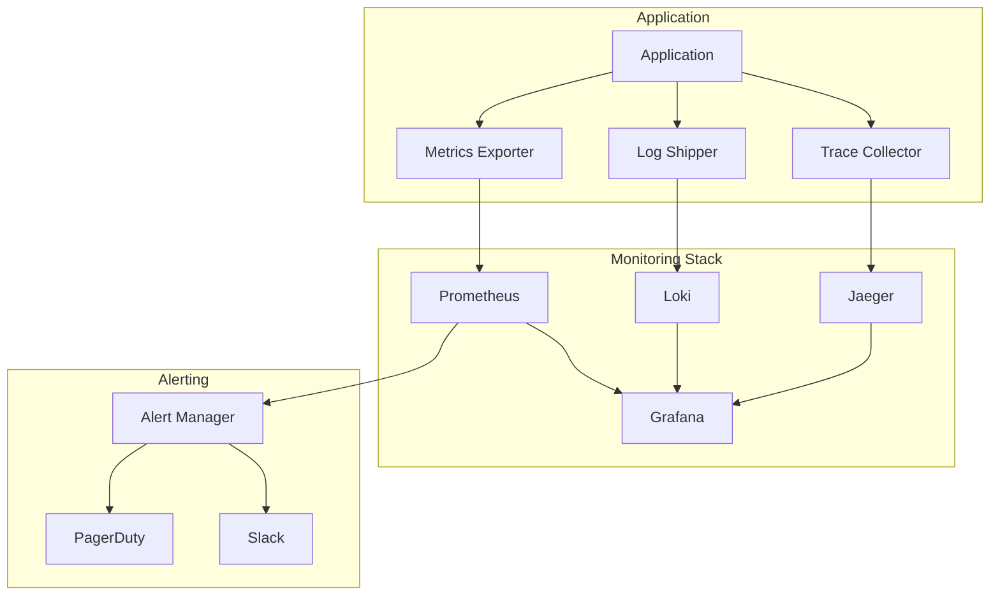

### 13.2 Key Metrics

| Metric | Type | Threshold | Alert Level |
|--------|------|-----------|-------------|
| Request Rate | Gauge | - | Info |
| Error Rate | Gauge | > 1% | Warning |
| Response Time (p99) | Histogram | > 500ms | Warning |
| CPU Usage | Gauge | > 80% | Critical |
| Memory Usage | Gauge | > 85% | Warning |
| Database Connections | Gauge | > 80% pool | Warning |

---

## 14. Disaster Recovery

### 14.1 Backup Strategy

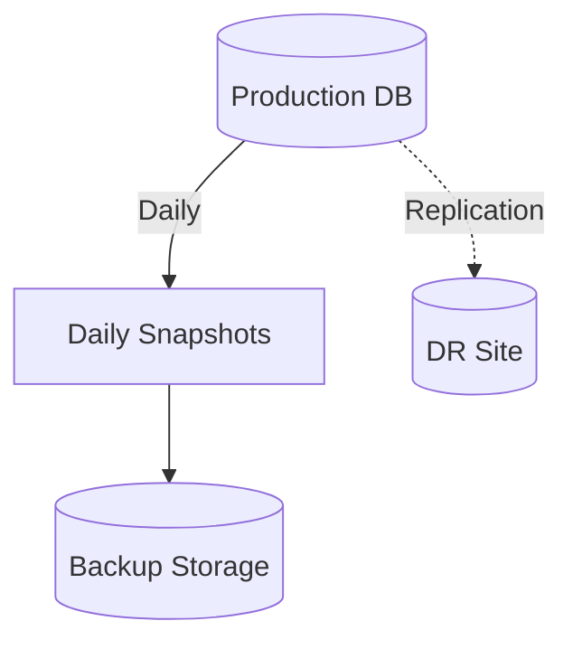

### 14.2 Recovery Procedures

| Scenario | RTO | RPO | Procedure |
|----------|-----|-----|-----------|
| Service Outage | 5 minutes | 0 | Auto-failover to healthy instances |
| Database Failure | 1 hour | 15 minutes | Promote read replica |
| Region Failure | 4 hours | 1 hour | Failover to DR region |
| Data Corruption | 24 hours | 24 hours | Restore from backup |

---

## 15. Deployment Architecture

### 15.1 Infrastructure

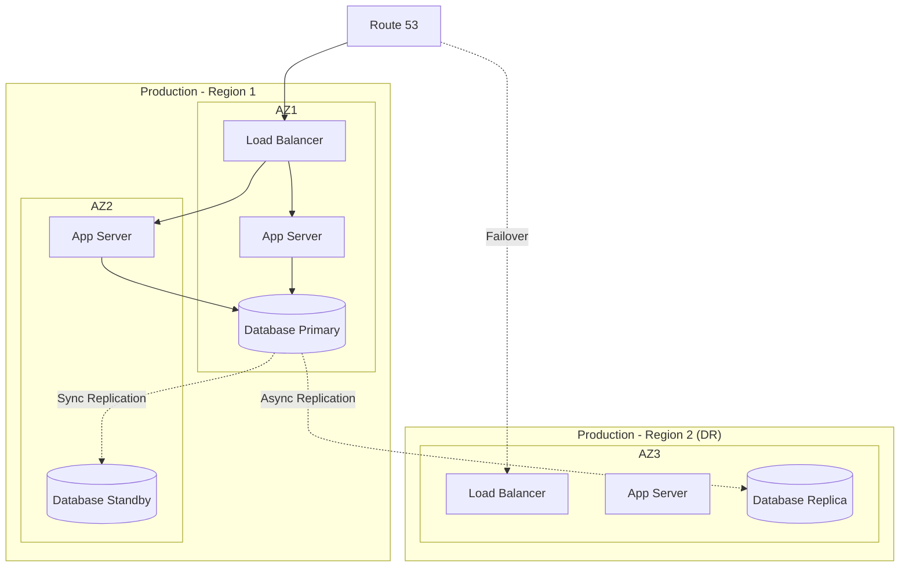

---

## 16. Cost Optimization

### 16.1 Cost Breakdown

| Component | Monthly Cost | Optimization Opportunity |
|-----------|-------------|-------------------------|
| Compute | $10,000 | Reserved instances, spot instances |
| Database | $5,000 | Right-sizing, read replicas |
| Data Transfer | $2,000 | CDN, compression |
| Storage | $1,000 | Lifecycle policies, compression |

---

## 17. Trade-offs & Alternatives

### 17.1 Key Decisions

**Decision 1: Eventual Consistency vs Strong Consistency**
- **Chosen:** Eventual consistency
- **Rationale:** Better availability and performance
- **Trade-off:** Temporary inconsistency acceptable for this use case
- **Alternative:** Strong consistency - rejected due to performance impact

**Decision 2: Monolith vs Microservices**
- **Chosen:** Microservices
- **Rationale:** Independent scaling, fault isolation
- **Trade-off:** Increased operational complexity
- **Alternative:** Modular monolith - might revisit for smaller features

---

## 18. Future Enhancements

### 18.1 Roadmap

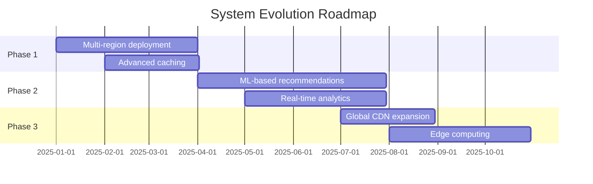

---

## 19. Appendices

### A. Glossary

| Term | Definition |
|------|------------|
| CDN | Content Delivery Network |
| WAF | Web Application Firewall |
| TTL | Time To Live |

### B. References

1. [System Design Primer](https://github.com/donnemartin/system-design-primer)
2. [AWS Well-Architected Framework](https://aws.amazon.com/architecture/well-architected/)
