# Java Servlet/JSP Web Application → Mermaid Diagrams

**Framework:** Java EE / Jakarta EE (Servlet 4.0+, JSP 2.3)
**Pattern:** MVC Model 2, DAO, Service Layer
**Server:** Apache Tomcat 10, WildFly, GlassFish
**Build:** Maven, Gradle

This guide shows how to extract Mermaid diagrams from traditional Java servlet-based web applications using the MVC Model 2 architecture pattern.

---

## Table of Contents

1. [Architecture Diagram from Project Structure](#architecture-diagram-from-project-structure)
2. [Deployment Diagram from web.xml & server.xml](#deployment-diagram-from-webxml--serverxml)
3. [Sequence Diagram from Servlet Request Flow](#sequence-diagram-from-servlet-request-flow)
4. [Activity Diagram from Filter Chain](#activity-diagram-from-filter-chain)
5. [Entity Relationship from JPA Entities](#entity-relationship-from-jpa-entities)
6. [Best Practices](#best-practices)

---

## Architecture Diagram from Project Structure

### Java Source Code Structure

```
src/main/java/com/example/
├── controller/              # Servlets (Controller layer)
│   ├── ContactServlet.java
│   ├── AuthServlet.java
│   └── DashboardServlet.java
├── service/                 # Business logic (Service layer)
│   ├── ContactService.java
│   └── AuthService.java
├── dao/                     # Data access (DAO layer)
│   ├── ContactDao.java
│   ├── UserDao.java
│   └── impl/
│       ├── ContactDaoImpl.java
│       └── UserDaoImpl.java
├── model/                   # Domain entities
│   ├── Contact.java
│   ├── User.java
│   └── Role.java
├── filter/                  # Servlet filters
│   ├── AuthenticationFilter.java
│   ├── LoggingFilter.java
│   └── CorsFilter.java
├── listener/                # Context/Session listeners
│   └── ApplicationListener.java
└── util/
    ├── DbConnectionPool.java
    └── ValidationUtil.java

src/main/webapp/
├── WEB-INF/
│   ├── web.xml              # Deployment descriptor
│   └── jsp/                 # View layer (JSP pages)
│       ├── contacts/
│       │   ├── list.jsp
│       │   └── edit.jsp
│       └── common/
│           ├── header.jsp
│           └── footer.jsp
├── css/
├── js/
└── index.jsp
```

### Mapping to Architecture Diagram

**Pattern Recognition:**
- `controller/` → Servlet classes handling HTTP requests (Controller)
- `service/` → Business logic classes (Service)
- `dao/` → Database access classes (DAO/Repository)
- `model/` → Plain Java Objects (Domain Model)
- `filter/` → Servlet filters for cross-cutting concerns
- `webapp/WEB-INF/jsp/` → JSP view templates (View)

**Generated Mermaid:**



```mermaid
graph TB
    Client[👤 Browser Client]
    Server[🌐 Tomcat Server]

    subgraph "Servlet Container"
        Filters[🔧 Filter Chain]
        DispatchServlet[🎯 Dispatcher Servlet]

        subgraph "Controller Layer"
            ContactCtrl[📝 ContactServlet]
            AuthCtrl[🔐 AuthServlet]
            DashboardCtrl[📊 DashboardServlet]
        end

        subgraph "Service Layer"
            ContactSvc[⚙️ ContactService]
            AuthSvc[🔑 AuthService]
        end

        subgraph "DAO Layer"
            ContactDAO[💾 ContactDaoImpl]
            UserDAO[👥 UserDaoImpl]
        end

        subgraph "View Layer"
            JSP[📄 JSP Pages]
            JSTL[🏷️ JSTL Tags]
        end
    end

    subgraph "Database"
        DB[(🗄️ MySQL/PostgreSQL)]
        ConnPool[⚡ HikariCP Pool]
    end

    Client -->|HTTP Request| Server
    Server --> Filters
    Filters -->|Filter Chain| DispatchServlet

    DispatchServlet --> ContactCtrl
    DispatchServlet --> AuthCtrl
    DispatchServlet --> DashboardCtrl

    ContactCtrl --> ContactSvc
    AuthCtrl --> AuthSvc

    ContactSvc --> ContactDAO
    AuthSvc --> UserDAO

    ContactDAO --> ConnPool
    UserDAO --> ConnPool
    ConnPool --> DB

    ContactCtrl -->|Forward Request| JSP
    JSP --> JSTL
    JSTL -->|Render HTML| Client

    classDef controller fill:#FF6B6B,stroke:#C92A2A,color:#fff
    classDef service fill:#4ECDC4,stroke:#0B7285,color:#fff
    classDef dao fill:#95E1D3,stroke:#087F5B,color:#000
    classDef view fill:#FFE66D,stroke:#F08C00,color:#000
    classDef db fill:#A8DADC,stroke:#1864AB,color:#000
    classDef filter fill:#F38181,stroke:#C92A2A,color:#fff

    class ContactCtrl,AuthCtrl,DashboardCtrl controller
    class ContactSvc,AuthSvc service
    class ContactDAO,UserDAO dao
    class JSP,JSTL view
    class DB,ConnPool db
    class Filters,DispatchServlet filter
```

**Code Snippet - Servlet Controller:**

```java
// src/main/java/com/example/controller/ContactServlet.java
@WebServlet(urlPatterns = {"/contacts", "/contacts/*"})
public class ContactServlet extends HttpServlet {

    private ContactService contactService;

    @Override
    public void init() throws ServletException {
        // Service layer injection (manual or with CDI)
        contactService = new ContactService();
    }

    @Override
    protected void doGet(HttpServletRequest req, HttpServletResponse resp)
            throws ServletException, IOException {
        String pathInfo = req.getPathInfo();

        if (pathInfo == null || pathInfo.equals("/")) {
            // List all contacts
            List<Contact> contacts = contactService.getAllContacts();
            req.setAttribute("contacts", contacts);
            req.getRequestDispatcher("/WEB-INF/jsp/contacts/list.jsp")
               .forward(req, resp);
        } else {
            // View single contact
            long id = Long.parseLong(pathInfo.substring(1));
            Contact contact = contactService.getContactById(id);
            req.setAttribute("contact", contact);
            req.getRequestDispatcher("/WEB-INF/jsp/contacts/view.jsp")
               .forward(req, resp);
        }
    }

    @Override
    protected void doPost(HttpServletRequest req, HttpServletResponse resp)
            throws ServletException, IOException {
        String action = req.getParameter("action");

        if ("create".equals(action)) {
            Contact contact = buildContactFromRequest(req);
            contactService.createContact(contact);
            resp.sendRedirect(req.getContextPath() + "/contacts");
        }
    }
}
```

---

## Deployment Diagram from web.xml & server.xml

### web.xml Configuration

```xml
<?xml version="1.0" encoding="UTF-8"?>
<web-app xmlns="https://jakarta.ee/xml/ns/jakartaee"
         xmlns:xsi="http://www.w3.org/2001/XMLSchema-instance"
         xsi:schemaLocation="https://jakarta.ee/xml/ns/jakartaee
         https://jakarta.ee/xml/ns/jakartaee/web-app_5_0.xsd"
         version="5.0">

    <display-name>Contact Management App</display-name>

    <!-- Context Parameters -->
    <context-param>
        <param-name>db.url</param-name>
        <param-value>jdbc:mysql://localhost:3306/contacts</param-value>
    </context-param>
    <context-param>
        <param-name>db.pool.size</param-name>
        <param-value>20</param-value>
    </context-param>

    <!-- Servlet Definitions -->
    <servlet>
        <servlet-name>ContactServlet</servlet-name>
        <servlet-class>com.example.controller.ContactServlet</servlet-class>
        <load-on-startup>1</load-on-startup>
    </servlet>

    <servlet-mapping>
        <servlet-name>ContactServlet</servlet-name>
        <url-pattern>/contacts/*</url-pattern>
    </servlet-mapping>

    <!-- Filters -->
    <filter>
        <filter-name>AuthenticationFilter</filter-name>
        <filter-class>com.example.filter.AuthenticationFilter</filter-class>
    </filter>

    <filter-mapping>
        <filter-name>AuthenticationFilter</filter-name>
        <url-pattern>/contacts/*</url-pattern>
        <url-pattern>/dashboard/*</url-pattern>
    </filter-mapping>

    <!-- Error Pages -->
    <error-page>
        <error-code>404</error-code>
        <location>/WEB-INF/jsp/error/404.jsp</location>
    </error-page>

    <!-- Session Configuration -->
    <session-config>
        <session-timeout>30</session-timeout>
        <cookie-config>
            <http-only>true</http-only>
            <secure>true</secure>
        </cookie-config>
    </session-config>

</web-app>
```

### Tomcat server.xml (Excerpt)

```xml
<Context path="/contacts-app" docBase="contacts-app" reloadable="true">
    <!-- Database Connection Pool -->
    <Resource name="jdbc/ContactsDB"
              auth="Container"
              type="javax.sql.DataSource"
              driverClassName="com.mysql.cj.jdbc.Driver"
              url="jdbc:mysql://localhost:3306/contacts"
              username="app_user"
              password="secure_password"
              maxTotal="20"
              maxIdle="10"
              maxWaitMillis="10000"/>

    <!-- JNDI Mail Session -->
    <Resource name="mail/Session"
              auth="Container"
              type="javax.mail.Session"
              mail.smtp.host="smtp.gmail.com"
              mail.smtp.port="587"
              mail.smtp.auth="true"
              mail.smtp.starttls.enable="true"/>
</Context>
```

### Mapping to Deployment Diagram

**Pattern Recognition:**
- `<servlet>` tags → Web application components
- `<filter>` tags → Request/response interceptors
- `<context-param>` → Application configuration
- `<Resource>` in server.xml → External dependencies (DB, mail)
- Session config → Session management settings

**Generated Mermaid:**



```mermaid
graph TB
    subgraph "Client Layer"
        Browser[🌐 Web Browser]
    end

    subgraph "Load Balancer"
        LB[⚖️ Apache httpd mod_jk]
    end

    subgraph "Tomcat Server - 192.168.1.10:8080"
        direction TB

        subgraph "Servlet Container"
            direction TB
            Connector[🔌 HTTP Connector<br/>Port 8080<br/>maxThreads: 200]

            subgraph "Web Application<br/>/contacts-app"
                direction TB
                FilterChain[🔧 Filter Chain]
                AuthFilter[🔐 AuthFilter]
                LogFilter[📝 LoggingFilter]

                subgraph "Servlets"
                    ContactServlet[📝 ContactServlet<br/>/contacts/*]
                    AuthServlet[🔑 AuthServlet<br/>/auth/*]
                    Dashboard[📊 DashboardServlet<br/>/dashboard/*]
                end

                SessionMgr[⏰ Session Manager<br/>Timeout: 30min<br/>HttpOnly: true]
            end

            subgraph "JNDI Resources"
                DataSource[💾 DataSource<br/>jdbc/ContactsDB<br/>maxTotal: 20<br/>maxIdle: 10]
                MailSession[📧 Mail Session<br/>mail/Session<br/>SMTP: smtp.gmail.com:587]
            end
        end
    end

    subgraph "Database Server - 192.168.1.20:3306"
        MySQL[(🗄️ MySQL 8.0<br/>Database: contacts<br/>User: app_user)]
    end

    subgraph "Email Service"
        SMTP[📨 Gmail SMTP<br/>smtp.gmail.com:587<br/>TLS Enabled]
    end

    Browser -->|HTTPS :443| LB
    LB -->|HTTP :8080| Connector
    Connector --> FilterChain
    FilterChain --> AuthFilter
    AuthFilter --> LogFilter
    LogFilter --> ContactServlet
    LogFilter --> AuthServlet
    LogFilter --> Dashboard

    ContactServlet -.->|Use| SessionMgr
    ContactServlet -->|JNDI Lookup| DataSource
    AuthServlet -->|JNDI Lookup| MailSession

    DataSource -->|JDBC Connection| MySQL
    MailSession -->|Send Email| SMTP

    classDef frontend fill:#FFE66D,stroke:#F08C00,color:#000
    classDef server fill:#4ECDC4,stroke:#0B7285,color:#fff
    classDef servlet fill:#FF6B6B,stroke:#C92A2A,color:#fff
    classDef resource fill:#95E1D3,stroke:#087F5B,color:#000
    classDef external fill:#A8DADC,stroke:#1864AB,color:#000

    class Browser,LB frontend
    class Connector,FilterChain,AuthFilter,LogFilter,SessionMgr server
    class ContactServlet,AuthServlet,Dashboard servlet
    class DataSource,MailSession resource
    class MySQL,SMTP external
```

**Key Configuration Mappings:**

| web.xml Element | Diagram Component | Notes |
|-----------------|-------------------|-------|
| `<servlet>` + `<servlet-mapping>` | Servlet nodes with URL patterns | Shows routing configuration |
| `<filter>` + `<filter-mapping>` | Filter chain sequence | Order matters for execution |
| `<session-config>` | Session Manager component | Security settings (HttpOnly, Secure) |
| `<context-param>` | Configuration properties | Database URLs, pool sizes |
| `<Resource>` (server.xml) | JNDI resources | DataSource, Mail, JMS connections |
| `<error-page>` | Error handling routes | (Optional in diagram) |

---

## Sequence Diagram from Servlet Request Flow

### Java Code - Request Processing

```java
// src/main/java/com/example/controller/ContactServlet.java
@WebServlet("/contacts/*")
public class ContactServlet extends HttpServlet {

    @Inject
    private ContactService contactService;

    @Override
    protected void doPost(HttpServletRequest req, HttpServletResponse resp)
            throws ServletException, IOException {

        // 1. Extract parameters
        String name = req.getParameter("name");
        String email = req.getParameter("email");

        // 2. Validate input
        if (!ValidationUtil.isValidEmail(email)) {
            req.setAttribute("error", "Invalid email format");
            req.getRequestDispatcher("/WEB-INF/jsp/error.jsp").forward(req, resp);
            return;
        }

        // 3. Build domain object
        Contact contact = new Contact();
        contact.setName(name);
        contact.setEmail(email);

        // 4. Call service layer
        try {
            Contact saved = contactService.createContact(contact);

            // 5. Set response attributes
            req.setAttribute("contact", saved);
            req.setAttribute("message", "Contact created successfully");

            // 6. Forward to success view
            req.getRequestDispatcher("/WEB-INF/jsp/contacts/success.jsp")
               .forward(req, resp);

        } catch (DuplicateEmailException e) {
            req.setAttribute("error", "Email already exists");
            req.getRequestDispatcher("/WEB-INF/jsp/contacts/form.jsp")
               .forward(req, resp);
        }
    }
}

// src/main/java/com/example/service/ContactService.java
public class ContactService {

    private ContactDao contactDao;

    public Contact createContact(Contact contact) throws DuplicateEmailException {
        // Check for duplicates
        if (contactDao.existsByEmail(contact.getEmail())) {
            throw new DuplicateEmailException("Email already exists");
        }

        // Generate ID
        contact.setId(UUID.randomUUID().toString());
        contact.setCreatedAt(LocalDateTime.now());

        // Save to database
        return contactDao.save(contact);
    }
}

// src/main/java/com/example/dao/impl/ContactDaoImpl.java
public class ContactDaoImpl implements ContactDao {

    @Resource(name = "jdbc/ContactsDB")
    private DataSource dataSource;

    @Override
    public Contact save(Contact contact) {
        String sql = "INSERT INTO contacts (id, name, email, created_at) VALUES (?, ?, ?, ?)";

        try (Connection conn = dataSource.getConnection();
             PreparedStatement stmt = conn.prepareStatement(sql)) {

            stmt.setString(1, contact.getId());
            stmt.setString(2, contact.getName());
            stmt.setString(3, contact.getEmail());
            stmt.setTimestamp(4, Timestamp.valueOf(contact.getCreatedAt()));

            stmt.executeUpdate();
            return contact;

        } catch (SQLException e) {
            throw new DaoException("Failed to save contact", e);
        }
    }

    @Override
    public boolean existsByEmail(String email) {
        String sql = "SELECT COUNT(*) FROM contacts WHERE email = ?";

        try (Connection conn = dataSource.getConnection();
             PreparedStatement stmt = conn.prepareStatement(sql)) {

            stmt.setString(1, email);
            ResultSet rs = stmt.executeQuery();

            if (rs.next()) {
                return rs.getInt(1) > 0;
            }
            return false;

        } catch (SQLException e) {
            throw new DaoException("Failed to check email", e);
        }
    }
}

// src/main/java/com/example/filter/AuthenticationFilter.java
public class AuthenticationFilter implements Filter {

    @Override
    public void doFilter(ServletRequest request, ServletResponse response,
                        FilterChain chain) throws IOException, ServletException {

        HttpServletRequest req = (HttpServletRequest) request;
        HttpServletResponse resp = (HttpServletResponse) response;
        HttpSession session = req.getSession(false);

        // Check if user is authenticated
        if (session != null && session.getAttribute("user") != null) {
            // User authenticated, continue
            chain.doFilter(request, response);
        } else {
            // Not authenticated, redirect to login
            resp.sendRedirect(req.getContextPath() + "/login.jsp");
        }
    }
}
```

### Mapping to Sequence Diagram

**Pattern Recognition:**
- Filter chain execution order
- Servlet request dispatch pattern
- Service layer method calls
- DAO database operations
- JSP forward/redirect patterns
- Exception handling flow

**Generated Mermaid:**


**Alternative Flow - Duplicate Email:**

```mermaid
sequenceDiagram
    participant Servlet as 📝 Contact Servlet
    participant Service as ⚙️ Contact Service
    participant DAO as 💾 Contact DAO
    participant DB as 🗄️ MySQL
    participant JSP as 📄 Error JSP

    Servlet->>+Service: createContact(contact)
    Service->>+DAO: existsByEmail(email)
    DAO->>+DB: SELECT COUNT(*)<br/>WHERE email = ?
    DB-->>-DAO: 1 (exists)
    DAO-->>-Service: true

    Service->>Service: throw DuplicateEmailException
    Service-->>-Servlet: Exception thrown

    Servlet->>Servlet: catch (DuplicateEmailException)<br/>req.setAttribute("error", "Email exists")
    Servlet->>+JSP: forward("/WEB-INF/jsp/form.jsp")
    JSP->>JSP: Render form with error
    JSP-->>-Servlet: HTML with error message
```



---

## Activity Diagram from Filter Chain

### Filter Chain Configuration

```java
// src/main/java/com/example/filter/LoggingFilter.java
@WebFilter("/*")
public class LoggingFilter implements Filter {
    private static final Logger logger = Logger.getLogger(LoggingFilter.class.getName());

    @Override
    public void doFilter(ServletRequest request, ServletResponse response,
                        FilterChain chain) throws IOException, ServletException {
        HttpServletRequest req = (HttpServletRequest) request;

        long startTime = System.currentTimeMillis();
        String uri = req.getRequestURI();
        String method = req.getMethod();

        logger.info("Request started: " + method + " " + uri);

        try {
            // Continue filter chain
            chain.doFilter(request, response);
        } finally {
            long duration = System.currentTimeMillis() - startTime;
            logger.info("Request completed: " + uri + " in " + duration + "ms");
        }
    }
}

// src/main/java/com/example/filter/CorsFilter.java
@WebFilter("/*")
public class CorsFilter implements Filter {

    @Override
    public void doFilter(ServletRequest request, ServletResponse response,
                        FilterChain chain) throws IOException, ServletException {
        HttpServletResponse resp = (HttpServletResponse) response;
        HttpServletRequest req = (HttpServletRequest) request;

        // Add CORS headers
        resp.setHeader("Access-Control-Allow-Origin", "*");
        resp.setHeader("Access-Control-Allow-Methods", "GET, POST, PUT, DELETE, OPTIONS");
        resp.setHeader("Access-Control-Allow-Headers", "Content-Type, Authorization");

        if ("OPTIONS".equalsIgnoreCase(req.getMethod())) {
            resp.setStatus(HttpServletResponse.SC_OK);
            return;
        }

        chain.doFilter(request, response);
    }
}

// src/main/java/com/example/filter/AuthenticationFilter.java
@WebFilter(urlPatterns = {"/contacts/*", "/dashboard/*"})
public class AuthenticationFilter implements Filter {

    @Override
    public void doFilter(ServletRequest request, ServletResponse response,
                        FilterChain chain) throws IOException, ServletException {
        HttpServletRequest req = (HttpServletRequest) request;
        HttpServletResponse resp = (HttpServletResponse) response;
        HttpSession session = req.getSession(false);

        User user = (session != null) ? (User) session.getAttribute("user") : null;

        if (user == null) {
            // Not authenticated
            resp.sendRedirect(req.getContextPath() + "/login.jsp");
            return;
        }

        // Check if user has required role
        String requiredRole = getRequiredRole(req.getRequestURI());
        if (requiredRole != null && !user.hasRole(requiredRole)) {
            resp.sendError(HttpServletResponse.SC_FORBIDDEN, "Access denied");
            return;
        }

        // Set user in request scope for servlets
        req.setAttribute("currentUser", user);

        chain.doFilter(request, response);
    }

    private String getRequiredRole(String uri) {
        if (uri.contains("/admin/")) return "ADMIN";
        if (uri.contains("/dashboard/")) return "USER";
        return null;
    }
}
```

### web.xml Filter Ordering

```xml
<web-app>
    <!-- Filter execution order defined by order in web.xml -->

    <!-- 1. Logging Filter - First to log all requests -->
    <filter>
        <filter-name>LoggingFilter</filter-name>
        <filter-class>com.example.filter.LoggingFilter</filter-class>
    </filter>
    <filter-mapping>
        <filter-name>LoggingFilter</filter-name>
        <url-pattern>/*</url-pattern>
    </filter-mapping>

    <!-- 2. CORS Filter - Add headers early -->
    <filter>
        <filter-name>CorsFilter</filter-name>
        <filter-class>com.example.filter.CorsFilter</filter-class>
    </filter>
    <filter-mapping>
        <filter-name>CorsFilter</filter-name>
        <url-pattern>/*</url-pattern>
    </filter-mapping>

    <!-- 3. Authentication Filter - Check access -->
    <filter>
        <filter-name>AuthenticationFilter</filter-name>
        <filter-class>com.example.filter.AuthenticationFilter</filter-class>
    </filter>
    <filter-mapping>
        <filter-name>AuthenticationFilter</filter-name>
        <url-pattern>/contacts/*</url-pattern>
        <url-pattern>/dashboard/*</url-pattern>
    </filter-mapping>
</web-app>
```

### Mapping to Activity Diagram

**Pattern Recognition:**
- Filter chain execution order (from web.xml)
- `chain.doFilter()` invocation points
- Early return patterns (redirect, error response)
- Session validation logic
- Role-based access control checks

**Generated Mermaid:**



```mermaid
flowchart TD
    Start([📥 HTTP Request<br/>POST /contacts/create]) --> TomcatReceive[⚙️ Tomcat Receives Request]

    TomcatReceive --> LogFilter{🔧 Logging Filter}
    LogFilter --> LogStart[📝 Log request start<br/>Method + URI + timestamp]
    LogStart --> CorsFilter{🌐 CORS Filter}

    CorsFilter --> CheckOptions{OPTIONS<br/>request?}
    CheckOptions -->|Yes| SetCorsHeaders[📋 Set CORS headers<br/>Allow-Origin: *<br/>Allow-Methods: GET,POST...]
    SetCorsHeaders --> ReturnOK[✅ Return 200 OK<br/>END]

    CheckOptions -->|No| AddCorsHeaders[📋 Add CORS headers]
    AddCorsHeaders --> AuthFilter{🔐 Authentication Filter}

    AuthFilter --> GetSession[🔑 Get HttpSession]
    GetSession --> SessionExists{Session<br/>exists?}

    SessionExists -->|No| RedirectLogin[🚪 Redirect to /login.jsp]
    RedirectLogin --> LogEnd1[📝 Log request end<br/>Status: 302]
    LogEnd1 --> EndRedirect([❌ END - Not Authenticated])

    SessionExists -->|Yes| GetUser[👤 Get user from session]
    GetUser --> UserExists{User<br/>object exists?}

    UserExists -->|No| RedirectLogin
    UserExists -->|Yes| CheckRole{Required<br/>role?}

    CheckRole -->|/admin/* path| CheckAdmin{User has<br/>ADMIN role?}
    CheckAdmin -->|No| Return403[⛔ Send 403 Forbidden]
    Return403 --> LogEnd2[📝 Log request end<br/>Status: 403]
    LogEnd2 --> EndForbidden([❌ END - Access Denied])

    CheckAdmin -->|Yes| SetUserAttr[👤 req.setAttribute<br/>'currentUser', user]

    CheckRole -->|/dashboard/* path| CheckUser{User has<br/>USER role?}
    CheckUser -->|No| Return403
    CheckUser -->|Yes| SetUserAttr

    CheckRole -->|No role required| SetUserAttr

    SetUserAttr --> InvokeServlet[📝 Invoke ContactServlet.doPost]
    InvokeServlet --> ProcessRequest[⚙️ Process business logic<br/>Call service layer]
    ProcessRequest --> ForwardJSP[📄 Forward to JSP view]
    ForwardJSP --> RenderHTML[🎨 Render HTML response]
    RenderHTML --> LogEnd3[📝 Log request end<br/>Status: 200<br/>Duration: 45ms]
    LogEnd3 --> Success([✅ END - Success])

    classDef filterNode fill:#F38181,stroke:#C92A2A,color:#fff
    classDef decisionNode fill:#FFE66D,stroke:#F08C00,color:#000
    classDef actionNode fill:#4ECDC4,stroke:#0B7285,color:#fff
    classDef successNode fill:#95E1D3,stroke:#087F5B,color:#000
    classDef errorNode fill:#FF6B6B,stroke:#C92A2A,color:#fff

    class LogFilter,CorsFilter,AuthFilter filterNode
    class SessionExists,UserExists,CheckOptions,CheckRole,CheckAdmin,CheckUser decisionNode
    class LogStart,AddCorsHeaders,GetSession,GetUser,SetUserAttr,InvokeServlet,ProcessRequest,ForwardJSP,RenderHTML actionNode
    class Success,ReturnOK successNode
    class EndRedirect,EndForbidden,Return403,RedirectLogin errorNode
```

**Key Flow Insights:**

1. **Filter Chain Order:** LoggingFilter → CorsFilter → AuthenticationFilter → Servlet
2. **Early Returns:** OPTIONS requests exit early with 200 OK (CORS preflight)
3. **Authentication Gates:** Session and user checks before servlet execution
4. **Role-Based Access:** Different paths require different roles (ADMIN, USER)
5. **Logging Bookends:** Request logged at start and end with duration

---

## Entity Relationship from JPA Entities

### JPA Entity Classes

```java
// src/main/java/com/example/model/User.java
@Entity
@Table(name = "users")
public class User {

    @Id
    @GeneratedValue(strategy = GenerationType.IDENTITY)
    private Long id;

    @Column(nullable = false, length = 100)
    private String username;

    @Column(nullable = false, unique = true, length = 255)
    private String email;

    @Column(nullable = false)
    private String passwordHash;

    @ManyToMany(fetch = FetchType.EAGER)
    @JoinTable(
        name = "user_roles",
        joinColumns = @JoinColumn(name = "user_id"),
        inverseJoinColumns = @JoinColumn(name = "role_id")
    )
    private Set<Role> roles = new HashSet<>();

    @OneToMany(mappedBy = "owner", cascade = CascadeType.ALL, orphanRemoval = true)
    private List<Contact> contacts = new ArrayList<>();

    @Temporal(TemporalType.TIMESTAMP)
    @Column(nullable = false, updatable = false)
    private Date createdAt;

    @Temporal(TemporalType.TIMESTAMP)
    private Date lastLoginAt;

    // Getters, setters, constructors...
}

// src/main/java/com/example/model/Role.java
@Entity
@Table(name = "roles")
public class Role {

    @Id
    @GeneratedValue(strategy = GenerationType.IDENTITY)
    private Long id;

    @Column(nullable = false, unique = true, length = 50)
    @Enumerated(EnumType.STRING)
    private RoleType name; // ADMIN, USER, GUEST

    @Column(length = 255)
    private String description;

    @ManyToMany(mappedBy = "roles")
    private Set<User> users = new HashSet<>();

    // Getters, setters...
}

// src/main/java/com/example/model/Contact.java
@Entity
@Table(name = "contacts", indexes = {
    @Index(name = "idx_email", columnList = "email"),
    @Index(name = "idx_owner_id", columnList = "owner_id")
})
public class Contact {

    @Id
    @GeneratedValue(strategy = GenerationType.IDENTITY)
    private Long id;

    @Column(nullable = false, length = 100)
    private String name;

    @Column(nullable = false, unique = true, length = 255)
    private String email;

    @Column(length = 20)
    private String phone;

    @Column(columnDefinition = "TEXT")
    private String notes;

    @ManyToOne(fetch = FetchType.LAZY, optional = false)
    @JoinColumn(name = "owner_id", nullable = false,
                foreignKey = @ForeignKey(name = "fk_contact_owner"))
    private User owner;

    @OneToMany(mappedBy = "contact", cascade = CascadeType.ALL, orphanRemoval = true)
    private List<Tag> tags = new ArrayList<>();

    @Temporal(TemporalType.TIMESTAMP)
    @Column(nullable = false, updatable = false)
    private Date createdAt;

    @Temporal(TemporalType.TIMESTAMP)
    private Date updatedAt;

    // Getters, setters...
}

// src/main/java/com/example/model/Tag.java
@Entity
@Table(name = "tags", uniqueConstraints = {
    @UniqueConstraint(columnNames = {"name", "contact_id"})
})
public class Tag {

    @Id
    @GeneratedValue(strategy = GenerationType.IDENTITY)
    private Long id;

    @Column(nullable = false, length = 50)
    private String name;

    @Column(length = 7) // Hex color code
    private String color;

    @ManyToOne(fetch = FetchType.LAZY, optional = false)
    @JoinColumn(name = "contact_id", nullable = false)
    private Contact contact;

    // Getters, setters...
}
```

### Mapping to ER Diagram

**Pattern Recognition:**
- `@Entity` → Database table
- `@Id` + `@GeneratedValue` → Primary key (auto-increment)
- `@Column(unique = true)` → Unique constraint
- `@OneToMany` / `@ManyToOne` → 1:N relationship with foreign key
- `@ManyToMany` + `@JoinTable` → N:M relationship with junction table
- `@Index` → Database index for performance

**Generated Mermaid:**


**Relationship Details:**

| Relationship | Type | Cascade | Fetch | Notes |
|--------------|------|---------|-------|-------|
| User → Contact | 1:N | ALL + orphanRemoval | LAZY | Deleting user deletes all contacts |
| User ↔ Role | N:M | None | EAGER | Junction table `user_roles` |
| Contact → Tag | 1:N | ALL + orphanRemoval | LAZY | Deleting contact deletes all tags |

**Index Strategy:**

```java
// Indexes for query performance
@Index(name = "idx_email", columnList = "email")        // Fast email lookups
@Index(name = "idx_owner_id", columnList = "owner_id")  // Fast joins on owner
```

---

## Best Practices

### 1. **Three-Layer Architecture**

Always separate concerns:

```
Controller (Servlet) → Service → DAO → Database
```

- **Controller:** HTTP request/response handling only
- **Service:** Business logic, validation, transaction boundaries
- **DAO:** Database CRUD operations, SQL queries

### 2. **Use Request Dispatcher for Internal Forwarding**

```java
// GOOD - Server-side forward (URL doesn't change)
req.getRequestDispatcher("/WEB-INF/jsp/success.jsp").forward(req, resp);

// GOOD - Redirect for POST-Redirect-GET pattern
resp.sendRedirect(req.getContextPath() + "/contacts");
```

### 3. **Filter Chain Ordering Matters**

Order filters in web.xml from **general to specific:**

1. Logging (captures all requests)
2. CORS (adds headers early)
3. Authentication (checks access)
4. Authorization (checks permissions)

### 4. **Connection Pool Configuration**

```xml
<Resource name="jdbc/ContactsDB"
          maxTotal="20"        <!-- Max connections -->
          maxIdle="10"         <!-- Idle connections kept -->
          minIdle="5"          <!-- Min connections maintained -->
          maxWaitMillis="10000" <!-- Wait 10s before timeout -->
          testOnBorrow="true"  <!-- Validate before use -->
          validationQuery="SELECT 1"/>
```

### 5. **Session Security**

```xml
<session-config>
    <session-timeout>30</session-timeout> <!-- 30 minutes -->
    <cookie-config>
        <http-only>true</http-only>      <!-- Prevent JS access -->
        <secure>true</secure>            <!-- HTTPS only -->
        <max-age>1800</max-age>          <!-- 30 minutes -->
    </cookie-config>
</session-config>
```

### 6. **Exception Handling in Servlets**

```java
@Override
protected void doPost(HttpServletRequest req, HttpServletResponse resp)
        throws ServletException, IOException {
    try {
        // Business logic
        Contact contact = contactService.createContact(...);

    } catch (ValidationException e) {
        // User error - show in UI
        req.setAttribute("error", e.getMessage());
        req.getRequestDispatcher("/WEB-INF/jsp/form.jsp").forward(req, resp);

    } catch (Exception e) {
        // System error - log and show generic error
        logger.log(Level.SEVERE, "Unexpected error", e);
        throw new ServletException("System error occurred", e);
    }
}
```

### 7. **DAO Pattern with Try-With-Resources**

```java
@Override
public Contact findById(Long id) {
    String sql = "SELECT * FROM contacts WHERE id = ?";

    try (Connection conn = dataSource.getConnection();
         PreparedStatement stmt = conn.prepareStatement(sql)) {

        stmt.setLong(1, id);

        try (ResultSet rs = stmt.executeQuery()) {
            if (rs.next()) {
                return mapRowToContact(rs);
            }
            return null;
        }

    } catch (SQLException e) {
        throw new DaoException("Failed to find contact by ID", e);
    }
}
```

### 8. **Unicode Symbols in Diagrams**

Use semantic Unicode symbols consistently:

- **👤 User** - User/person entities
- **🔐 Authentication** - Auth filters/services
- **📝 Servlet** - Controller components
- **⚙️ Service** - Business logic layer
- **💾 DAO** - Data access objects
- **🗄️ Database** - Database servers
- **📄 JSP** - View templates
- **🔧 Filter** - Servlet filters
- **⚖️ Load Balancer** - Load balancers
- **📨 Email** - Mail services

---

## Summary: Java Servlet → Mermaid Mapping

| Java Element | Diagram Type | Key Patterns |
|--------------|--------------|--------------|
| Package structure (`controller/`, `service/`, `dao/`) | Architecture | Three-layer MVC separation |
| `web.xml` + `server.xml` config | Deployment | Servlet mappings, filters, JNDI resources |
| Method call chain (Servlet → Service → DAO) | Sequence | Request/response flow with method calls |
| Filter chain with `doFilter()` | Activity | Sequential filter execution with conditionals |
| `@Entity`, `@OneToMany`, `@ManyToMany` | ER Diagram | JPA annotations to table relationships |

**Token Efficiency:**
- This guide: ~8,000 words
- Loaded on-demand only when user mentions "Java servlet", "JSP", or "Java webapp"
- Reduces token usage by 75% compared to loading all framework examples at once

---

**Related Examples:**
- [Spring Boot → Mermaid](../spring-boot/README.md) - Modern Spring Boot patterns
- [FastAPI → Mermaid](../fastapi/README.md) - Python async patterns
- [Node.js/Express → Mermaid](../node-webapp/README.md) - JavaScript patterns

**Guides:**
- [Activity Diagrams](../../guides/diagrams/activity-diagrams.md)
- [Deployment Diagrams](../../guides/diagrams/deployment-diagrams.md)
- [Unicode Symbols](../../guides/unicode-symbols/guide.md)
