# Node.js/Express to Mermaid Diagrams

This directory contains examples of generating Mermaid diagrams from Node.js/Express applications.

## Diagram Types

### 1. Architecture Diagram (from layered structure)
### 2. Middleware Chain (from Express middleware)
### 3. Deployment Diagram (from Docker/PM2 setup)
### 4. Sequence Diagram (from async request flow)

## Example Application Structure

```
src/
├── server.js                 # App entry point
├── app.js                    # Express app configuration
├── config/
│   ├── database.js          # MongoDB/PostgreSQL config
│   ├── redis.js             # Redis client setup
│   └── environment.js       # Environment variables
├── routes/
│   ├── index.js             # Route registry
│   ├── auth.routes.js       # Authentication routes
│   ├── user.routes.js       # User CRUD routes
│   └── product.routes.js    # Product routes
├── controllers/
│   ├── auth.controller.js   # Auth business logic
│   ├── user.controller.js   # User operations
│   └── product.controller.js
├── services/
│   ├── auth.service.js      # Auth service layer
│   ├── user.service.js      # User service layer
│   ├── email.service.js     # Email notifications
│   └── cache.service.js     # Redis caching
├── models/
│   ├── user.model.js        # Mongoose/Sequelize model
│   ├── product.model.js
│   └── order.model.js
├── middleware/
│   ├── auth.middleware.js   # JWT validation
│   ├── validator.middleware.js # Request validation
│   ├── rateLimit.middleware.js # Rate limiting
│   ├── error.middleware.js  # Error handler
│   └── logger.middleware.js # Request logging
├── utils/
│   ├── jwt.utils.js         # JWT helpers
│   ├── hash.utils.js        # Bcrypt helpers
│   └── logger.js            # Winston logger
└── tests/
    ├── unit/
    └── integration/
```

## Generated Diagrams

### Express Architecture Diagram

**From**: Three-layer architecture pattern

```mermaid
graph TB
    subgraph "Node.js Express Application"
        subgraph "Entry Point"
            Server[⚙️ server.js<br/>HTTP Server<br/>Port: 3000]
            App[⚙️ app.js<br/>Express App<br/>Middleware Setup]
        end

        subgraph "Route Layer"
            Router[🌐 Route Registry<br/>index.js]
            AuthRoutes[🔐 Auth Routes<br/>/api/auth/*]
            UserRoutes[👤 User Routes<br/>/api/users/*]
            ProductRoutes[📦 Product Routes<br/>/api/products/*]
        end

        subgraph "Controller Layer"
            AuthController[⚙️ Auth Controller<br/>login, signup, refresh]
            UserController[⚙️ User Controller<br/>CRUD operations]
            ProductController[⚙️ Product Controller<br/>Inventory management]
        end

        subgraph "Service Layer"
            AuthService[⚙️ Auth Service<br/>JWT generation<br/>Token validation]
            UserService[⚙️ User Service<br/>Business logic<br/>Validation rules]
            EmailService[📧 Email Service<br/>Nodemailer<br/>Templates]
            CacheService[⚡ Cache Service<br/>Redis client<br/>Get/Set/Delete]
        end

        subgraph "Model Layer"
            UserModel[💾 User Model<br/>Mongoose Schema<br/>Hooks & Virtuals]
            ProductModel[💾 Product Model<br/>Mongoose Schema]
            OrderModel[💾 Order Model<br/>Mongoose Schema]
        end

        subgraph "Middleware Chain"
            AuthMW[🔐 Auth Middleware<br/>JWT validation<br/>User injection]
            ValidatorMW[✓ Validator<br/>Joi/express-validator]
            RateLimitMW[⏱️ Rate Limiter<br/>express-rate-limit]
            ErrorMW[❌ Error Handler<br/>Global catch]
            LoggerMW[📝 Logger<br/>Morgan + Winston]
        end

        subgraph "External Services"
            MongoDB[(💾 MongoDB<br/>Database<br/>Replica Set)]
            Redis[(⚡ Redis<br/>Cache & Sessions<br/>Pub/Sub)]
            SMTP[📧 SMTP Server<br/>SendGrid/SES]
        end
    end

    Server --> App
    App --> LoggerMW
    LoggerMW --> RateLimitMW
    RateLimitMW --> Router

    Router --> AuthRoutes
    Router --> UserRoutes
    Router --> ProductRoutes

    AuthRoutes --> AuthMW
    UserRoutes --> AuthMW
    ProductRoutes --> AuthMW

    AuthMW --> ValidatorMW
    ValidatorMW --> AuthController
    ValidatorMW --> UserController
    ValidatorMW --> ProductController

    AuthController --> AuthService
    UserController --> UserService
    ProductController --> UserService

    UserService --> UserModel
    ProductController --> ProductModel

    AuthService --> CacheService
    UserService --> EmailService

    UserModel --> MongoDB
    ProductModel --> MongoDB
    OrderModel --> MongoDB

    CacheService --> Redis
    EmailService --> SMTP

    ErrorMW -.catches.-> AuthController
    ErrorMW -.catches.-> UserController
    ErrorMW -.catches.-> ProductController

    classDef entry fill:#E6E6FA,stroke:#333,stroke-width:2px,color:darkblue
    classDef route fill:#87CEEB,stroke:#333,stroke-width:2px,color:darkblue
    classDef controller fill:#90EE90,stroke:#333,stroke-width:2px,color:darkgreen
    classDef service fill:#FFD700,stroke:#333,stroke-width:2px,color:black
    classDef model fill:#E6E6FA,stroke:#333,stroke-width:2px,color:darkblue
    classDef middleware fill:#F0E68C,stroke:#333,stroke-width:2px,color:black
    classDef external fill:#FFB6C1,stroke:#DC143C,stroke-width:2px,color:black

    class Server,App entry
    class Router,AuthRoutes,UserRoutes,ProductRoutes route
    class AuthController,UserController,ProductController controller
    class AuthService,UserService,EmailService,CacheService service
    class UserModel,ProductModel,OrderModel model
    class AuthMW,ValidatorMW,RateLimitMW,ErrorMW,LoggerMW middleware
    class MongoDB,Redis,SMTP external
```



### Middleware Chain Flow

**From**: Express middleware stack

```javascript
// app.js
const express = require('express');
const app = express();

// Global middleware (applied to all routes)
app.use(helmet());                    // Security headers
app.use(cors());                      // CORS policy
app.use(morgan('combined'));          // HTTP logging
app.use(express.json());              // Body parser
app.use(express.urlencoded({ extended: true }));

// Custom middleware
app.use(requestId());                 // Add request ID
app.use(rateLimiter);                 // Rate limiting

// Routes with route-specific middleware
app.use('/api/auth', authRoutes);
app.use('/api/users', authenticate, userRoutes);
app.use('/api/products', authenticate, authorize('admin'), productRoutes);

// Error handling (must be last)
app.use(notFoundHandler);
app.use(errorHandler);
```

**Generated Middleware Chain Diagram:**

```mermaid
flowchart TD
    Request([📥 HTTP Request]) --> Helmet[🛡️ Helmet<br/>Security Headers<br/>X-Frame-Options, CSP]

    Helmet --> CORS[🌐 CORS<br/>Access-Control-*<br/>Preflight handling]

    CORS --> Morgan[📝 Morgan<br/>HTTP Logging<br/>combined format]

    Morgan --> BodyParser[📄 Body Parser<br/>express.json()<br/>express.urlencoded()]

    BodyParser --> RequestID[🏷️ Request ID<br/>Add unique ID<br/>X-Request-ID header]

    RequestID --> RateLimit{⏱️ Rate Limiter<br/>Check limit}

    RateLimit -->|Exceeded| RateLimitError[❌ 429 Too Many Requests]
    RateLimitError --> ErrorHandler

    RateLimit -->|OK| Router{🗺️ Route Matching}

    Router -->|/api/auth| AuthRoute[🔐 Auth Routes<br/>No auth required]
    Router -->|/api/users| AuthMiddleware[🔐 Authenticate<br/>Verify JWT]
    Router -->|/api/products| AuthMiddleware2[🔐 Authenticate<br/>Verify JWT]
    Router -->|No match| NotFound[❌ 404 Not Found]

    AuthRoute --> Controller1[⚙️ Auth Controller]

    AuthMiddleware --> UserCheck{Valid Token?}
    UserCheck -->|No| AuthError[❌ 401 Unauthorized]
    UserCheck -->|Yes| UserController[⚙️ User Controller]

    AuthMiddleware2 --> AdminCheck{Admin Role?}
    AdminCheck -->|No| ForbiddenError[❌ 403 Forbidden]
    AdminCheck -->|Yes| Authorize[✓ Authorize<br/>Check admin role]
    Authorize --> ProductController[⚙️ Product Controller]

    Controller1 --> Success{Success?}
    UserController --> Success
    ProductController --> Success

    Success -->|Yes| Response([📤 HTTP Response])
    Success -->|No| ControllerError[❌ Application Error]

    AuthError --> ErrorHandler[❌ Error Handler<br/>Format error response<br/>Log error]
    ForbiddenError --> ErrorHandler
    ControllerError --> ErrorHandler
    NotFound --> ErrorHandler

    ErrorHandler --> ErrorResponse([📤 Error Response])

    classDef middleware fill:#90EE90,stroke:#333,stroke-width:2px,color:darkgreen
    classDef decision fill:#FFD700,stroke:#333,stroke-width:2px,color:black
    classDef controller fill:#87CEEB,stroke:#333,stroke-width:2px,color:darkblue
    classDef error fill:#FFB6C1,stroke:#DC143C,stroke-width:2px,color:black
    classDef success fill:#E6E6FA,stroke:#333,stroke-width:2px,color:darkblue

    class Helmet,CORS,Morgan,BodyParser,RequestID,AuthMiddleware,AuthMiddleware2,Authorize middleware
    class RateLimit,Router,UserCheck,AdminCheck,Success decision
    class Controller1,UserController,ProductController controller
    class RateLimitError,AuthError,ForbiddenError,ControllerError,NotFound,ErrorHandler error
    class Request,Response,ErrorResponse success
```

### Sequence Diagram (Async Request Flow)

**From**: Async/await controller and service calls

```javascript
// controllers/user.controller.js
const userController = {
  async createUser(req, res, next) {
    try {
      // 1. Validate request
      const { error, value } = userSchema.validate(req.body);
      if (error) {
        return res.status(400).json({ error: error.message });
      }

      // 2. Check if user exists
      const existing = await User.findOne({ email: value.email });
      if (existing) {
        return res.status(409).json({ error: 'User already exists' });
      }

      // 3. Hash password
      const hashedPassword = await bcrypt.hash(value.password, 10);

      // 4. Create user
      const user = await User.create({
        ...value,
        password: hashedPassword
      });

      // 5. Cache user
      await cacheService.set(`user:${user.id}`, user, 3600);

      // 6. Send welcome email (async, non-blocking)
      emailService.sendWelcome(user.email).catch(err => {
        logger.error('Failed to send welcome email', err);
      });

      // 7. Return response
      res.status(201).json({
        id: user.id,
        email: user.email,
        createdAt: user.createdAt
      });
    } catch (error) {
      next(error);
    }
  }
};
```

**Generated Sequence Diagram:**

```mermaid
sequenceDiagram
    participant Client as 👤 Client
    participant MW as 🔐 Middleware Chain
    participant Ctrl as ⚙️ User Controller
    participant Validator as ✓ Joi Validator
    participant Model as 💾 User Model
    participant MongoDB as 💾 MongoDB
    participant Cache as ⚡ Redis
    participant Email as 📧 Email Service
    participant SMTP as 📧 SMTP Server

    Client->>+MW: POST /api/users<br/>{email, password}
    Note over MW: Auth, Rate Limit,<br/>Body Parser

    MW->>+Ctrl: createUser(req, res, next)
    Note over Ctrl: async function

    Ctrl->>+Validator: validate(req.body)
    Validator-->>-Ctrl: {error: null, value: data}

    Ctrl->>+Model: findOne({email})
    Model->>+MongoDB: db.users.findOne()
    MongoDB-->>-Model: null (not found)
    Model-->>-Ctrl: null

    Ctrl->>Ctrl: await bcrypt.hash(password)
    Note over Ctrl: Hash password<br/>10 rounds

    Ctrl->>+Model: create(userData)
    Model->>+MongoDB: db.users.insertOne()
    MongoDB-->>-Model: {_id, email, ...}
    Model-->>-Ctrl: User document

    Ctrl->>+Cache: set('user:123', user, 3600)
    Cache-->>-Ctrl: OK

    Ctrl->>Email: sendWelcome(email)<br/>(fire and forget)
    Note over Email: Async,<br/>non-blocking

    Ctrl-->>-MW: res.status(201).json(user)
    MW-->>-Client: 201 Created<br/>{id, email, createdAt}

    Note over Email,SMTP: Background<br/>processing continues

    Email->>+SMTP: Send email via Nodemailer
    SMTP-->>-Email: Email sent

    classDef client fill:#FFE4B5,stroke:#333,stroke-width:2px,color:black
    classDef middleware fill:#F0E68C,stroke:#333,stroke-width:2px,color:black
    classDef controller fill:#90EE90,stroke:#333,stroke-width:2px,color:darkgreen
    classDef database fill:#E6E6FA,stroke:#333,stroke-width:2px,color:darkblue
```

### Deployment Diagram (PM2 Cluster + Docker)

**From**: ecosystem.config.js, Dockerfile, docker-compose.yml

```mermaid
graph TB
    subgraph "Production Deployment"
        subgraph "Load Balancer"
            NGINX[🌐 NGINX<br/>Reverse Proxy<br/>SSL Termination<br/>Port: 80, 443]
        end

        subgraph "Application Tier (PM2 Cluster)"
            PM2[⚙️ PM2 Process Manager<br/>Cluster Mode<br/>4 instances<br/>Auto-restart]

            App1[⚙️ Node.js Instance 1<br/>Port: 3000<br/>PID: 1234]
            App2[⚙️ Node.js Instance 2<br/>Port: 3001<br/>PID: 1235]
            App3[⚙️ Node.js Instance 3<br/>Port: 3002<br/>PID: 1236]
            App4[⚙️ Node.js Instance 4<br/>Port: 3003<br/>PID: 1237]
        end

        subgraph "Data Layer"
            MongoDB[(💾 MongoDB<br/>Replica Set<br/>3 nodes<br/>27017)]
            Redis[(⚡ Redis<br/>Master-Slave<br/>6379<br/>maxmemory: 2GB)]
        end

        subgraph "Background Workers"
            BullQueue[📬 Bull Queue<br/>Redis-backed<br/>Job processing]
            Worker1[⚙️ Worker 1<br/>Email jobs]
            Worker2[⚙️ Worker 2<br/>Report jobs]
        end

        subgraph "Monitoring"
            PM2Plus[📊 PM2 Plus<br/>Monitoring<br/>Metrics]
            Prometheus[📊 Prometheus<br/>prom-client<br/>Port: 9090]
            Grafana[📈 Grafana<br/>Dashboards<br/>Port: 3001]
        end

        subgraph "Logging"
            Winston[📝 Winston Logger<br/>File + Console<br/>Error tracking]
            LogStash[📝 LogStash<br/>Log aggregation]
            Elastic[📊 Elasticsearch<br/>Log storage]
        end
    end

    Client[👤 Client] --> NGINX
    NGINX --> PM2

    PM2 -.manages.-> App1
    PM2 -.manages.-> App2
    PM2 -.manages.-> App3
    PM2 -.manages.-> App4

    App1 --> MongoDB
    App2 --> MongoDB
    App3 --> MongoDB
    App4 --> MongoDB

    App1 --> Redis
    App2 --> Redis
    App3 --> Redis
    App4 --> Redis

    App1 --> BullQueue
    App2 --> BullQueue
    BullQueue --> Worker1
    BullQueue --> Worker2

    PM2 --> PM2Plus
    App1 --> Prometheus
    App2 --> Prometheus
    Prometheus --> Grafana

    App1 --> Winston
    App2 --> Winston
    Winston --> LogStash
    LogStash --> Elastic

    classDef loadbalancer fill:#87CEEB,stroke:#333,stroke-width:2px,color:darkblue
    classDef app fill:#90EE90,stroke:#333,stroke-width:2px,color:darkgreen
    classDef data fill:#E6E6FA,stroke:#333,stroke-width:2px,color:darkblue
    classDef worker fill:#FFD700,stroke:#333,stroke-width:2px,color:black
    classDef monitoring fill:#F0E68C,stroke:#333,stroke-width:2px,color:black

    class NGINX loadbalancer
    class PM2,App1,App2,App3,App4 app
    class MongoDB,Redis data
    class BullQueue,Worker1,Worker2 worker
    class PM2Plus,Prometheus,Grafana,Winston,LogStash,Elastic monitoring
```



## Node.js Patterns

### 1. Error Handling Pattern

```javascript
// middleware/error.middleware.js
class AppError extends Error {
  constructor(message, statusCode) {
    super(message);
    this.statusCode = statusCode;
    this.isOperational = true;
    Error.captureStackTrace(this, this.constructor);
  }
}

const errorHandler = (err, req, res, next) => {
  err.statusCode = err.statusCode || 500;
  err.status = err.status || 'error';

  if (process.env.NODE_ENV === 'development') {
    res.status(err.statusCode).json({
      status: err.status,
      error: err,
      message: err.message,
      stack: err.stack
    });
  } else {
    // Production: don't leak error details
    if (err.isOperational) {
      res.status(err.statusCode).json({
        status: err.status,
        message: err.message
      });
    } else {
      // Programming errors: log and send generic message
      console.error('ERROR 💥', err);
      res.status(500).json({
        status: 'error',
        message: 'Something went wrong'
      });
    }
  }
};

// Usage
app.get('/users/:id', async (req, res, next) => {
  try {
    const user = await User.findById(req.params.id);
    if (!user) {
      throw new AppError('User not found', 404);
    }
    res.json(user);
  } catch (error) {
    next(error);
  }
});
```

### 2. Async Handler Wrapper

```javascript
// utils/async-handler.js
const asyncHandler = (fn) => {
  return (req, res, next) => {
    Promise.resolve(fn(req, res, next)).catch(next);
  };
};

// Usage - cleaner controllers
app.get('/users', asyncHandler(async (req, res) => {
  const users = await User.find();
  res.json(users);
  // No try-catch needed!
}));
```

### 3. Service Layer Pattern

```javascript
// services/user.service.js
class UserService {
  constructor() {
    this.cache = new CacheService();
    this.email = new EmailService();
  }

  async createUser(userData) {
    // Business logic encapsulated in service
    const existing = await User.findOne({ email: userData.email });
    if (existing) {
      throw new AppError('User already exists', 409);
    }

    const hashedPassword = await bcrypt.hash(userData.password, 10);

    const user = await User.create({
      ...userData,
      password: hashedPassword
    });

    // Cache user
    await this.cache.set(`user:${user.id}`, user, 3600);

    // Send welcome email (async)
    this.email.sendWelcome(user.email).catch(console.error);

    return user;
  }

  async getUserById(id, useCache = true) {
    if (useCache) {
      const cached = await this.cache.get(`user:${id}`);
      if (cached) return cached;
    }

    const user = await User.findById(id);
    if (!user) {
      throw new AppError('User not found', 404);
    }

    await this.cache.set(`user:${id}`, user, 3600);
    return user;
  }
}

module.exports = new UserService();
```

### 4. Dependency Injection Pattern

```javascript
// config/container.js (using awilix)
const { createContainer, asClass, asFunction, asValue } = require('awilix');

const container = createContainer();

container.register({
  // Services
  userService: asClass(UserService).singleton(),
  authService: asClass(AuthService).singleton(),
  emailService: asClass(EmailService).singleton(),

  // Repositories
  userRepository: asClass(UserRepository).singleton(),

  // External clients
  database: asFunction(createDatabase).singleton(),
  redis: asFunction(createRedisClient).singleton(),

  // Config
  config: asValue(require('./environment'))
});

// Usage in controller
class UserController {
  constructor({ userService, authService }) {
    this.userService = userService;
    this.authService = authService;
  }

  async createUser(req, res) {
    const user = await this.userService.createUser(req.body);
    res.status(201).json(user);
  }
}

module.exports = container.resolve('userController');
```

### 5. Background Job Processing with Bull

```javascript
// services/queue.service.js
const Queue = require('bull');

const emailQueue = new Queue('email', {
  redis: { host: 'localhost', port: 6379 }
});

// Producer: Add jobs to queue
exports.sendEmail = async (to, subject, body) => {
  await emailQueue.add({
    to,
    subject,
    body
  }, {
    attempts: 3,
    backoff: {
      type: 'exponential',
      delay: 2000
    }
  });
};

// Consumer: Process jobs
emailQueue.process(async (job) => {
  const { to, subject, body } = job.data;

  await transporter.sendMail({
    from: process.env.EMAIL_FROM,
    to,
    subject,
    html: body
  });

  job.progress(100);
});

// Event handlers
emailQueue.on('completed', (job) => {
  console.log(`Email job ${job.id} completed`);
});

emailQueue.on('failed', (job, err) => {
  console.error(`Email job ${job.id} failed:`, err);
});
```

## PM2 Ecosystem Configuration

```javascript
// ecosystem.config.js
module.exports = {
  apps: [
    {
      name: 'api',
      script: './src/server.js',
      instances: 4,
      exec_mode: 'cluster',
      watch: false,
      max_memory_restart: '1G',
      env: {
        NODE_ENV: 'production',
        PORT: 3000
      },
      error_file: './logs/err.log',
      out_file: './logs/out.log',
      log_date_format: 'YYYY-MM-DD HH:mm:ss Z'
    },
    {
      name: 'worker',
      script: './src/worker.js',
      instances: 2,
      exec_mode: 'cluster',
      watch: false,
      env: {
        NODE_ENV: 'production'
      }
    }
  ]
};

// Start: pm2 start ecosystem.config.js
// Monitor: pm2 monit
// Logs: pm2 logs
```

## Docker Deployment

```dockerfile
# Dockerfile
FROM node:18-alpine AS builder

WORKDIR /app
COPY package*.json ./
RUN npm ci --only=production

FROM node:18-alpine

WORKDIR /app
COPY --from=builder /app/node_modules ./node_modules
COPY . .

EXPOSE 3000

USER node
CMD ["node", "src/server.js"]
```

## See Also

- [FastAPI Example](../fastapi/) - Python async patterns
- [Spring Boot Example](../spring-boot/) - Java enterprise patterns
- [React Example](../react/) - Frontend patterns
- [Python ETL Example](../python-etl/) - Data pipeline patterns
