# Python ETL to Mermaid Diagrams

This directory contains examples of generating Mermaid diagrams from Python ETL pipelines and data workflows.

## Diagram Types

### 1. Activity Diagram (from ETL workflow stages)
### 2. Architecture Diagram (from pipeline components)
### 3. Deployment Diagram (from Airflow/orchestration setup)
### 4. Sequence Diagram (from data flow between components)

## Example ETL Project Structure

```
etl_project/
├── config/
│   ├── database.yaml          # Database connections
│   ├── pipeline_config.yaml   # Pipeline parameters
│   └── logging_config.yaml    # Logging setup
├── extractors/
│   ├── __init__.py
│   ├── base_extractor.py      # Abstract base class
│   ├── postgres_extractor.py  # PostgreSQL source
│   ├── api_extractor.py       # REST API source
│   └── s3_extractor.py        # S3 file source
├── transformers/
│   ├── __init__.py
│   ├── base_transformer.py    # Abstract base class
│   ├── data_cleaner.py        # Data quality
│   ├── aggregator.py          # Aggregations
│   └── enricher.py            # Data enrichment
├── loaders/
│   ├── __init__.py
│   ├── base_loader.py         # Abstract base class
│   ├── snowflake_loader.py    # Snowflake target
│   ├── redshift_loader.py     # Redshift target
│   └── parquet_loader.py      # File output
├── pipelines/
│   ├── __init__.py
│   ├── daily_sales.py         # Sales ETL
│   ├── user_events.py         # Event processing
│   └── inventory_sync.py      # Inventory updates
├── utils/
│   ├── logger.py              # Logging utilities
│   ├── db_connection.py       # Connection pooling
│   └── validators.py          # Data validation
├── dags/                      # Airflow DAGs
│   ├── daily_sales_dag.py
│   └── user_events_dag.py
├── tests/
│   ├── test_extractors.py
│   ├── test_transformers.py
│   └── test_loaders.py
└── run.py                     # Pipeline runner
```

## Generated Diagrams

### ETL Architecture Diagram

**From**: Class structure, inheritance, composition patterns

```mermaid
graph TB
    subgraph "ETL Pipeline Architecture"
        subgraph "Orchestration Layer"
            Airflow[⏰ Apache Airflow<br/>DAG Scheduler<br/>Task Dependencies]
            Runner[⚙️ Pipeline Runner<br/>run.py<br/>CLI Interface]
        end

        subgraph "Extract Layer"
            BaseExtractor[📥 BaseExtractor<br/>Abstract Base Class]
            PostgresExt[💾 PostgresExtractor<br/>Query Builder<br/>Batch Fetching]
            APIExt[🌐 APIExtractor<br/>REST Client<br/>Pagination]
            S3Ext[📦 S3Extractor<br/>boto3 Client<br/>Streaming Read]
        end

        subgraph "Transform Layer"
            BaseTransformer[🔄 BaseTransformer<br/>Abstract Base Class]
            DataCleaner[✓ DataCleaner<br/>Validation<br/>Deduplication]
            Aggregator[📊 Aggregator<br/>Group By<br/>Window Functions]
            Enricher[🎨 Enricher<br/>Joins<br/>Lookups]
        end

        subgraph "Load Layer"
            BaseLoader[📤 BaseLoader<br/>Abstract Base Class]
            SnowflakeLoader[❄️ SnowflakeLoader<br/>Bulk Insert<br/>Upsert Logic]
            RedshiftLoader[📊 RedshiftLoader<br/>COPY Command<br/>S3 Staging]
            ParquetLoader[📦 ParquetLoader<br/>PyArrow<br/>Partitioning]
        end

        subgraph "Utilities"
            Logger[📝 Logger<br/>Structured Logging<br/>Error Tracking]
            DBPool[🔌 DB Connection Pool<br/>Connection Reuse<br/>Health Checks]
            Validators[✓ Validators<br/>Schema Checks<br/>Data Quality]
        end

        subgraph "Configuration"
            DBConfig[💾 database.yaml<br/>Connection Strings]
            PipelineConfig[⚙️ pipeline_config.yaml<br/>Parameters<br/>Schedules]
            LogConfig[📝 logging_config.yaml<br/>Log Levels<br/>Handlers]
        end
    end

    Airflow --> Runner
    Runner --> PostgresExt
    Runner --> APIExt
    Runner --> S3Ext

    BaseExtractor -.implements.-> PostgresExt
    BaseExtractor -.implements.-> APIExt
    BaseExtractor -.implements.-> S3Ext

    PostgresExt --> DataCleaner
    APIExt --> DataCleaner
    S3Ext --> DataCleaner

    DataCleaner --> Aggregator
    Aggregator --> Enricher

    BaseTransformer -.implements.-> DataCleaner
    BaseTransformer -.implements.-> Aggregator
    BaseTransformer -.implements.-> Enricher

    Enricher --> SnowflakeLoader
    Enricher --> RedshiftLoader
    Enricher --> ParquetLoader

    BaseLoader -.implements.-> SnowflakeLoader
    BaseLoader -.implements.-> RedshiftLoader
    BaseLoader -.implements.-> ParquetLoader

    PostgresExt --> DBPool
    SnowflakeLoader --> DBPool
    RedshiftLoader --> DBPool

    Runner --> Logger
    DataCleaner --> Validators

    DBConfig -.configures.-> DBPool
    PipelineConfig -.configures.-> Runner
    LogConfig -.configures.-> Logger

    classDef orchestration fill:#E6E6FA,stroke:#333,stroke-width:2px,color:darkblue
    classDef extract fill:#87CEEB,stroke:#333,stroke-width:2px,color:darkblue
    classDef transform fill:#90EE90,stroke:#333,stroke-width:2px,color:darkgreen
    classDef load fill:#FFD700,stroke:#333,stroke-width:2px,color:black
    classDef utility fill:#F0E68C,stroke:#333,stroke-width:2px,color:black
    classDef config fill:#FFE4B5,stroke:#333,stroke-width:2px,color:black

    class Airflow,Runner orchestration
    class BaseExtractor,PostgresExt,APIExt,S3Ext extract
    class BaseTransformer,DataCleaner,Aggregator,Enricher transform
    class BaseLoader,SnowflakeLoader,RedshiftLoader,ParquetLoader load
    class Logger,DBPool,Validators utility
    class DBConfig,PipelineConfig,LogConfig config
```



### ETL Activity Diagram (Daily Sales Pipeline)

**From**: Pipeline execution flow with error handling

```python
# pipelines/daily_sales.py
class DailySalesPipeline:
    def __init__(self, config):
        self.config = config
        self.extractor = PostgresExtractor(config['source'])
        self.transformer = SalesTransformer()
        self.loader = SnowflakeLoader(config['target'])
        self.logger = get_logger(__name__)

    def run(self, execution_date):
        try:
            # 1. Extract
            self.logger.info(f"Starting extraction for {execution_date}")
            raw_data = self.extractor.extract(
                query=self._get_sales_query(execution_date),
                batch_size=10000
            )

            if raw_data.empty:
                self.logger.warning("No data to process")
                return {"status": "success", "rows": 0}

            # 2. Transform
            self.logger.info(f"Transforming {len(raw_data)} rows")

            # Validate schema
            if not self.transformer.validate_schema(raw_data):
                raise ValidationError("Schema validation failed")

            # Clean data
            cleaned = self.transformer.clean_data(raw_data)

            # Aggregate by product and date
            aggregated = self.transformer.aggregate_sales(cleaned)

            # Enrich with product metadata
            enriched = self.transformer.enrich_with_products(aggregated)

            # 3. Load
            self.logger.info(f"Loading {len(enriched)} rows to Snowflake")

            result = self.loader.upsert(
                table="fact_daily_sales",
                data=enriched,
                keys=["product_id", "sale_date"]
            )

            # 4. Data Quality Checks
            quality_result = self._run_quality_checks(execution_date)

            if not quality_result['passed']:
                raise DataQualityError(quality_result['errors'])

            return {
                "status": "success",
                "rows_processed": len(enriched),
                "rows_loaded": result['rows_inserted']
            }

        except Exception as e:
            self.logger.error(f"Pipeline failed: {str(e)}")
            self._send_alert(e)
            raise
```

**Generated Activity Diagram:**

```mermaid
flowchart TD
    Start([⏰ Scheduled Trigger<br/>execution_date]) --> Init[⚙️ Initialize Pipeline<br/>Load Config<br/>Create Connections]

    Init --> Extract[📥 Extract Data<br/>PostgreSQL Query<br/>batch_size=10000]

    Extract --> CheckData{Data Empty?}
    CheckData -->|Yes| NoData[⚠️ Log Warning<br/>No data to process]
    NoData --> SuccessNoData([✅ Success: 0 rows])

    CheckData -->|No| LogRows[📝 Log Row Count]
    LogRows --> ValidateSchema[✓ Validate Schema<br/>Check Column Types]

    ValidateSchema --> SchemaValid{Schema Valid?}
    SchemaValid -->|No| SchemaError[❌ ValidationError<br/>Schema mismatch]
    SchemaError --> SendAlert1[🚨 Send Alert]
    SendAlert1 --> Fail1([❌ Pipeline Failed])

    SchemaValid -->|Yes| CleanData[🔄 Clean Data<br/>Remove Nulls<br/>Deduplicate]

    CleanData --> Aggregate[📊 Aggregate Sales<br/>GROUP BY product, date<br/>SUM(amount)]

    Aggregate --> Enrich[🎨 Enrich Data<br/>JOIN with products<br/>Add metadata]

    Enrich --> LoadStart[📤 Start Load<br/>Snowflake COPY]

    LoadStart --> LoadAttempt{Load Success?}
    LoadAttempt -->|No| LoadError[❌ Load Error<br/>Connection/SQL issue]
    LoadError --> Retry{Retry Count < 3?}
    Retry -->|Yes| Wait[⏱️ Wait 5 seconds]
    Wait --> LoadStart
    Retry -->|No| SendAlert2[🚨 Send Alert]
    SendAlert2 --> Fail2([❌ Pipeline Failed])

    LoadAttempt -->|Yes| QualityChecks[✓ Data Quality Checks<br/>Count validation<br/>Null checks<br/>Range checks]

    QualityChecks --> QualityPassed{All Checks Pass?}
    QualityPassed -->|No| QualityError[❌ DataQualityError<br/>Failed checks]
    QualityError --> SendAlert3[🚨 Send Alert<br/>with failed checks]
    SendAlert3 --> Fail3([❌ Pipeline Failed])

    QualityPassed -->|Yes| LogSuccess[📝 Log Success<br/>rows_processed<br/>rows_loaded]
    LogSuccess --> UpdateMetrics[📊 Update Metrics<br/>Duration, Status]
    UpdateMetrics --> Success([✅ Pipeline Complete])

    classDef startEnd fill:#E6E6FA,stroke:#333,stroke-width:2px,color:darkblue
    classDef process fill:#90EE90,stroke:#333,stroke-width:2px,color:darkgreen
    classDef decision fill:#FFD700,stroke:#333,stroke-width:2px,color:black
    classDef error fill:#FFB6C1,stroke:#DC143C,stroke-width:2px,color:black
    classDef warning fill:#F0E68C,stroke:#333,stroke-width:2px,color:black

    class Start,Success,SuccessNoData,Fail1,Fail2,Fail3 startEnd
    class Init,Extract,LogRows,ValidateSchema,CleanData,Aggregate,Enrich,LoadStart,QualityChecks,LogSuccess,UpdateMetrics process
    class CheckData,SchemaValid,LoadAttempt,Retry,QualityPassed decision
    class SchemaError,LoadError,QualityError,SendAlert1,SendAlert2,SendAlert3 error
    class NoData,Wait warning
```

### Airflow DAG Architecture

**From**: Airflow DAG definition with task dependencies

```python
# dags/daily_sales_dag.py
from airflow import DAG
from airflow.operators.python import PythonOperator
from airflow.sensors.external_task import ExternalTaskSensor
from datetime import datetime, timedelta

default_args = {
    'owner': 'data_team',
    'depends_on_past': False,
    'start_date': datetime(2024, 1, 1),
    'email': ['alerts@company.com'],
    'email_on_failure': True,
    'email_on_retry': False,
    'retries': 3,
    'retry_delay': timedelta(minutes=5),
}

dag = DAG(
    'daily_sales_etl',
    default_args=default_args,
    description='Daily sales ETL pipeline',
    schedule_interval='0 2 * * *',  # 2 AM daily
    catchup=False
)

# Wait for upstream data
wait_for_source = ExternalTaskSensor(
    task_id='wait_for_source_data',
    external_dag_id='source_data_ready',
    external_task_id='mark_complete',
    timeout=3600,
    dag=dag
)

# Extract
extract_task = PythonOperator(
    task_id='extract_sales_data',
    python_callable=extract_sales,
    dag=dag
)

# Transform
clean_task = PythonOperator(
    task_id='clean_sales_data',
    python_callable=clean_sales,
    dag=dag
)

aggregate_task = PythonOperator(
    task_id='aggregate_sales',
    python_callable=aggregate_sales,
    dag=dag
)

enrich_task = PythonOperator(
    task_id='enrich_sales',
    python_callable=enrich_sales,
    dag=dag
)

# Load
load_task = PythonOperator(
    task_id='load_to_snowflake',
    python_callable=load_sales,
    dag=dag
)

# Quality Checks
quality_check = PythonOperator(
    task_id='data_quality_checks',
    python_callable=run_quality_checks,
    dag=dag
)

# Notification
notify_task = PythonOperator(
    task_id='send_success_notification',
    python_callable=send_notification,
    trigger_rule='all_success',
    dag=dag
)

# Define dependencies
wait_for_source >> extract_task >> clean_task >> aggregate_task >> enrich_task >> load_task >> quality_check >> notify_task
```

**Generated Airflow DAG Diagram:**

```mermaid
graph LR
    subgraph "Airflow DAG: daily_sales_etl"
        subgraph "Schedule"
            Trigger[⏰ Cron: 0 2 * * *<br/>2 AM Daily]
        end

        subgraph "Dependency"
            WaitSource[⏳ ExternalTaskSensor<br/>wait_for_source_data<br/>Timeout: 3600s]
        end

        subgraph "Extract Stage"
            Extract[📥 PythonOperator<br/>extract_sales_data<br/>retries: 3]
        end

        subgraph "Transform Stage"
            Clean[🔄 PythonOperator<br/>clean_sales_data]
            Aggregate[📊 PythonOperator<br/>aggregate_sales]
            Enrich[🎨 PythonOperator<br/>enrich_sales]
        end

        subgraph "Load Stage"
            Load[📤 PythonOperator<br/>load_to_snowflake<br/>retries: 3]
        end

        subgraph "Validation"
            Quality[✓ PythonOperator<br/>data_quality_checks]
        end

        subgraph "Notification"
            Notify[📧 PythonOperator<br/>send_notification<br/>trigger_rule: all_success]
        end
    end

    Trigger --> WaitSource
    WaitSource --> Extract
    Extract --> Clean
    Clean --> Aggregate
    Aggregate --> Enrich
    Enrich --> Load
    Load --> Quality
    Quality --> Notify

    classDef schedule fill:#E6E6FA,stroke:#333,stroke-width:2px,color:darkblue
    classDef dependency fill:#F0E68C,stroke:#333,stroke-width:2px,color:black
    classDef extract fill:#87CEEB,stroke:#333,stroke-width:2px,color:darkblue
    classDef transform fill:#90EE90,stroke:#333,stroke-width:2px,color:darkgreen
    classDef load fill:#FFD700,stroke:#333,stroke-width:2px,color:black
    classDef validation fill:#FFE4B5,stroke:#333,stroke-width:2px,color:black

    class Trigger schedule
    class WaitSource dependency
    class Extract extract
    class Clean,Aggregate,Enrich transform
    class Load load
    class Quality,Notify validation
```



### Deployment Architecture

**From**: Infrastructure setup (Docker, Airflow, databases)

```mermaid
graph TB
    subgraph "Production ETL Infrastructure"
        subgraph "Orchestration"
            Airflow[⏰ Apache Airflow<br/>3 Webserver Nodes<br/>5 Scheduler Nodes<br/>10 Worker Nodes]
            Executor[⚙️ Celery Executor<br/>Distributed Task Queue]
            Redis[(⚡ Redis<br/>Celery Broker<br/>Result Backend)]
        end

        subgraph "Source Systems"
            ProdDB[(💾 Production DB<br/>PostgreSQL<br/>Read Replica)]
            SalesAPI[🌐 Sales API<br/>REST Endpoint<br/>Rate Limited)]
            S3Source[📦 S3 Raw Data<br/>s3://raw-data/<br/>CSV, JSON, Parquet]
        end

        subgraph "ETL Processing"
            ExtractWorker[📥 Extract Workers<br/>4x Python Workers<br/>8GB RAM each]
            TransformWorker[🔄 Transform Workers<br/>6x Pandas/Polars<br/>16GB RAM each]
            LoadWorker[📤 Load Workers<br/>2x Bulk Loaders<br/>8GB RAM each]
        end

        subgraph "Target Systems"
            Snowflake[(❄️ Snowflake<br/>Data Warehouse<br/>COMPUTE_WH)]
            Redshift[(📊 Redshift<br/>Analytics DB<br/>dc2.large cluster)]
            S3Target[📦 S3 Processed<br/>s3://processed-data/<br/>Parquet Partitioned]
        end

        subgraph "Monitoring & Logging"
            Prometheus[📊 Prometheus<br/>Metrics Collection<br/>Airflow Exporter]
            Grafana[📈 Grafana<br/>Dashboards<br/>Alerts]
            ELK[📝 ELK Stack<br/>Elasticsearch<br/>Logstash<br/>Kibana]
        end

        subgraph "Metadata & Config"
            MetaDB[(💾 Airflow Metadata<br/>PostgreSQL<br/>Task History)]
            ConfigStore[📦 Config Store<br/>AWS Secrets Manager<br/>Connection Strings)]
        end
    end

    Airflow --> Executor
    Executor --> Redis
    Redis --> ExtractWorker
    Redis --> TransformWorker
    Redis --> LoadWorker

    ExtractWorker --> ProdDB
    ExtractWorker --> SalesAPI
    ExtractWorker --> S3Source

    ExtractWorker --> TransformWorker
    TransformWorker --> LoadWorker

    LoadWorker --> Snowflake
    LoadWorker --> Redshift
    LoadWorker --> S3Target

    Airflow --> MetaDB
    Airflow --> ConfigStore

    Airflow --> Prometheus
    Prometheus --> Grafana
    ExtractWorker --> ELK
    TransformWorker --> ELK
    LoadWorker --> ELK

    classDef orchestration fill:#E6E6FA,stroke:#333,stroke-width:2px,color:darkblue
    classDef source fill:#87CEEB,stroke:#333,stroke-width:2px,color:darkblue
    classDef processing fill:#90EE90,stroke:#333,stroke-width:2px,color:darkgreen
    classDef target fill:#FFD700,stroke:#333,stroke-width:2px,color:black
    classDef monitoring fill:#F0E68C,stroke:#333,stroke-width:2px,color:black

    class Airflow,Executor,Redis orchestration
    class ProdDB,SalesAPI,S3Source source
    class ExtractWorker,TransformWorker,LoadWorker processing
    class Snowflake,Redshift,S3Target target
    class Prometheus,Grafana,ELK,MetaDB,ConfigStore monitoring
```

## ETL Design Patterns

### 1. Abstract Base Class Pattern

```python
# extractors/base_extractor.py
from abc import ABC, abstractmethod
from typing import Iterator
import pandas as pd

class BaseExtractor(ABC):
    """Abstract base class for all extractors"""

    def __init__(self, config: dict):
        self.config = config
        self.logger = get_logger(self.__class__.__name__)

    @abstractmethod
    def extract(self, **kwargs) -> pd.DataFrame:
        """Extract data from source"""
        pass

    @abstractmethod
    def extract_incremental(self, last_run: datetime) -> pd.DataFrame:
        """Extract only new/modified data"""
        pass

    @abstractmethod
    def validate_connection(self) -> bool:
        """Test connection to source"""
        pass

    def extract_batch(self, batch_size: int = 10000) -> Iterator[pd.DataFrame]:
        """Extract data in batches to manage memory"""
        offset = 0
        while True:
            batch = self.extract(offset=offset, limit=batch_size)
            if batch.empty:
                break
            yield batch
            offset += batch_size

# Usage
class PostgresExtractor(BaseExtractor):
    def extract(self, query: str, **kwargs) -> pd.DataFrame:
        return pd.read_sql(query, self.connection)

    def extract_incremental(self, last_run: datetime) -> pd.DataFrame:
        query = f"SELECT * FROM sales WHERE updated_at > '{last_run}'"
        return pd.read_sql(query, self.connection)

    def validate_connection(self) -> bool:
        try:
            self.connection.execute("SELECT 1")
            return True
        except Exception:
            return False
```

### 2. Configuration-Driven Pattern

```yaml
# config/pipeline_config.yaml
pipelines:
  daily_sales:
    schedule: "0 2 * * *"
    source:
      type: postgres
      connection: prod_db
      query: "SELECT * FROM sales WHERE date = {{ ds }}"
      batch_size: 10000

    transformations:
      - type: clean
        rules:
          - remove_nulls: ["amount", "product_id"]
          - deduplicate: ["order_id"]

      - type: aggregate
        group_by: ["product_id", "date"]
        metrics:
          total_sales: "SUM(amount)"
          order_count: "COUNT(order_id)"

      - type: enrich
        join_table: "dim_products"
        join_key: "product_id"
        columns: ["product_name", "category"]

    target:
      type: snowflake
      connection: snowflake_prod
      table: "fact_daily_sales"
      mode: upsert
      keys: ["product_id", "date"]

    quality_checks:
      - name: row_count
        min_rows: 1000
      - name: null_check
        columns: ["product_id", "total_sales"]
      - name: range_check
        column: "total_sales"
        min: 0
        max: 1000000
```

### 3. Error Handling & Retry Pattern

```python
# utils/retry.py
from functools import wraps
import time

def retry_with_backoff(retries=3, backoff_factor=2):
    def decorator(func):
        @wraps(func)
        def wrapper(*args, **kwargs):
            for attempt in range(retries):
                try:
                    return func(*args, **kwargs)
                except Exception as e:
                    if attempt == retries - 1:
                        raise

                    wait_time = backoff_factor ** attempt
                    logger.warning(
                        f"Attempt {attempt + 1} failed: {e}. "
                        f"Retrying in {wait_time}s..."
                    )
                    time.sleep(wait_time)
        return wrapper
    return decorator

# Usage
class SnowflakeLoader:
    @retry_with_backoff(retries=3, backoff_factor=2)
    def load(self, df: pd.DataFrame, table: str):
        self.connection.write_pandas(df, table)
```

### 4. Data Quality Validation Pattern

```python
# utils/validators.py
from typing import List, Dict
import pandas as pd

class DataQualityValidator:
    """Validate data quality with configurable rules"""

    def validate(self, df: pd.DataFrame, rules: List[Dict]) -> Dict:
        results = {
            'passed': True,
            'errors': [],
            'warnings': []
        }

        for rule in rules:
            rule_type = rule['type']

            if rule_type == 'row_count':
                if len(df) < rule.get('min_rows', 0):
                    results['passed'] = False
                    results['errors'].append(
                        f"Row count {len(df)} below minimum {rule['min_rows']}"
                    )

            elif rule_type == 'null_check':
                for col in rule['columns']:
                    null_count = df[col].isnull().sum()
                    if null_count > 0:
                        results['passed'] = False
                        results['errors'].append(
                            f"Column {col} has {null_count} null values"
                        )

            elif rule_type == 'range_check':
                col = rule['column']
                min_val, max_val = rule['min'], rule['max']
                out_of_range = df[(df[col] < min_val) | (df[col] > max_val)]

                if len(out_of_range) > 0:
                    results['passed'] = False
                    results['errors'].append(
                        f"Column {col} has {len(out_of_range)} "
                        f"values outside range [{min_val}, {max_val}]"
                    )

            elif rule_type == 'duplicate_check':
                keys = rule['keys']
                duplicates = df[df.duplicated(subset=keys, keep=False)]

                if len(duplicates) > 0:
                    results['passed'] = False
                    results['errors'].append(
                        f"Found {len(duplicates)} duplicate rows on {keys}"
                    )

        return results
```

## Streaming ETL Pattern

```python
# For real-time data processing
from kafka import KafkaConsumer, KafkaProducer
import json

class StreamingETL:
    """Process data from Kafka topic in real-time"""

    def __init__(self, config):
        self.consumer = KafkaConsumer(
            config['input_topic'],
            bootstrap_servers=config['kafka_brokers'],
            value_deserializer=lambda m: json.loads(m.decode('utf-8'))
        )

        self.producer = KafkaProducer(
            bootstrap_servers=config['kafka_brokers'],
            value_serializer=lambda m: json.dumps(m).encode('utf-8')
        )

        self.transformer = StreamTransformer()

    def run(self):
        for message in self.consumer:
            try:
                # Extract
                raw_data = message.value

                # Transform
                transformed = self.transformer.transform(raw_data)

                # Load (publish to output topic)
                self.producer.send(
                    'output_topic',
                    value=transformed
                )

            except Exception as e:
                logger.error(f"Failed to process message: {e}")
                # Send to dead letter queue
                self.producer.send('dlq_topic', value=message.value)
```

## Performance Optimization Patterns

### 1. Parallel Processing with Multiprocessing

```python
from multiprocessing import Pool
import pandas as pd

def process_chunk(chunk: pd.DataFrame) -> pd.DataFrame:
    # Transform operations on chunk
    return chunk.pipe(clean_data).pipe(aggregate_data)

def parallel_transform(df: pd.DataFrame, n_workers: int = 4) -> pd.DataFrame:
    # Split dataframe into chunks
    chunks = np.array_split(df, n_workers)

    # Process in parallel
    with Pool(n_workers) as pool:
        results = pool.map(process_chunk, chunks)

    # Combine results
    return pd.concat(results, ignore_index=True)
```

### 2. Memory-Efficient Processing with Dask

```python
import dask.dataframe as dd

def large_file_etl(file_path: str):
    # Read large CSV with Dask (lazy evaluation)
    ddf = dd.read_csv(file_path, blocksize='64MB')

    # Transform (computed lazily)
    transformed = (
        ddf
        .dropna(subset=['amount', 'product_id'])
        .groupby(['product_id', 'date'])
        .agg({'amount': 'sum', 'order_id': 'count'})
        .reset_index()
    )

    # Compute and load (triggers execution)
    result = transformed.compute()
    return result
```

## See Also

- [FastAPI Example](../fastapi/) - Async web API patterns
- [Spring Boot Example](../spring-boot/) - Java enterprise patterns
- [Node.js Example](../node-webapp/) - JavaScript backend patterns
