# React to Mermaid Diagrams

This directory contains examples of generating Mermaid diagrams from React applications.

## Diagram Types

### 1. Component Architecture (from component hierarchy)
### 2. State Management Flow (from Redux/Context/Zustand)
### 3. Data Flow (from props and state)
### 4. Build & Deployment (from Vite/Webpack config)

## Example Application Structure

```
src/
├── main.tsx                  # App entry point
├── App.tsx                   # Root component
├── components/
│   ├── layout/
│   │   ├── Header.tsx
│   │   ├── Sidebar.tsx
│   │   └── Footer.tsx
│   ├── contacts/
│   │   ├── ContactList.tsx
│   │   ├── ContactCard.tsx
│   │   └── ContactForm.tsx
│   └── common/
│       ├── Button.tsx
│       ├── Input.tsx
│       └── Modal.tsx
├── pages/
│   ├── HomePage.tsx
│   ├── ContactsPage.tsx
│   └── ProfilePage.tsx
├── hooks/
│   ├── useAuth.ts
│   ├── useContacts.ts
│   └── useApi.ts
├── store/
│   ├── index.ts              # Redux store
│   ├── slices/
│   │   ├── authSlice.ts
│   │   └── contactsSlice.ts
│   └── middleware/
│       └── apiMiddleware.ts
├── services/
│   └── api.ts                # API client
└── utils/
    ├── validators.ts
    └── formatters.ts
```

## Generated Diagrams

### Component Architecture Diagram

**From**: Component hierarchy, imports, props

```mermaid
graph TB
    subgraph "React Application"
        subgraph "Root"
            Main[⚛️ main.tsx<br/>React.createRoot]
            App[⚛️ App.tsx<br/>Router, Providers]
        end

        subgraph "Layout Components"
            Header[⚛️ Header<br/>Navigation, User Menu]
            Sidebar[⚛️ Sidebar<br/>Links, Filters]
            Footer[⚛️ Footer<br/>Info, Links]
        end

        subgraph "Page Components"
            HomePage[⚛️ HomePage<br/>Landing, Hero]
            ContactsPage[⚛️ ContactsPage<br/>List, Filters]
            ProfilePage[⚛️ ProfilePage<br/>User Settings]
        end

        subgraph "Feature Components - Contacts"
            ContactList[⚛️ ContactList<br/>maps contacts]
            ContactCard[⚛️ ContactCard<br/>display item]
            ContactForm[⚛️ ContactForm<br/>create/edit]
        end

        subgraph "Common Components"
            Button[⚛️ Button<br/>Reusable]
            Input[⚛️ Input<br/>Form Field]
            Modal[⚛️ Modal<br/>Dialog]
        end

        subgraph "Custom Hooks"
            useAuth[🎣 useAuth<br/>JWT, user state]
            useContacts[🎣 useContacts<br/>CRUD operations]
            useApi[🎣 useApi<br/>HTTP client]
        end

        subgraph "State Management"
            Store[📦 Redux Store<br/>centralized state]
            AuthSlice[📦 authSlice<br/>user, token]
            ContactsSlice[📦 contactsSlice<br/>contacts list]
        end
    end

    subgraph "External"
        API[🌐 REST API<br/>Backend]
    end

    Main --> App
    App --> Header
    App --> Sidebar
    App --> Footer
    App --> HomePage
    App --> ContactsPage
    App --> ProfilePage

    ContactsPage --> ContactList
    ContactList --> ContactCard
    ContactsPage --> ContactForm

    ContactForm --> Button
    ContactForm --> Input
    ContactForm --> Modal

    ContactsPage --> useContacts
    Header --> useAuth
    ProfilePage --> useAuth

    useAuth --> Store
    useContacts --> Store
    useApi --> API

    Store --> AuthSlice
    Store --> ContactsSlice

    ContactsSlice -.subscribes.-> ContactList
    AuthSlice -.subscribes.-> Header

    classDef root fill:#E6E6FA,stroke:#333,stroke-width:2px,color:darkblue
    classDef layout fill:#FFE4B5,stroke:#333,stroke-width:2px,color:black
    classDef page fill:#87CEEB,stroke:#333,stroke-width:2px,color:darkblue
    classDef feature fill:#90EE90,stroke:#333,stroke-width:2px,color:darkgreen
    classDef common fill:#F0E68C,stroke:#333,stroke-width:2px,color:black
    classDef hook fill:#FFD700,stroke:#333,stroke-width:2px,color:black
    classDef state fill:#FFB6C1,stroke:#DC143C,stroke-width:2px,color:black

    class Main,App root
    class Header,Sidebar,Footer layout
    class HomePage,ContactsPage,ProfilePage page
    class ContactList,ContactCard,ContactForm feature
    class Button,Input,Modal common
    class useAuth,useContacts,useApi hook
    class Store,AuthSlice,ContactsSlice state
    class API external
```



### State Management Flow (Redux)

**From**: Redux slices, actions, reducers

```mermaid
flowchart TD
    subgraph "User Action"
        UI[👤 User Clicks<br/>"Add Contact"]
        Component[⚛️ ContactForm]
    end

    subgraph "Redux Flow"
        Action[📨 dispatch action<br/>addContact]
        Middleware[⚙️ API Middleware<br/>async thunk]
        Reducer[🔄 Reducer<br/>contactsSlice]
        Store[📦 Redux Store<br/>new state]
    end

    subgraph "Side Effects"
        API[🌐 POST /api/contacts]
        LocalStorage[💾 localStorage<br/>persist state]
    end

    subgraph "Re-render"
        Selector[📊 useSelector<br/>select contacts]
        Rerender[⚛️ Component<br/>Re-renders]
    end

    UI --> Component
    Component --> Action
    Action --> Middleware

    Middleware --> API
    API -->|Success| Middleware
    API -->|Error| ErrorHandler[❌ Error Handler]

    Middleware --> Reducer
    Reducer --> Store

    Store --> LocalStorage
    Store --> Selector
    Selector --> Rerender

    classDef user fill:#FFE4B5,stroke:#333,stroke-width:2px,color:black
    classDef redux fill:#90EE90,stroke:#333,stroke-width:2px,color:darkgreen
    classDef sideEffect fill:#87CEEB,stroke:#333,stroke-width:2px,color:darkblue
    classDef component fill:#E6E6FA,stroke:#333,stroke-width:2px,color:darkblue
    classDef error fill:#FFB6C1,stroke:#DC143C,stroke-width:2px,color:black

    class UI,Component user
    class Action,Middleware,Reducer,Store redux
    class API,LocalStorage sideEffect
    class Selector,Rerender component
    class ErrorHandler error
```

### Data Flow Diagram

**From**: Props drilling vs Context vs Redux

```mermaid
graph TB
    subgraph "Props Drilling (Avoid)"
        App1[⚛️ App]
        Page1[⚛️ Page]
        Section1[⚛️ Section]
        Component1[⚛️ Component]

        App1 -->|props: user| Page1
        Page1 -->|props: user| Section1
        Section1 -->|props: user| Component1
    end

    subgraph "Context API (Better)"
        App2[⚛️ App + Provider]
        Page2[⚛️ Page]
        Section2[⚛️ Section]
        Component2[⚛️ Component<br/>useContext]

        App2 -.context.-> Component2
        App2 --> Page2
        Page2 --> Section2
        Section2 --> Component2
    end

    subgraph "Redux (Best for Complex State)"
        Store2[📦 Redux Store]
        App3[⚛️ App + Provider]
        Page3[⚛️ Page]
        Component3[⚛️ Component<br/>useSelector]

        Store2 -.subscribes.-> Component3
        App3 --> Page3
        Page3 --> Component3
    end

    classDef props fill:#FFB6C1,stroke:#DC143C,stroke-width:2px,color:black
    classDef context fill:#FFD700,stroke:#333,stroke-width:2px,color:black
    classDef redux fill:#90EE90,stroke:#333,stroke-width:2px,color:darkgreen

    class App1,Page1,Section1,Component1 props
    class App2,Page2,Section2,Component2 context
    class Store2,App3,Page3,Component3 redux
```



### Component Lifecycle & Hooks

**From**: React hooks usage

```mermaid
sequenceDiagram
    participant User as 👤 User
    participant Component as ⚛️ ContactList
    participant Hook as 🎣 useContacts
    participant Redux as 📦 Redux Store
    participant API as 🌐 API

    User->>Component: Navigate to /contacts
    Note over Component: Mount Phase

    Component->>Component: useState([])
    Component->>Hook: useContacts()

    Hook->>Redux: useSelector(contacts)
    Redux-->>Hook: [] (empty)

    Hook->>Hook: useEffect(() => {}, [])
    Note over Hook: Run on mount

    Hook->>Redux: dispatch(fetchContacts())
    Redux->>API: GET /api/contacts

    API-->>Redux: 200 OK [{contacts}]
    Redux->>Redux: Update state
    Redux-->>Component: Re-render with data

    Component->>Component: map(contacts)
    Component-->>User: Display contact list

    User->>Component: Click "Delete Contact"
    Component->>Hook: handleDelete(id)

    Hook->>Redux: dispatch(deleteContact(id))
    Redux->>API: DELETE /api/contacts/:id

    API-->>Redux: 204 No Content
    Redux->>Redux: Remove from state
    Redux-->>Component: Re-render

    Component-->>User: Updated list (without deleted)

    Note over Component: Unmount Phase
    User->>Component: Navigate away
    Component->>Component: Cleanup useEffect

    classDef user fill:#FFE4B5,stroke:#333,stroke-width:2px,color:black
    classDef component fill:#87CEEB,stroke:#333,stroke-width:2px,color:darkblue
    classDef hook fill:#FFD700,stroke:#333,stroke-width:2px,color:black
    classDef redux fill:#90EE90,stroke:#333,stroke-width:2px,color:darkgreen
```

### Build & Deployment Diagram

**From**: Vite config, Docker, CI/CD

```mermaid
graph TB
    subgraph "Development"
        Dev[💻 npm run dev<br/>Vite Dev Server<br/>Port: 5173]
        HMR[🔥 Hot Module Replacement]
    end

    subgraph "Build Process"
        Build[🏗️ npm run build<br/>Vite Build]
        TS[📘 TypeScript<br/>tsc --noEmit]
        Lint[✓ ESLint<br/>check code quality]
        Test[🧪 Vitest<br/>run tests]

        Build --> Bundle[📦 dist/<br/>optimized bundles]
        Bundle --> HTML[📄 index.html]
        Bundle --> JS[📝 assets/*.js]
        Bundle --> CSS[🎨 assets/*.css]
        Bundle --> Assets[📦 assets/images]
    end

    subgraph "Docker Build"
        Dockerfile[🐳 Dockerfile<br/>multi-stage]

        Stage1[📦 Build Stage<br/>node:18-alpine<br/>npm run build]
        Stage2[🌐 Runtime Stage<br/>nginx:alpine<br/>serve static files]

        Dockerfile --> Stage1
        Stage1 --> Stage2
        Stage2 --> Image[🐳 Docker Image<br/>myapp:latest]
    end

    subgraph "Deployment"
        Registry[📦 Container Registry<br/>Docker Hub / ECR]
        K8s[☁️ Kubernetes<br/>or Cloud Run]
        CDN[🌐 CloudFront CDN<br/>global distribution]
    end

    Dev --> HMR
    HMR --> Dev

    Build --> TS
    Build --> Lint
    Build --> Test

    Bundle --> Stage1
    Image --> Registry
    Registry --> K8s
    K8s --> CDN
    CDN --> Client[👤 End Users]

    classDef dev fill:#FFD700,stroke:#333,stroke-width:2px,color:black
    classDef build fill:#90EE90,stroke:#333,stroke-width:2px,color:darkgreen
    classDef docker fill:#87CEEB,stroke:#333,stroke-width:2px,color:darkblue
    classDef deploy fill:#E6E6FA,stroke:#333,stroke-width:2px,color:darkblue

    class Dev,HMR dev
    class Build,TS,Lint,Test,Bundle,HTML,JS,CSS,Assets build
    class Dockerfile,Stage1,Stage2,Image docker
    class Registry,K8s,CDN,Client deploy
```



## React Patterns

### Custom Hook Pattern

```tsx
// hooks/useContacts.ts
import { useAppDispatch, useAppSelector } from '@/store/hooks'
import { fetchContacts, addContact, updateContact, deleteContact } from '@/store/slices/contactsSlice'

export function useContacts() {
  const dispatch = useAppDispatch()
  const { contacts, loading, error } = useAppSelector(state => state.contacts)

  const loadContacts = async () => {
    await dispatch(fetchContacts())
  }

  const createContact = async (data: ContactCreate) => {
    await dispatch(addContact(data))
  }

  const editContact = async (id: number, data: ContactUpdate) => {
    await dispatch(updateContact({ id, data }))
  }

  const removeContact = async (id: number) => {
    await dispatch(deleteContact(id))
  }

  return {
    contacts,
    loading,
    error,
    loadContacts,
    createContact,
    editContact,
    removeContact
  }
}
```

**Hook Pattern Diagram:**

```mermaid
graph LR
    Component[⚛️ Component] --> Hook[🎣 useContacts]

    Hook --> Redux[📦 Redux<br/>useSelector]
    Hook --> Dispatch[📨 useDispatch]

    Hook --> Methods[Methods]

    Methods --> loadContacts[loadContacts]
    Methods --> createContact[createContact]
    Methods --> editContact[editContact]
    Methods --> removeContact[removeContact]

    Redux --> State[State]
    State --> contacts[contacts: []]
    State --> loading[loading: bool]
    State --> error[error: string]

    Dispatch --> Actions[Actions]
    Actions --> fetchContacts[fetchContacts]
    Actions --> addContact[addContact]
    Actions --> updateContact[updateContact]
    Actions --> deleteContact[deleteContact]

    classDef component fill:#87CEEB,stroke:#333,stroke-width:2px,color:darkblue
    classDef hook fill:#FFD700,stroke:#333,stroke-width:2px,color:black
    classDef redux fill:#90EE90,stroke:#333,stroke-width:2px,color:darkgreen

    class Component component
    class Hook hook
    class Redux,Dispatch,State,contacts,loading,error,Actions,fetchContacts,addContact,updateContact,deleteContact redux
```

### Component Composition

```tsx
// Composition over inheritance
function ContactsPage() {
  return (
    <Layout>
      <Header title="Contacts" />
      <Filters onFilterChange={handleFilter} />
      <ContactList contacts={filteredContacts}>
        {contact => (
          <ContactCard
            key={contact.id}
            contact={contact}
            actions={
              <>
                <Button onClick={() => handleEdit(contact)}>Edit</Button>
                <Button onClick={() => handleDelete(contact.id)}>Delete</Button>
              </>
            }
          />
        )}
      </ContactList>
      <Pagination page={page} total={total} onChange={setPage} />
    </Layout>
  )
}
```

**Composition Diagram:**

```mermaid
graph TB
    ContactsPage[⚛️ ContactsPage<br/>Smart Component]

    ContactsPage --> Layout[⚛️ Layout<br/>Structure]
    ContactsPage --> Header[⚛️ Header<br/>title prop]
    ContactsPage --> Filters[⚛️ Filters<br/>onFilterChange]
    ContactsPage --> ContactList[⚛️ ContactList<br/>children render prop]
    ContactsPage --> Pagination[⚛️ Pagination<br/>controlled]

    ContactList --> ContactCard[⚛️ ContactCard<br/>Dumb Component]
    ContactCard --> Button1[⚛️ Button<br/>Edit]
    ContactCard --> Button2[⚛️ Button<br/>Delete]

    classDef smart fill:#90EE90,stroke:#333,stroke-width:2px,color:darkgreen
    classDef dumb fill:#87CEEB,stroke:#333,stroke-width:2px,color:darkblue

    class ContactsPage smart
    class Layout,Header,Filters,ContactList,Pagination,ContactCard,Button1,Button2 dumb
```



### React Router Structure

```tsx
// App.tsx with routing
import { BrowserRouter, Routes, Route } from 'react-router-dom'

function App() {
  return (
    <BrowserRouter>
      <Routes>
        <Route path="/" element={<Layout />}>
          <Route index element={<HomePage />} />
          <Route path="contacts" element={<ContactsPage />} />
          <Route path="contacts/:id" element={<ContactDetailPage />} />
          <Route path="profile" element={<PrivateRoute><ProfilePage /></PrivateRoute>} />
          <Route path="*" element={<NotFoundPage />} />
        </Route>
      </Routes>
    </BrowserRouter>
  )
}
```

**Routing Diagram:**


## Performance Optimization

### Code Splitting & Lazy Loading

```tsx
import { lazy, Suspense } from 'react'

// Lazy load heavy components
const ContactsPage = lazy(() => import('./pages/ContactsPage'))
const ProfilePage = lazy(() => import('./pages/ProfilePage'))

function App() {
  return (
    <Suspense fallback={<LoadingSpinner />}>
      <Routes>
        <Route path="/contacts" element={<ContactsPage />} />
        <Route path="/profile" element={<ProfilePage />} />
      </Routes>
    </Suspense>
  )
}
```

**Code Splitting Diagram:**


## Vite Configuration

```typescript
// vite.config.ts
import { defineConfig } from 'vite'
import react from '@vitejs/plugin-react'

export default defineConfig({
  plugins: [react()],
  build: {
    rollupOptions: {
      output: {
        manualChunks: {
          'vendor': ['react', 'react-dom', 'react-router-dom'],
          'redux': ['@reduxjs/toolkit', 'react-redux'],
          'ui': ['@mui/material', '@emotion/react']
        }
      }
    }
  },
  server: {
    port: 5173,
    proxy: {
      '/api': {
        target: 'http://localhost:8000',
        changeOrigin: true
      }
    }
  }
})
```

## See Also

- [Spring Boot Example](../spring-boot/) - Backend API patterns
- [FastAPI Example](../fastapi/) - Python async backend
- [Python ETL Example](../python-etl/) - Data processing
