# Spring Boot to Mermaid Diagrams

This directory contains examples of generating Mermaid diagrams from Spring Boot applications.

## Diagram Types

### 1. Architecture Diagram (from application structure)
### 2. Deployment Diagram (from configuration)
### 3. Sequence Diagram (from controller/service code)
### 4. Activity Diagram (from business logic)

## Example Application Structure

```
src/main/java/com/example/contactapi/
├── ContactApiApplication.java
├── config/
│   ├── SecurityConfig.java
│   ├── DatabaseConfig.java
│   └── CacheConfig.java
├── controller/
│   ├── ContactController.java
│   └── AuthController.java
├── service/
│   ├── ContactService.java
│   └── AuthService.java
├── repository/
│   ├── ContactRepository.java
│   └── UserRepository.java
└── model/
    ├── Contact.java
    └── User.java
```

## Generated Diagrams

### Architecture Diagram

**From**: Application structure, annotations, dependencies

```mermaid
graph TB
    subgraph "Spring Boot Application"
        subgraph "Presentation Layer"
            ContactCtrl[⚙️ ContactController<br/>@RestController<br/>/api/contacts]
            AuthCtrl[🔐 AuthController<br/>@RestController<br/>/api/auth]
        end

        subgraph "Service Layer"
            ContactSvc[⚙️ ContactService<br/>@Service<br/>@Transactional]
            AuthSvc[🔐 AuthService<br/>@Service]
        end

        subgraph "Data Access Layer"
            ContactRepo[💾 ContactRepository<br/>@Repository<br/>extends JpaRepository]
            UserRepo[💾 UserRepository<br/>@Repository]
        end

        subgraph "Configuration"
            SecurityConfig[🔐 SecurityConfig<br/>@Configuration<br/>Spring Security]
            DBConfig[💾 DatabaseConfig<br/>@Configuration<br/>AlloyDB]
            CacheConfig[⚡ CacheConfig<br/>@Configuration<br/>Redis]
        end
    end

    subgraph "External Dependencies"
        PostgreSQL[(💾 AlloyDB<br/>PostgreSQL 14)]
        Redis[(⚡ Redis<br/>Cache)]
    end

    ContactCtrl --> ContactSvc
    AuthCtrl --> AuthSvc
    ContactSvc --> ContactRepo
    AuthSvc --> UserRepo

    ContactRepo --> PostgreSQL
    UserRepo --> PostgreSQL
    ContactSvc --> Redis

    SecurityConfig -.configures.-> AuthCtrl
    SecurityConfig -.configures.-> ContactCtrl
    DBConfig -.configures.-> ContactRepo
    DBConfig -.configures.-> UserRepo
    CacheConfig -.configures.-> ContactSvc

    classDef controller fill:#87CEEB,stroke:#333,stroke-width:2px,color:darkblue
    classDef service fill:#90EE90,stroke:#333,stroke-width:2px,color:darkgreen
    classDef repository fill:#E6E6FA,stroke:#333,stroke-width:2px,color:darkblue
    classDef config fill:#FFD700,stroke:#333,stroke-width:2px,color:black
    classDef database fill:#E6E6FA,stroke:#333,stroke-width:2px,color:darkblue

    class ContactCtrl,AuthCtrl controller
    class ContactSvc,AuthSvc service
    class ContactRepo,UserRepo repository
    class SecurityConfig,DBConfig,CacheConfig config
    class PostgreSQL,Redis database
```



### Deployment Diagram

**From**: application.yml, Dockerfile, kubernetes manifests

```mermaid
graph TB
    subgraph "Google Cloud Platform"
        subgraph "Cloud Run"
            Container1[☁️ contact-api-1<br/>Spring Boot 3.2<br/>Java 21<br/>CPU: 2, Mem: 4Gi<br/>Min: 1, Max: 10]
            Container2[☁️ contact-api-2<br/>Spring Boot 3.2<br/>Java 21<br/>CPU: 2, Mem: 4Gi]
        end

        subgraph "VPC Network"
            VPCConnector[🔌 VPC Connector<br/>Serverless Access]
        end

        subgraph "Database"
            AlloyDB[(💾 AlloyDB Cluster<br/>Primary: 8 vCPU<br/>Read Pool: 2 replicas<br/>Storage: 500GB)]
        end

        subgraph "Cache"
            Memorystore[(⚡ Memorystore Redis<br/>Standard Tier<br/>5GB Memory)]
        end

        subgraph "Security"
            CloudArmor[🛡️ Cloud Armor<br/>WAF Rules]
            IAM[🔐 Service Account<br/>cloudr un-sa]
            SecretMgr[🔑 Secret Manager<br/>DB Credentials<br/>API Keys]
        end

        subgraph "Monitoring"
            CloudLogging[📝 Cloud Logging]
            CloudTrace[📊 Cloud Trace]
            CloudMonitoring[📊 Cloud Monitoring]
        end
    end

    Internet[🌍 Internet] --> CloudArmor
    CloudArmor --> LoadBalancer[🌐 Load Balancer]
    LoadBalancer --> Container1
    LoadBalancer --> Container2

    Container1 --> VPCConnector
    Container2 --> VPCConnector
    VPCConnector --> AlloyDB
    VPCConnector --> Memorystore

    IAM -.identity.-> Container1
    IAM -.identity.-> Container2
    Container1 --> SecretMgr
    Container2 --> SecretMgr

    Container1 --> CloudLogging
    Container2 --> CloudLogging
    Container1 --> CloudTrace
    Container2 --> CloudTrace
    AlloyDB --> CloudMonitoring
    Memorystore --> CloudMonitoring

    classDef public fill:#FFE4B5,stroke:#333,stroke-width:2px,color:black
    classDef compute fill:#90EE90,stroke:#333,stroke-width:2px,color:darkgreen
    classDef database fill:#E6E6FA,stroke:#333,stroke-width:2px,color:darkblue
    classDef security fill:#FFB6C1,stroke:#DC143C,stroke-width:2px,color:black
    classDef monitoring fill:#F0E68C,stroke:#333,stroke-width:2px,color:black

    class Internet,CloudArmor,LoadBalancer public
    class Container1,Container2,VPCConnector compute
    class AlloyDB,Memorystore database
    class IAM,SecretMgr security
    class CloudLogging,CloudTrace,CloudMonitoring monitoring
```



### Sequence Diagram

**From**: Controller and Service method calls

```java
// ContactController.java
@RestController
@RequestMapping("/api/contacts")
public class ContactController {

    @Autowired
    private ContactService contactService;

    @PostMapping
    public ResponseEntity<Contact> createContact(@RequestBody ContactDTO dto) {
        Contact contact = contactService.createContact(dto);
        return ResponseEntity.ok(contact);
    }
}

// ContactService.java
@Service
@Transactional
public class ContactService {

    @Autowired
    private ContactRepository contactRepository;

    @Autowired
    private CacheManager cacheManager;

    public Contact createContact(ContactDTO dto) {
        Contact contact = new Contact();
        // ... mapping logic
        Contact saved = contactRepository.save(contact);
        cacheManager.getCache("contacts").put(saved.getId(), saved);
        return saved;
    }
}
```

**Generated Sequence Diagram:**

```mermaid
sequenceDiagram
    participant Client as 👤 Client
    participant Controller as ⚙️ ContactController
    participant Service as ⚙️ ContactService
    participant Repository as 💾 ContactRepository
    participant Cache as ⚡ Cache Manager
    participant DB as 💾 AlloyDB

    Client->>+Controller: POST /api/contacts<br/>{ContactDTO}
    Note over Controller: @PostMapping<br/>createContact()

    Controller->>+Service: createContact(dto)
    Note over Service: @Transactional<br/>Start Transaction

    Service->>Service: map DTO to Entity
    Service->>+Repository: save(contact)
    Repository->>+DB: INSERT INTO contacts
    DB-->>-Repository: Contact saved
    Repository-->>-Service: Contact entity

    Service->>+Cache: put(id, contact)
    Cache-->>-Service: Cached

    Note over Service: Commit Transaction
    Service-->>-Controller: Contact entity

    Controller-->>-Client: 200 OK<br/>{Contact}
```



### Activity Diagram

**From**: Business logic flow

```java
// ContactService.java
public Contact updateContact(Long id, ContactDTO dto) {
    Optional<Contact> existing = contactRepository.findById(id);

    if (existing.isEmpty()) {
        throw new ResourceNotFoundException("Contact not found");
    }

    Contact contact = existing.get();

    // Check if email changed
    if (!contact.getEmail().equals(dto.getEmail())) {
        // Validate new email doesn't exist
        if (contactRepository.existsByEmail(dto.getEmail())) {
            throw new DuplicateEmailException("Email already in use");
        }
        contact.setEmail(dto.getEmail());
    }

    // Update fields
    contact.setName(dto.getName());
    contact.setPhone(dto.getPhone());

    Contact saved = contactRepository.save(contact);

    // Invalidate cache
    cacheManager.getCache("contacts").evict(id);

    // Publish event
    eventPublisher.publishEvent(new ContactUpdatedEvent(saved));

    return saved;
}
```

**Generated Activity Diagram:**

```mermaid
flowchart TD
    Start([📥 Update Contact Request]) --> FindContact[💾 Find Contact by ID]
    FindContact --> Exists{Contact Exists?}

    Exists -->|No| NotFound[❌ Throw ResourceNotFoundException]
    NotFound --> End1([End])

    Exists -->|Yes| CheckEmail{Email Changed?}

    CheckEmail -->|No| UpdateFields[📝 Update Name & Phone]

    CheckEmail -->|Yes| ValidateEmail[🔍 Check Email Exists]
    ValidateEmail --> EmailExists{Email In Use?}

    EmailExists -->|Yes| DuplicateError[❌ Throw DuplicateEmailException]
    DuplicateError --> End2([End])

    EmailExists -->|No| SetEmail[📝 Set New Email]
    SetEmail --> UpdateFields

    UpdateFields --> SaveDB[💾 Save to Database]
    SaveDB --> SaveSuccess{Save Success?}

    SaveSuccess -->|No| SaveError[❌ Transaction Rollback]
    SaveError --> End3([End])

    SaveSuccess -->|Yes| EvictCache[⚡ Evict from Cache]
    EvictCache --> PublishEvent[📨 Publish ContactUpdatedEvent]
    PublishEvent --> Success([✅ Return Updated Contact])

    classDef startEnd fill:#E6E6FA,stroke:#333,stroke-width:2px,color:darkblue
    classDef process fill:#90EE90,stroke:#333,stroke-width:2px,color:darkgreen
    classDef decision fill:#FFD700,stroke:#333,stroke-width:2px,color:black
    classDef error fill:#FFB6C1,stroke:#DC143C,stroke-width:2px,color:black

    class Start,Success,End1,End2,End3 startEnd
    class FindContact,UpdateFields,SetEmail,SaveDB,EvictCache,PublishEvent,ValidateEmail process
    class Exists,CheckEmail,EmailExists,SaveSuccess decision
    class NotFound,DuplicateError,SaveError error
```



## Configuration Mapping

### From application.yml

```yaml
spring:
  application:
    name: contact-api

  datasource:
    url: jdbc:postgresql://alloydb-host:5432/contacts
    driver-class-name: org.postgresql.Driver

  jpa:
    database-platform: org.hibernate.dialect.PostgreSQLDialect
    hibernate:
      ddl-auto: validate

  cache:
    type: redis
    redis:
      time-to-live: 600000

  data:
    redis:
      host: memorystore-redis
      port: 6379

  security:
    oauth2:
      resourceserver:
        jwt:
          issuer-uri: https://accounts.google.com

management:
  endpoints:
    web:
      exposure:
        include: health,metrics,prometheus
  metrics:
    export:
      prometheus:
        enabled: true

logging:
  level:
    root: INFO
    com.example.contactapi: DEBUG
```

**Configuration Diagram:**

```mermaid
graph TB
    subgraph "Spring Boot Configuration"
        App[⚙️ contact-api<br/>Spring Boot App]

        subgraph "Data Sources"
            DataSource[💾 DataSource<br/>HikariCP<br/>postgresql://alloydb:5432]
            JPA[💾 JPA/Hibernate<br/>PostgreSQLDialect<br/>ddl-auto: validate]
        end

        subgraph "Caching"
            CacheType[⚡ Redis Cache<br/>TTL: 10 min]
            RedisConfig[⚡ Redis Connection<br/>memorystore-redis:6379]
        end

        subgraph "Security"
            OAuth[🔐 OAuth2 Resource Server<br/>JWT Validation<br/>Issuer: Google]
        end

        subgraph "Monitoring"
            Actuator[📊 Actuator<br/>health, metrics, prometheus]
            Prometheus[📊 Prometheus Exporter<br/>Enabled]
        end

        subgraph "Logging"
            LogConfig[📝 Logging<br/>Root: INFO<br/>App: DEBUG]
        end
    end

    App --> DataSource
    App --> JPA
    DataSource --> AlloyDB[(💾 AlloyDB)]
    JPA --> AlloyDB

    App --> CacheType
    App --> RedisConfig
    RedisConfig --> Redis[(⚡ Redis)]

    App --> OAuth
    OAuth --> Google[🔐 Google OAuth]

    App --> Actuator
    Actuator --> Prometheus
    Prometheus --> Grafana[📊 Grafana]

    App --> LogConfig
    LogConfig --> CloudLogging[📝 Cloud Logging]

    classDef app fill:#90EE90,stroke:#333,stroke-width:2px,color:darkgreen
    classDef data fill:#E6E6FA,stroke:#333,stroke-width:2px,color:darkblue
    classDef cache fill:#FFD700,stroke:#333,stroke-width:2px,color:black
    classDef security fill:#FFB6C1,stroke:#DC143C,stroke-width:2px,color:black
    classDef monitoring fill:#F0E68C,stroke:#333,stroke-width:2px,color:black

    class App app
    class DataSource,JPA,AlloyDB data
    class CacheType,RedisConfig,Redis cache
    class OAuth,Google security
    class Actuator,Prometheus,Grafana,LogConfig,CloudLogging monitoring
```



## Generating Diagrams

### Automated Generation

Use static code analysis to extract structure and generate diagrams:

```bash
# Using custom Spring Boot analyzer tool (hypothetical)
spring-analyzer --input src/ --output diagrams/ --format mermaid

# Or manually identify patterns and create diagrams
```

### Manual Creation Guidelines

1. **Architecture Diagram**: Map package structure to layers
2. **Deployment Diagram**: Extract from cloud configuration and Docker/K8s manifests
3. **Sequence Diagram**: Trace method calls from controllers through services to repositories
4. **Activity Diagram**: Document business logic flows from service methods

## See Also

- [FastAPI Example](../fastapi/) - Python microservice patterns
- [React Example](../react/) - Frontend architecture
- [Node.js Example](../node-webapp/) - Node.js backend patterns
