# Code-to-Diagram Master Guide

**Version:** 1.0
**Last Updated:** 2025-01-13
**Purpose:** Comprehensive guide for extracting Mermaid diagrams from source code

This master guide explains how to analyze source code and configuration files to generate accurate Mermaid diagrams across different languages, frameworks, and architectural patterns.

---

## Table of Contents

1. [Overview](#overview)
2. [Analysis Workflow](#analysis-workflow)
3. [Framework-Specific Guides](#framework-specific-guides)
4. [Diagram Type Mapping](#diagram-type-mapping)
5. [Pattern Recognition](#pattern-recognition)
6. [Best Practices](#best-practices)
7. [Common Pitfalls](#common-pitfalls)

---

## Overview

**Code-to-diagram conversion** involves analyzing source code artifacts to extract architectural information and represent it visually using Mermaid diagrams.

### Why Convert Code to Diagrams?

- **Documentation Sync** - Diagrams stay current with code
- **Onboarding** - Visualize system structure for new team members
- **Code Review** - Understand architectural impact of changes
- **Refactoring** - Visualize current vs. desired architecture
- **Compliance** - Generate diagrams for audits and documentation requirements

### Supported Frameworks

| Framework | Language | Architecture Style | Example Guide |
|-----------|----------|-------------------|---------------|
| **Spring Boot** | Java | Annotation-driven, layered | [Spring Boot Guide](../../examples/spring-boot/README.md) |
| **FastAPI** | Python | Async, dependency injection | [FastAPI Guide](../../examples/fastapi/README.md) |
| **React** | JavaScript/TypeScript | Component-based, state management | [React Guide](../../examples/react/README.md) |
| **Express.js** | JavaScript/TypeScript | Middleware chain, routes | [Node.js Guide](../../examples/node-webapp/README.md) |
| **Java Servlet** | Java | MVC Model 2, filters | [Java Servlet Guide](../../examples/java-webapp/README.md) |
| **Python ETL** | Python | Data pipelines, transformations | [Python ETL Guide](../../examples/python-etl/README.md) |

---

## Analysis Workflow

Follow this systematic approach for any codebase:

### Step 1: Identify Framework and Patterns

**Scan for telltale signs:**

```bash
# Check project files
ls -la | grep -E "(pom.xml|build.gradle|package.json|requirements.txt|Pipfile)"

# Check for framework markers
grep -r "@SpringBootApplication\|@RestController" .
grep -r "from fastapi import\|@app.route" .
grep -r "express()\|app.use" .
```

**Common Framework Markers:**

| Framework | File Markers | Code Markers |
|-----------|--------------|--------------|
| Spring Boot | `pom.xml`, `build.gradle` | `@SpringBootApplication`, `@RestController`, `@Service` |
| FastAPI | `requirements.txt`, `pyproject.toml` | `from fastapi import`, `@app.get`, `async def` |
| React | `package.json`, `.jsx/.tsx` files | `import React`, `useState`, `useEffect` |
| Express | `package.json`, `app.js` | `const express = require`, `app.use`, `app.get` |
| Django | `requirements.txt`, `settings.py` | `from django`, `models.Model`, `views.py` |

### Step 2: Map Code Structure to Diagram Types

| Code Artifact | Extracts To | Diagram Type | Guide |
|---------------|-------------|--------------|-------|
| **Directory structure** | Package/module hierarchy | Architecture | [Architecture Guide](../diagrams/architecture-diagrams.md) |
| **Configuration files** | Infrastructure layout | Deployment | [Deployment Guide](../diagrams/deployment-diagrams.md) |
| **Method calls** | Request/response flow | Sequence | [Sequence Guide](../diagrams/sequence-diagrams.md) |
| **Business logic** | Process flow | Activity | [Activity Guide](../diagrams/activity-diagrams.md) |
| **Database entities** | Data relationships | ER Diagram | See examples |

### Step 3: Extract Key Information

**For Architecture Diagrams:**
- Directory/package names → Components
- Import/dependency statements → Relationships
- Annotations/decorators → Component roles

**For Deployment Diagrams:**
- `application.yml`, `docker-compose.yml` → Services
- Port configurations → Network connections
- Environment variables → External dependencies

**For Sequence Diagrams:**
- Method signatures → Participants
- Method calls → Messages
- Return statements → Responses

**For Activity Diagrams:**
- Conditional statements (`if`, `switch`) → Decision nodes
- Loops (`for`, `while`) → Loop nodes
- Function calls → Activities

### Step 4: Apply Framework Patterns

Each framework has common architectural patterns. Load the appropriate framework guide:


### Step 5: Generate and Validate

1. **Generate Mermaid code** using patterns from guides
2. **Validate syntax** using `scripts/extract_mermaid.py --validate`
3. **Review diagram** for accuracy and clarity
4. **Refine** based on team feedback

---

## Framework-Specific Guides

### Spring Boot → Diagrams

**Key Patterns to Recognize:**

| Spring Pattern | Maps To | Diagram |
|----------------|---------|---------|
| `@RestController` + `@RequestMapping` | HTTP endpoints | Architecture, Sequence |
| `@Service` | Business logic layer | Architecture |
| `@Repository` | Data access layer | Architecture |
| `@Configuration` + `@Bean` | Component wiring | Architecture |
| `application.yml` datasource | Database connection | Deployment |
| `@EnableScheduling` + `@Scheduled` | Background jobs | Activity |

**Example Mapping:**

```java
// Source code
@RestController
@RequestMapping("/api/contacts")
public class ContactController {

    @Autowired
    private ContactService contactService;

    @GetMapping("/{id}")
    public ResponseEntity<Contact> getContact(@PathVariable Long id) {
        Contact contact = contactService.findById(id);
        return ResponseEntity.ok(contact);
    }
}

@Service
public class ContactService {
    @Autowired
    private ContactRepository contactRepository;

    public Contact findById(Long id) {
        return contactRepository.findById(id)
            .orElseThrow(() -> new NotFoundException("Contact not found"));
    }
}

@Repository
public interface ContactRepository extends JpaRepository<Contact, Long> {
}
```

**Generated Sequence Diagram:**



```mermaid
sequenceDiagram
    participant Client as 👤 Client
    participant Controller as 📝 Contact Controller
    participant Service as ⚙️ Contact Service
    participant Repo as 💾 Contact Repository
    participant DB as 🗄️ Database

    Client->>+Controller: GET /api/contacts/{id}
    Controller->>+Service: findById(id)
    Service->>+Repo: findById(id)
    Repo->>+DB: SELECT * FROM contacts WHERE id = ?
    DB-->>-Repo: Contact record
    Repo-->>-Service: Optional<Contact>
    Service->>Service: orElseThrow if empty
    Service-->>-Controller: Contact
    Controller-->>-Client: 200 OK + JSON
```

**Full Guide:** [Spring Boot Examples](../../examples/spring-boot/README.md)

---

### FastAPI → Diagrams

**Key Patterns to Recognize:**

| FastAPI Pattern | Maps To | Diagram |
|-----------------|---------|---------|
| `@app.get()`, `@app.post()` | HTTP endpoints | Architecture, Sequence |
| `Depends(get_db)` | Dependency injection | Sequence |
| `async def` | Async operations | Sequence |
| `Celery.task` | Background jobs | Activity |
| Pydantic `BaseSettings` | Configuration | Deployment |

**Example Mapping:**

```python
# Source code
@app.post("/contacts", response_model=ContactResponse)
async def create_contact(
    contact: ContactCreate,
    db: AsyncSession = Depends(get_db),
    current_user: User = Depends(get_current_user)
):
    # Check for duplicate email
    existing = await db.execute(
        select(Contact).where(Contact.email == contact.email)
    )
    if existing.scalar_one_or_none():
        raise HTTPException(status_code=400, detail="Email already exists")

    # Create new contact
    db_contact = Contact(**contact.dict(), owner_id=current_user.id)
    db.add(db_contact)
    await db.commit()
    await db.refresh(db_contact)

    return db_contact
```

**Generated Sequence Diagram:**



```mermaid
sequenceDiagram
    participant Client as 👤 Client
    participant Endpoint as 📝 create_contact
    participant AuthDep as 🔐 get_current_user
    participant DBDep as 💾 get_db
    participant DB as 🗄️ PostgreSQL

    Client->>+Endpoint: POST /contacts
    Endpoint->>+AuthDep: Resolve dependency
    AuthDep-->>-Endpoint: current_user
    Endpoint->>+DBDep: Resolve dependency
    DBDep-->>-Endpoint: AsyncSession

    Endpoint->>+DB: SELECT * FROM contacts<br/>WHERE email = ?
    DB-->>-Endpoint: None (no duplicate)

    Endpoint->>Endpoint: Create Contact object
    Endpoint->>+DB: INSERT INTO contacts
    DB-->>-Endpoint: Contact (with ID)
    Endpoint-->>-Client: 201 Created + JSON
```

**Full Guide:** [FastAPI Examples](../../examples/fastapi/README.md)

---

### React → Diagrams

**Key Patterns to Recognize:**

| React Pattern | Maps To | Diagram |
|---------------|---------|---------|
| Component hierarchy (imports) | Component tree | Architecture |
| `useState`, `useReducer` | State management | Activity |
| Redux `actions` → `reducers` → `store` | Data flow | Sequence |
| `useEffect` with async calls | API interaction | Sequence |
| Route configuration | Navigation flow | Architecture |

**Example Mapping:**

```javascript
// Source code
function ContactList() {
  const [contacts, setContacts] = useState([]);
  const [loading, setLoading] = useState(true);

  useEffect(() => {
    fetchContacts();
  }, []);

  const fetchContacts = async () => {
    setLoading(true);
    try {
      const response = await api.get('/contacts');
      setContacts(response.data);
    } catch (error) {
      console.error('Failed to fetch contacts', error);
    } finally {
      setLoading(false);
    }
  };

  return (
    <div>
      {loading ? <Spinner /> : <ContactTable contacts={contacts} />}
    </div>
  );
}
```

**Generated Sequence Diagram:**



```mermaid
sequenceDiagram
    participant User as 👤 User
    participant Component as ⚛️ ContactList
    participant API as 🌐 API Client
    participant Backend as ⚙️ Backend

    User->>Component: Navigate to page
    Component->>Component: useEffect fires
    Component->>Component: setLoading(true)
    Component->>+API: api.get('/contacts')
    API->>+Backend: GET /contacts
    Backend-->>-API: 200 OK + contacts[]
    API-->>-Component: response.data
    Component->>Component: setContacts(data)
    Component->>Component: setLoading(false)
    Component->>User: Render ContactTable
```

**Full Guide:** [React Examples](../../examples/react/README.md)

---

### Express.js → Diagrams

**Key Patterns to Recognize:**

| Express Pattern | Maps To | Diagram |
|-----------------|---------|---------|
| `app.use()` middleware chain | Filter chain | Activity |
| Route handlers (`app.get()`, `app.post()`) | Endpoints | Architecture |
| Controller → Service → Repository | Layered architecture | Architecture |
| `next(err)` error handling | Error flow | Sequence |

**Example Mapping:**

```javascript
// Middleware chain
app.use(helmet());                    // Security headers
app.use(cors());                      // CORS
app.use(express.json());              // Body parsing
app.use(rateLimiter);                 // Rate limiting
app.use('/api', authMiddleware);      // Authentication

// Route handler
router.post('/contacts', async (req, res, next) => {
  try {
    const contact = await contactService.create(req.body);
    res.status(201).json(contact);
  } catch (error) {
    next(error);
  }
});
```

**Generated Activity Diagram:**

```mermaid
flowchart TD
    Start([HTTP Request]) --> Helmet[🛡️ Helmet Middleware<br/>Add security headers]
    Helmet --> CORS[🌐 CORS Middleware<br/>Check origin]
    CORS --> BodyParser[📋 Body Parser<br/>Parse JSON]
    BodyParser --> RateLimit{⏱️ Rate Limiter<br/>Check limit}

    RateLimit -->|Exceeded| Return429[❌ 429 Too Many Requests]
    RateLimit -->|OK| Auth{🔐 Auth Middleware<br/>Token valid?}

    Auth -->|Invalid| Return401[❌ 401 Unauthorized]
    Auth -->|Valid| RouteHandler[📝 Route Handler<br/>POST /contacts]

    RouteHandler --> Service[⚙️ Contact Service<br/>create(data)]
    Service --> Success[✅ 201 Created]

    Return429 --> End([Response])
    Return401 --> End
    Success --> End
```

**Full Guide:** [Node.js/Express Examples](../../examples/node-webapp/README.md)

---

### Java Servlet → Diagrams

**Key Patterns to Recognize:**

| Servlet Pattern | Maps To | Diagram |
|-----------------|---------|---------|
| `web.xml` servlet mappings | Routing configuration | Deployment |
| Filter chain execution order | Filter pipeline | Activity |
| `doGet()`, `doPost()` method calls | Request handling | Sequence |
| `@WebServlet`, `@WebFilter` annotations | Component registration | Architecture |

**Example Mapping:**

```xml
<!-- web.xml -->
<servlet>
    <servlet-name>ContactServlet</servlet-name>
    <servlet-class>com.example.ContactServlet</servlet-class>
</servlet>
<servlet-mapping>
    <servlet-name>ContactServlet</servlet-name>
    <url-pattern>/contacts/*</url-pattern>
</servlet-mapping>

<filter>
    <filter-name>AuthFilter</filter-name>
    <filter-class>com.example.AuthFilter</filter-class>
</filter>
<filter-mapping>
    <filter-name>AuthFilter</filter-name>
    <url-pattern>/contacts/*</url-pattern>
</filter-mapping>
```

**Generated Deployment Diagram:**

```mermaid
graph TB
    subgraph "Tomcat Server"
        Connector[🔌 HTTP Connector<br/>Port 8080]

        subgraph "Web Application /app"
            FilterChain[🔧 Filter Chain]
            AuthFilter[🔐 Auth Filter]
            ContactServlet[📝 Contact Servlet<br/>/contacts/*]
        end
    end

    Connector --> FilterChain
    FilterChain --> AuthFilter
    AuthFilter --> ContactServlet
```



**Full Guide:** [Java Servlet Examples](../../examples/java-webapp/README.md)

---

### Python ETL → Diagrams

**Key Patterns to Recognize:**

| ETL Pattern | Maps To | Diagram |
|-------------|---------|---------|
| Extract → Transform → Load classes | Data flow | Activity |
| Airflow DAG definitions | Workflow orchestration | Activity |
| Abstract base classes | Component hierarchy | Architecture |
| Error handling & retries | Error flow | Activity |

**Example Mapping:**

```python
# Airflow DAG
with DAG('customer_etl', schedule_interval='@daily') as dag:
    extract = PythonOperator(
        task_id='extract',
        python_callable=CustomerExtractor().extract
    )

    transform = PythonOperator(
        task_id='transform',
        python_callable=CustomerTransformer().transform
    )

    load = PythonOperator(
        task_id='load',
        python_callable=CustomerLoader().load
    )

    extract >> transform >> load
```

**Generated Activity Diagram:**



```mermaid
flowchart LR
    Start([🕐 Daily Schedule<br/>00:00 UTC]) --> Extract[📥 Customer Extractor<br/>Pull from API]

    Extract --> TransformSuccess{Extract<br/>Success?}
    TransformSuccess -->|No| Retry1{Retry<br/>Count < 3?}
    Retry1 -->|Yes| Extract
    Retry1 -->|No| Fail1[❌ Mark Failed]

    TransformSuccess -->|Yes| Transform[⚙️ Customer Transformer<br/>Clean & normalize]

    Transform --> LoadSuccess{Transform<br/>Success?}
    LoadSuccess -->|No| Retry2{Retry<br/>Count < 3?}
    Retry2 -->|Yes| Transform
    Retry2 -->|No| Fail2[❌ Mark Failed]

    LoadSuccess -->|Yes| Load[💾 Customer Loader<br/>Write to warehouse]

    Load --> Complete{Load<br/>Success?}
    Complete -->|No| Retry3{Retry<br/>Count < 3?}
    Retry3 -->|Yes| Load
    Retry3 -->|No| Fail3[❌ Mark Failed]

    Complete -->|Yes| Success[✅ Pipeline Complete]

    Fail1 --> End([Pipeline Failed])
    Fail2 --> End
    Fail3 --> End
    Success --> End2([Pipeline Success])
```

**Full Guide:** [Python ETL Examples](../../examples/python-etl/README.md)

---

## Diagram Type Mapping

### Quick Reference Table

| If Code Contains... | Generate... | Use Guide... |
|---------------------|-------------|--------------|
| Package/directory structure | Architecture diagram | [Architecture](../diagrams/architecture-diagrams.md) |
| Configuration files (YAML, XML, JSON) | Deployment diagram | [Deployment](../diagrams/deployment-diagrams.md) |
| Method calls between classes | Sequence diagram | [Sequence](../diagrams/sequence-diagrams.md) |
| Conditional logic, loops | Activity diagram | [Activity](../diagrams/activity-diagrams.md) |
| Database entity annotations | ER diagram | See framework examples |
| Message queue publishers/consumers | Event-driven architecture | [Architecture](../diagrams/architecture-diagrams.md) |

### Decision Tree


---

## Pattern Recognition

### Common Architectural Patterns

#### 1. Layered Architecture (MVC)

**Code Indicators:**
- Directories: `controllers/`, `services/`, `repositories/` or `dao/`
- Clear separation between presentation, business, and data layers

**Diagram Type:** Architecture (layered)

**Template:**


#### 2. Microservices

**Code Indicators:**
- Multiple independent `main()` or entry points
- Service discovery configuration (Consul, Eureka)
- Inter-service HTTP clients or message queue publishers/consumers

**Diagram Type:** Architecture (microservices)

**Template:** See [Architecture Guide - Microservices Section](../diagrams/architecture-diagrams.md#microservices-architecture)

#### 3. Event-Driven

**Code Indicators:**
- Message queue consumers/producers (Kafka, RabbitMQ, SQS)
- Event handler methods (`@EventListener`, `@Subscribe`)
- Async message processing

**Diagram Type:** Activity (event flow) or Architecture (event-driven)

**Template:** See [Architecture Guide - Event-Driven Section](../diagrams/architecture-diagrams.md#event-driven-architecture)

#### 4. CQRS (Command Query Responsibility Segregation)

**Code Indicators:**
- Separate read and write models
- Command handlers and query handlers
- Event sourcing (event store)

**Diagram Type:** Architecture (CQRS) with multiple data stores

**Template:** See [Architecture Guide - CQRS Section](../diagrams/architecture-diagrams.md#pattern---event-sourcing-with-cqrs)

---

## Best Practices

### 1. **Start High-Level, Then Zoom In**

Don't try to diagram everything at once:

1. **First:** System context (C4 Level 1)
2. **Then:** Container diagram (C4 Level 2)
3. **Then:** Component diagram for key containers
4. **Finally:** Sequence diagrams for critical flows

### 2. **Use Framework Examples as Templates**

Don't reinvent patterns. If you're analyzing a Spring Boot app:
1. Load [Spring Boot Guide](../../examples/spring-boot/README.md)
2. Find similar code patterns
3. Adapt the Mermaid template to your specific code

### 3. **Include Technology Stack**

Always label:
- Programming language & version
- Framework & version
- Database technology
- Communication protocols
- Port numbers

### 4. **Validate Diagram Syntax**

```bash
# Extract diagrams from markdown
python scripts/extract_mermaid.py docs/architecture.md --validate

# Convert to image to verify rendering
python scripts/mermaid_to_image.py diagram.mmd output.png
```

### 5. **Keep Diagrams Current**

- Update diagrams when code changes
- Store diagrams in version control alongside code
- Add diagram generation to CI/CD pipeline (optional)

### 6. **Use Semantic Unicode Symbols**

Refer to [Unicode Symbols Guide](../unicode-symbols/guide.md) for:
- 👤 Users/actors
- ⚙️ Services
- 💾 Databases
- 🔐 Security components
- 📬 Message queues

### 7. **Document Diagram Scope**

Add a note to clarify what the diagram shows:

```mermaid
graph TB
    Note[📝 Scope: User authentication flow<br/>Excludes: Password reset, 2FA]

    style Note fill:#FFF9C4,stroke:#F9A825,color:#000
```



---

## Common Pitfalls

### ❌ Pitfall 1: Mixing Abstraction Levels

**Bad:**

❌ Mixing component (UserService) with method call (findById)

**Good:**

✅ Consistent abstraction level (components)

### ❌ Pitfall 2: Overloading Diagrams

**Bad:** One diagram showing 20+ components

**Good:** Multiple focused diagrams:
- Architecture diagram (10-12 components)
- Separate sequence diagram for each key flow

### ❌ Pitfall 3: Missing Communication Protocols

**Bad:**

❌ How do they communicate?

**Good:**

✅ Protocol specified

### ❌ Pitfall 4: Ignoring Error Paths

**Bad:** Only showing happy path

**Good:** Create separate diagrams for:
- Main success flow
- Validation errors
- System errors
- Timeout/retry scenarios

### ❌ Pitfall 5: Outdated Diagrams

**Bad:** Diagram created once, never updated

**Good:**
- Store diagrams with code (e.g., `docs/diagrams/`)
- Update during code reviews
- Validate with team during architecture reviews

---

## Summary Workflow

```mermaid
flowchart TD
    Start([Receive Codebase]) --> Identify[🔍 Identify Framework<br/>Check files, imports, annotations]

    Identify --> LoadGuide[📚 Load Framework-Specific Guide<br/>Spring Boot, FastAPI, React, etc.]

    LoadGuide --> Analyze[🧩 Analyze Code Structure<br/>Directories, configs, dependencies]

    Analyze --> SelectDiagram{📊 Select Diagram Type}

    SelectDiagram -->|Structure| ArchDiagram[🏗️ Architecture Diagram]
    SelectDiagram -->|Config| DeployDiagram[☁️ Deployment Diagram]
    SelectDiagram -->|Methods| SeqDiagram[📨 Sequence Diagram]
    SelectDiagram -->|Logic| ActDiagram[⚡ Activity Diagram]

    ArchDiagram --> Generate[✏️ Generate Mermaid Code]
    DeployDiagram --> Generate
    SeqDiagram --> Generate
    ActDiagram --> Generate

    Generate --> Validate[✅ Validate Syntax<br/>scripts/extract_mermaid.py]

    Validate --> Valid{Valid?}
    Valid -->|No| Fix[🔧 Fix Syntax Errors]
    Fix --> Validate

    Valid -->|Yes| Review[👥 Team Review]

    Review --> Approved{Approved?}
    Approved -->|No| Refine[📝 Refine Diagram]
    Refine --> Generate

    Approved -->|Yes| Document[📄 Add to Documentation]
    Document --> Done([✅ Complete])

    classDef process fill:#4ECDC4,stroke:#0B7285,color:#fff
    classDef decision fill:#FFE66D,stroke:#F08C00,color:#000
    classDef diagram fill:#95E1D3,stroke:#087F5B,color:#000
    classDef done fill:#A8DADC,stroke:#1864AB,color:#000

    class Identify,LoadGuide,Analyze,Generate,Validate,Review,Document process
    class SelectDiagram,Valid,Approved decision
    class ArchDiagram,DeployDiagram,SeqDiagram,ActDiagram diagram
    class Done done
```



---

## Quick Start Checklist

- [ ] **Step 1:** Identify framework (Spring Boot, FastAPI, React, etc.)
- [ ] **Step 2:** Load appropriate framework example guide
- [ ] **Step 3:** Decide which diagram type(s) to create
- [ ] **Step 4:** Extract relevant code patterns
- [ ] **Step 5:** Generate Mermaid diagram using guide templates
- [ ] **Step 6:** Add Unicode symbols for clarity
- [ ] **Step 7:** Apply high-contrast styling
- [ ] **Step 8:** Validate syntax with validation script
- [ ] **Step 9:** Review with team
- [ ] **Step 10:** Commit to version control with code

---

**Related Resources:**
- [Activity Diagrams Guide](../diagrams/activity-diagrams.md)
- [Architecture Diagrams Guide](../diagrams/architecture-diagrams.md)
- [Deployment Diagrams Guide](../diagrams/deployment-diagrams.md)
- [Sequence Diagrams Guide](../diagrams/sequence-diagrams.md)
- [Unicode Symbols Reference](../unicode-symbols/guide.md)
- [Spring Boot Examples](../../examples/spring-boot/README.md)
- [FastAPI Examples](../../examples/fastapi/README.md)
- [React Examples](../../examples/react/README.md)
- [Node.js Examples](../../examples/node-webapp/README.md)
- [Java Servlet Examples](../../examples/java-webapp/README.md)
- [Python ETL Examples](../../examples/python-etl/README.md)

---

**Version:** 1.0
**Last Updated:** 2025-01-13
**Token Count:** ~7,000 words
