# Activity Diagram Guide

Activity diagrams show workflows, business processes, and algorithmic flows. They're perfect for documenting user actions, system processes, and decision trees.

## When to Use Activity Diagrams

- **Business workflows**: Order processing, approval flows, customer journeys
- **System processes**: Data pipelines, ETL jobs, batch processing
- **User interactions**: Login flows, checkout processes, form submissions
- **Decision trees**: Conditional logic, branching scenarios
- **Algorithm visualization**: Step-by-step processes with conditions

## Basic Syntax

### Simple Linear Flow

### Decision Points

## Common Patterns

### Authentication Flow

### E-commerce Checkout Flow

### Data Processing Pipeline

## Unicode Semantic Symbols

Enhance activity diagrams with Unicode symbols for visual clarity:

### Process Types

```mermaid
flowchart TD
    Start([⚡ Start Process]) --> Input[📥 Receive Input]
    Input --> Validate[✓ Validate Data]
    Validate --> Process[⚙️ Process Request]
    Process --> Save[💾 Save to Database]
    Save --> Notify[📧 Send Notification]
    Notify --> End([✓ Complete])

    classDef startEnd fill:#E6E6FA,stroke:#333,stroke-width:2px,color:darkblue
    classDef process fill:#90EE90,stroke:#333,stroke-width:2px,color:darkgreen

    class Start,End startEnd
    class Input,Validate,Process,Save,Notify process
```

### Error Handling with Symbols

```mermaid
flowchart TD
    Start([🚀 Start]) --> API[🌐 Call External API]
    API --> Result{📊 Status?}
    Result -->|✓ Success| Parse[📝 Parse Response]
    Result -->|❌ Error| RetryCheck{🔄 Retry?}
    RetryCheck -->|Yes| Wait[⏱️ Wait]
    RetryCheck -->|No| Alert[🚨 Alert Admin]
    Wait --> API
    Parse --> Store[💾 Store Data]
    Store --> Complete([✓ Done])
    Alert --> Fail([❌ Failed])

    classDef startEnd fill:#E6E6FA,stroke:#333,stroke-width:2px,color:darkblue
    classDef process fill:#90EE90,stroke:#333,stroke-width:2px,color:darkgreen
    classDef decision fill:#FFD700,stroke:#333,stroke-width:2px,color:black
    classDef error fill:#FFB6C1,stroke:#DC143C,stroke-width:2px,color:black

    class Start,Complete startEnd
    class API,Parse,Store,Wait process
    class Result,RetryCheck decision
    class Alert,Fail error
```

## Common Unicode Symbols for Activities

| Symbol | Meaning | Use Case |
|--------|---------|----------|
| ⚡ | Start/Trigger | Process initiation |
| ✓ / ✅ | Success | Successful completion |
| ❌ / ✗ | Failure | Error states |
| ⚙️ | Processing | Active computation |
| 💾 | Storage | Database/file operations |
| 📥 | Input | Receiving data |
| 📤 | Output | Sending data |
| 🌐 | Network | API calls, web requests |
| 📧 | Email | Notification/messaging |
| 🔄 | Retry | Retry logic |
| ⏱️ | Wait | Delays, timeouts |
| 🚨 | Alert | Critical notifications |
| 📊 | Analysis | Data processing |
| 🔐 | Security | Authentication/encryption |
| 📝 | Logging | Write logs |
| 🎯 | Target | Goal achievement |

## Swimlane Activity Diagrams

Show responsibilities across different actors or systems:

## Best Practices

### 1. Keep Flows Focused

- **Single purpose**: One activity diagram = one workflow
- **Limit complexity**: Max 15-20 nodes per diagram
- **Break down**: Split complex flows into multiple diagrams

### 2. Use Clear Naming

### 3. Consistent Decision Logic

### 4. Handle Error Paths

Always show what happens when things go wrong:

```mermaid
flowchart TD
    Start([Start]) --> Process[Process Request]
    Process --> Result{Success?}
    Result -->|Yes| Happy[✓ Complete]
    Result -->|No| Retry{Can Retry?}
    Retry -->|Yes| Process
    Retry -->|No| Fail[❌ Mark Failed]
    Fail --> Alert[🚨 Alert Admin]
    Alert --> End([End])
    Happy --> End
```

### 5. Use Subgraphs for Organization

## Activity Diagram Templates

### Template: API Request Flow

### Template: Batch Job Execution

## Anti-Patterns to Avoid

### ❌ Too Complex

**Fix**: Break into multiple focused diagrams

### ❌ Unclear Decisions

**Fix**: Label all decision branches clearly

### ❌ Missing Error Handling

**Fix**: Always include error paths

## Integration with Code

Activity diagrams should reflect actual code workflows. See the `code-to-diagram` guide for examples of generating activity diagrams from:

- Python functions with control flow
- Java/Spring Boot request handlers
- Node.js/Express route handlers
- React component lifecycle

---

**Next Steps:**
- See `deployment-diagrams.md` for infrastructure flows
- See `code-to-diagram/` for code-to-diagram examples
- See `unicode-symbols/guide.md` for complete symbol reference
