# Architecture Diagrams Guide

**Version:** 1.0
**Last Updated:** 2025-01-13
**Diagram Types:** C4 Model, Component, Layered, Microservices, Event-Driven

This guide shows how to create effective architecture diagrams using Mermaid syntax with Unicode semantic symbols and high-contrast styling.

---

## Table of Contents

1. [When to Use Architecture Diagrams](#when-to-use-architecture-diagrams)
2. [C4 Model Diagrams](#c4-model-diagrams)
3. [Component Diagrams](#component-diagrams)
4. [Layered Architecture](#layered-architecture)
5. [Microservices Architecture](#microservices-architecture)
6. [Event-Driven Architecture](#event-driven-architecture)
7. [Best Practices](#best-practices)
8. [Common Patterns](#common-patterns)

---

## When to Use Architecture Diagrams

Use architecture diagrams when you need to:

- **Communicate System Structure** - Show how components fit together
- **Document Design Decisions** - Explain architectural choices
- **Onboard New Team Members** - Visualize system organization
- **Plan Refactoring** - Illustrate current vs. future state
- **Review Architecture** - Facilitate technical discussions
- **Compliance Documentation** - Satisfy audit requirements

**Choose the Right Abstraction Level:**

| Audience | Diagram Type | Focus |
|----------|--------------|-------|
| Executives, stakeholders | C4 Context | System in ecosystem, external dependencies |
| Architects, technical leads | C4 Container, Component | Services, databases, communication patterns |
| Developers | Component, Layered | Modules, interfaces, dependencies |
| Operations | Deployment (see deployment guide) | Infrastructure, servers, networks |

---

## C4 Model Diagrams

The **C4 model** provides hierarchical views of system architecture at four levels of abstraction. We'll focus on the first three levels (Context, Container, Component) as these are most commonly used.

### Level 1: Context Diagram

**Purpose:** Show the system boundary and how it fits in its environment.

**Include:**
- Your system (single box)
- Users/personas interacting with the system
- External systems your system depends on
- Relationships and protocols

**Pattern - E-commerce System Context:**

```mermaid
graph TB
    Customer([👤 Customer])
    Admin([👤 Admin User])

    subgraph "System Boundary"
        EcommSystem[🛒 E-commerce Platform]
    end

    PaymentGateway[💳 Stripe Payment Gateway]
    EmailService[📧 SendGrid Email Service]
    Analytics[📊 Google Analytics]
    InventorySystem[📦 Legacy Inventory System<br/>SOAP API]

    Customer -->|Browse products<br/>Place orders<br/>Track shipments| EcommSystem
    Admin -->|Manage products<br/>View reports| EcommSystem

    EcommSystem -->|Process payments<br/>HTTPS REST| PaymentGateway
    EcommSystem -->|Send order confirmations<br/>SMTP| EmailService
    EcommSystem -->|Track user behavior<br/>JavaScript SDK| Analytics
    EcommSystem -->|Check stock levels<br/>Update inventory<br/>SOAP/XML| InventorySystem

    PaymentGateway -->|Payment webhooks| EcommSystem

    classDef systemBoundary fill:#4ECDC4,stroke:#0B7285,color:#fff
    classDef external fill:#A8DADC,stroke:#1864AB,color:#000
    classDef user fill:#FFE66D,stroke:#F08C00,color:#000

    class EcommSystem systemBoundary
    class PaymentGateway,EmailService,Analytics,InventorySystem external
    class Customer,Admin user
```

**Key Characteristics:**
- Single box for your entire system
- Clear system boundary
- All external actors and systems shown
- Communication protocols labeled
- User personas identified with emoji

---

### Level 2: Container Diagram

**Purpose:** Show the major runtime containers (applications, databases, services) that make up the system.

**Include:**
- Web applications, mobile apps, SPAs
- Backend services (APIs, workers)
- Databases (SQL, NoSQL, cache)
- Message queues, event streams
- Technology stack for each container

**Pattern - E-commerce Containers:**

```mermaid
graph TB
    Customer([👤 Customer<br/>Web/Mobile])
    Admin([👤 Admin<br/>Web Browser])

    subgraph "E-commerce Platform"
        direction TB

        WebApp[🌐 Web Application<br/>React SPA<br/>Port 3000]
        AdminApp[⚙️ Admin Portal<br/>React + Material UI<br/>Port 3001]

        APIGateway[🚪 API Gateway<br/>Kong/nginx<br/>Port 8080]

        subgraph "Backend Services"
            ProductAPI[📦 Product Service<br/>Node.js/Express<br/>Port 8081]
            OrderAPI[🛒 Order Service<br/>Java/Spring Boot<br/>Port 8082]
            UserAPI[👤 User Service<br/>Python/FastAPI<br/>Port 8083]
            PaymentAPI[💳 Payment Service<br/>Go<br/>Port 8084]
        end

        subgraph "Data Layer"
            ProductDB[(💾 Product DB<br/>PostgreSQL)]
            OrderDB[(💾 Order DB<br/>PostgreSQL)]
            UserDB[(💾 User DB<br/>MySQL)]
            SessionCache[(⚡ Session Cache<br/>Redis)]
        end

        MessageQueue[📬 Message Queue<br/>RabbitMQ]
        BackgroundWorker[⚙️ Background Worker<br/>Python/Celery]
    end

    ExtPayment[💳 Stripe API]
    ExtEmail[📧 SendGrid]
    ExtInventory[📦 Legacy Inventory]

    Customer -->|HTTPS/443| WebApp
    Admin -->|HTTPS/443| AdminApp

    WebApp -->|REST API<br/>HTTPS/8080| APIGateway
    AdminApp -->|REST API<br/>HTTPS/8080| APIGateway

    APIGateway -->|Route requests| ProductAPI
    APIGateway -->|Route requests| OrderAPI
    APIGateway -->|Route requests| UserAPI
    APIGateway -->|Route requests| PaymentAPI

    ProductAPI --> ProductDB
    OrderAPI --> OrderDB
    UserAPI --> UserDB
    UserAPI --> SessionCache

    OrderAPI -->|Publish events<br/>AMQP| MessageQueue
    PaymentAPI -->|Publish events| MessageQueue
    MessageQueue -->|Subscribe| BackgroundWorker

    PaymentAPI -->|HTTPS| ExtPayment
    BackgroundWorker -->|HTTPS| ExtEmail
    BackgroundWorker -->|SOAP| ExtInventory

    classDef frontend fill:#FFE66D,stroke:#F08C00,color:#000
    classDef gateway fill:#F38181,stroke:#C92A2A,color:#fff
    classDef service fill:#4ECDC4,stroke:#0B7285,color:#fff
    classDef database fill:#A8DADC,stroke:#1864AB,color:#000
    classDef messaging fill:#95E1D3,stroke:#087F5B,color:#000
    classDef external fill:#D4A5A5,stroke:#7D4E57,color:#fff

    class WebApp,AdminApp frontend
    class APIGateway gateway
    class ProductAPI,OrderAPI,UserAPI,PaymentAPI,BackgroundWorker service
    class ProductDB,OrderDB,UserDB,SessionCache database
    class MessageQueue messaging
    class ExtPayment,ExtEmail,ExtInventory external
```

**Technology Stack Labels:**
Always include:
- Programming language/framework
- Port numbers (if relevant)
- Database technology
- Communication protocols

---

### Level 3: Component Diagram

**Purpose:** Zoom into a single container to show its internal components and their relationships.

**Include:**
- Major modules/components within the container
- Component responsibilities
- Interfaces between components
- Dependencies (internal and external)

**Pattern - Product Service Components:**

```mermaid
graph TB
    APIGateway[🚪 API Gateway]
    ProductDB[(💾 Product DB)]
    SearchEngine[🔍 Elasticsearch]
    ImageStorage[🖼️ S3 Image Storage]
    CacheLayer[(⚡ Redis Cache)]

    subgraph "Product Service Container - Node.js/Express"
        direction TB

        subgraph "API Layer"
            ProductController[📝 Product Controller<br/>Express routes<br/>Validation middleware]
            SearchController[🔍 Search Controller<br/>Full-text search endpoints]
            CategoryController[📂 Category Controller<br/>Category management]
        end

        subgraph "Business Logic"
            ProductService[⚙️ Product Service<br/>CRUD operations<br/>Business rules]
            SearchService[🔍 Search Service<br/>Indexing, querying]
            CategoryService[📂 Category Service<br/>Hierarchy management]
            PricingService[💰 Pricing Service<br/>Price calculation<br/>Discount rules]
        end

        subgraph "Data Access"
            ProductRepo[💾 Product Repository<br/>SQL queries<br/>ORM: Sequelize]
            SearchRepo[🔍 Search Repository<br/>Elasticsearch client]
            CacheRepo[⚡ Cache Repository<br/>Redis client<br/>TTL: 5 min]
        end

        subgraph "Domain Model"
            Product[📦 Product Entity]
            Category[📂 Category Entity]
            Price[💰 Price Entity]
        end
    end

    APIGateway -->|HTTP Request| ProductController
    APIGateway -->|HTTP Request| SearchController
    APIGateway -->|HTTP Request| CategoryController

    ProductController --> ProductService
    SearchController --> SearchService
    CategoryController --> CategoryService

    ProductService --> PricingService
    ProductService --> ProductRepo
    ProductService --> CacheRepo
    SearchService --> SearchRepo
    CategoryService --> ProductRepo

    ProductRepo --> Product
    ProductRepo --> Category
    PricingService --> Price

    ProductRepo --> ProductDB
    SearchRepo --> SearchEngine
    CacheRepo --> CacheLayer
    ProductService --> ImageStorage

    classDef controller fill:#FF6B6B,stroke:#C92A2A,color:#fff
    classDef service fill:#4ECDC4,stroke:#0B7285,color:#fff
    classDef repo fill:#95E1D3,stroke:#087F5B,color:#000
    classDef model fill:#FFE66D,stroke:#F08C00,color:#000
    classDef external fill:#A8DADC,stroke:#1864AB,color:#000

    class ProductController,SearchController,CategoryController controller
    class ProductService,SearchService,CategoryService,PricingService service
    class ProductRepo,SearchRepo,CacheRepo repo
    class Product,Category,Price model
    class ProductDB,SearchEngine,ImageStorage,CacheLayer,APIGateway external
```

**Component Naming Convention:**
- Controllers: Handle HTTP requests/responses
- Services: Business logic and orchestration
- Repositories: Data access abstraction
- Entities/Models: Domain objects

---

## Component Diagrams

Component diagrams focus on **modular structure** without necessarily following the C4 model hierarchy. Use these for:

- Showing plugin architectures
- Documenting library dependencies
- Illustrating design patterns
- Explaining interfaces between modules

### Pattern - Plugin Architecture


**Interface Documentation:**

```typescript
// IPlugin interface
interface IPlugin {
    name: string;
    version: string;
    init(config: PluginConfig): Promise<void>;
    destroy(): Promise<void>;
    onEvent(event: AppEvent): void;
}
```

---

## Layered Architecture

**Layered architecture** organizes the system into horizontal layers with strict dependency rules (typically top-to-bottom).

### Pattern - Three-Tier Web Application

```mermaid
graph TB
    Client[👤 Client Browser]

    subgraph "Presentation Layer"
        direction LR
        WebUI[🌐 Web UI<br/>HTML/CSS/JS]
        ViewController[📝 View Controllers<br/>Render templates]
        DTOs[📋 DTOs/View Models<br/>Data transfer objects]
    end

    subgraph "Business Logic Layer"
        direction LR
        ServiceFacade[🎯 Service Facade<br/>Entry point]
        BusinessServices[⚙️ Business Services<br/>Domain logic]
        DomainModel[📦 Domain Model<br/>Entities, value objects]
        Validators[✅ Validators<br/>Business rules]
    end

    subgraph "Data Access Layer"
        direction LR
        Repositories[💾 Repositories<br/>Data access abstraction]
        ORM[🔧 ORM/Query Builder<br/>SQL generation]
        DBContext[🔌 Database Context<br/>Connection management]
    end

    subgraph "Cross-Cutting Concerns"
        direction LR
        Logging[📝 Logging]
        Security[🔐 Security]
        Caching[⚡ Caching]
        ErrorHandler[⚠️ Error Handling]
    end

    Database[(🗄️ Database<br/>PostgreSQL)]

    Client -->|HTTP| WebUI
    WebUI --> ViewController
    ViewController --> DTOs

    DTOs -->|Map to/from| ServiceFacade
    ServiceFacade --> BusinessServices
    BusinessServices --> DomainModel
    BusinessServices --> Validators

    BusinessServices -->|Use| Repositories
    Repositories --> ORM
    ORM --> DBContext
    DBContext --> Database

    ViewController -.->|Use| Logging
    ViewController -.->|Use| Security
    BusinessServices -.->|Use| Logging
    BusinessServices -.->|Use| Caching
    BusinessServices -.->|Use| ErrorHandler
    Repositories -.->|Use| Logging

    classDef presentation fill:#FFE66D,stroke:#F08C00,color:#000
    classDef business fill:#4ECDC4,stroke:#0B7285,color:#fff
    classDef data fill:#95E1D3,stroke:#087F5B,color:#000
    classDef crosscutting fill:#F38181,stroke:#C92A2A,color:#fff
    classDef database fill:#A8DADC,stroke:#1864AB,color:#000

    class WebUI,ViewController,DTOs presentation
    class ServiceFacade,BusinessServices,DomainModel,Validators business
    class Repositories,ORM,DBContext data
    class Logging,Security,Caching,ErrorHandler crosscutting
    class Database database
```

**Dependency Rules:**
- ✅ Presentation → Business Logic → Data Access
- ❌ Data Access → Business Logic (violates layer independence)
- ✅ Any layer → Cross-cutting concerns
- ❌ Cross-cutting concerns → Specific layers (should be generic)

### Pattern - Hexagonal Architecture (Ports & Adapters)

```mermaid
graph TB
    subgraph "Outside World - Driving Side"
        WebAPI[🌐 Web API<br/>REST endpoints]
        CLI[💻 CLI<br/>Command-line tool]
        MessageListener[📬 Message Listener<br/>RabbitMQ consumer]
    end

    subgraph "Hexagon - Application Core"
        direction TB

        subgraph "Inbound Ports"
            IUserService[🔌 IUserService<br/>Port interface]
            IOrderService[🔌 IOrderService<br/>Port interface]
        end

        subgraph "Domain Logic"
            UserService[⚙️ User Service<br/>Implementation]
            OrderService[⚙️ Order Service<br/>Implementation]
            DomainModel[📦 Domain Model<br/>Business entities]
        end

        subgraph "Outbound Ports"
            IUserRepo[🔌 IUserRepository<br/>Port interface]
            IOrderRepo[🔌 IOrderRepository<br/>Port interface]
            IEmailSender[🔌 IEmailSender<br/>Port interface]
        end
    end

    subgraph "Outside World - Driven Side"
        PostgresAdapter[💾 Postgres Adapter<br/>Repository implementation]
        MySQLAdapter[💾 MySQL Adapter<br/>Repository implementation]
        SendGridAdapter[📧 SendGrid Adapter<br/>Email implementation]
        MockEmailAdapter[📧 Mock Email Adapter<br/>Test implementation]
    end

    WebAPI -->|Uses| IUserService
    CLI -->|Uses| IOrderService
    MessageListener -->|Uses| IOrderService

    IUserService -.->|Implemented by| UserService
    IOrderService -.->|Implemented by| OrderService

    UserService --> DomainModel
    OrderService --> DomainModel

    UserService -->|Depends on| IUserRepo
    OrderService -->|Depends on| IOrderRepo
    OrderService -->|Depends on| IEmailSender

    IUserRepo -.->|Implemented by| PostgresAdapter
    IOrderRepo -.->|Implemented by| MySQLAdapter
    IEmailSender -.->|Implemented by| SendGridAdapter
    IEmailSender -.->|Implemented by| MockEmailAdapter

    classDef driving fill:#FFE66D,stroke:#F08C00,color:#000
    classDef port fill:#F38181,stroke:#C92A2A,color:#fff
    classDef core fill:#4ECDC4,stroke:#0B7285,color:#fff
    classDef adapter fill:#95E1D3,stroke:#087F5B,color:#000

    class WebAPI,CLI,MessageListener driving
    class IUserService,IOrderService,IUserRepo,IOrderRepo,IEmailSender port
    class UserService,OrderService,DomainModel core
    class PostgresAdapter,MySQLAdapter,SendGridAdapter,MockEmailAdapter adapter
```

**Key Insight:** Domain core depends only on port interfaces, never on concrete adapters. This enables:
- Easy testing (swap with mocks)
- Technology changes (swap adapters)
- Multiple implementations (Postgres or MySQL)

---

## Microservices Architecture

Microservices diagrams emphasize **service boundaries, independence, and communication patterns**.

### Pattern - Microservices with API Gateway

```mermaid
graph TB
    Client[👤 Client App]

    subgraph "Edge Layer"
        APIGateway[🚪 API Gateway<br/>Kong<br/>Rate limiting<br/>Auth validation]
        ServiceRegistry[📋 Service Registry<br/>Consul<br/>Health checks]
    end

    subgraph "Microservices"
        direction TB

        UserService[👤 User Service<br/>Python/FastAPI<br/>Port 8001<br/>Owns: users DB]
        ProductService[📦 Product Service<br/>Node.js/Express<br/>Port 8002<br/>Owns: products DB]
        OrderService[🛒 Order Service<br/>Java/Spring Boot<br/>Port 8003<br/>Owns: orders DB]
        PaymentService[💳 Payment Service<br/>Go<br/>Port 8004<br/>Owns: payments DB]
        NotificationService[📧 Notification Service<br/>Python/Celery<br/>Port 8005<br/>Stateless]
    end

    subgraph "Data Layer"
        UserDB[(💾 User DB<br/>PostgreSQL)]
        ProductDB[(💾 Product DB<br/>MongoDB)]
        OrderDB[(💾 Order DB<br/>PostgreSQL)]
        PaymentDB[(💾 Payment DB<br/>PostgreSQL)]
    end

    subgraph "Messaging"
        EventBus[📡 Event Bus<br/>Kafka<br/>Topics: order.created<br/>payment.completed]
    end

    Client -->|HTTPS| APIGateway
    APIGateway -->|Discover services| ServiceRegistry

    APIGateway -->|REST| UserService
    APIGateway -->|REST| ProductService
    APIGateway -->|REST| OrderService
    APIGateway -->|REST| PaymentService

    UserService --> UserDB
    ProductService --> ProductDB
    OrderService --> OrderDB
    PaymentService --> PaymentDB

    UserService -.->|Register| ServiceRegistry
    ProductService -.->|Register| ServiceRegistry
    OrderService -.->|Register| ServiceRegistry
    PaymentService -.->|Register| ServiceRegistry

    OrderService -->|Publish:<br/>order.created| EventBus
    PaymentService -->|Publish:<br/>payment.completed| EventBus

    EventBus -->|Subscribe| NotificationService
    EventBus -->|Subscribe| OrderService

    OrderService -.->|HTTP: Get user| UserService
    OrderService -.->|HTTP: Check stock| ProductService

    classDef edge fill:#F38181,stroke:#C92A2A,color:#fff
    classDef service fill:#4ECDC4,stroke:#0B7285,color:#fff
    classDef database fill:#A8DADC,stroke:#1864AB,color:#000
    classDef messaging fill:#FFE66D,stroke:#F08C00,color:#000

    class APIGateway,ServiceRegistry edge
    class UserService,ProductService,OrderService,PaymentService,NotificationService service
    class UserDB,ProductDB,OrderDB,PaymentDB database
    class EventBus messaging
```

**Key Design Principles:**
- ✅ Each service owns its database (no shared databases)
- ✅ Async communication via events when possible
- ✅ Sync communication (REST/gRPC) only when needed
- ✅ Service discovery for dynamic scaling
- ✅ API Gateway as single entry point

### Pattern - Service Mesh

```mermaid
graph TB
    subgraph "Service Mesh Control Plane - Istio"
        Pilot[🎯 Pilot<br/>Service discovery<br/>Traffic management]
        Citadel[🔐 Citadel<br/>Certificate authority<br/>mTLS]
        Galley[⚙️ Galley<br/>Configuration validation]
    end

    subgraph "Service A Pod"
        ServiceA[⚙️ Service A<br/>Application]
        EnvoyA[🔧 Envoy Proxy<br/>Sidecar]
    end

    subgraph "Service B Pod"
        ServiceB[⚙️ Service B<br/>Application]
        EnvoyB[🔧 Envoy Proxy<br/>Sidecar]
    end

    subgraph "Service C Pod"
        ServiceC[⚙️ Service C<br/>Application]
        EnvoyC[🔧 Envoy Proxy<br/>Sidecar]
    end

    subgraph "Observability"
        Prometheus[📊 Prometheus<br/>Metrics]
        Jaeger[🔍 Jaeger<br/>Distributed tracing]
        Kiali[🗺️ Kiali<br/>Service graph]
    end

    Pilot -->|Config| EnvoyA
    Pilot -->|Config| EnvoyB
    Pilot -->|Config| EnvoyC

    Citadel -->|TLS Certs| EnvoyA
    Citadel -->|TLS Certs| EnvoyB
    Citadel -->|TLS Certs| EnvoyC

    ServiceA -->|Outbound| EnvoyA
    EnvoyA -->|mTLS encrypted| EnvoyB
    EnvoyB -->|Inbound| ServiceB

    ServiceB -->|Outbound| EnvoyB
    EnvoyB -->|mTLS encrypted| EnvoyC
    EnvoyC -->|Inbound| ServiceC

    EnvoyA -->|Metrics| Prometheus
    EnvoyB -->|Metrics| Prometheus
    EnvoyC -->|Metrics| Prometheus

    EnvoyA -->|Traces| Jaeger
    EnvoyB -->|Traces| Jaeger
    EnvoyC -->|Traces| Jaeger

    Prometheus --> Kiali

    classDef controlplane fill:#F38181,stroke:#C92A2A,color:#fff
    classDef service fill:#4ECDC4,stroke:#0B7285,color:#fff
    classDef proxy fill:#FFE66D,stroke:#F08C00,color:#000
    classDef observability fill:#95E1D3,stroke:#087F5B,color:#000

    class Pilot,Citadel,Galley controlplane
    class ServiceA,ServiceB,ServiceC service
    class EnvoyA,EnvoyB,EnvoyC proxy
    class Prometheus,Jaeger,Kiali observability
```

**Service Mesh Benefits:**
- Zero-trust security (mTLS between all services)
- Traffic management (retries, timeouts, circuit breaking)
- Observability (metrics, traces, logs)
- No code changes required (sidecar pattern)

---

## Event-Driven Architecture

Event-driven diagrams emphasize **event flows, producers, consumers, and event brokers**.

### Pattern - Event Sourcing with CQRS

```mermaid
graph TB
    Client[👤 Client]

    subgraph "Command Side - Write Model"
        direction TB
        CommandAPI[📝 Command API<br/>POST /orders<br/>PUT /orders/:id]
        CommandHandler[⚙️ Command Handler<br/>Business logic<br/>Validation]
        EventStore[(📚 Event Store<br/>Append-only log<br/>All events)]
        Aggregate[📦 Aggregate Root<br/>Order aggregate<br/>Rebuild from events]
    end

    subgraph "Event Bus"
        EventStream[📡 Event Stream<br/>Kafka Topic: orders<br/>Partitioned by order_id]
    end

    subgraph "Query Side - Read Models"
        direction TB

        subgraph "Projections"
            OrderSummaryProjection[⚙️ Order Summary Projection<br/>Consumer group: summaries]
            OrderHistoryProjection[⚙️ Order History Projection<br/>Consumer group: history]
            AnalyticsProjection[⚙️ Analytics Projection<br/>Consumer group: analytics]
        end

        subgraph "Read Databases"
            OrderSummaryDB[(💾 Order Summary DB<br/>Redis<br/>Fast lookups)]
            OrderHistoryDB[(💾 Order History DB<br/>PostgreSQL<br/>Full history)]
            AnalyticsDB[(💾 Analytics DB<br/>ClickHouse<br/>Time-series)]
        end

        QueryAPI[🔍 Query API<br/>GET /orders<br/>GET /orders/:id<br/>GET /analytics]
    end

    Client -->|Command<br/>POST| CommandAPI
    CommandAPI --> CommandHandler
    CommandHandler --> Aggregate
    Aggregate -->|Load events| EventStore

    CommandHandler -->|Append event<br/>OrderCreated<br/>OrderShipped| EventStore

    EventStore -->|Publish| EventStream

    EventStream -->|Subscribe| OrderSummaryProjection
    EventStream -->|Subscribe| OrderHistoryProjection
    EventStream -->|Subscribe| AnalyticsProjection

    OrderSummaryProjection -->|Update| OrderSummaryDB
    OrderHistoryProjection -->|Update| OrderHistoryDB
    AnalyticsProjection -->|Update| AnalyticsDB

    Client -->|Query<br/>GET| QueryAPI
    QueryAPI -->|Read| OrderSummaryDB
    QueryAPI -->|Read| OrderHistoryDB
    QueryAPI -->|Read| AnalyticsDB

    classDef command fill:#FF6B6B,stroke:#C92A2A,color:#fff
    classDef event fill:#FFE66D,stroke:#F08C00,color:#000
    classDef query fill:#4ECDC4,stroke:#0B7285,color:#fff
    classDef database fill:#A8DADC,stroke:#1864AB,color:#000

    class CommandAPI,CommandHandler,Aggregate command
    class EventStore,EventStream event
    class OrderSummaryProjection,OrderHistoryProjection,AnalyticsProjection,QueryAPI query
    class OrderSummaryDB,OrderHistoryDB,AnalyticsDB database
```

**CQRS Benefits:**
- Separate optimization of read and write paths
- Multiple read models tailored to different use cases
- Event sourcing provides complete audit trail
- Scalability: scale reads and writes independently

### Pattern - Saga Pattern (Choreography)

```mermaid
sequenceDiagram
    participant OrderSvc as 🛒 Order Service
    participant EventBus as 📡 Event Bus
    participant PaymentSvc as 💳 Payment Service
    participant InventorySvc as 📦 Inventory Service
    participant ShippingSvc as 🚚 Shipping Service
    participant NotifySvc as 📧 Notification Service

    Note over OrderSvc,NotifySvc: Happy Path - Successful Order

    OrderSvc->>+EventBus: Publish: OrderCreated<br/>{orderId, items, total}
    EventBus->>+PaymentSvc: Subscribe: OrderCreated
    PaymentSvc->>PaymentSvc: Process payment
    PaymentSvc->>+EventBus: Publish: PaymentCompleted<br/>{orderId, transactionId}

    EventBus->>+InventorySvc: Subscribe: PaymentCompleted
    InventorySvc->>InventorySvc: Reserve inventory
    InventorySvc->>+EventBus: Publish: InventoryReserved<br/>{orderId, items}

    EventBus->>+ShippingSvc: Subscribe: InventoryReserved
    ShippingSvc->>ShippingSvc: Create shipment
    ShippingSvc->>+EventBus: Publish: ShipmentCreated<br/>{orderId, trackingNumber}

    EventBus->>+NotifySvc: Subscribe: ShipmentCreated
    NotifySvc->>NotifySvc: Send confirmation email

    Note over OrderSvc,NotifySvc: Compensating Transaction - Payment Fails

    OrderSvc->>EventBus: Publish: OrderCreated
    EventBus->>PaymentSvc: Subscribe: OrderCreated
    PaymentSvc->>PaymentSvc: ❌ Payment declined
    PaymentSvc->>EventBus: Publish: PaymentFailed<br/>{orderId, reason}

    EventBus->>OrderSvc: Subscribe: PaymentFailed
    OrderSvc->>OrderSvc: Mark order as failed
    EventBus->>NotifySvc: Subscribe: PaymentFailed
    NotifySvc->>NotifySvc: Send failure notification
```

**Saga Compensation Logic:**

| Event | Compensating Action | Trigger |
|-------|---------------------|---------|
| PaymentFailed | Cancel order | OrderService |
| InventoryReservationFailed | Refund payment | PaymentService |
| ShipmentFailed | Release inventory | InventoryService |

---

## Best Practices

### 1. **Choose the Right Abstraction Level**

| Too High Level | ❌ | Just Right | ✅ | Too Detailed | ❌ |
|----------------|---|------------|---|--------------|---|
| "The system" | | "API Gateway → Services → Databases" | | "UserController.getUser() → UserService.findById()" | |

### 2. **Use Consistent Symbols**

Create a legend or use the same Unicode symbols throughout:

```mermaid
graph LR
    subgraph "Legend"
        User([👤 User/Actor])
        Service[⚙️ Service/Component]
        Database[(💾 Database)]
        Queue[📬 Message Queue]
        Cache[(⚡ Cache)]
        API[🔌 API/Interface]
        External[☁️ External System]
    end
```

### 3. **Label Communication Protocols**

Always specify:
- Protocol: HTTPS, gRPC, AMQP
- Port: :8080, :5432
- Format: JSON, Protobuf, XML
- Pattern: Sync/Async, Request/Response, Pub/Sub

### 4. **Show Boundaries Clearly**

Use subgraphs to indicate:
- System boundaries
- Trust boundaries (DMZ, internal network)
- Deployment boundaries (different servers/clusters)
- Team boundaries (who owns what)

### 5. **Indicate Technology Choices**

```mermaid
graph TB
    Service[⚙️ Order Service<br/>Java 17<br/>Spring Boot 3.2<br/>Port 8080]
    Database[(💾 PostgreSQL 15<br/>Primary + 2 Replicas<br/>Connection Pool: 20)]
```

### 6. **Document Key Decisions**

Add notes for architectural decisions:

```mermaid
graph TB
    A[⚙️ Service A]
    B[⚙️ Service B]

    A -->|Async via Kafka| B

    Note1[📝 Decision: Use async messaging<br/>to decouple services and improve<br/>resilience. Eventual consistency OK.]

    style Note1 fill:#FFF9C4,stroke:#F9A825,color:#000
```

### 7. **High-Contrast Styling**

All diagrams MUST use high-contrast colors for accessibility:

```css
classDef frontend fill:#FFE66D,stroke:#F08C00,color:#000  /* Yellow */
classDef service fill:#4ECDC4,stroke:#0B7285,color:#fff   /* Teal */
classDef database fill:#A8DADC,stroke:#1864AB,color:#000  /* Light blue */
classDef messaging fill:#95E1D3,stroke:#087F5B,color:#000 /* Light green */
classDef external fill:#D4A5A5,stroke:#7D4E57,color:#fff  /* Muted red */
```

---

## Common Patterns

### Pattern - Backend for Frontend (BFF)

```mermaid
graph TB
    WebClient[🌐 Web Client]
    MobileClient[📱 Mobile Client]

    WebBFF[⚙️ Web BFF<br/>Node.js<br/>Optimized for web]
    MobileBFF[⚙️ Mobile BFF<br/>Go<br/>Optimized for mobile<br/>Data compression]

    UserAPI[👤 User API]
    ProductAPI[📦 Product API]
    OrderAPI[🛒 Order API]

    WebClient --> WebBFF
    MobileClient --> MobileBFF

    WebBFF --> UserAPI
    WebBFF --> ProductAPI
    WebBFF --> OrderAPI

    MobileBFF --> UserAPI
    MobileBFF --> ProductAPI
    MobileBFF --> OrderAPI

    classDef client fill:#FFE66D,stroke:#F08C00,color:#000
    classDef bff fill:#4ECDC4,stroke:#0B7285,color:#fff
    classDef api fill:#95E1D3,stroke:#087F5B,color:#000

    class WebClient,MobileClient client
    class WebBFF,MobileBFF bff
    class UserAPI,ProductAPI,OrderAPI api
```

### Pattern - Strangler Fig (Legacy Migration)

```mermaid
graph TB
    Client[👤 Client]

    Proxy[🔀 Routing Proxy<br/>nginx/Envoy<br/>Route by URL path]

    subgraph "New System (Target)"
        NewUserService[👤 User Service<br/>✅ Migrated]
        NewProductService[📦 Product Service<br/>✅ Migrated]
    end

    subgraph "Legacy System (Being Replaced)"
        LegacyApp[⚙️ Legacy Monolith<br/>🔄 Order module still here<br/>❌ User module deprecated<br/>❌ Product module deprecated]
        LegacyDB[(💾 Legacy Database<br/>Being phased out)]
    end

    NewUserDB[(💾 User DB<br/>PostgreSQL)]
    NewProductDB[(💾 Product DB<br/>MongoDB)]

    Client --> Proxy

    Proxy -->|/users/*<br/>✅ Route to new| NewUserService
    Proxy -->|/products/*<br/>✅ Route to new| NewProductService
    Proxy -->|/orders/*<br/>⏳ Route to legacy| LegacyApp

    NewUserService --> NewUserDB
    NewProductService --> NewProductDB
    LegacyApp --> LegacyDB

    NewUserService -.->|Read legacy data<br/>during migration| LegacyDB

    classDef new fill:#95E1D3,stroke:#087F5B,color:#000
    classDef legacy fill:#D4A5A5,stroke:#7D4E57,color:#fff
    classDef proxy fill:#FFE66D,stroke:#F08C00,color:#000

    class NewUserService,NewProductService,NewUserDB,NewProductDB new
    class LegacyApp,LegacyDB legacy
    class Proxy proxy
```

---

## Summary

| Diagram Type | When to Use | Key Elements |
|--------------|-------------|--------------|
| **C4 Context** | System in ecosystem | System boundary, external actors, external systems |
| **C4 Container** | Runtime structure | Web apps, APIs, databases, message queues, tech stack |
| **C4 Component** | Internal module structure | Controllers, services, repositories, interfaces |
| **Component** | Plugin/modular architecture | Plugin API, implementations, dependencies |
| **Layered** | Strict layer separation | Presentation, business, data layers, dependency flow |
| **Hexagonal** | Ports & Adapters pattern | Inbound/outbound ports, adapters, domain core |
| **Microservices** | Distributed services | Service boundaries, ownership, communication patterns |
| **Service Mesh** | Inter-service communication | Sidecars, control plane, mTLS, observability |
| **Event-Driven** | Event flows | Events, producers, consumers, event store |
| **CQRS** | Command-query separation | Command side, query side, projections |
| **Saga** | Distributed transactions | Events, compensating actions, choreography |

---

**Related Guides:**
- [Activity Diagrams](./activity-diagrams.md) - Workflows and processes
- [Deployment Diagrams](./deployment-diagrams.md) - Infrastructure and hosting
- [Unicode Symbols](../unicode-symbols/guide.md) - Complete symbol reference

**Version:** 1.0
**Last Updated:** 2025-01-13
**Token Count:** ~6,500 words
