# Deployment Diagram Guide

Deployment diagrams visualize infrastructure, server architecture, network topology, and how software components are deployed across physical or cloud resources.

## When to Use Deployment Diagrams

- **Infrastructure architecture**: Cloud resources, server layouts, network topology
- **Deployment configurations**: How services are distributed across environments
- **System boundaries**: External dependencies, third-party integrations
- **Scaling strategies**: Load balancing, replication, failover
- **Network flows**: Data paths, communication channels, security zones

## Basic Syntax

### Simple Deployment

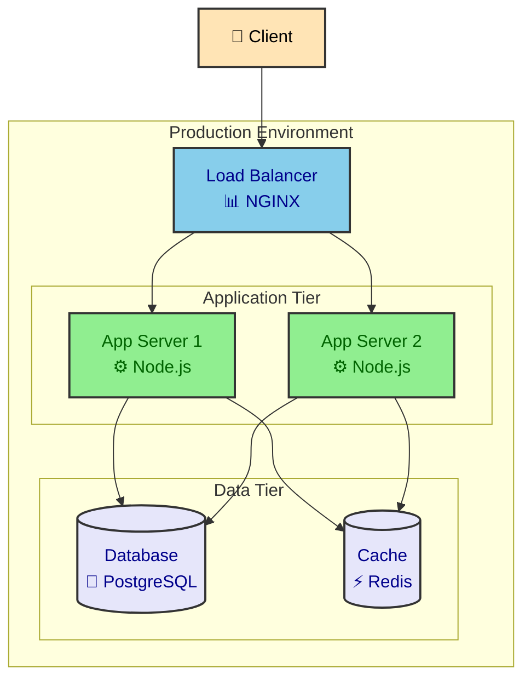

## Common Deployment Patterns

### Three-Tier Architecture

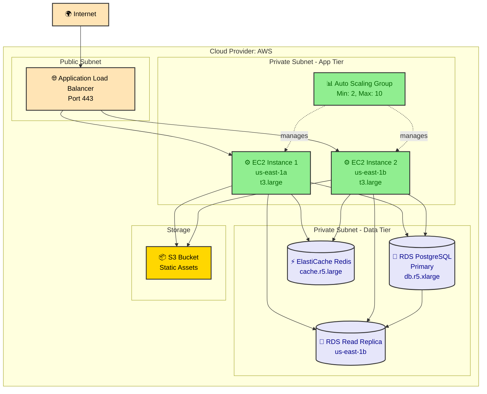

### Microservices Deployment (Kubernetes)

```mermaid
graph TB
    subgraph "Kubernetes Cluster"
        subgraph "Ingress"
            Ingress[🌐 NGINX Ingress<br/>ingress-nginx]
        end

        subgraph "Namespace: production"
            subgraph "Auth Service"
                AuthPod1[⚙️ auth-service-1]
                AuthPod2[⚙️ auth-service-2]
                AuthSvc[Service: auth-svc<br/>ClusterIP]
            end

            subgraph "API Service"
                APIPod1[⚙️ api-service-1]
                APIPod2[⚙️ api-service-2]
                APIPod3[⚙️ api-service-3]
                APISvc[Service: api-svc<br/>ClusterIP]
            end

            subgraph "Worker Service"
                WorkerPod1[⚙️ worker-1]
                WorkerPod2[⚙️ worker-2]
            end
        end

        subgraph "External Dependencies"
            RabbitMQ[🐰 RabbitMQ<br/>message-queue]
            PostgreSQL[(💾 PostgreSQL<br/>Cloud SQL)]
            Redis[(⚡ Redis<br/>Memorystore)]
        end
    end

    Client[👤 Client] --> Ingress
    Ingress --> AuthSvc
    Ingress --> APISvc
    AuthSvc --> AuthPod1
    AuthSvc --> AuthPod2
    APISvc --> APIPod1
    APISvc --> APIPod2
    APISvc --> APIPod3

    AuthPod1 --> PostgreSQL
    AuthPod2 --> PostgreSQL
    APIPod1 --> PostgreSQL
    APIPod2 --> PostgreSQL
    APIPod3 --> PostgreSQL

    APIPod1 --> Redis
    APIPod2 --> Redis
    APIPod3 --> Redis

    APIPod1 --> RabbitMQ
    APIPod2 --> RabbitMQ
    APIPod3 --> RabbitMQ

    RabbitMQ --> WorkerPod1
    RabbitMQ --> WorkerPod2
    WorkerPod1 --> PostgreSQL
    WorkerPod2 --> PostgreSQL

    classDef client fill:#FFE4B5,stroke:#333,stroke-width:2px,color:black
    classDef ingress fill:#87CEEB,stroke:#333,stroke-width:2px,color:darkblue
    classDef service fill:#90EE90,stroke:#333,stroke-width:2px,color:darkgreen
    classDef database fill:#E6E6FA,stroke:#333,stroke-width:2px,color:darkblue
    classDef queue fill:#FFD700,stroke:#333,stroke-width:2px,color:black

    class Client client
    class Ingress ingress
    class AuthPod1,AuthPod2,AuthSvc,APIPod1,APIPod2,APIPod3,APISvc,WorkerPod1,WorkerPod2 service
    class PostgreSQL,Redis database
    class RabbitMQ queue
```

### Serverless Architecture

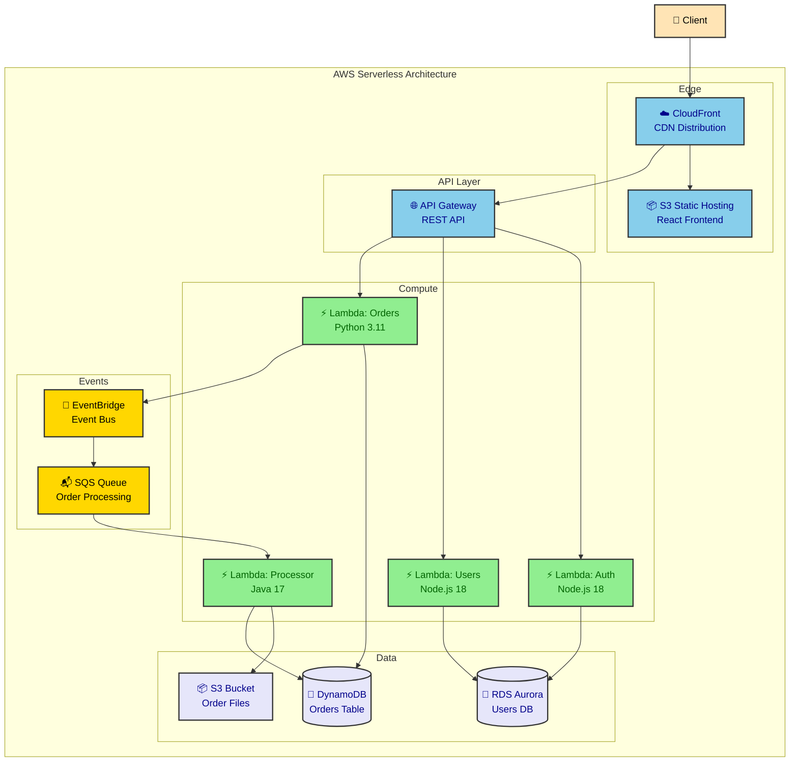

## Infrastructure as Code Mapping

### Pulumi/Terraform to Deployment Diagram

When you have IaC code, map resources to deployment diagrams:

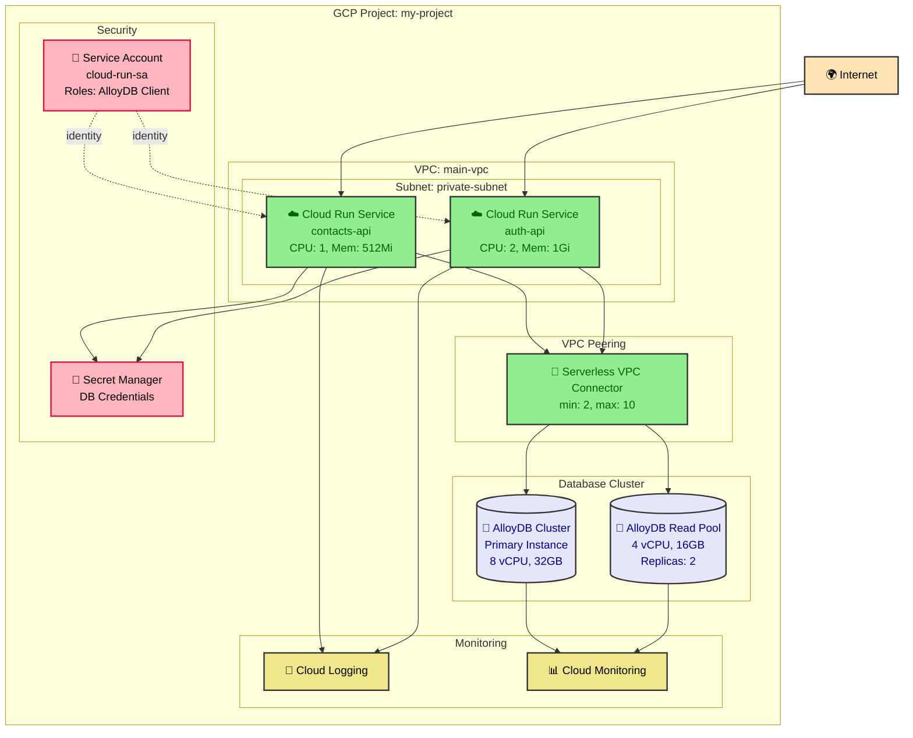

### Docker Compose to Deployment Diagram

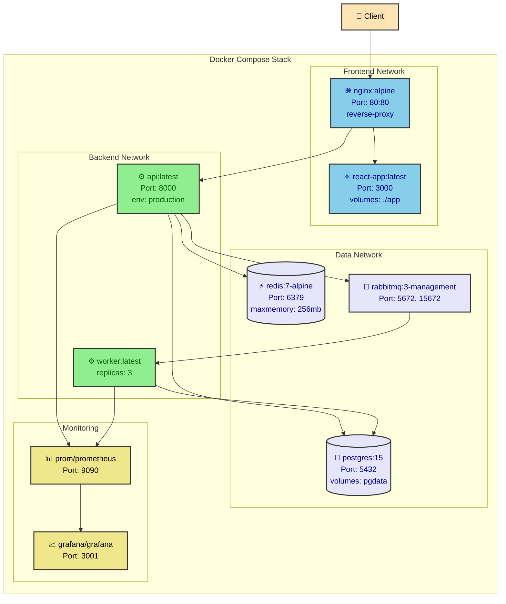

## Network Security Zones

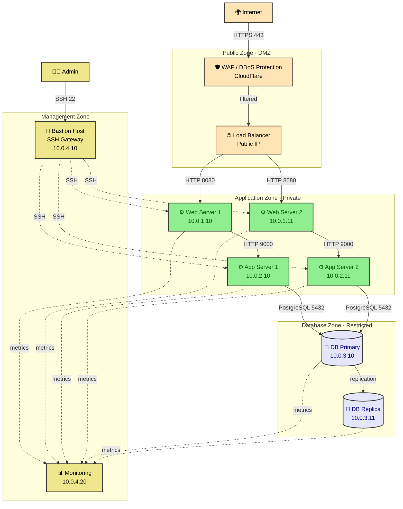

## Unicode Symbols for Infrastructure

| Symbol | Meaning | Use Case |
|--------|---------|----------|
| ☁️ | Cloud Service | Cloud resources, SaaS |
| 🌐 | Load Balancer | LB, API Gateway |
| ⚙️ | Application Server | Compute instances |
| 💾 | Database | Persistent storage |
| ⚡ | Cache | Redis, Memcached |
| 📦 | Object Storage | S3, GCS, Blob Storage |
| 🐰 | Message Queue | RabbitMQ, SQS |
| 🔌 | Network Connector | VPN, VPC peering |
| 🛡️ | Security | Firewall, WAF |
| 🔐 | IAM/Auth | Identity, secrets |
| 🔑 | Secrets | API keys, passwords |
| 📊 | Monitoring | Metrics, dashboards |
| 📝 | Logging | Log aggregation |
| 🔄 | Replication | DB replication, sync |
| 🌍 | Internet | Public access |
| 👤 | User/Client | End users |
| 🔧 | Management | Admin tools, bastion |
| ⚛️ | Frontend | React, Vue, Angular |
| 📨 | Event Bus | EventBridge, Pub/Sub |
| 📬 | Queue | Job queues |

## Best Practices

### 1. Show Resource Specifications

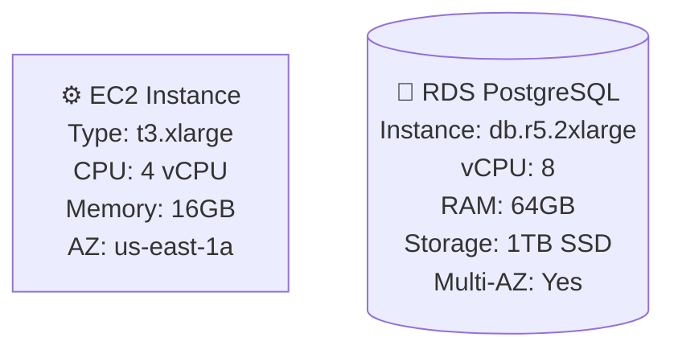

### 2. Indicate Network Boundaries

Use subgraphs for:
- VPCs / Virtual Networks
- Subnets (public/private)
- Security groups
- Availability zones
- Regions

### 3. Show Scaling Configuration

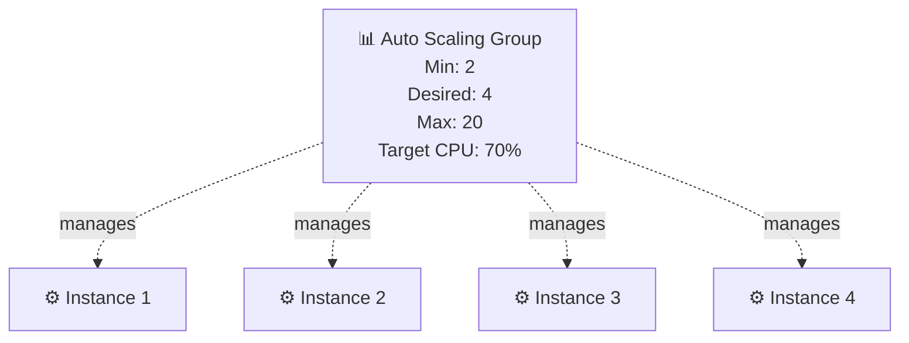

### 4. Document Ports and Protocols

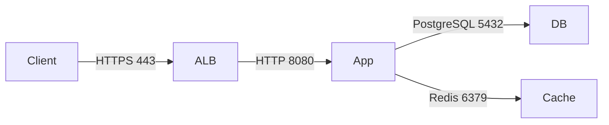

### 5. Indicate High Availability

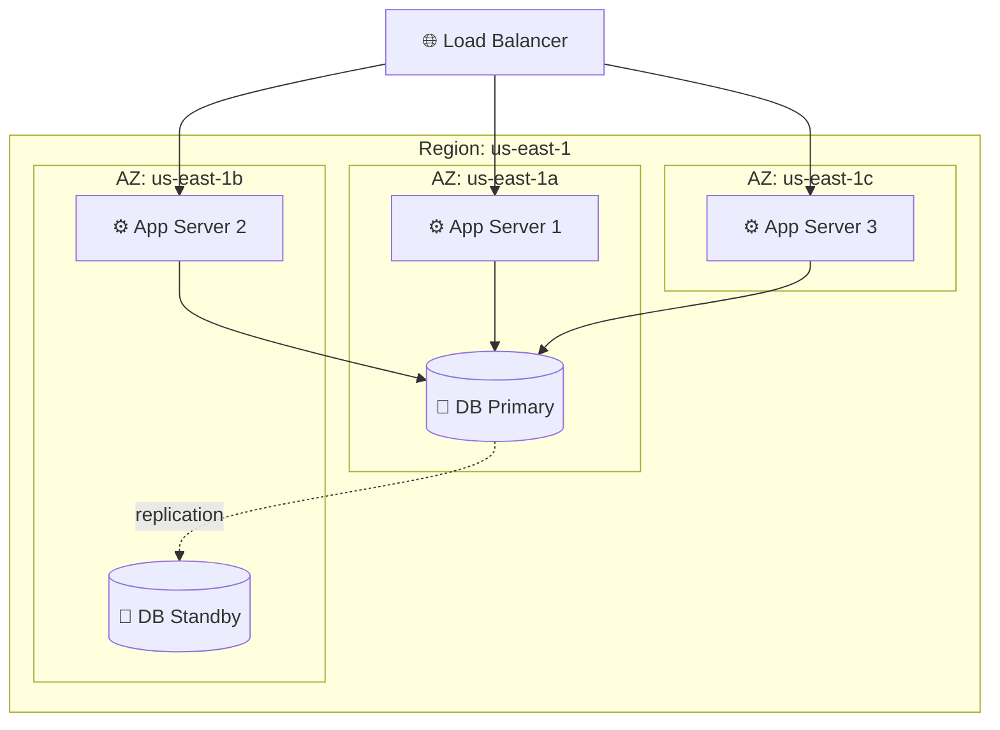

## Deployment Diagram Templates

### Template: Multi-Region Deployment

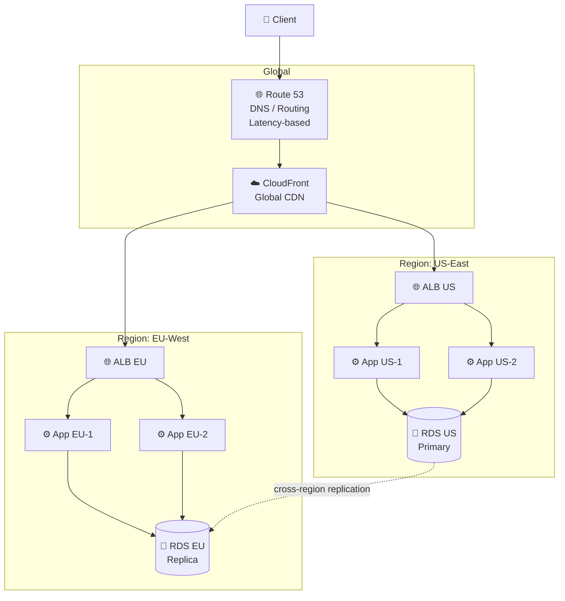

### Template: Hybrid Cloud

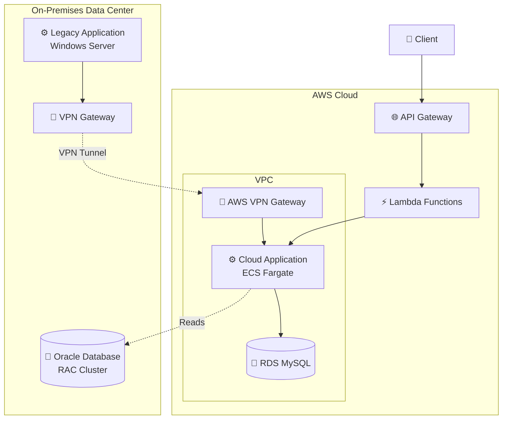

## Integration with Code

See language-specific examples for generating deployment diagrams from:

- **Pulumi**: Python, TypeScript, Go IaC code
- **Terraform**: HCL configuration files
- **Docker Compose**: YAML service definitions
- **Kubernetes**: YAML manifests and Helm charts
- **CDK**: CloudFormation templates

Examples: `examples/spring-boot/`, `examples/fastapi/`, etc.

---

**Next Steps:**
- See `activity-diagrams.md` for workflow visualization
- See `code-to-diagram/` for IaC-to-diagram examples
- See language-specific examples for framework-specific patterns
