# Sequence Diagrams Guide

**Version:** 1.0
**Last Updated:** 2025-01-13
**Purpose:** Document interactions between actors and system components over time

This guide shows how to create effective UML sequence diagrams using Mermaid syntax with Unicode semantic symbols and clear message flows.

---

## Table of Contents

1. [When to Use Sequence Diagrams](#when-to-use-sequence-diagrams)
2. [Basic Elements](#basic-elements)
3. [REST API Patterns](#rest-api-patterns)
4. [Authentication Flows](#authentication-flows)
5. [Microservices Communication](#microservices-communication)
6. [Async Messaging Patterns](#async-messaging-patterns)
7. [Error Handling](#error-handling)
8. [Advanced Patterns](#advanced-patterns)
9. [Best Practices](#best-practices)

---

## When to Use Sequence Diagrams

Use sequence diagrams to document:

- **API Request/Response Flows** - Show how clients interact with APIs
- **Authentication Sequences** - Visualize login, token refresh, logout flows
- **Service-to-Service Communication** - Document microservices interactions
- **Event Processing** - Show async message flows and event handling
- **Error Scenarios** - Illustrate failure paths and recovery mechanisms
- **Database Transaction Flows** - Document data access patterns
- **Complex Business Processes** - Break down multi-step workflows

**When NOT to use sequence diagrams:**
- System structure (use architecture diagrams)
- Workflow logic (use activity diagrams)
- Static relationships (use class/component diagrams)

---

## Basic Elements

### Participants

Participants appear as vertical lifelines in sequence diagrams:

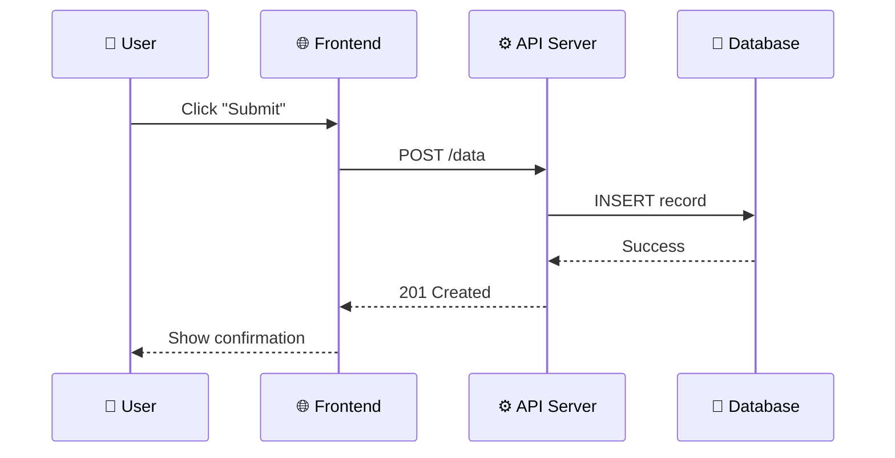
```mermaid
sequenceDiagram
    participant User as 👤 User
    participant Frontend as 🌐 Frontend
    participant API as ⚙️ API Server
    participant DB as 💾 Database

    User->>Frontend: Click "Submit"
    Frontend->>API: POST /data
    API->>DB: INSERT record
    DB-->>API: Success
    API-->>Frontend: 201 Created
    Frontend-->>User: Show confirmation
```

**Participant Types with Unicode:**

| Symbol | Type | Example |
|--------|------|---------|
| 👤 | Human User | Customer, Admin, Developer |
| 🌐 | Web/Frontend | React App, Browser, Mobile App |
| ⚙️ | Backend Service | API Server, Microservice |
| 💾 | Database | PostgreSQL, MongoDB, Redis |
| 📬 | Message Queue | RabbitMQ, Kafka, SQS |
| 🔐 | Auth Service | OAuth Provider, Auth0, Keycloak |
| 🚪 | Gateway | API Gateway, Load Balancer |
| 📧 | Email Service | SendGrid, Mailgun |
| 💳 | Payment Service | Stripe, PayPal |

### Message Types

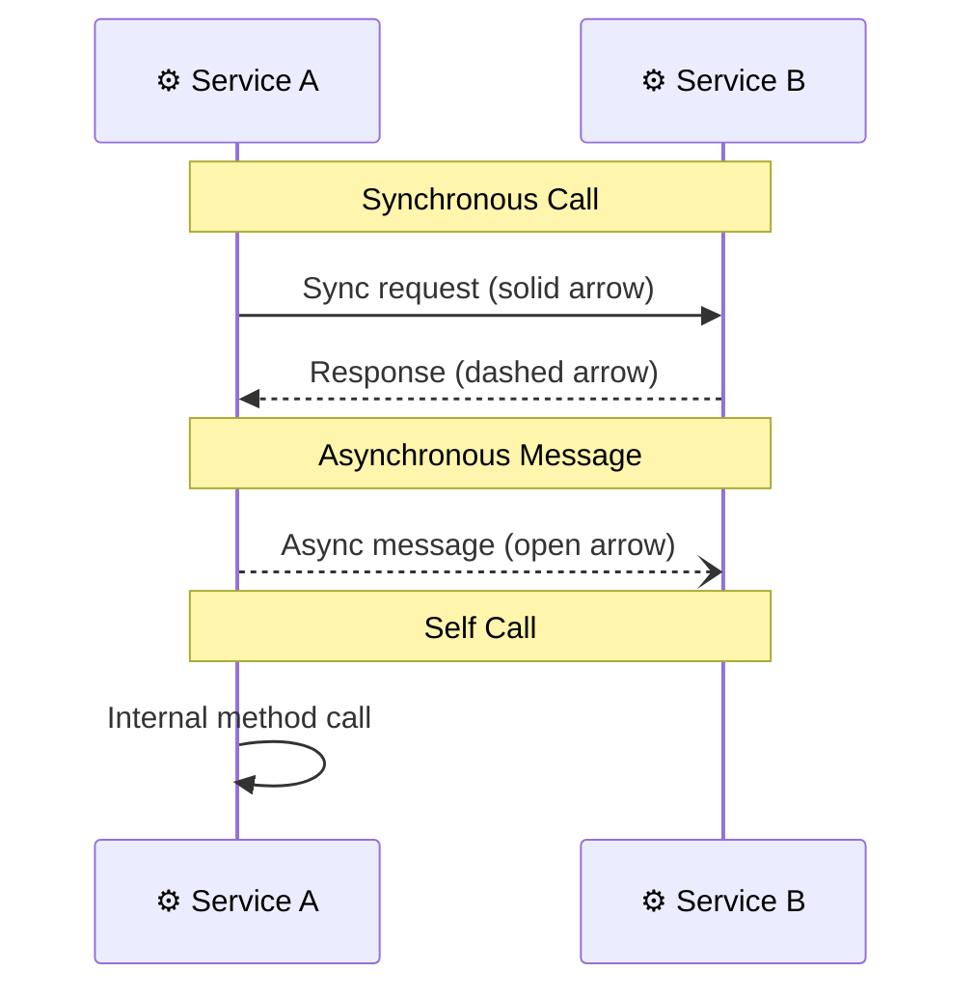
```mermaid
sequenceDiagram
    participant A as ⚙️ Service A
    participant B as ⚙️ Service B

    Note over A,B: Synchronous Call
    A->>B: Sync request (solid arrow)
    B-->>A: Response (dashed arrow)

    Note over A,B: Asynchronous Message
    A--)B: Async message (open arrow)

    Note over A,B: Self Call
    A->>A: Internal method call
```

### Activation Boxes

Show when a participant is actively processing:

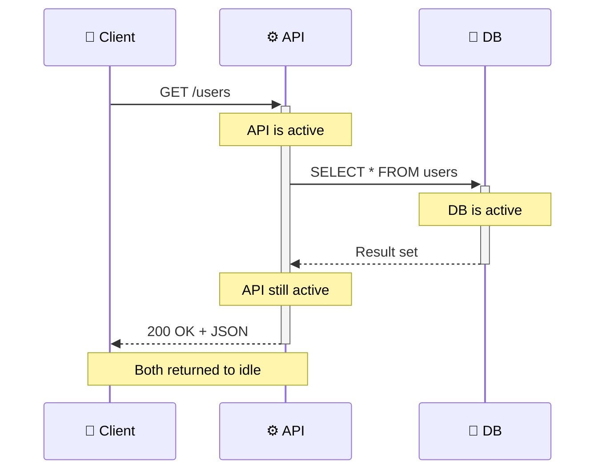
```mermaid
sequenceDiagram
    participant Client as 👤 Client
    participant API as ⚙️ API
    participant DB as 💾 DB

    Client->>+API: GET /users
    Note over API: API is active
    API->>+DB: SELECT * FROM users
    Note over DB: DB is active
    DB-->>-API: Result set
    Note over API: API still active
    API-->>-Client: 200 OK + JSON
    Note over Client,API: Both returned to idle
```

---

## REST API Patterns

### Pattern - Simple CRUD Operation

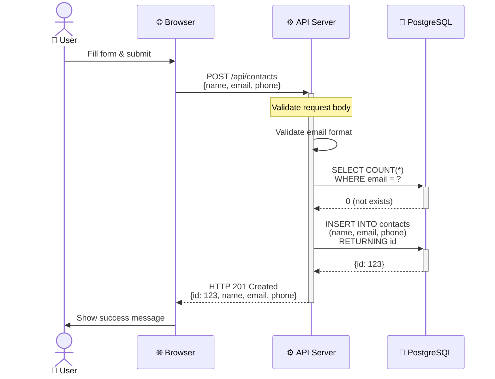
```mermaid
sequenceDiagram
    actor User as 👤 User
    participant Browser as 🌐 Browser
    participant API as ⚙️ API Server
    participant DB as 💾 PostgreSQL

    User->>Browser: Fill form & submit
    Browser->>+API: POST /api/contacts<br/>{name, email, phone}
    Note over API: Validate request body

    API->>API: Validate email format
    API->>+DB: SELECT COUNT(*)<br/>WHERE email = ?
    DB-->>-API: 0 (not exists)

    API->>+DB: INSERT INTO contacts<br/>(name, email, phone)<br/>RETURNING id
    DB-->>-API: {id: 123}

    API-->>-Browser: HTTP 201 Created<br/>{id: 123, name, email, phone}
    Browser->>User: Show success message
```

### Pattern - List with Pagination

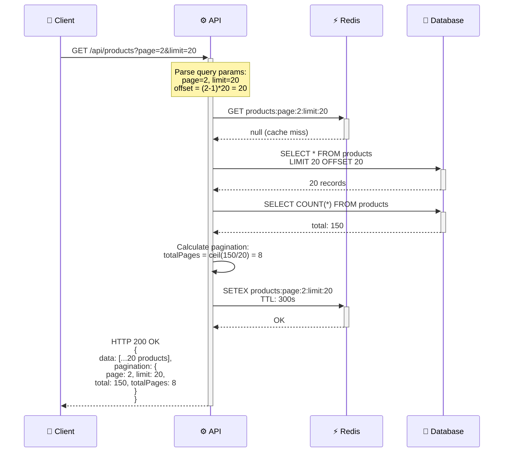
```mermaid
sequenceDiagram
    participant Client as 👤 Client
    participant API as ⚙️ API
    participant Cache as ⚡ Redis
    participant DB as 💾 Database

    Client->>+API: GET /api/products?page=2&limit=20
    Note over API: Parse query params:<br/>page=2, limit=20<br/>offset = (2-1)*20 = 20

    API->>+Cache: GET products:page:2:limit:20
    Cache-->>-API: null (cache miss)

    API->>+DB: SELECT * FROM products<br/>LIMIT 20 OFFSET 20
    DB-->>-API: 20 records

    API->>+DB: SELECT COUNT(*) FROM products
    DB-->>-API: total: 150

    API->>API: Calculate pagination:<br/>totalPages = ceil(150/20) = 8

    API->>+Cache: SETEX products:page:2:limit:20<br/>TTL: 300s
    Cache-->>-API: OK

    API-->>-Client: HTTP 200 OK<br/>{<br/>  data: [...20 products],<br/>  pagination: {<br/>    page: 2, limit: 20,<br/>    total: 150, totalPages: 8<br/>  }<br/>}
```

### Pattern - Update with Optimistic Locking

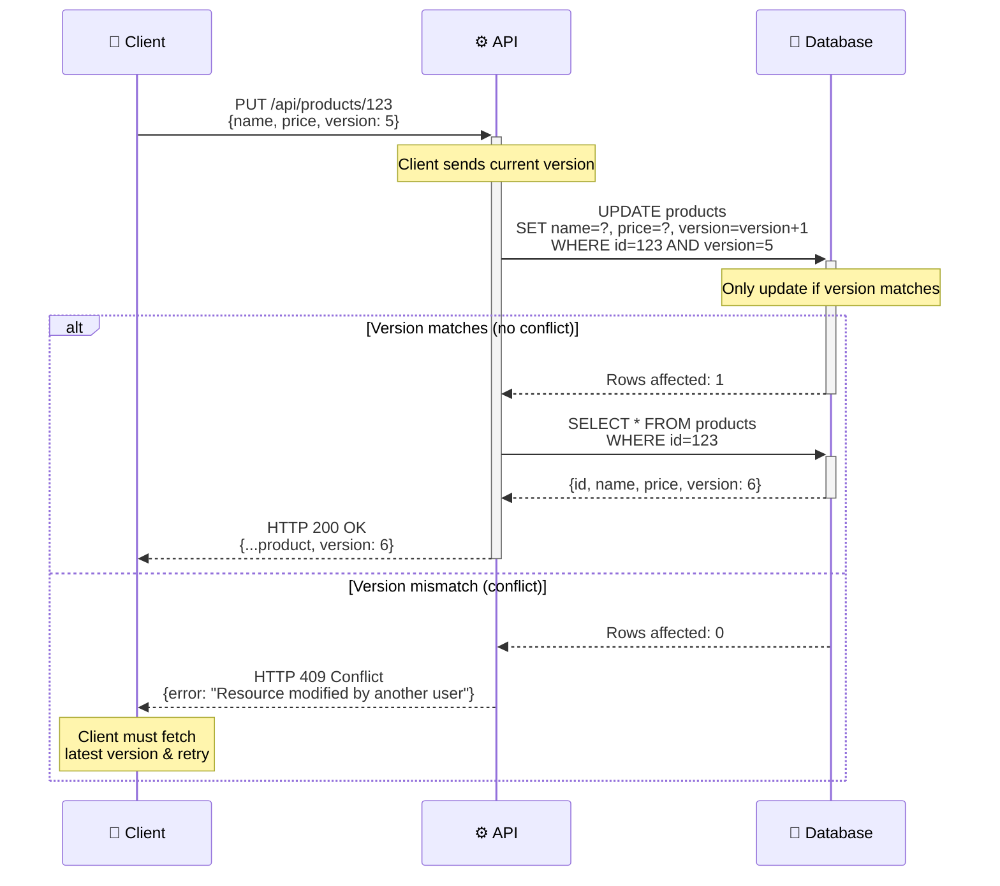
```mermaid
sequenceDiagram
    participant Client as 👤 Client
    participant API as ⚙️ API
    participant DB as 💾 Database

    Client->>+API: PUT /api/products/123<br/>{name, price, version: 5}
    Note over API: Client sends current version

    API->>+DB: UPDATE products<br/>SET name=?, price=?, version=version+1<br/>WHERE id=123 AND version=5
    Note over DB: Only update if version matches

    alt Version matches (no conflict)
        DB-->>-API: Rows affected: 1
        API->>+DB: SELECT * FROM products<br/>WHERE id=123
        DB-->>-API: {id, name, price, version: 6}
        API-->>-Client: HTTP 200 OK<br/>{...product, version: 6}

    else Version mismatch (conflict)
        DB-->>API: Rows affected: 0
        API-->>Client: HTTP 409 Conflict<br/>{error: "Resource modified by another user"}
        Note over Client: Client must fetch<br/>latest version & retry
    end
```

---

## Authentication Flows

### Pattern - OAuth 2.0 Authorization Code Flow

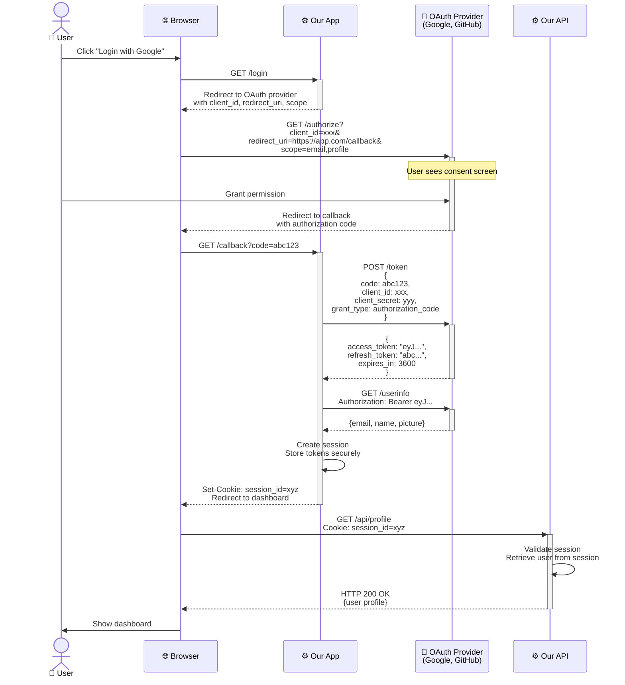
```mermaid
sequenceDiagram
    actor User as 👤 User
    participant Browser as 🌐 Browser
    participant App as ⚙️ Our App
    participant AuthProvider as 🔐 OAuth Provider<br/>(Google, GitHub)
    participant API as ⚙️ Our API

    User->>Browser: Click "Login with Google"
    Browser->>+App: GET /login
    App-->>-Browser: Redirect to OAuth provider<br/>with client_id, redirect_uri, scope

    Browser->>+AuthProvider: GET /authorize?<br/>client_id=xxx&<br/>redirect_uri=https://app.com/callback&<br/>scope=email,profile
    Note over AuthProvider: User sees consent screen

    User->>AuthProvider: Grant permission
    AuthProvider-->>-Browser: Redirect to callback<br/>with authorization code

    Browser->>+App: GET /callback?code=abc123
    App->>+AuthProvider: POST /token<br/>{<br/>  code: abc123,<br/>  client_id: xxx,<br/>  client_secret: yyy,<br/>  grant_type: authorization_code<br/>}
    AuthProvider-->>-App: {<br/>  access_token: "eyJ...",<br/>  refresh_token: "abc...",<br/>  expires_in: 3600<br/>}

    App->>+AuthProvider: GET /userinfo<br/>Authorization: Bearer eyJ...
    AuthProvider-->>-App: {email, name, picture}

    App->>App: Create session<br/>Store tokens securely
    App-->>-Browser: Set-Cookie: session_id=xyz<br/>Redirect to dashboard

    Browser->>+API: GET /api/profile<br/>Cookie: session_id=xyz
    API->>API: Validate session<br/>Retrieve user from session
    API-->>-Browser: HTTP 200 OK<br/>{user profile}

    Browser->>User: Show dashboard
```

### Pattern - JWT Authentication with Refresh Token

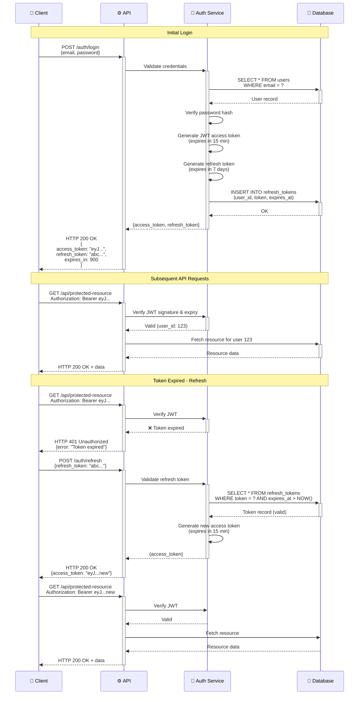
```mermaid
sequenceDiagram
    participant Client as 👤 Client
    participant API as ⚙️ API
    participant AuthService as 🔐 Auth Service
    participant DB as 💾 Database

    Note over Client,DB: Initial Login

    Client->>+API: POST /auth/login<br/>{email, password}
    API->>+AuthService: Validate credentials
    AuthService->>+DB: SELECT * FROM users<br/>WHERE email = ?
    DB-->>-AuthService: User record
    AuthService->>AuthService: Verify password hash
    AuthService->>AuthService: Generate JWT access token<br/>(expires in 15 min)
    AuthService->>AuthService: Generate refresh token<br/>(expires in 7 days)
    AuthService->>+DB: INSERT INTO refresh_tokens<br/>(user_id, token, expires_at)
    DB-->>-AuthService: OK
    AuthService-->>-API: {access_token, refresh_token}
    API-->>-Client: HTTP 200 OK<br/>{<br/>  access_token: "eyJ...",<br/>  refresh_token: "abc...",<br/>  expires_in: 900<br/>}

    Note over Client,DB: Subsequent API Requests

    Client->>+API: GET /api/protected-resource<br/>Authorization: Bearer eyJ...
    API->>+AuthService: Verify JWT signature & expiry
    AuthService-->>-API: Valid (user_id: 123)
    API->>+DB: Fetch resource for user 123
    DB-->>-API: Resource data
    API-->>-Client: HTTP 200 OK + data

    Note over Client,DB: Token Expired - Refresh

    Client->>+API: GET /api/protected-resource<br/>Authorization: Bearer eyJ...
    API->>+AuthService: Verify JWT
    AuthService-->>-API: ❌ Token expired
    API-->>-Client: HTTP 401 Unauthorized<br/>{error: "Token expired"}

    Client->>+API: POST /auth/refresh<br/>{refresh_token: "abc..."}
    API->>+AuthService: Validate refresh token
    AuthService->>+DB: SELECT * FROM refresh_tokens<br/>WHERE token = ? AND expires_at > NOW()
    DB-->>-AuthService: Token record (valid)
    AuthService->>AuthService: Generate new access token<br/>(expires in 15 min)
    AuthService-->>-API: {access_token}
    API-->>-Client: HTTP 200 OK<br/>{access_token: "eyJ...new"}

    Client->>+API: GET /api/protected-resource<br/>Authorization: Bearer eyJ...new
    API->>AuthService: Verify JWT
    AuthService-->>API: Valid
    API->>DB: Fetch resource
    DB-->>API: Resource data
    API-->>-Client: HTTP 200 OK + data
```

---

## Microservices Communication

### Pattern - Synchronous Service-to-Service Call

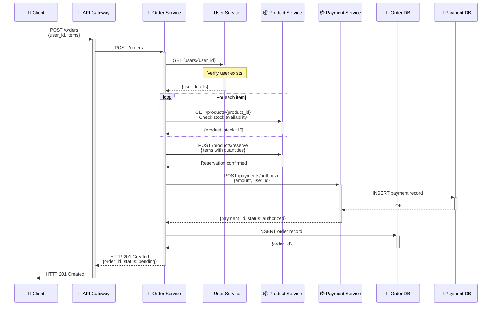
```mermaid
sequenceDiagram
    participant Client as 👤 Client
    participant Gateway as 🚪 API Gateway
    participant OrderSvc as 🛒 Order Service
    participant UserSvc as 👤 User Service
    participant ProductSvc as 📦 Product Service
    participant PaymentSvc as 💳 Payment Service
    participant OrderDB as 💾 Order DB
    participant PaymentDB as 💾 Payment DB

    Client->>+Gateway: POST /orders<br/>{user_id, items}
    Gateway->>+OrderSvc: POST /orders

    OrderSvc->>+UserSvc: GET /users/{user_id}
    Note over UserSvc: Verify user exists
    UserSvc-->>-OrderSvc: {user details}

    loop For each item
        OrderSvc->>+ProductSvc: GET /products/{product_id}<br/>Check stock availability
        ProductSvc-->>-OrderSvc: {product, stock: 10}
    end

    OrderSvc->>+ProductSvc: POST /products/reserve<br/>{items with quantities}
    ProductSvc-->>-OrderSvc: Reservation confirmed

    OrderSvc->>+PaymentSvc: POST /payments/authorize<br/>{amount, user_id}
    PaymentSvc->>+PaymentDB: INSERT payment record
    PaymentDB-->>-PaymentSvc: OK
    PaymentSvc-->>-OrderSvc: {payment_id, status: authorized}

    OrderSvc->>+OrderDB: INSERT order record
    OrderDB-->>-OrderSvc: {order_id}

    OrderSvc-->>-Gateway: HTTP 201 Created<br/>{order_id, status: pending}
    Gateway-->>-Client: HTTP 201 Created
```

### Pattern - Circuit Breaker

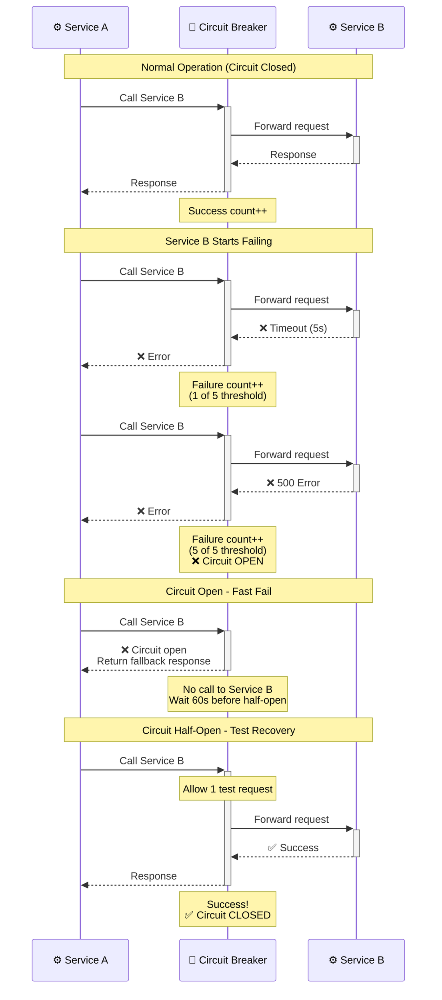
```mermaid
sequenceDiagram
    participant ServiceA as ⚙️ Service A
    participant CircuitBreaker as 🔧 Circuit Breaker
    participant ServiceB as ⚙️ Service B

    Note over ServiceA,ServiceB: Normal Operation (Circuit Closed)

    ServiceA->>+CircuitBreaker: Call Service B
    CircuitBreaker->>+ServiceB: Forward request
    ServiceB-->>-CircuitBreaker: Response
    CircuitBreaker-->>-ServiceA: Response
    Note over CircuitBreaker: Success count++

    Note over ServiceA,ServiceB: Service B Starts Failing

    ServiceA->>+CircuitBreaker: Call Service B
    CircuitBreaker->>+ServiceB: Forward request
    ServiceB-->>-CircuitBreaker: ❌ Timeout (5s)
    CircuitBreaker-->>-ServiceA: ❌ Error
    Note over CircuitBreaker: Failure count++<br/>(1 of 5 threshold)

    ServiceA->>+CircuitBreaker: Call Service B
    CircuitBreaker->>+ServiceB: Forward request
    ServiceB-->>-CircuitBreaker: ❌ 500 Error
    CircuitBreaker-->>-ServiceA: ❌ Error
    Note over CircuitBreaker: Failure count++<br/>(5 of 5 threshold)<br/>❌ Circuit OPEN

    Note over ServiceA,ServiceB: Circuit Open - Fast Fail

    ServiceA->>+CircuitBreaker: Call Service B
    CircuitBreaker-->>-ServiceA: ❌ Circuit open<br/>Return fallback response
    Note over CircuitBreaker: No call to Service B<br/>Wait 60s before half-open

    Note over ServiceA,ServiceB: Circuit Half-Open - Test Recovery

    ServiceA->>+CircuitBreaker: Call Service B
    Note over CircuitBreaker: Allow 1 test request
    CircuitBreaker->>+ServiceB: Forward request
    ServiceB-->>-CircuitBreaker: ✅ Success
    CircuitBreaker-->>-ServiceA: Response
    Note over CircuitBreaker: Success!<br/>✅ Circuit CLOSED
```

---

## Async Messaging Patterns

### Pattern - Event-Driven with Message Queue

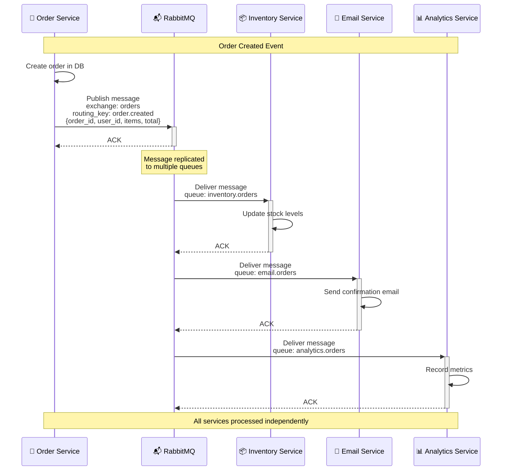
```mermaid
sequenceDiagram
    participant OrderSvc as 🛒 Order Service
    participant Queue as 📬 RabbitMQ
    participant InventorySvc as 📦 Inventory Service
    participant EmailSvc as 📧 Email Service
    participant AnalyticsSvc as 📊 Analytics Service

    Note over OrderSvc,AnalyticsSvc: Order Created Event

    OrderSvc->>OrderSvc: Create order in DB
    OrderSvc->>+Queue: Publish message<br/>exchange: orders<br/>routing_key: order.created<br/>{order_id, user_id, items, total}
    Queue-->>-OrderSvc: ACK

    Note over Queue: Message replicated<br/>to multiple queues

    Queue->>+InventorySvc: Deliver message<br/>queue: inventory.orders
    InventorySvc->>InventorySvc: Update stock levels
    InventorySvc-->>-Queue: ACK

    Queue->>+EmailSvc: Deliver message<br/>queue: email.orders
    EmailSvc->>EmailSvc: Send confirmation email
    EmailSvc-->>-Queue: ACK

    Queue->>+AnalyticsSvc: Deliver message<br/>queue: analytics.orders
    AnalyticsSvc->>AnalyticsSvc: Record metrics
    AnalyticsSvc-->>-Queue: ACK

    Note over OrderSvc,AnalyticsSvc: All services processed independently
```

### Pattern - Saga with Compensating Transactions

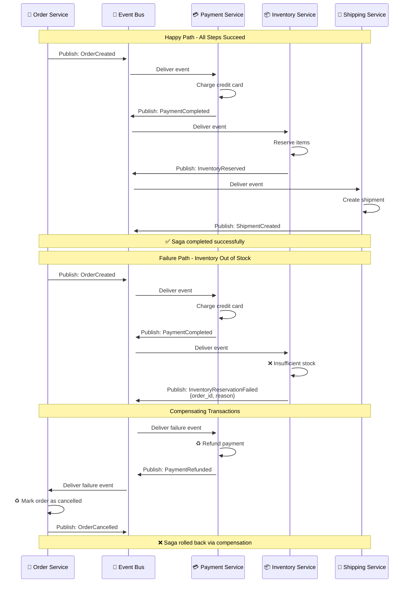
```mermaid
sequenceDiagram
    participant OrderSvc as 🛒 Order Service
    participant EventBus as 📡 Event Bus
    participant PaymentSvc as 💳 Payment Service
    participant InventorySvc as 📦 Inventory Service
    participant ShippingSvc as 🚚 Shipping Service

    Note over OrderSvc,ShippingSvc: Happy Path - All Steps Succeed

    OrderSvc->>+EventBus: Publish: OrderCreated
    EventBus->>+PaymentSvc: Deliver event
    PaymentSvc->>PaymentSvc: Charge credit card
    PaymentSvc->>+EventBus: Publish: PaymentCompleted
    EventBus->>+InventorySvc: Deliver event
    InventorySvc->>InventorySvc: Reserve items
    InventorySvc->>+EventBus: Publish: InventoryReserved
    EventBus->>+ShippingSvc: Deliver event
    ShippingSvc->>ShippingSvc: Create shipment
    ShippingSvc->>+EventBus: Publish: ShipmentCreated
    Note over OrderSvc,ShippingSvc: ✅ Saga completed successfully

    Note over OrderSvc,ShippingSvc: Failure Path - Inventory Out of Stock

    OrderSvc->>EventBus: Publish: OrderCreated
    EventBus->>PaymentSvc: Deliver event
    PaymentSvc->>PaymentSvc: Charge credit card
    PaymentSvc->>EventBus: Publish: PaymentCompleted

    EventBus->>InventorySvc: Deliver event
    InventorySvc->>InventorySvc: ❌ Insufficient stock
    InventorySvc->>+EventBus: Publish: InventoryReservationFailed<br/>{order_id, reason}

    Note over OrderSvc,ShippingSvc: Compensating Transactions

    EventBus->>PaymentSvc: Deliver failure event
    PaymentSvc->>PaymentSvc: ♻️ Refund payment
    PaymentSvc->>EventBus: Publish: PaymentRefunded

    EventBus->>OrderSvc: Deliver failure event
    OrderSvc->>OrderSvc: ♻️ Mark order as cancelled
    OrderSvc->>EventBus: Publish: OrderCancelled

    Note over OrderSvc,ShippingSvc: ❌ Saga rolled back via compensation
```

### Pattern - Dead Letter Queue Handling

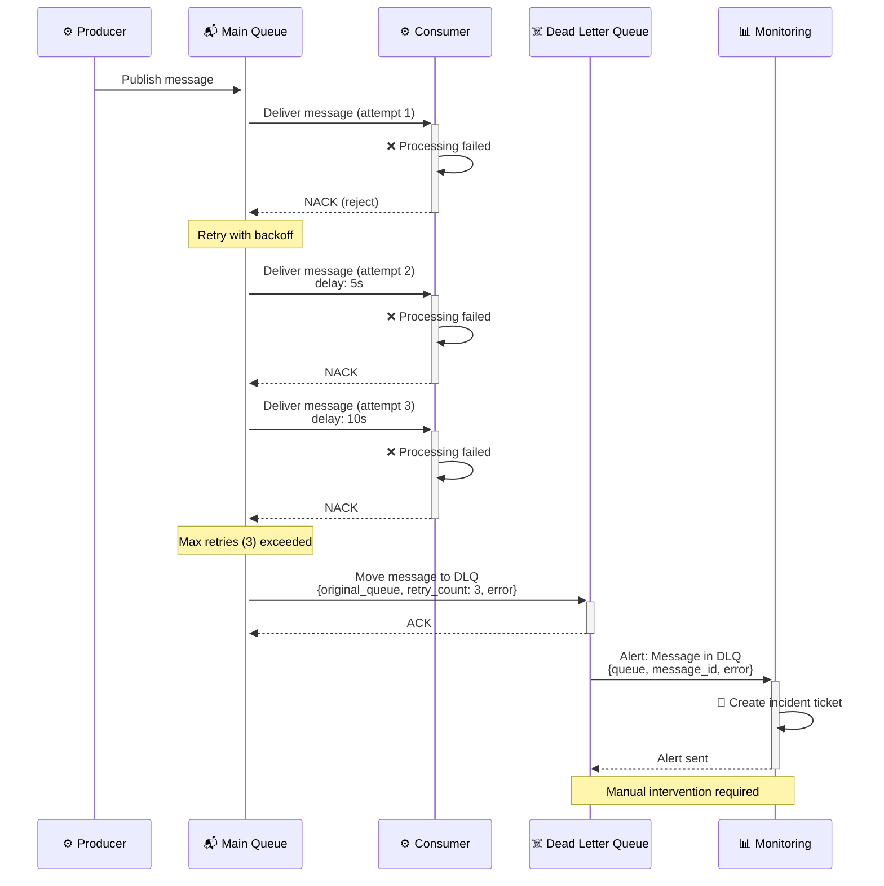
```mermaid
sequenceDiagram
    participant Producer as ⚙️ Producer
    participant Queue as 📬 Main Queue
    participant Consumer as ⚙️ Consumer
    participant DLQ as ☠️ Dead Letter Queue
    participant Monitor as 📊 Monitoring

    Producer->>+Queue: Publish message
    Queue->>+Consumer: Deliver message (attempt 1)
    Consumer->>Consumer: ❌ Processing failed
    Consumer-->>-Queue: NACK (reject)

    Note over Queue: Retry with backoff

    Queue->>+Consumer: Deliver message (attempt 2)<br/>delay: 5s
    Consumer->>Consumer: ❌ Processing failed
    Consumer-->>-Queue: NACK

    Queue->>+Consumer: Deliver message (attempt 3)<br/>delay: 10s
    Consumer->>Consumer: ❌ Processing failed
    Consumer-->>-Queue: NACK

    Note over Queue: Max retries (3) exceeded

    Queue->>+DLQ: Move message to DLQ<br/>{original_queue, retry_count: 3, error}
    DLQ-->>-Queue: ACK

    DLQ->>+Monitor: Alert: Message in DLQ<br/>{queue, message_id, error}
    Monitor->>Monitor: 🚨 Create incident ticket
    Monitor-->>-DLQ: Alert sent

    Note over DLQ,Monitor: Manual intervention required
```

---

## Error Handling

### Pattern - Graceful Error Responses

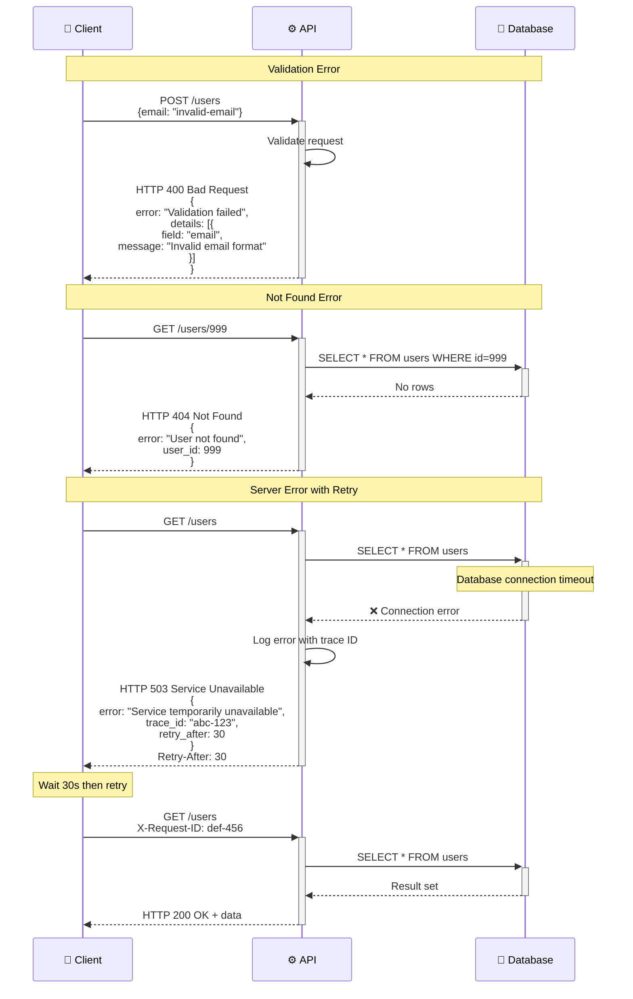
```mermaid
sequenceDiagram
    participant Client as 👤 Client
    participant API as ⚙️ API
    participant DB as 💾 Database

    Note over Client,DB: Validation Error

    Client->>+API: POST /users<br/>{email: "invalid-email"}
    API->>API: Validate request
    API-->>-Client: HTTP 400 Bad Request<br/>{<br/>  error: "Validation failed",<br/>  details: [{<br/>    field: "email",<br/>    message: "Invalid email format"<br/>  }]<br/>}

    Note over Client,DB: Not Found Error

    Client->>+API: GET /users/999
    API->>+DB: SELECT * FROM users WHERE id=999
    DB-->>-API: No rows
    API-->>-Client: HTTP 404 Not Found<br/>{<br/>  error: "User not found",<br/>  user_id: 999<br/>}

    Note over Client,DB: Server Error with Retry

    Client->>+API: GET /users
    API->>+DB: SELECT * FROM users
    Note over DB: Database connection timeout
    DB-->>-API: ❌ Connection error
    API->>API: Log error with trace ID
    API-->>-Client: HTTP 503 Service Unavailable<br/>{<br/>  error: "Service temporarily unavailable",<br/>  trace_id: "abc-123",<br/>  retry_after: 30<br/>}<br/>Retry-After: 30

    Note over Client: Wait 30s then retry

    Client->>+API: GET /users<br/>X-Request-ID: def-456
    API->>+DB: SELECT * FROM users
    DB-->>-API: Result set
    API-->>-Client: HTTP 200 OK + data
```

### Pattern - Timeout Handling

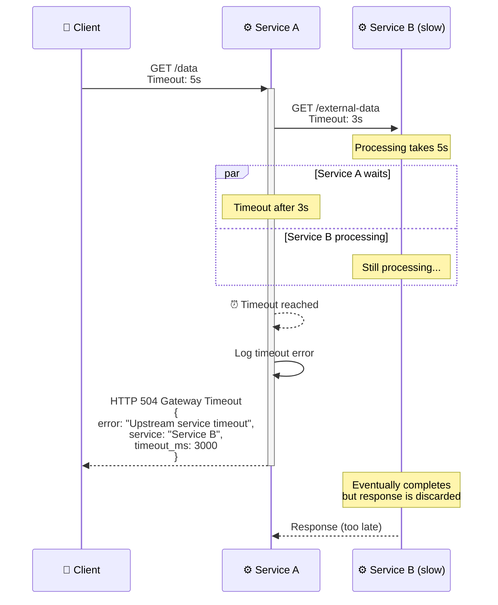
```mermaid
sequenceDiagram
    participant Client as 👤 Client
    participant ServiceA as ⚙️ Service A
    participant ServiceB as ⚙️ Service B (slow)

    Client->>+ServiceA: GET /data<br/>Timeout: 5s

    ServiceA->>+ServiceB: GET /external-data<br/>Timeout: 3s
    Note over ServiceB: Processing takes 5s

    par Service A waits
        Note over ServiceA: Timeout after 3s
    and Service B processing
        Note over ServiceB: Still processing...
    end

    ServiceA-->>ServiceA: ⏰ Timeout reached
    ServiceA->>ServiceA: Log timeout error
    ServiceA-->>-Client: HTTP 504 Gateway Timeout<br/>{<br/>  error: "Upstream service timeout",<br/>  service: "Service B",<br/>  timeout_ms: 3000<br/>}

    Note over ServiceB: Eventually completes<br/>but response is discarded
    ServiceB-->>ServiceA: Response (too late)
```

---

## Advanced Patterns

### Pattern - Parallel Requests

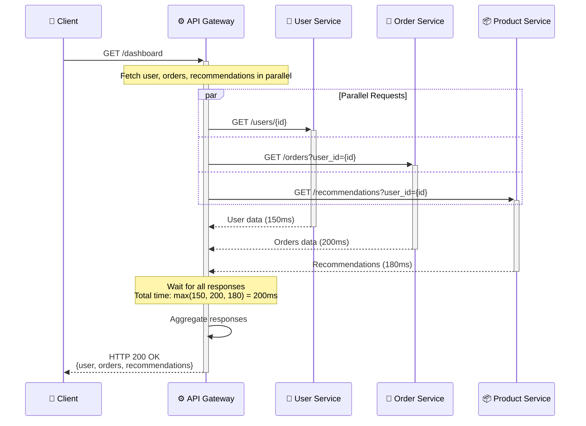
```mermaid
sequenceDiagram
    participant Client as 👤 Client
    participant API as ⚙️ API Gateway
    participant UserSvc as 👤 User Service
    participant OrderSvc as 🛒 Order Service
    participant ProductSvc as 📦 Product Service

    Client->>+API: GET /dashboard
    Note over API: Fetch user, orders, recommendations in parallel

    par Parallel Requests
        API->>+UserSvc: GET /users/{id}
    and
        API->>+OrderSvc: GET /orders?user_id={id}
    and
        API->>+ProductSvc: GET /recommendations?user_id={id}
    end

    UserSvc-->>-API: User data (150ms)
    OrderSvc-->>-API: Orders data (200ms)
    ProductSvc-->>-API: Recommendations (180ms)

    Note over API: Wait for all responses<br/>Total time: max(150, 200, 180) = 200ms

    API->>API: Aggregate responses
    API-->>-Client: HTTP 200 OK<br/>{user, orders, recommendations}
```

### Pattern - Request Batching

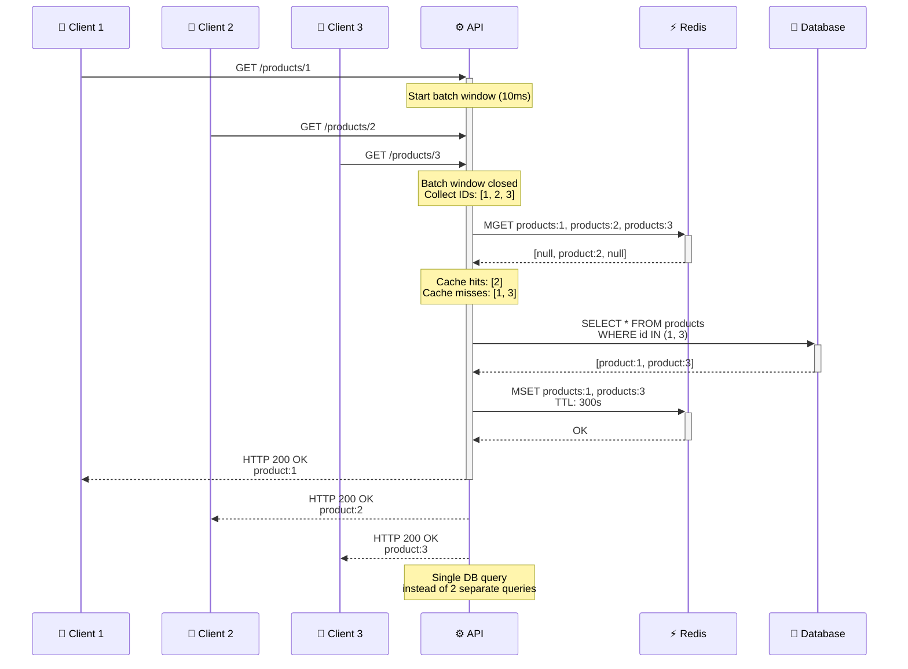
```mermaid
sequenceDiagram
    participant Client1 as 👤 Client 1
    participant Client2 as 👤 Client 2
    participant Client3 as 👤 Client 3
    participant API as ⚙️ API
    participant Cache as ⚡ Redis
    participant DB as 💾 Database

    Client1->>+API: GET /products/1
    Note over API: Start batch window (10ms)
    Client2->>API: GET /products/2
    Client3->>API: GET /products/3

    Note over API: Batch window closed<br/>Collect IDs: [1, 2, 3]

    API->>+Cache: MGET products:1, products:2, products:3
    Cache-->>-API: [null, product:2, null]
    Note over API: Cache hits: [2]<br/>Cache misses: [1, 3]

    API->>+DB: SELECT * FROM products<br/>WHERE id IN (1, 3)
    DB-->>-API: [product:1, product:3]

    API->>+Cache: MSET products:1, products:3<br/>TTL: 300s
    Cache-->>-API: OK

    API-->>-Client1: HTTP 200 OK<br/>product:1
    API-->>Client2: HTTP 200 OK<br/>product:2
    API-->>Client3: HTTP 200 OK<br/>product:3

    Note over API: Single DB query<br/>instead of 2 separate queries
```

### Pattern - Webhook Callback

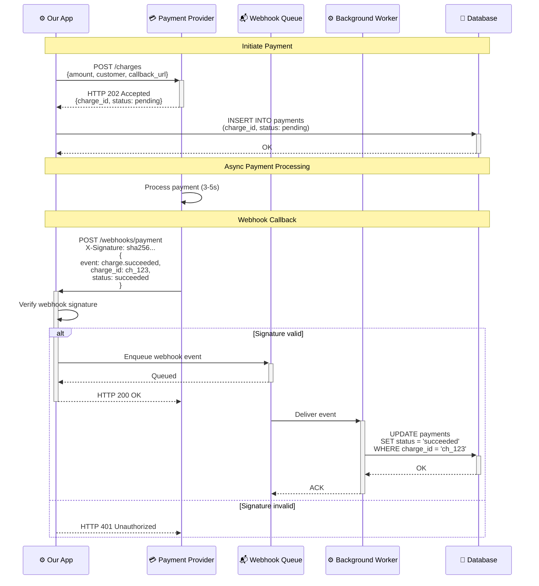
```mermaid
sequenceDiagram
    participant App as ⚙️ Our App
    participant PaymentProvider as 💳 Payment Provider
    participant WebhookQueue as 📬 Webhook Queue
    participant Worker as ⚙️ Background Worker
    participant DB as 💾 Database

    Note over App,DB: Initiate Payment

    App->>+PaymentProvider: POST /charges<br/>{amount, customer, callback_url}
    PaymentProvider-->>-App: HTTP 202 Accepted<br/>{charge_id, status: pending}
    App->>+DB: INSERT INTO payments<br/>(charge_id, status: pending)
    DB-->>-App: OK

    Note over App,DB: Async Payment Processing

    PaymentProvider->>PaymentProvider: Process payment (3-5s)

    Note over App,DB: Webhook Callback

    PaymentProvider->>+App: POST /webhooks/payment<br/>X-Signature: sha256...<br/>{<br/>  event: charge.succeeded,<br/>  charge_id: ch_123,<br/>  status: succeeded<br/>}

    App->>App: Verify webhook signature

    alt Signature valid
        App->>+WebhookQueue: Enqueue webhook event
        WebhookQueue-->>-App: Queued
        App-->>-PaymentProvider: HTTP 200 OK

        WebhookQueue->>+Worker: Deliver event
        Worker->>+DB: UPDATE payments<br/>SET status = 'succeeded'<br/>WHERE charge_id = 'ch_123'
        DB-->>-Worker: OK
        Worker-->>-WebhookQueue: ACK

    else Signature invalid
        App-->>PaymentProvider: HTTP 401 Unauthorized
    end
```

---

## Best Practices

### 1. **One Scenario Per Diagram**

❌ **Bad:** Mixing success and failure flows in one diagram

✅ **Good:** Separate diagrams for happy path and error scenarios

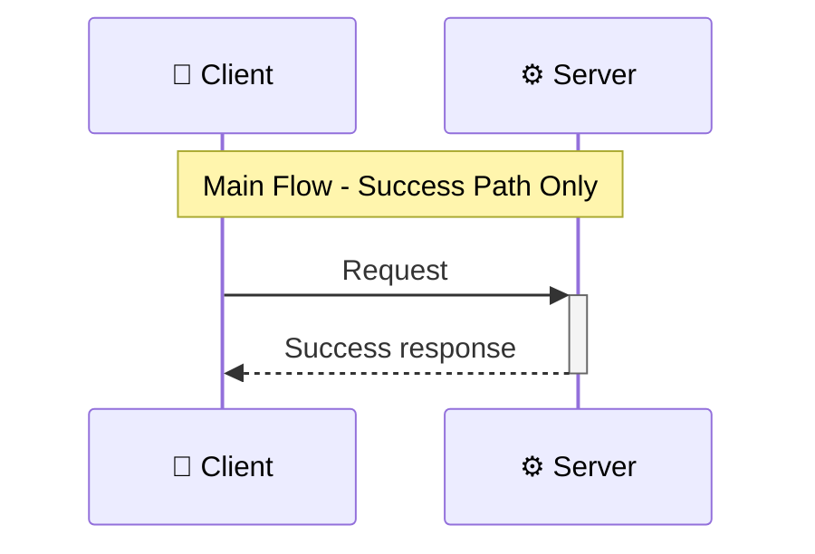
```mermaid
sequenceDiagram
    Note over Client,Server: Main Flow - Success Path Only
    participant Client as 👤 Client
    participant Server as ⚙️ Server

    Client->>+Server: Request
    Server-->>-Client: Success response
```

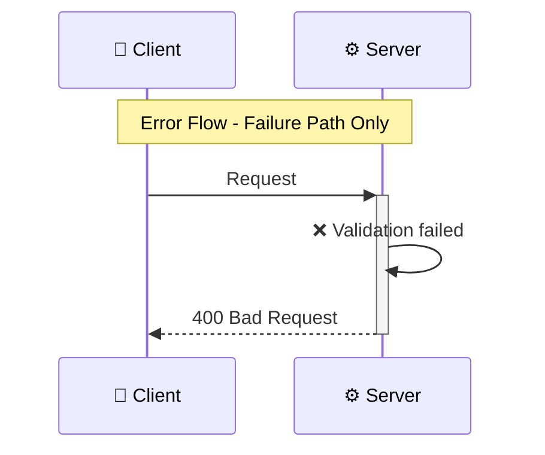
```mermaid
sequenceDiagram
    Note over Client,Server: Error Flow - Failure Path Only
    participant Client as 👤 Client
    participant Server as ⚙️ Server

    Client->>+Server: Request
    Server->>Server: ❌ Validation failed
    Server-->>-Client: 400 Bad Request
```

### 2. **Use Clear, Specific Labels**

❌ **Bad:** `A -> B: send data`

✅ **Good:** `OrderService ->> PaymentService: POST /payments {amount: 100.00, currency: USD}`

### 3. **Include HTTP Status Codes**

Always show status codes for HTTP responses:

```mermaid
sequenceDiagram
    participant API as ⚙️ API
    participant Client as 👤 Client

    Client->>+API: POST /users
    API-->>-Client: ✅ HTTP 201 Created

    Client->>+API: GET /users/123
    API-->>-Client: ✅ HTTP 200 OK

    Client->>+API: DELETE /users/123
    API-->>-Client: ✅ HTTP 204 No Content

    Client->>+API: GET /users/999
    API-->>-Client: ❌ HTTP 404 Not Found
```

### 4. **Show Timing Information**

Add notes for performance-critical operations:

```mermaid
sequenceDiagram
    participant API as ⚙️ API
    participant DB as 💾 Database

    API->>+DB: Complex query
    Note over DB: Query execution: 250ms
    DB-->>-API: Result set (1000 rows)
    Note over API: Serialization: 50ms<br/>Total response time: 300ms
```

### 5. **Use Alt/Opt/Loop Fragments Sparingly**

Fragments add complexity. Use them only when necessary:

```mermaid
sequenceDiagram
    participant Client as 👤 Client
    participant API as ⚙️ API
    participant DB as 💾 DB

    Client->>+API: POST /users {email}

    alt Email format valid
        API->>+DB: INSERT user
        DB-->>-API: Success
        API-->>-Client: 201 Created
    else Email format invalid
        API-->>Client: 400 Bad Request
    end
```

### 6. **Indicate Async vs. Sync**

Use different arrow styles:

- **Solid arrow `->`**: Synchronous (waits for response)
- **Open arrow `--)`**: Asynchronous (fire and forget)
- **Dashed arrow `-->`**: Return/response

```mermaid
sequenceDiagram
    participant API as ⚙️ API
    participant Queue as 📬 Queue
    participant Worker as ⚙️ Worker

    API->>Queue: Sync call (wait for ACK)
    Queue-->>API: ACK
    Queue--)Worker: Async delivery (no wait)
```

### 7. **Group Related Participants**

Use boxes to group related services:

```mermaid
sequenceDiagram
    box Frontend
        participant Browser as 🌐 Browser
        participant React as ⚛️ React App
    end

    box Backend
        participant API as ⚙️ API
        participant DB as 💾 Database
    end

    Browser->>React: User action
    React->>API: API call
    API->>DB: Query
```

### 8. **Use Unicode Symbols Consistently**

Maintain consistent symbol usage across all diagrams:

| Category | Symbols |
|----------|---------|
| Users | 👤 👥 👨‍💻 👩‍💼 |
| Frontend | 🌐 📱 🖥️ ⚛️ |
| Backend | ⚙️ 🔧 🚀 ⚡ |
| Data | 💾 📊 🗄️ 📦 |
| Security | 🔐 🔑 🛡️ 🚪 |
| Messaging | 📬 📨 📡 🐰 |
| External | ☁️ 💳 📧 🔍 |

---

## Summary

| Pattern | When to Use | Key Elements |
|---------|-------------|--------------|
| **Simple CRUD** | Basic API operations | Client, API, Database, HTTP verbs |
| **Pagination** | List endpoints with large datasets | Cache check, DB query with LIMIT/OFFSET, pagination metadata |
| **OAuth Flow** | Third-party authentication | User, App, OAuth Provider, tokens |
| **JWT Auth** | Token-based authentication | Login, token generation, refresh token flow |
| **Service-to-Service** | Microservices communication | Multiple services, API Gateway, sync calls |
| **Circuit Breaker** | Fault tolerance | Service, circuit breaker logic, failure thresholds |
| **Event-Driven** | Async messaging | Producer, message queue, multiple consumers |
| **Saga** | Distributed transactions | Multiple services, events, compensating transactions |
| **Dead Letter Queue** | Error handling in queues | Main queue, DLQ, retry logic, monitoring |
| **Parallel Requests** | Performance optimization | Multiple concurrent calls, aggregation |
| **Webhook** | External callbacks | Provider, webhook endpoint, signature verification, queue |

---

**Related Guides:**
- [Activity Diagrams](./activity-diagrams.md) - Workflows and business logic
- [Architecture Diagrams](./architecture-diagrams.md) - System structure
- [Deployment Diagrams](./deployment-diagrams.md) - Infrastructure
- [Unicode Symbols](../unicode-symbols/guide.md) - Symbol reference

**Version:** 1.0
**Last Updated:** 2025-01-13
**Token Count:** ~7,000 words
