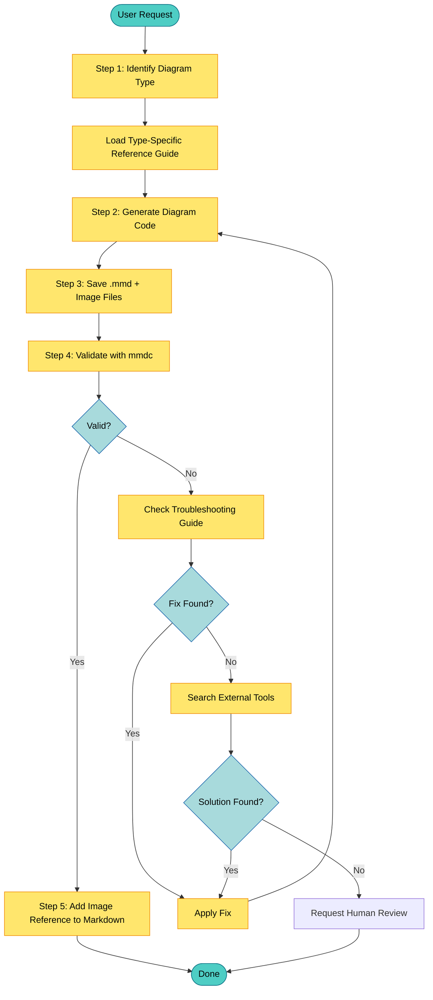

# Resilient Diagram Generation Workflow

**Version:** 1.0
**Last Updated:** 2025-01-15
**Purpose:** Complete workflow for reliable Mermaid diagram generation with error recovery

This guide documents the resilient workflow for generating Mermaid diagrams. It ensures diagrams are validated before being added to markdown files, and provides systematic error recovery when validation fails.

---

## Table of Contents

1. [Overview](#overview)
2. [Workflow Steps](#workflow-steps)
3. [File Naming Convention](#file-naming-convention)
4. [Using the Script](#using-the-script)
5. [Error Recovery Patterns](#error-recovery-patterns)
6. [Search Tool Priority](#search-tool-priority)
7. [Manual Fallback Workflow](#manual-fallback-workflow)
8. [Integration Examples](#integration-examples)

---

## Overview

The resilient workflow ensures diagrams are generated correctly by:

- **Detecting diagram type** for appropriate reference guide loading
- **Following consistent file naming** for organized output
- **Validating before finalizing** using mmdc CLI
- **Recovering from errors** using troubleshooting guide and external search
- **Only adding validated diagrams** to markdown files

### Workflow Diagram



### Key Principle

**NEVER add a diagram to a markdown file until it has been validated.** The workflow ensures all diagrams pass validation before being embedded, preventing broken diagrams in documentation.

---

## Workflow Steps

### Step 1: Identify Diagram Type

Analyze the Mermaid code to determine the diagram type and load appropriate reference guides.

**Detection Patterns:**

| First Line Pattern | Type | Reference Guide |
|-------------------|------|-----------------|
| `flowchart TD/LR/...` or `graph TB/...` | Flowchart | `references/guides/diagrams/activity-diagrams.md` |
| `sequenceDiagram` | Sequence | `references/guides/diagrams/sequence-diagrams.md` |
| `classDiagram` | Class | (use general mermaid-diagram-guide.md) |
| `stateDiagram-v2` | State | (use general mermaid-diagram-guide.md) |
| `erDiagram` | ER | (use general mermaid-diagram-guide.md) |
| `gantt` | Gantt | (use general mermaid-diagram-guide.md) |
| `pie` | Pie | (use general mermaid-diagram-guide.md) |
| `C4Context/Container/...` | C4 | `references/guides/diagrams/architecture-diagrams.md` |

**Action:** Load the appropriate reference guide to ensure correct syntax and patterns are used.

### Step 2: Generate Diagram Code

Write the Mermaid diagram code following the patterns in the loaded reference guide.

**Best Practices:**
- Use high-contrast styling with `classDef` and `color:` property
- Use Unicode symbols for semantic meaning
- Follow the patterns and templates from the reference guides
- Avoid reserved words or wrap them in quotes

### Step 3: Save Files

**IMPORTANT:** Save both the .mmd source file AND generate the image file BEFORE adding to markdown.

**Output Directory:** `./diagrams/` (relative to markdown file location)

**Generated Files:**
```
./diagrams/<base_filename>.mmd    # Mermaid source code
./diagrams/<base_filename>.png    # Rendered image (or .svg)
```

### Step 4: Validate with mmdc

Run the Mermaid CLI to validate and render the diagram:

```bash
mmdc -i diagram.mmd -o diagram.png -b transparent
```

**Success Criteria:**
- Exit code is 0
- Output file exists
- Output file size > 0 bytes

**If validation fails:** Proceed to error recovery (Step 4a).

### Step 4a: Error Recovery

When validation fails:

1. **Parse the error message** from mmdc output
2. **Search troubleshooting.md** for matching errors:
   - Match by error keywords (reserved word, missing, invalid, syntax)
   - Match by diagram type
   - Match by severity level
3. **Apply the suggested fix** from the troubleshooting guide
4. **Retry validation**

If troubleshooting guide doesn't have a match:
1. Use **search tools** (see [Search Tool Priority](#search-tool-priority))
2. Apply the found solution
3. Retry validation

### Step 5: Add to Markdown

**Only after successful validation**, add the image reference to the markdown file:

```markdown

```

Optionally include a link to the source:
```markdown


[View Mermaid source](./diagrams/filename.mmd)
```

---

## File Naming Convention

### Format

```
<markdown_file>_<num>_<type>_<title>.<ext>
```

### Components

| Component | Description | Example |
|-----------|-------------|---------|
| `markdown_file` | Source file name (no extension, sanitized) | `api_design` |
| `num` | Zero-padded diagram number (01-99) | `01`, `02`, `03` |
| `type` | Diagram type (lowercase) | `flowchart`, `sequence`, `class` |
| `title` | Sanitized title (max 20 chars) | `auth_flow`, `user_reg` |
| `ext` | File extension | `.mmd`, `.png`, `.svg` |

### Sanitization Rules

- Convert to lowercase
- Replace spaces and special characters with underscores
- Remove consecutive underscores
- Truncate title to 20 characters
- Remove trailing underscores

### Examples

**Input:**
- Markdown file: `API Design Doc.md`
- Diagram number: 1
- Type: sequence
- Title: "User Authentication Flow"

**Output files:**
```
./diagrams/api_design_doc_01_sequence_user_authenticatio.mmd
./diagrams/api_design_doc_01_sequence_user_authenticatio.png
```

---

## Using the Script

### Automated Workflow (Recommended)

The `resilient_diagram.py` script automates the entire workflow:

```bash
# Basic usage
python scripts/resilient_diagram.py \
    --code "flowchart TD; A-->B" \
    --markdown-file design_doc \
    --diagram-num 1 \
    --title "overview" \
    --format png

# With JSON output (recommended for programmatic use)
python scripts/resilient_diagram.py \
    --code "sequenceDiagram..." \
    --markdown-file api \
    --diagram-num 2 \
    --title "auth_flow" \
    --json
```

### CLI Options

| Option | Short | Description | Default |
|--------|-------|-------------|---------|
| `--code` | `-c` | Mermaid code string | - |
| `--mmd-file` | `-i` | Path to .mmd file | - |
| `--stdin` | - | Read from stdin | - |
| `--output-dir` | `-o` | Output directory | `./diagrams` |
| `--markdown-file` | `-m` | Source markdown name | `diagram` |
| `--diagram-num` | `-n` | Diagram number | `1` |
| `--title` | `-t` | Diagram title | `diagram` |
| `--format` | `-f` | Image format (png/svg/pdf) | `png` |
| `--json` | `-j` | Output as JSON | `false` |

### JSON Output Format

When using `--json`, the script returns structured data:

```json
{
  "success": true,
  "mmd_path": "./diagrams/api_01_sequence_auth_flow.mmd",
  "image_path": "./diagrams/api_01_sequence_auth_flow.png",
  "diagram_type": "sequence",
  "error_message": null,
  "troubleshooting_matches": [],
  "suggested_fix": null,
  "search_recommendation": null
}
```

**On failure:**

```json
{
  "success": false,
  "mmd_path": "./diagrams/api_01_flowchart_process.mmd",
  "image_path": null,
  "diagram_type": "flowchart",
  "error_message": "Parse error on line 2: reserved word 'end'",
  "troubleshooting_matches": [
    {
      "error_number": 5,
      "title": "Reserved Word \"end\" in Node Names",
      "severity": "Critical",
      "diagram_types": ["flowchart"],
      "problem": "The word 'end' is reserved and breaks flowcharts",
      "correct_example": "flowchart TD\n    start --> End"
    }
  ],
  "suggested_fix": "flowchart TD\n    start --> End",
  "search_recommendation": null
}
```

---

## Error Recovery Patterns

### Common Error Categories

#### 1. Reserved Words (Error 1, 5)

**Symptoms:** Parse error mentioning DEFAULT, end, style, class, etc.

**Fix:** Wrap reserved word in double quotes or change case.

```diff
- start --> end
+ start --> "end"
```

#### 2. Unescaped Special Characters (Error 2)

**Symptoms:** Unexpected token, parsing error mid-label

**Fix:** Wrap labels in quotes or use HTML entities.

```diff
- A[Say "hello"]
+ A["Say #34;hello#34;"]
```

#### 3. Invalid Arrow Syntax (Error 7)

**Symptoms:** Connection not rendered, no arrow shown

**Fix:** Use correct arrow format (3+ characters).

```diff
- A -> B
+ A --> B
```

#### 4. Missing Colon in Sequence (Error 11)

**Symptoms:** Parsing error in sequence diagram

**Fix:** Add colon before message text.

```diff
- Alice->>Bob Message
+ Alice->>Bob: Message
```

#### 5. Missing "end" in Blocks (Error 13)

**Symptoms:** Parse error in alt/opt/loop blocks

**Fix:** Add closing `end` keyword.

```diff
  alt Success
      Bob->>Alice: OK
  else Failure
      Bob->>Alice: Error
+ end
```

#### 6. Invalid classDef (Error 3)

**Symptoms:** Styling not applied

**Fix:** Remove curly braces, use comma-separated properties.

```diff
- classDef myClass { fill:#f00; }
+ classDef myClass fill:#f00,stroke:#333,color:#fff
```

### Using Troubleshooting Guide

1. **Read the error message** from mmdc output
2. **Search troubleshooting.md** for keywords:
   - Error keywords: "reserved", "missing", "invalid", "syntax"
   - Diagram type: "flowchart", "sequence", etc.
3. **Find matching Error entry** (Error 1-28)
4. **Compare your code** to the "Incorrect" example
5. **Apply the pattern** from the "Correct" example

---

## Search Tool Priority

When troubleshooting.md doesn't have a matching fix, use external search tools **in this order**:

### 1. Perplexity MCP (Primary)

Best for: Specific syntax questions, code examples

```
perplexity_ask: "mermaid sequenceDiagram syntax error participant not defined"
```

### 2. Brave Search MCP (Secondary)

Best for: Recent issues, GitHub discussions, community solutions

```
brave_web_search: "mermaid gantt chart reserved word error site:github.com"
```

### 3. Gemini Skill (Tertiary)

Best for: Complex multi-line errors, alternative perspectives, debugging assistance

```
Use gemini skill with prompt:
"I have a Mermaid diagram error. The code is:
[paste diagram code]
The error is: [paste error message]
What is the fix?"
```

### 4. WebSearch Tool (Fallback)

Best for: General web results when other tools unavailable

```
WebSearch: "mermaid diagram syntax error [specific error text]"
```

### Search Query Format

Construct search queries with:
1. Tool/technology: "mermaid"
2. Diagram type: "flowchart", "sequence", etc.
3. Error context: "syntax error", "parse error"
4. Key error text: first 100 characters of error message

**Example:**
```
mermaid flowchart syntax error: Parse error on line 2 reserved word end
```

---

## Manual Fallback Workflow

If the `resilient_diagram.py` script is unavailable or fails, follow these manual steps:

### Step 1: Determine Diagram Type

Look at the first non-comment line of Mermaid code:

| First Line | Type |
|------------|------|
| `flowchart` / `graph` | Flowchart/Activity |
| `sequenceDiagram` | Sequence |
| `classDiagram` | Class |
| `stateDiagram-v2` | State |
| `erDiagram` | ER |
| `gantt` | Gantt |
| `pie` | Pie |
| `C4Context` | C4/Architecture |

### Step 2: Load Reference Guide

Read the appropriate guide from `references/guides/diagrams/`:

```
Activity/Flowchart: activity-diagrams.md
Sequence: sequence-diagrams.md
Deployment: deployment-diagrams.md
Architecture: architecture-diagrams.md
```

### Step 3: Create Output Directory

```bash
mkdir -p ./diagrams/
```

### Step 4: Save .mmd File

Create the file with naming convention:
```bash
# Generate filename
FILENAME="<markdown>_<num>_<type>_<title>.mmd"

# Save content
cat > "./diagrams/${FILENAME}" << 'EOF'
flowchart TD
    A[Start] --> B[Process]
    B --> C[End]
EOF
```

### Step 5: Validate and Render

```bash
mmdc -i "./diagrams/${FILENAME}" -o "./diagrams/${FILENAME%.mmd}.png" -b transparent
```

Check exit code:
- `0` = Success, proceed to Step 7
- Non-zero = Error, proceed to Step 6

### Step 6: Error Recovery

1. **Read error message** from mmdc output
2. **Open troubleshooting guide:**
   ```bash
   cat references/guides/troubleshooting.md
   ```
3. **Search for matching error** (Ctrl+F for keywords)
4. **Apply the fix** from "Correct" example
5. **Retry Step 5**

If no match found:
1. Use search tools in priority order
2. Apply found solution
3. Retry Step 5

### Step 7: Add to Markdown

Only after validation succeeds:

```markdown

```

---

## Integration Examples

### Example 1: Creating a New Diagram

**User Request:** "Create a sequence diagram showing user login"

**Workflow:**

1. **Identify type:** Sequence diagram
2. **Load guide:** `references/guides/diagrams/sequence-diagrams.md`
3. **Generate code:**
   ```mermaid
   sequenceDiagram
       participant U as User
       participant A as Auth Service
       participant D as Database

       U->>A: Login request
       A->>D: Validate credentials
       D-->>A: User data
       A-->>U: JWT token
   ```
4. **Save files:**
   - `./diagrams/auth_doc_01_sequence_user_login.mmd`
   - `./diagrams/auth_doc_01_sequence_user_login.png`
5. **Validate:** `mmdc -i ... -o ...` → Success
6. **Add to markdown:**
   ```markdown
   ## Login Flow

   
   ```

### Example 2: Handling Validation Error

**Diagram Code:**
```mermaid
flowchart TD
    start --> end
```

**Error:** `Parse error: reserved word 'end'`

**Recovery:**

1. **Search troubleshooting.md** → Match Error #5
2. **Apply fix:** Change `end` to `"end"` or `End`
3. **Fixed code:**
   ```mermaid
   flowchart TD
       start --> End
   ```
4. **Retry validation** → Success
5. **Save and add to markdown**

### Example 3: No Troubleshooting Match

**Error:** `Unknown parsing error in custom directive`

**Recovery:**

1. **Search troubleshooting.md** → No match
2. **Use perplexity_ask:**
   ```
   "mermaid flowchart custom directive unknown parsing error"
   ```
3. **Get solution** from search result
4. **Apply fix and retry**
5. **If still failing:** Escalate to brave_web_search, then gemini skill

---

## Quick Reference Card

### Workflow Summary

```
1. IDENTIFY → Detect diagram type, load reference guide
2. GENERATE → Write Mermaid code using guide patterns
3. SAVE     → Create ./diagrams/<name>.mmd
4. VALIDATE → Run mmdc, check exit code
5. RECOVER  → If failed: troubleshooting.md → search tools
6. ADD      → Only after validation: 
```

### File Naming

```
./diagrams/<markdown>_<num>_<type>_<title>.mmd
./diagrams/<markdown>_<num>_<type>_<title>.png
```

### Search Priority

```
1. perplexity_ask MCP
2. brave_web_search MCP
3. gemini skill
4. WebSearch tool
```

### Validation Command

```bash
mmdc -i input.mmd -o output.png -b transparent
```

---

**Version:** 1.0
**Related Guides:**
- [Troubleshooting Guide](troubleshooting.md)
- [Activity Diagrams](diagrams/activity-diagrams.md)
- [Sequence Diagrams](diagrams/sequence-diagrams.md)
- [Deployment Diagrams](diagrams/deployment-diagrams.md)
- [Architecture Diagrams](diagrams/architecture-diagrams.md)
