# Unicode Semantic Symbols in Mermaid Diagrams

Using Unicode characters in Mermaid diagrams enhances clarity, expressiveness, and visual meaning. This guide provides a comprehensive reference for semantic symbols across all diagram types.

## What Are Semantic Unicode Symbols?

Semantic Unicode symbols (also called meaningful Unicode glyphs) are special characters that visually represent concepts, states, or actions within diagrams. For example:

- ⚙️ represents a **process** or **configuration**
- ⚡ represents **speed**, **power**, or **real-time** operations
- 💾 represents **storage** or **database**
- 🔐 represents **security** or **authentication**

Mermaid supports Unicode characters within node labels when enclosed in double quotes or brackets.

## Symbol Categories

### Infrastructure & Cloud (☁️ 🌐 🔌)

| Symbol | Meaning | Example Usage |
|--------|---------|---------------|
| ☁️ | Cloud Service | `[☁️ AWS Lambda]` |
| 🌐 | Network/Internet/Load Balancer | `[🌐 API Gateway]` |
| 🔌 | Network Connection | `[🔌 VPC Connector]` |
| 📡 | Communication/Broadcast | `[📡 WebSocket Server]` |
| 🛰️ | Satellite/Remote | `[🛰️ Edge Location]` |
| 🗄️ | Server/Storage | `[🗄️ File Server]` |

**Example:**
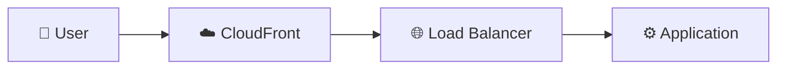

### Compute & Processing (⚙️ ⚡ 🔄)

| Symbol | Meaning | Example Usage |
|--------|---------|---------------|
| ⚙️ | Process/Service/Configuration | `[⚙️ Worker Service]` |
| ⚡ | Fast/Real-time/Cache | `[⚡ Redis Cache]` |
| 🔄 | Sync/Retry/Circular Process | `[🔄 Sync Service]` |
| ♻️ | Recycle/Reprocess | `[♻️ Retry Queue]` |
| 🚀 | Launch/Start/Deploy | `[🚀 Startup Process]` |
| 🔥 | Hot/Active/Critical | `[🔥 Hot Path]` |
| 💨 | Fast/Lightweight | `[💨 Quick Response]` |

**Example:**
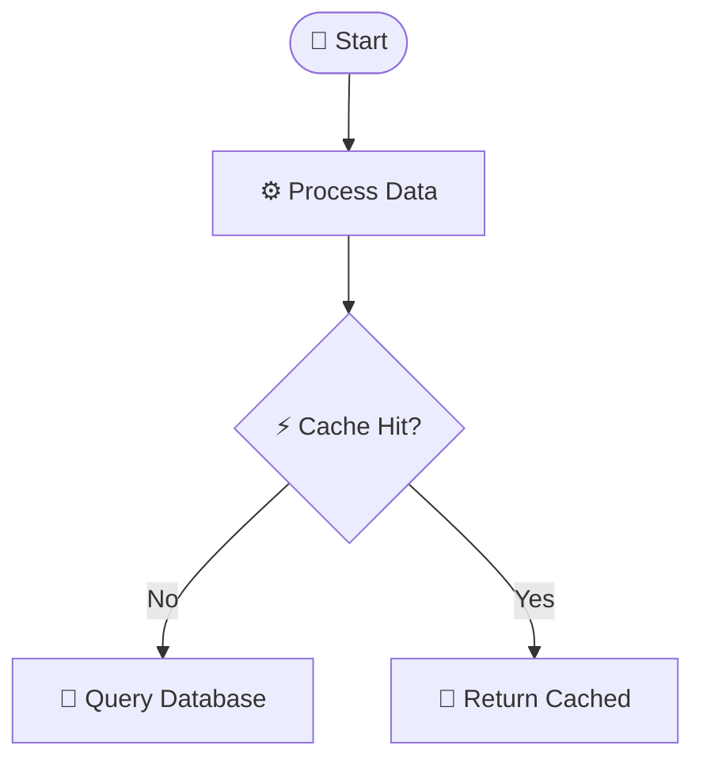

### Data & Storage (💾 📦 📊)

| Symbol | Meaning | Example Usage |
|--------|---------|---------------|
| 💾 | Database/Persistent Storage | `[(💾 PostgreSQL)]` |
| 📦 | Object Storage/Package | `[📦 S3 Bucket]` |
| 📊 | Data/Analytics/Metrics | `[📊 Analytics DB]` |
| 📈 | Growth/Trending Up | `[📈 Metrics Dashboard]` |
| 📉 | Decline/Trending Down | `[📉 Error Rate]` |
| 🗃️ | Archive/Files | `[🗃️ Archive Storage]` |
| 💿 | Disk/Volume | `[💿 EBS Volume]` |
| 🧊 | Cold Storage | `[🧊 Glacier]` |

**Example:**
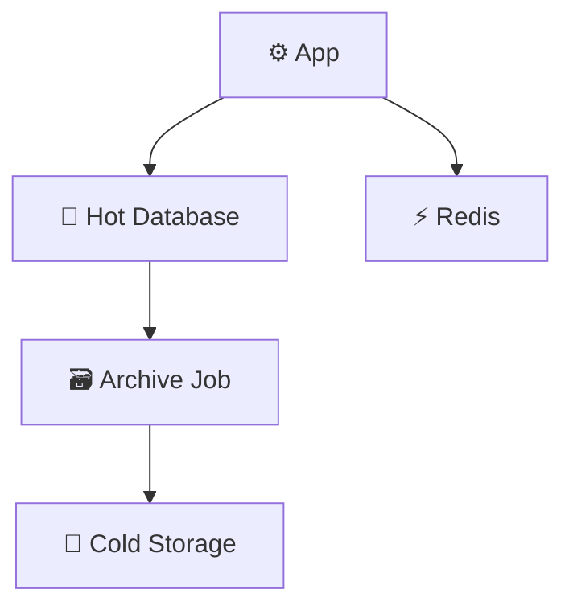

### Messaging & Events (📨 📬 🐰)

| Symbol | Meaning | Example Usage |
|--------|---------|---------------|
| 📨 | Event/Message/Email | `[📨 Event Bus]` |
| 📬 | Queue/Mailbox | `[📬 SQS Queue]` |
| 📤 | Outbox/Send | `[📤 Outgoing Messages]` |
| 📥 | Inbox/Receive | `[📥 Incoming Events]` |
| 🐰 | RabbitMQ specifically | `[🐰 RabbitMQ]` |
| 📢 | Broadcast/Notification | `[📢 Push Notifications]` |
| 📲 | Mobile Push | `[📲 Mobile Alerts]` |

**Example:**
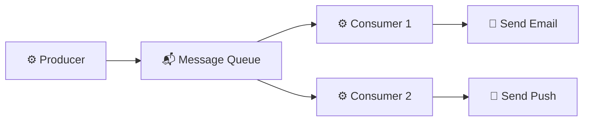

### Security & Authentication (🔐 🔑 🛡️)

| Symbol | Meaning | Example Usage |
|--------|---------|---------------|
| 🔐 | Security/Encryption/Auth | `[🔐 Auth Service]` |
| 🔑 | Key/Secret/Credential | `[🔑 Secret Manager]` |
| 🛡️ | Protection/Firewall/WAF | `[🛡️ Security Gateway]` |
| 🚪 | Gateway/Entry Point | `[🚪 API Gateway]` |
| 👤 | User/Person | `[👤 End User]` |
| 👥 | Users/Group | `[👥 User Pool]` |
| 🎫 | Token/Ticket | `[🎫 JWT Token]` |
| 🔓 | Unlocked/Public | `[🔓 Public API]` |

**Example:**
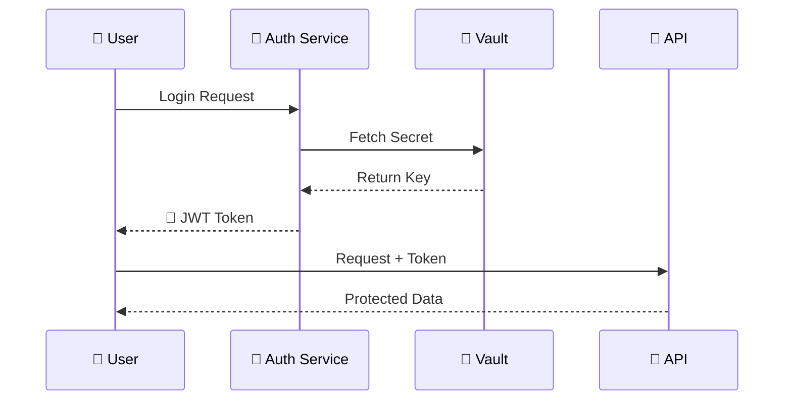

### Monitoring & Operations (📝 📊 🚨)

| Symbol | Meaning | Example Usage |
|--------|---------|---------------|
| 📝 | Logging/Writing | `[📝 Log Aggregator]` |
| 📊 | Monitoring/Dashboard | `[📊 Grafana]` |
| 🚨 | Alert/Critical | `[🚨 Alert Manager]` |
| ⚠️ | Warning | `[⚠️ Rate Limit Warning]` |
| ✅ | Success/OK | `[✅ Health Check Pass]` |
| ❌ | Failure/Error | `[❌ Failed]` |
| 🔍 | Search/Inspect | `[🔍 Log Search]` |
| 🎯 | Target/Goal | `[🎯 SLA Target]` |
| 🏷️ | Tag/Label | `[🏷️ Resource Tags]` |

**Example:**
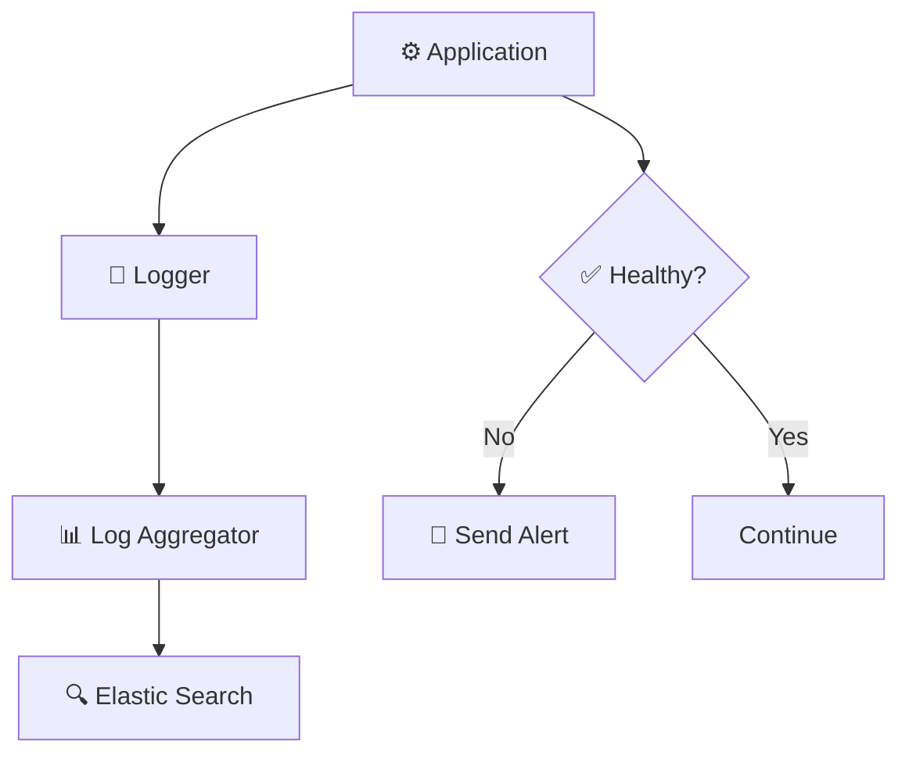

### Status & State (✓ ❌ ⏸️)

| Symbol | Meaning | Example Usage |
|--------|---------|---------------|
| ✓ / ✅ | Success/Complete/Approved | `[✅ Approved]` |
| ❌ / ✗ | Failed/Rejected/Error | `[❌ Failed]` |
| ⏸️ | Paused/Suspended | `[⏸️ Paused]` |
| ▶️ | Running/Active | `[▶️ Running]` |
| ⏹️ | Stopped/Terminated | `[⏹️ Stopped]` |
| 🔴 | Critical/Down | `[🔴 Service Down]` |
| 🟢 | OK/Up/Green | `[🟢 Service Up]` |
| 🟡 | Warning/Degraded | `[🟡 Degraded]` |
| ⭕ | Pending/Waiting | `[⭕ Pending]` |

**Example:**
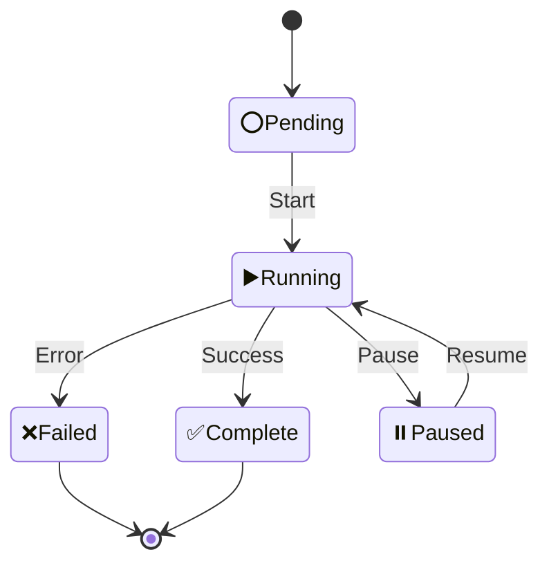

### Time & Scheduling (⏰ ⏱️ 📅)

| Symbol | Meaning | Example Usage |
|--------|---------|---------------|
| ⏰ | Scheduled/Cron Job | `[⏰ Nightly Batch]` |
| ⏱️ | Timer/Timeout | `[⏱️ 30s Timeout]` |
| 📅 | Calendar/Schedule | `[📅 Event Scheduler]` |
| ⌛ | Hourglass/Waiting | `[⌛ Long Running]` |
| ⏳ | Processing Time | `[⏳ Processing]` |
| 🕐-🕛 | Specific Time | `[🕐 1:00 AM Job]` |

**Example:**
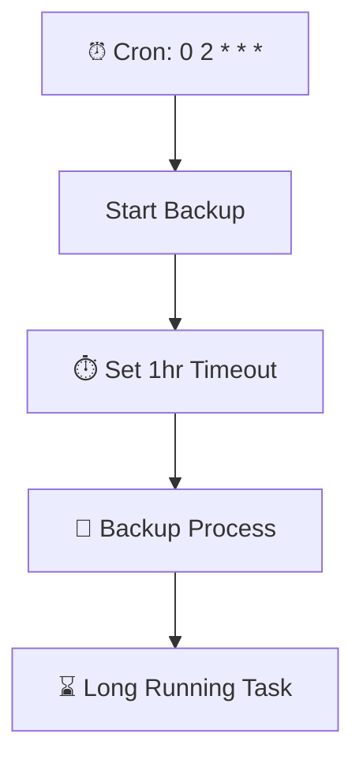

### Development & Code (💻 🔧 🐛)

| Symbol | Meaning | Example Usage |
|--------|---------|---------------|
| 💻 | Development/Code | `[💻 Dev Environment]` |
| 🔧 | Tool/Build/Fix | `[🔧 Build Pipeline]` |
| 🐛 | Bug/Debug | `[🐛 Bug Fix]` |
| 🧪 | Test/Experiment | `[🧪 Test Suite]` |
| 📦 | Package/Artifact | `[📦 Docker Image]` |
| 🏗️ | Build/Construction | `[🏗️ CI/CD]` |
| 🚢 | Ship/Deploy | `[🚢 Production Deploy]` |
| 🔀 | Branch/Merge | `[🔀 Git Merge]` |

**Example:**
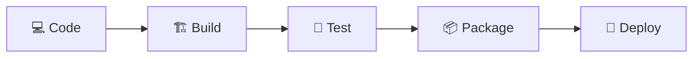

### UI/UX & Frontend (⚛️ 🎨 📱)

| Symbol | Meaning | Example Usage |
|--------|---------|---------------|
| ⚛️ | React/Frontend Framework | `[⚛️ React App]` |
| 🎨 | Design/Styling | `[🎨 CSS Engine]` |
| 📱 | Mobile | `[📱 Mobile App]` |
| 🖥️ | Desktop | `[🖥️ Desktop Client]` |
| 🌐 | Browser/Web | `[🌐 Web Browser]` |
| 🖱️ | User Interaction | `[🖱️ Click Handler]` |
| 👁️ | View/Display | `[👁️ Render View]` |

**Example:**
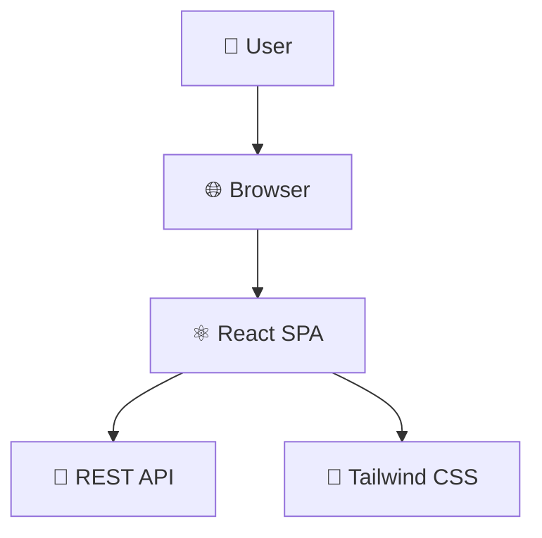

### Business & Domain (💰 🛒 📋)

| Symbol | Meaning | Example Usage |
|--------|---------|---------------|
| 💰 | Payment/Money | `[💰 Payment Gateway]` |
| 🛒 | Shopping/Cart | `[🛒 Shopping Cart]` |
| 📋 | Order/List | `[📋 Order Management]` |
| 📦 | Product/Package | `[📦 Product Catalog]` |
| 🏢 | Enterprise/Organization | `[🏢 Company]` |
| 🏦 | Financial/Bank | `[🏦 Bank Integration]` |
| 📧 | Email/Communication | `[📧 Email Service]` |
| 🎁 | Reward/Bonus | `[🎁 Loyalty Program]` |

**Example:**
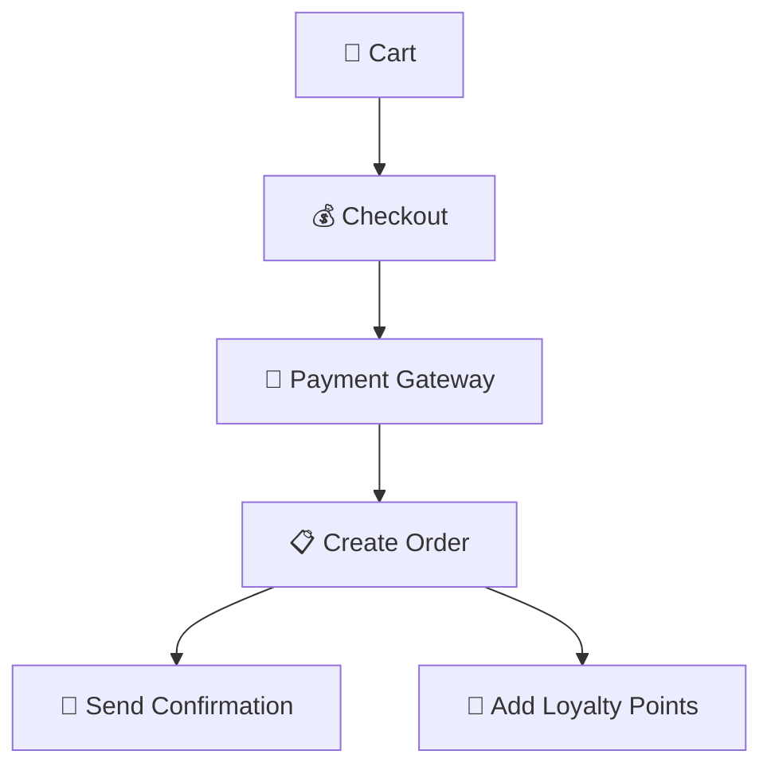

## Best Practices

### 1. Consistent Symbol Usage

Use the same symbol for the same concept throughout all diagrams in a project:

✅ **Good - Consistent:**
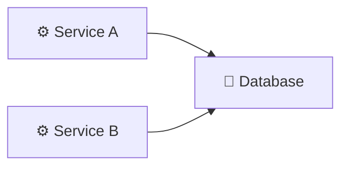

❌ **Bad - Inconsistent:**
```mermaid
graph LR
    A[⚙️ Service A] --> B[💾 Database]
    C[🔧 Service B] --> B  %% Different symbol for same concept
```

### 2. Don't Overuse Symbols

One or two symbols per node is ideal:

✅ **Good - Clear:**
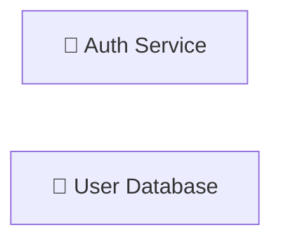

❌ **Bad - Too Many:**
```mermaid
graph LR
    A[🔐🔑🛡️👤 Auth Service]  %% Cluttered
```

### 3. Combine with Text

Symbols should complement, not replace, descriptive text:

✅ **Good:**
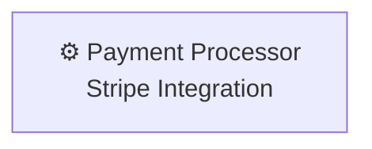

❌ **Bad:**
```mermaid
graph LR
    A[💰💳🏦]  %% No context
```

### 4. Consider Rendering Context

Some symbols may not render consistently across all platforms. Test your diagrams:

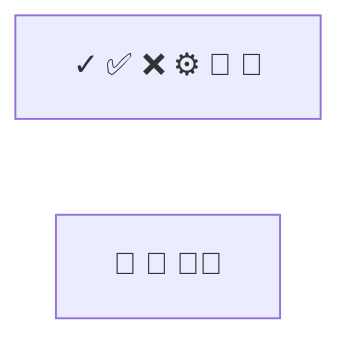

Stick to well-established Unicode symbols (≤ Unicode 13.0) for maximum compatibility.

### 5. Symbol Accessibility

Remember that some users may use screen readers. The text should make sense without symbols:

✅ **Good:**
```mermaid
graph LR
    A[🔐 Authentication Service]  %% "Authentication Service" is clear
```

❌ **Bad:**
```mermaid
graph LR
    A[🔐]  %% Screen reader only says "lock"
```

## Symbol Combinations

### Common Patterns

**Cache with Database:**
```mermaid
graph LR
    App[⚙️ App] --> Cache[⚡ Redis Cache]
    App --> DB[(💾 PostgreSQL)]
```

**Event-Driven Architecture:**
```mermaid
flowchart TD
    Producer[⚙️ Producer] --> Bus[📨 Event Bus]
    Bus --> Queue1[📬 Orders Queue]
    Bus --> Queue2[📬 Notifications Queue]
    Queue1 --> Consumer1[⚙️ Order Processor]
    Queue2 --> Consumer2[⚙️ Email Sender]
```

**Security Flow:**
```mermaid
sequenceDiagram
    participant U as 👤 User
    participant G as 🚪 Gateway
    participant A as 🔐 Auth
    participant V as 🔑 Vault
    participant API as ⚙️ API

    U->>G: Request
    G->>A: Validate Token
    A->>V: Check Permissions
    V-->>A: ✅ Allowed
    A-->>G: ✅ Authorized
    G->>API: Forward Request
    API-->>U: Response
```

**CI/CD Pipeline:**
```mermaid
flowchart LR
    Code[💻 Code Push] --> Build[🏗️ Build]
    Build --> Test[🧪 Test]
    Test --> Package[📦 Docker Build]
    Package --> Deploy[🚢 Deploy]
    Deploy --> Prod[☁️ Production]
```

## Language-Specific Symbol Conventions

### Python
```mermaid
graph LR
    Script[🐍 Python Script] --> Lib[📚 Library]
    Script --> DB[(💾 SQLite)]
```

### Java/Spring
```mermaid
graph LR
    Spring[☕ Spring Boot] --> JPA[💾 JPA Repository]
    Spring --> Cache[⚡ Caffeine Cache]
```

### JavaScript/Node
```mermaid
graph LR
    Node[📗 Node.js] --> Express[⚙️ Express API]
    Express --> Mongo[(💾 MongoDB)]
```

### React
```mermaid
graph LR
    React[⚛️ React App] --> Redux[📦 Redux Store]
    Redux --> API[🌐 REST API]
```

## Complete Symbol Reference Table

| Category | Symbols |
|----------|---------|
| Cloud/Network | ☁️ 🌐 🔌 📡 🛰️ 🗄️ |
| Compute | ⚙️ ⚡ 🔄 ♻️ 🚀 🔥 💨 |
| Data/Storage | 💾 📦 📊 📈 📉 🗃️ 💿 🧊 |
| Messaging | 📨 📬 📤 📥 🐰 📢 📲 |
| Security | 🔐 🔑 🛡️ 🚪 👤 👥 🎫 🔓 |
| Monitoring | 📝 📊 🚨 ⚠️ ✅ ❌ 🔍 🎯 🏷️ |
| Status | ✓ ✅ ❌ ⏸️ ▶️ ⏹️ 🔴 🟢 🟡 ⭕ |
| Time | ⏰ ⏱️ 📅 ⌛ ⏳ 🕐-🕛 |
| Development | 💻 🔧 🐛 🧪 📦 🏗️ 🚢 🔀 |
| Frontend | ⚛️ 🎨 📱 🖥️ 🌐 🖱️ 👁️ |
| Business | 💰 🛒 📋 📦 🏢 🏦 📧 🎁 |
| Languages | 🐍 (Python) ☕ (Java) 📗 (Node) ⚛️ (React) |

## Advanced: Creating Symbol Legends

For complex diagrams, include a legend:

```mermaid
flowchart TD
    subgraph Legend
        L1[⚙️ = Service/Process]
        L2[💾 = Database]
        L3[⚡ = Cache]
        L4[🔐 = Security]
        L5[📨 = Message/Event]
    end

    subgraph "Architecture"
        Auth[🔐 Auth Service] --> DB[(💾 Users DB)]
        API[⚙️ API Service] --> Auth
        API --> Cache[⚡ Redis]
        API --> Queue[📨 Event Queue]
    end
```

---

**Next Steps:**
- See `activity-diagrams.md` for workflow symbols
- See `deployment-diagrams.md` for infrastructure symbols
- See language-specific examples for framework conventions
