# Mermaid Diagram Reference Guide

This reference provides comprehensive guidance on creating effective Mermaid diagrams for design documents.

---

## Diagram Type Selection Matrix

| When You Need To... | Use This Diagram | Best For |
|---------------------|------------------|----------|
| Show system boundaries and external actors | C4 Context | System context, stakeholder view |
| Document API calls and timing | Sequence Diagram | API flows, interactions, temporal behavior |
| Model object relationships and inheritance | Class Diagram | OOP design, code structure |
| Visualize database schema | ER Diagram | Data model, relationships |
| Show state transitions and lifecycle | State Diagram | Workflows, status changes |
| Document decision flows and algorithms | Flowchart | Business logic, processes |
| Map hierarchical concepts | Mind Map | Brainstorming, concept organization |
| Track project timeline | Gantt Chart | Project planning, milestones |
| Capture user experience | User Journey | UX flows, user interactions |
| Show infrastructure components | Architecture Diagram | Deployment, infrastructure |

---

## 1. C4 Context Diagrams

**Purpose:** Show system boundaries, users, and external dependencies

**When to use:**
- System overview
- Stakeholder presentations
- Architecture documentation

**Syntax:**
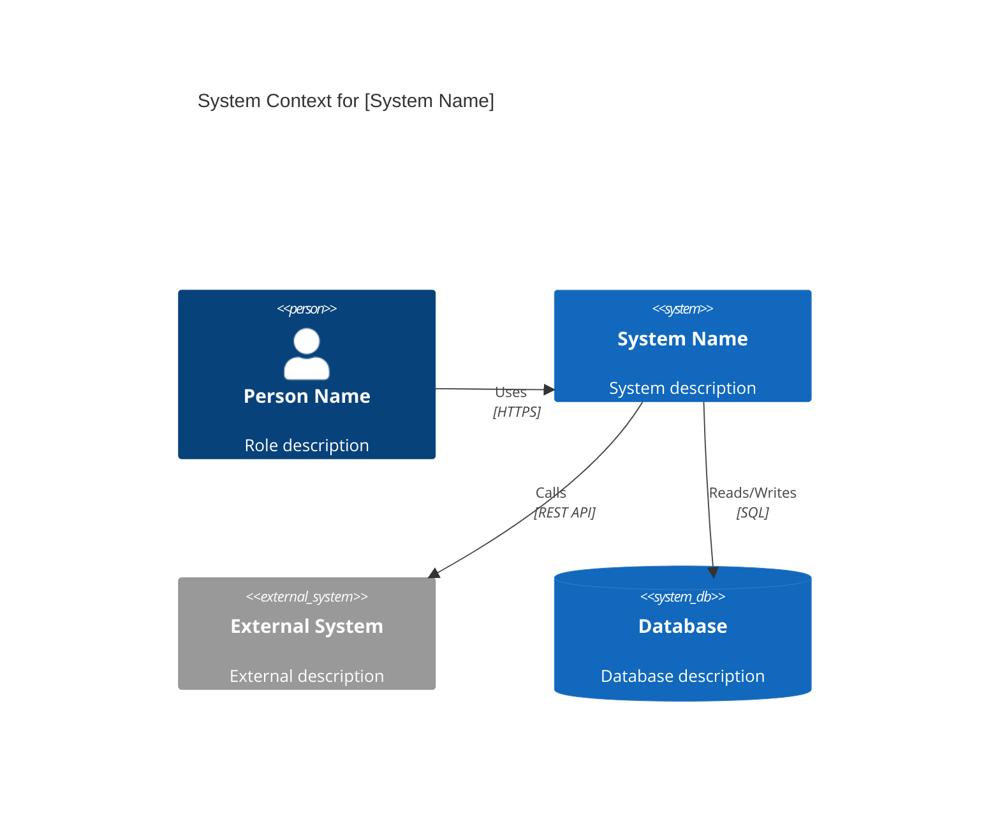

**Best Practices:**
- Limit to 5-7 systems for clarity
- Focus on key external dependencies
- Use consistent naming (nouns for systems, verbs for relationships)
- Include protocol information in relationship labels

---

## 2. Sequence Diagrams

**Purpose:** Show interactions between components over time

**When to use:**
- API documentation
- Request/response flows
- Authentication flows
- Error scenarios

**Syntax:**
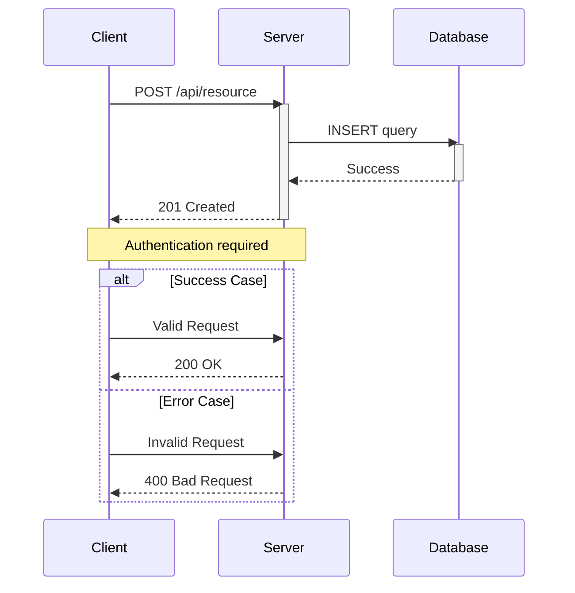

**Best Practices:**
- Order participants left-to-right by interaction flow
- Use activation boxes for processing time
- Include both happy path and error scenarios
- Add notes for important context
- Use alt/opt/loop for conditional logic

**Common Patterns:**
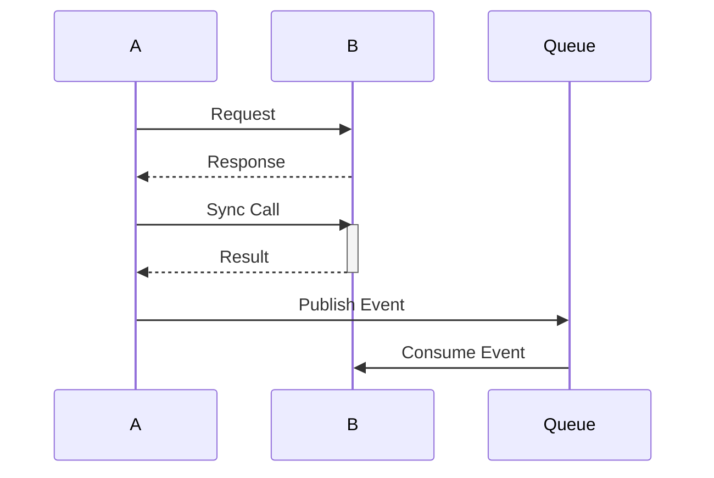

---

## 3. Class Diagrams

**Purpose:** Model object-oriented structure and relationships

**When to use:**
- OOP design documentation
- Code architecture
- Domain model

**Syntax:**
```mermaid
classDiagram
    class Animal {
        +String name
        +int age
        +makeSound() void
        -metabolize() void
    }

    class Dog {
        +String breed
        +bark() void
    }

    class Cat {
        +String color
        +meow() void
    }

    Animal <|-- Dog : inherits
    Animal <|-- Cat : inherits
    Dog "1" --> "*" Toy : has
    Cat "1" --> "1" Owner : belongs to

    <<interface>> Flyable
    Bird ..|> Flyable : implements
```

**Relationships:**
- `<|--` : Inheritance
- `*--` : Composition
- `o--` : Aggregation
- `-->` : Association
- `..>` : Dependency
- `..|>` : Realization

**Visibility:**
- `+` : Public
- `-` : Private
- `#` : Protected
- `~` : Package/Internal

---

## 4. ER Diagrams

**Purpose:** Model database schema and relationships

**When to use:**
- Database design
- Data architecture
- Schema documentation

**Syntax:**
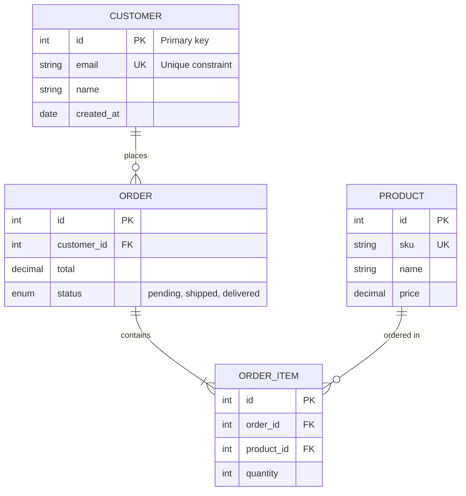

**Cardinality:**
- `||--||` : One to one
- `||--o{` : One to zero or more
- `||--|{` : One to one or more
- `}o--o{` : Zero or more to zero or more

**Best Practices:**
- Mark primary keys with "PK"
- Mark foreign keys with "FK"
- Mark unique constraints with "UK"
- Add field descriptions for clarity
- Include enum values in descriptions

---

## 5. State Diagrams

**Purpose:** Model state transitions and lifecycles

**When to use:**
- Workflow documentation
- Status management
- Lifecycle modeling

**Syntax:**
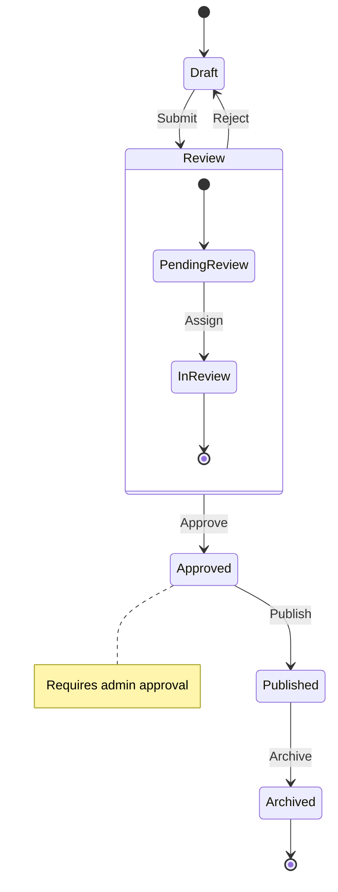

**Best Practices:**
- Start with `[*]` for initial state
- End with `[*]` for final state
- Use nested states for complex workflows
- Add notes for important transitions
- Keep transitions labeled with trigger events

---

## 6. Flowcharts

**Purpose:** Document processes, algorithms, and decision logic

**When to use:**
- Business logic documentation
- Process flows
- Algorithm explanation

**Syntax:**


**Node Shapes:**
- `[Text]` : Rectangle (process)
- `([Text])` : Stadium (start/end)
- `{Text}` : Diamond (decision)
- `[/Text/]` : Parallelogram (input/output)
- `[(Text)]` : Cylinder (database)
- `((Text))` : Circle
- `>Text]` : Asymmetric (flag)

**Directions:**
- `TD` / `TB` : Top to bottom
- `BT` : Bottom to top
- `LR` : Left to right
- `RL` : Right to left

---

## 7. Gantt Charts

**Purpose:** Project planning and timeline visualization

**When to use:**
- Project schedules
- Milestone tracking
- Roadmap planning

**Syntax:**
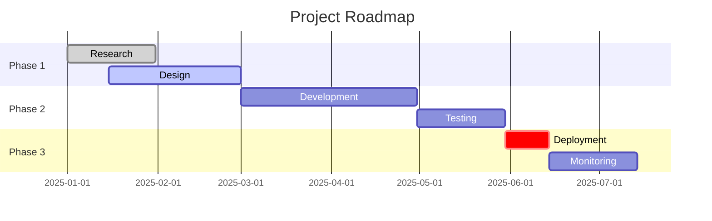

**Keywords:**
- `done` : Completed task
- `active` : Currently in progress
- `crit` : Critical path
- `after [id]` : Dependency

---

## 8. User Journey Maps

**Purpose:** Document user experience and interactions

**When to use:**
- UX documentation
- User story mapping
- Experience design

**Syntax:**
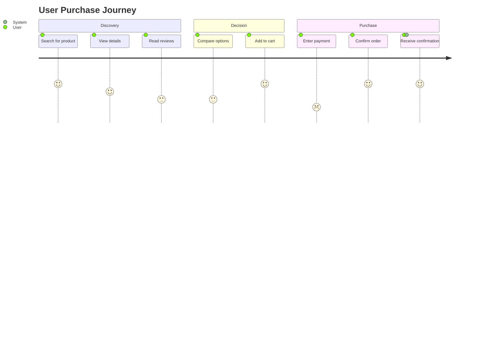

**Satisfaction Scores:**
- 5: Very satisfied
- 4: Satisfied
- 3: Neutral
- 2: Unsatisfied
- 1: Very unsatisfied

---

## Common Styling Patterns

### Subgraphs for Organization

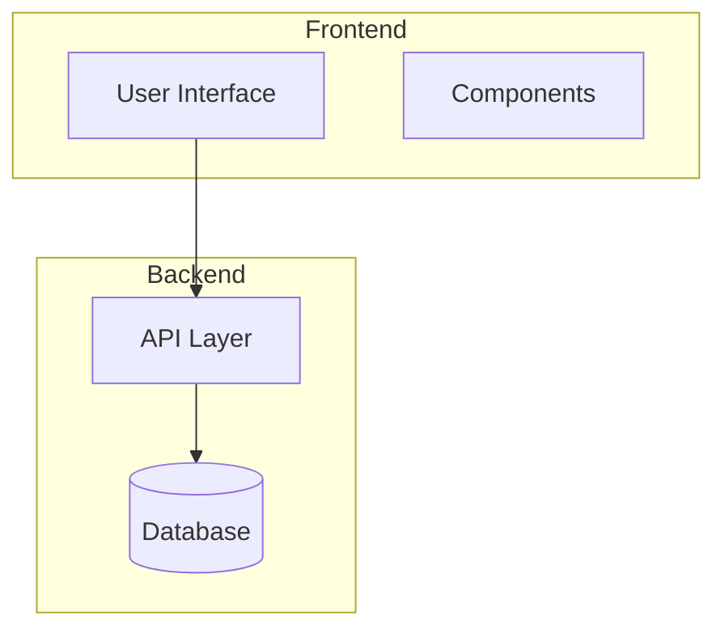

### Color Coding with High Contrast

**CRITICAL**: All Mermaid diagram styles MUST use high-contrast colors for accessibility.

**Rule**: Light backgrounds require dark text, dark backgrounds require light text.

✅ **Correct - High Contrast**:

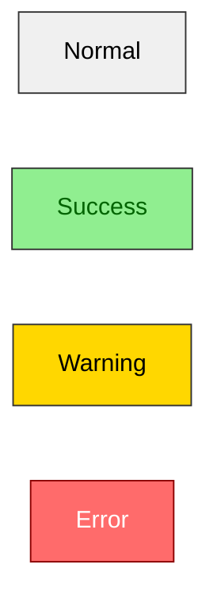

**Using classDef (Recommended for consistency)**:

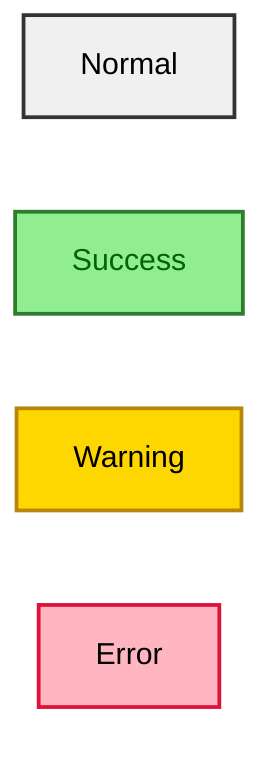

❌ **Incorrect - Poor Contrast**:

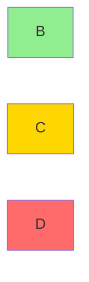

**High-Contrast Color Palette**:

| State | Background Fill | Text Color | Stroke |
|-------|----------------|------------|--------|
| Normal | `#F0F0F0` | `color:black` | `#333` |
| Success | `#90EE90` | `color:darkgreen` | `#2E7D2E` |
| Warning | `#FFD700` | `color:black` | `#B8860B` |
| Error | `#FFB6C1` | `color:black` | `#DC143C` |
| Info | `#87CEEB` | `color:darkblue` | `#4682B4` |
| Public | `#FFE4B5` | `color:black` | `#FF8C00` |
| Private | `#E6E6FA` | `color:darkblue` | `#8A2BE2` |
| Dark | `#2C3E50` | `color:white` | `#34495E` |

### Link Styles

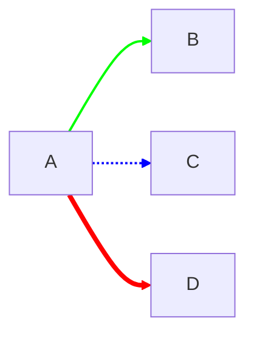

---

## Best Practices for Design Docs

### 1. Choose the Right Diagram

**Don't use:**
- Class diagrams for infrastructure
- Sequence diagrams for data models
- ER diagrams for workflows

**Do use:**
- The diagram type that best communicates your intent
- Multiple diagram types for different aspects
- Simpler diagrams over complex ones

### 2. Keep Diagrams Focused

**Bad:** One giant diagram showing everything
**Good:** Multiple focused diagrams showing specific aspects

**Guidelines:**
- Max 10-12 nodes per diagram
- Max 3-4 levels of nesting
- Break complex diagrams into multiple views

### 3. Use Consistent Naming

**Bad:**
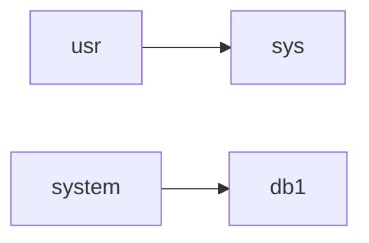

**Good:**
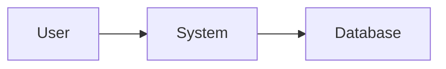

### 4. Add Context

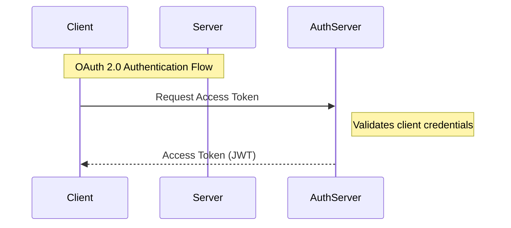

### 5. Document Technical Decisions

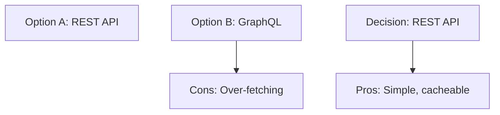

### 6. CRITICAL - Ensure High-Contrast Accessibility

**MANDATORY for ALL diagrams**:

Every diagram with custom styling MUST use high-contrast colors:

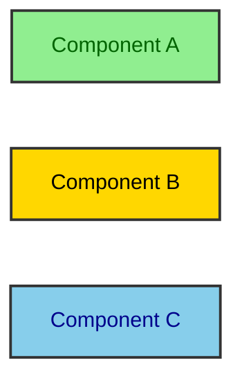

**Quick Accessibility Test**:
1. Can you easily read the text on each background color?
2. Would the diagram be readable if printed in grayscale?
3. Does every `classDef` include a `color:` property?

If answer is NO to any → Fix the contrast!

**Common Mistakes to Avoid**:
- ❌ `classDef myStyle fill:#FFD700` (missing `color:`)
- ❌ `style A fill:#F0F0F0,color:#E0E0E0` (light on light)
- ❌ `style B fill:#333,color:#222` (dark on dark)

**Always Include**:
- ✅ Explicit `color:` property in all `classDef` statements
- ✅ Explicit `color:` property in all `style` statements
- ✅ High-contrast combinations (see Color Coding section above)

---

## Syntax Validation Checklist

Before including a diagram, verify:

- [ ] All node IDs are unique
- [ ] All relationships use valid syntax
- [ ] Quotes are balanced in labels
- [ ] Special characters are escaped
- [ ] Subgraph syntax is correct
- [ ] No trailing commas
- [ ] Direction is specified (for flowcharts)
- [ ] Date format matches (for Gantt)
- [ ] **All `classDef` statements include `color:` property for high contrast**
- [ ] **All `style` statements include `color:` property for high contrast**
- [ ] **Text is readable on all background colors (accessibility test)**

---

## Common Errors and Fixes

### Error: "Parse error on line X"

**Cause:** Syntax error in Mermaid code

**Fix:**
- Check for missing quotes
- Verify relationship syntax
- Ensure all braces/parentheses match
- Remove trailing commas

### Error: Diagram doesn't render

**Cause:** Invalid node IDs or special characters

**Fix:**
- Use alphanumeric IDs (avoid spaces)
- Escape special characters in labels
- Use quotes for multi-word labels

### Error: Arrows pointing wrong direction

**Cause:** Wrong relationship syntax

**Fix:**
- `A-->B` : A to B
- `B<--A` : A to B (same as above)
- `A<-->B` : Bidirectional

---

## Quick Reference: When to Use Each Diagram

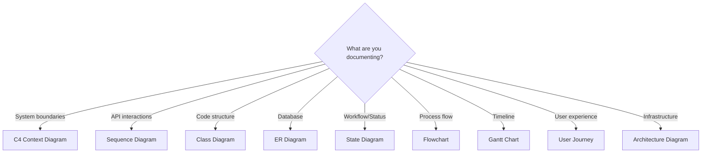

---

## Resources

- [Mermaid Official Docs](https://mermaid.js.org/)
- [Mermaid Live Editor](https://mermaid.live/)
- [C4 Model](https://c4model.com/)
