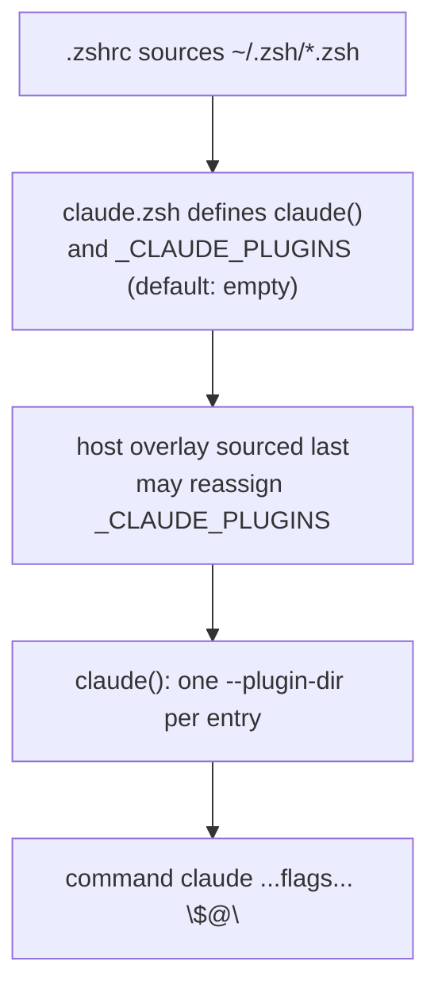

# claude

Claude Code configuration, delivered in two tiers:

1. **Stowed baseline** (`.claude/`) — symlinked into `~/.claude`, loads no matter
   how `claude` starts. Keep only truly-universal config here.
2. **Plugins** (`plugins/`) — purpose-grouped bundles loaded *per session* via
   `claude --plugin-dir`. Composed by a shell wrapper, so they never touch
   `~/.claude` and can vary by machine/repo.

## Layout

```
claude/
  .stow-local-ignore        # makes `stow claude` skip plugins/ and README
  .claude/                  # STOWED -> ~/.claude (baseline Claude config)
  .zsh/
    claude.zsh              # STOWED -> ~/.zsh/claude.zsh (the launcher)
  plugins/                  # NOT stowed; read in place via --plugin-dir
    <plugin>/.claude-plugin/plugin.json + skills|commands|agents|hooks/
```

## How loading works



- `claude.zsh` defines a `claude()` wrapper that reads `$_CLAUDE_PLUGINS` **lazily
  at call time** and adds one `--plugin-dir` per entry.
- It finds `plugins/` by resolving its **own** path through the stow symlink, so
  it needs no `$DOT_FILES` and works on any machine.
- The default array is empty; host overlays (`~/.zsh/host/*.zsh`) reassign it for
  a machine-wide profile.
- Unknown plugin names are skipped with a stderr warning, so a stale override
  never stops `claude` from launching.

## Stow notes

- `.stow-local-ignore` reproduces stow's built-in defaults plus `^/plugins`, so
  `stow claude` symlinks `.claude/*` and `.zsh/claude.zsh` but never `plugins/`
  (and skips this README). `claude` is stowed `--no-folding`.
- `.zsh/claude.zsh` lands in `~/.zsh/` (shared with the `zsh` package — both are
  `--no-folding`, so they co-populate the real dir) and is auto-sourced by the
  `~/.zsh/*.zsh` loop.
- Apply after changes: `stow --no-folding -t "$HOME" claude`.

## Extension points

**Add a skill to an existing plugin** — drop it under that plugin's `skills/<name>/SKILL.md`.

**Create a new plugin** — add `plugins/<name>/.claude-plugin/plugin.json` (needs at
least a `name`), then `skills/`, `commands/`, `agents/`, or `hooks/`.
Validate with `claude plugin validate plugins/<name>`.

**Change what loads on a machine** — edit the `_CLAUDE_PLUGINS` array: per-cde in
`zsh/.zsh/host/cde.zsh`, per-mac in `zsh/.zsh/host/macos.zsh`, or the default in
`claude/.zsh/claude.zsh`.

**Load a plugin for one repo only** — pass `--plugin-dir <path>` ad hoc, or extend
`claude()` to append entries when `git rev-parse --show-toplevel` matches a repo.

**Always-on instructions / rules** — plugins have no `rules/` primitive; ship a
`hooks/hooks.json` whose hook (SessionStart for always-on, or
PreToolUse/UserPromptSubmit for event-scoped) prints guidance as
`additionalContext`.

**Inspect cost** — `claude --plugin-dir <path> plugin details <name>` shows the
component inventory and projected token cost.
