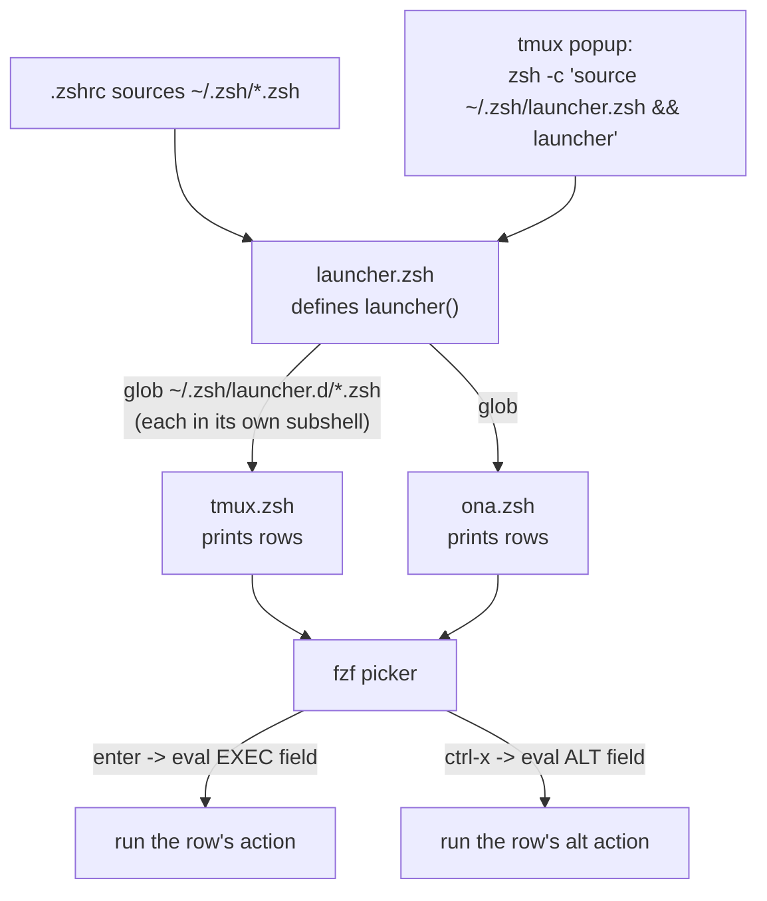

# launcher

A small, generic **fzf launcher**: one picker that fans rows in from any number
of plugins. The core knows nothing about tmux, ssh, or gitpod — every row
carries its own preview command and its own actions, so a plugin is just a
script that prints rows.

> **Mac-only.** This is its own stow package and is stowed *only* in the macOS
> branch of `stow.sh` (`run_stow_no_fold launcher`). It is never stowed on
> ona/cde, so `~/.zsh/launcher.zsh` is simply absent there and every consumer
> degrades gracefully (see [Wiring](#wiring)).

## Layout

```
launcher/.zsh/
  launcher.zsh            -> ~/.zsh/launcher.zsh         core: defines `launcher`
  launcher.d/
    tmux.zsh              -> ~/.zsh/launcher.d/tmux.zsh  plugin: tmux windows
    ona.zsh              -> ~/.zsh/launcher.d/ona.zsh    plugin: gitpod/ona envs
```

`~/.zsh/*.zsh` is sourced in a loop by `.zshrc`, which picks up `launcher.zsh`
and defines the `launcher` function (aliased `tjump`). The loop glob is
**non-recursive**, so `launcher.d/*.zsh` is *not* auto-sourced — the core
sources those itself, on demand, each time the picker opens.

## How it works



The picker is a single `fzf` call. Each plugin is sourced in its **own
subshell** purely for its stdout; the rows it prints are piped into `fzf`.
Plugin stderr is redirected to a debug log so a noisy/broken plugin can't
corrupt the row stream or the UI.

### Row contract

Each row is four fields joined by `$_LAUNCHER_DELIM` (`\x1f`):

```
DISPLAY ␟ PREVIEW_CMD ␟ EXEC_CMD ␟ ALT_CMD
```

| Field         | Who evals it      | Notes                                            |
| ------------- | ----------------- | ------------------------------------------------ |
| `DISPLAY`     | shown by fzf      | colored/aligned; ANSI ok, no `\x1f`              |
| `PREVIEW_CMD` | fzf `eval {2}`    | rendered in the preview pane                      |
| `EXEC_CMD`    | core `eval` (enter) | the action                                       |
| `ALT_CMD`     | fzf `eval {4}` (ctrl-x) | secondary action; `:` (no-op) when unused   |

Because PREVIEW/EXEC/ALT are eval'd **where the plugin was never sourced** (the
fzf preview shell, the dispatch shell), they must be self-contained and
shell-safe. Plugins pad the first three display columns to the shared widths in
`_LAUNCHER_COLW` so every plugin's rows line up into one grid.

### Plugin-author safety contract

The cost is proportional to how much **untrusted text** a plugin emits, not a
flat tax:

- **Universal:** print exactly 4 `\x1f`-joined fields; PREVIEW/EXEC/ALT must be
  self-contained and shell-safe (the core `eval`s them).
- **Only when a field carries arbitrary/external text:** never interpolate raw
  untrusted text into a command field — target a stable opaque token instead
  (tmux IDs `@N`/`$N`/`%N`) or quote with `${(q)...}`; and sanitize `DISPLAY`
  for control bytes (`[[:cntrl:]]`, which includes `\x1f`/newlines).

`launcher.d/tmux.zsh` is the worst-case reference (user-renamable window names +
arbitrary paths): it uses all of the above. Most plugins use little or none.

## Plugins

### `tmux.zsh` — window switcher

Prints one row per tmux window (MRU-sorted) across all sessions. Enter switches
the client to that session/window; ctrl-x kills the window. Targets use stable
tmux IDs, so no name ever reaches a command field.

### `ona.zsh` — gitpod/ona environments

Prints one row per gitpod env that has **no** live local tmux session bound to
it (a running env that *is* bound is already shown by `tmux.zsh`, so it's
skipped to avoid duplicates). Enter starts the env if stopped, then creates a
detached local session `ona-<short>` whose window ssh-attaches to the remote
`tmux new-session -A -s main`. ctrl-x stops a running env.

Only the env id (a UUID — hex + dashes, injection-safe) ever reaches a command
field; branch/repo names are repo-influenced so they appear in `DISPLAY` only,
control-stripped.

#### Remote "dumb terminal" mode (the `@is_remote` pattern)

Connecting to an ona env gives you **nested tmux**: a local tmux session whose
single pane runs `ssh` into a *remote* tmux. Both grab the prefix, both draw a
status bar — the outer one gets in the way of the inner one.

The fix has two halves:

1. **Stamp.** When `ona.zsh` creates the `ona-<short>` session it sets a custom
   user option on it:

   ```
   ... \; set-option -t "ona-$short" @is_remote 1 \; switch-client -t "=ona-$short"
   ```

   (The stamp uses the **bare** session name, not `=ona-<short>`:
   `set-option -t` rejects the `=` exact-match prefix that `switch-client` /
   `has-session` accept. `<short>` is a full UUID segment, so the bare name is
   unambiguous.)

2. **React.** `tmux/.tmux.conf` has a focus hook that, on entry to any session
   flagged `@is_remote`, runs the same body as the manual F12 toggle — drop the
   local prefix, key-table, and status bar so every keystroke passes straight
   through to the remote tmux:

   ```tmux
   set-hook -g pane-focus-in 'if-shell -F "#{@is_remote}" \
     "set prefix None ; set key-table off ; set status off ; refresh-client -S" ""'
   ```

   `prefix`/`key-table`/`status` are **session-scoped**, so switching back to a
   normal local session restores them automatically — that's why there is *no*
   else branch (an else branch would re-run on every pane focus and silently
   undo the manual F12 toggle in normal sessions). F12 (`C-F1`) still works
   inside the remote session for temporary local control; re-entering the
   session re-asserts dumb mode.

This README documents the launcher side; the hook itself lives in the `tmux`
package next to the F12 bindings.

## Wiring

One binding opens the launcher: Ghostty's `cmd+k` is mapped to tmux `User0`,
which opens the popup. The `tmux` package is stowed on every host, but the popup
is bound only when `~/.zsh/launcher.zsh` exists:

```tmux
if-shell '[ -r ~/.zsh/launcher.zsh ]' \
  "bind -n User0 display-popup -w 90% -h 90% -E \"zsh -c 'source ~/.zsh/launcher.zsh && launcher'\""
```

Because the launcher package is mac-only, on ona/cde the file is absent and
`cmd+k` simply stays unbound. The popup runs a non-interactive `zsh -c` that
sources only the cheap launcher files (not `.zshrc`), so it opens fast.

## Adding a plugin

Drop a `launcher.d/<name>.zsh` that prints rows per the [contract](#row-contract),
then re-stow (`run_stow_no_fold` doesn't fold, so a newly added file needs a
re-stow to appear as a `~/.zsh/launcher.d/` symlink). No registration step — the
core globs the directory.
