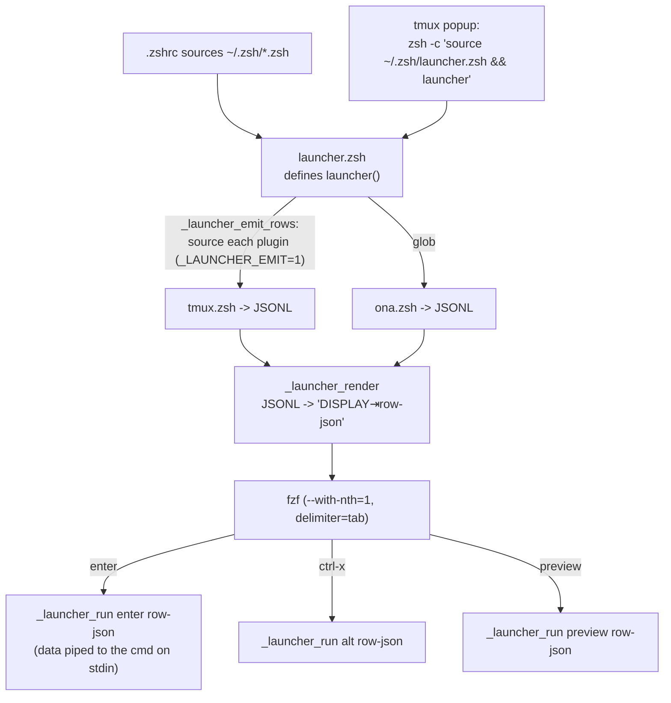

# launcher

A small, generic **fzf launcher**: one picker that fans rows in from any number
of plugins. The core is domain-agnostic; it knows nothing about tmux, ssh, or
gitpod. A plugin is just a script that prints rows.

> **Mac-only.** This is its own stow package, stowed only in the macOS branch of
> `stow.sh` (`run_stow_no_fold launcher`). It is never stowed on ona/cde, so
> `~/.zsh/launcher.zsh` is simply absent there and every consumer degrades
> gracefully (see [Wiring](#wiring)).

## The core idea: data in, not code in

Each plugin emits **one JSON object per line** (JSONL). A row carries a `data`
payload plus three **fixed command strings** (`enter`/`alt`/`preview`). On
selection, the core feeds the row's `data` to the chosen command **on stdin**
and `eval`s the command.

That split is the whole point:

- the command strings are **plugin-authored constants** (trusted code),
- `data` is the only per-row value, and it travels as JSON on **stdin**, so it
  **never reaches the shell parser**.

A hostile window name or branch in `data` is therefore inert: it can be printed
or passed as a command argument, but it cannot become code. This is what lets
the plugins stay readable. There is no per-row string surgery, no escaping
dance, no quoting paranoia, because nothing untrusted is ever interpolated into
a command.

## Row schema

```jsonc
{
  "display": { "icon": "", "color": 34, "cols": ["c1","c2","c3"], "tail": "" },
  "data":    { /* arbitrary, plugin-defined; piped to the commands on stdin */ },
  "enter":   "<cmd>",   // run on Enter   (the action)
  "alt":     "<cmd>",   // run on ctrl-x  (the alt action)
  "preview": "<cmd>"    // run for the preview pane
}
```

- **`display`** is rendered by the **core**, in one place, into the colored,
  aligned grid: `icon` + `color` lead, `cols[0..2]` fill the shared column
  widths (`_LAUNCHER_COLW`), `tail` is the free unpadded remainder. The core
  also strips control bytes from every display field, so plugins hand over raw
  text and never touch ANSI or alignment.
- **`enter`/`alt`/`preview`** are command strings the core `eval`s with `data`
  on stdin. The idiomatic value is a thin **re-source shim**:
  `"source ~/.zsh/launcher.d/tmux.zsh && _tmux_switch"`. The real logic lives in
  a normal, readable zsh helper that slurps `data` from stdin once and reads
  fields with jq. (The re-source is how a plugin exposes its helpers to the
  subshell fzf runs preview/alt in, where the plugin was never sourced. It is
  cheap and is already how `ona.zsh` re-enters itself.)

## How it works



The fzf line is `DISPLAY<TAB>ROW_JSON`. fzf shows field 1 (the rendered
display); field 2 carries the row's JSON (minus `display`) for dispatch. `jq -c`
guarantees the JSON is single-line and tab-free, so exactly one tab splits the
two. `_launcher_run` slurps `data` and pipes it to the eval'd command:

```zsh
_launcher_run() {            # $1 = enter|alt|preview   $2 = row JSON
  local row=$2
  print -r -- "$row" | jq -c '.data' | eval "$(print -r -- "$row" | jq -r ".$1")"
}
```

## Writing a plugin

A plugin file has three parts, in order:

1. **Helper functions** (the `enter`/`alt`/`preview` logic). Each slurps `data`
   from stdin once and reads fields with jq:

   ```zsh
   _tmux_switch() {
     local d; d=$(jq -c .)            # slurp once: stdin is single-use
     tmux switch-client -t "$(jq -r .sid <<<"$d")"
     tmux select-window -t "$(jq -r .wid <<<"$d")"
   }
   ```

   Slurp once. A second `jq` reading stdin directly would get nothing, because
   the first already drained the pipe.

2. **The emit guard**: `[[ -n $_LAUNCHER_EMIT ]] || return 0`. Only the core's
   emit pass sets `_LAUNCHER_EMIT`, so a re-source done just to obtain a helper
   stops here instead of printing rows.

3. **Row emission**: print JSONL below the guard. Build rows with `jq` so all
   JSON escaping is automatic, and pass the (constant) command strings in as
   `--arg`:

   ```zsh
   local sh='source ~/.zsh/launcher.d/tmux.zsh'
   tmux list-windows -a -F '...' \
     | jq -Rc --arg enter "$sh && _tmux_switch" ... '{ display: {...}, data: {...}, enter: $enter, ... }'
   ```

That is the entire contract. No registration step; the core globs
`~/.zsh/launcher.d/*.zsh`.

## Plugins

### `tmux.zsh` - window switcher

One row per tmux window, MRU-sorted. enter switches the client to that
session/window, alt kills the window, preview captures the pane. Targets are
stable tmux IDs (`$N`/`@N`/`%N`) carried in `data`.

### `ona.zsh` - gitpod/ona environments

One row per gitpod env that has **no** live local tmux session bound to it (a
running, bound env is already listed by `tmux.zsh`, so it is filtered out to
avoid duplicates). enter starts the env if stopped and ssh-attaches inside a
fresh detached session `ona-<short>`; alt stops a running env; preview shows
`gitpod env get`. Only the env id (a UUID) and its short form travel in `data`.

**Cache (stale-while-revalidate).** `gitpod env list` is a network call and the
slowest thing in emit, so the plugin caches its raw JSON
(`~/.cache/launcher-ona.json`, TTL `_ONA_TTL=30s`). On open it prints the cached
copy immediately and, if the cache is older than the TTL, refreshes it in a
detached background process so the *next* open is fresh; the picker never waits
except on a cold start (no cache yet). Only the slow remote call is cached. The
live tmux-session dedup is recomputed every open, so local sessions are never
stale, and the env phases self-heal one open later. Refreshes write a unique
`mktemp` file and atomically rename it, so concurrent opens can't corrupt the
cache and readers never see a half-written file.

#### Remote "dumb terminal" mode (the `@is_remote` pattern)

`_ona_launch` creates the `ona-<short>` session and stamps it with the tmux user
option `@is_remote`, then passes the env id to the session via
`new-session -e ONA_ID=...` (so the id is an environment value, never
interpolated into a command). A `pane-focus-in` hook in `tmux/.tmux.conf` sees
`@is_remote` on focus and drops the local prefix/status/key-table so keystrokes
pass through to the remote tmux over ssh. That hook lives in the `tmux` package;
this plugin only sets the stamp.

## Wiring

Ghostty's `cmd+k` is mapped to tmux `User0`, which opens the picker in a popup.
The `tmux` package is stowed on every host, but the binding is created only when
`~/.zsh/launcher.zsh` exists (and in both the `root` and `off` key-tables, so it
works while an ona session is in dumb mode):

```tmux
%hidden LAUNCHER_POPUP="display-popup -w 90% -h 90% -E \"zsh -c 'source ~/.zsh/launcher.zsh && launcher'\""
if-shell '[ -r ~/.zsh/launcher.zsh ]' \
  "bind -n User0 ${LAUNCHER_POPUP} ; bind -T off User0 ${LAUNCHER_POPUP}"
```

On ona/cde the launcher package is absent, so `cmd+k` stays unbound. The popup
runs a non-interactive `zsh -c` that sources only the cheap launcher files (not
`.zshrc`), so it opens fast.

## Adding a plugin

Drop a `launcher.d/<name>.zsh` following the [contract](#writing-a-plugin), then
re-stow (`run_stow_no_fold` doesn't fold, so a newly added file needs a re-stow
to appear as a `~/.zsh/launcher.d/` symlink).
